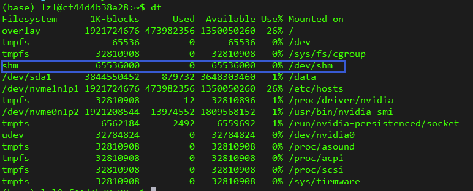
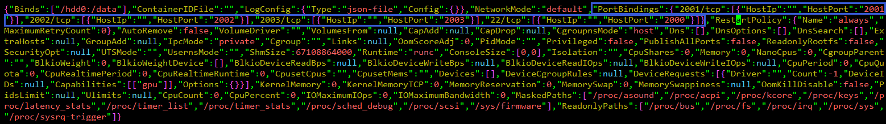

### Docker基本操作

**修改Docker镜像默认存储位置**

Docker容器默认存储位于`/var/lib/docker`下面，可以通过以下命令查看我们的Docker容器具体位置

```
docker info | grep "Docker Root Dir"
```

停掉docker服务

```
systemctl stop docker
```

移动整个`/var/lib/docker`目录到空间富裕的路径

```
mv /var/lib/docker /ssd1/docker
```

更改docker配置文件，首先在`/etc/docker`目录下新建daemon.json文件

```
vim /etc/docker/daemon.json
```

输入

```
{
    "data-root": "/ssd1/docker"
}
```

重启docker服务

```
systemctl restart docker
```

这样，我们的docker的默认存储位置就由`/var/lib/docker`更改到`/ssd1/docker`目录下了

**Docker镜像容器删除**

- 删除名称为\<none>的镜像

```
docker rmi $(docker images -f "dangling=true" -q)
```

- 删除状态为\<Exited>的容器

```
docker rm $(docker ps -q -f status=exited)
```

- 删除名称包含"calico"的镜像

```
docker rmi $(docker images | grep calico | awk '{print $3}')
```

**修改共享内存**

​	docker中的进程要与宿主机使用共享内存通信，共享内存过小可能导致在执行某些程序时发生内存溢出的现象，默认的共享内存大小为64MB，下面介绍如何在启动的docker容器中修改共享内存的大小。

进入容器，输入df可以看到共享内存的大小：



首先在主机上使用`docker ps -a`查看容器id：


接下来关闭docker服务

```
service docker stop
```

进入该容器目录`cd /ssd1/docker/containers/容器id`，修改hostconfig.json文件，找到“ShmSize”字段并进行更改我们需要的共享内存大小


最后重启docker服务

```
systemctl restart docker
```

**添加端口映射**

​	与修改共享内存类似，进入容器目录修改hostconfig.json文件，找到“PortBindings"字段，新增2001，2002，2003号端口，

```
"PortBindings":{
	"2001/tcp": [{"HostIp":"","HostPort":"2001"}],
	"2002/tcp": [{"HostIp":"","HostPort":"2002"}],
	"2003/tcp": [{"HostIp":"","HostPort":"2003"}]
}

```



​	然后修改config.v2.json文件，找到”Port“字段，新增2001，2002，2003号端口的主机映射：

```
"Ports":{
	"2001/tcp": [{"HostIp":"0.0.0.0","HostPort":"2001"},
				{"HostIp":"::","HostPort":"2001"}],
	"2002/tcp": [{"HostIp":"0.0.0.0","HostPort":"2002"},
				{"HostIp":"::","HostPort":"2002"}],
	"2003/tcp": [{"HostIp":"0.0.0.0","HostPort":"2003"},
				{"HostIp":"::","HostPort":"2003"}],
}
```


重启容器完成端口映射，使用命令可以查看端口映射

```
docker port lzl
```


