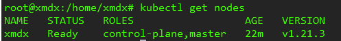

# kubernetes安装

​	Kubernetes是由谷歌开发的一个开源系统，用于在集群内运行和管理以容器微服务为基础的应用。使用Kubernetes需要确保可以从Kubernetes集群外部访问在Kubernetes内创建的服务。

**1、关闭防火墙**

```
ufw disable
```

**2、关闭selinux**

```
sudo apt install selinux-utils
setenforce 0
```

**3、禁止swap分区**

```
swapoff -a
sudo vim /etc/fstab		注释掉swap一行
```

**4、桥接的IPV4流量传递到[iptables](https://so.csdn.net/so/search?q=iptables&spm=1001.2101.3001.7020) 的链**

```
cat > /etc/sysctl.d/k8s.conf <<EOF
net.bridge.bridge-nf-call-ip6tables = 1
net.bridge.bridge-nf-call-iptables = 1
EOF
sysctl --system
```

**5、配置k8s资源**

```
curl -s https://mirrors.aliyun.com/kubernetes/apt/doc/apt-key.gpg | sudo apt-key add -
echo "deb https://mirrors.aliyun.com/kubernetes/apt/ kubernetes-xenial main" > /etc/apt/sources.list.d/kubernetes.list
apt-get update
```

**6、安装nfs**

```
apt-get install nfs-common
```

**7、安装kubeadm(初始化cluster)，kubelet(启动pod)和kubectl(k8s命令工具)**

```
apt install -y kubelet=1.21.3-00 kubeadm=1.21.3-00 kubectl=1.21.3-00
```

**8、设置开机启动并启动kubelet**

```
systemctl enable kubelet && systemctl start kubelet
```


**9、Master节点执行初始化配置**

```
kubeadm init \
  --apiserver-advertise-address=10.24.83.22 \
  --image-repository registry.aliyuncs.com/google_containers \
  --kubernetes-version v1.21.3 \
  --service-cidr=10.96.0.0/12 \
  --pod-network-cidr=10.244.0.0/16 \
  --ignore-preflight-errors=all
```

参数说明：

```
  --apiserver-advertise-address=10.24.83.40 \       #修改为自己master ip
  --image-repository registry.aliyuncs.com/google_containers \   #设置阿里镜像仓库
  --kubernetes-version v1.21.3 \         	#指定k8s版本
  --service-cidr=10.96.0.0/12 \   			#指定service  ip网段
  --pod-network-cidr=10.244.0.0/16 \		#指定pod ip网段

```

**10、master节点拷贝认证文件**

```
mkdir -p $HOME/.kube
sudo cp -i /etc/kubernetes/admin.conf $HOME/.kube/config
sudo chown $(id -u):$(id -g) $HOME/.kube/config
```

**11、切换至根目录下，将node节点加入集群**


```
kubeadm join 10.24.83.40:6443 --token mczjk1.5m5ypxfaunv4nd61 \
        --discovery-token-ca-cert-hash sha256:c360c1f4b50c96d7cc80759c73b0de9afa5dc5e1461693d781798f07b1bb4031
```

**12、配置命令补全工具**

```
apt-get -y install bash-completion
source <(kubectl completion bash)                               #临时生效
echo "source <(kubectl completion bash)" >> ~/.bashrc           #永久生效
```

**13、查看集群状态**

网络插件calico.yaml的链接：[kubernetes(k8s)网络插件calico.yaml文件](https://blog.csdn.net/moyuanbomo/article/details/123092448)

```
# 手动安装网络插件
kubectl apply -f calico.yaml
```

执行

```
kubectl get nodes
```

