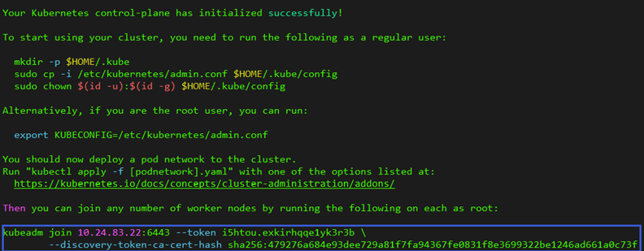
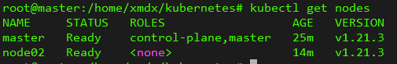

### 使用Kubernetes创建集群

Master节点和Node节点

操作根据 **在Ubuntu18.04上搭建kubernetes** 上的文档进行操作，在master节点执行完kubeadm之后，出现信息



在从节点上执行

```
kubeadm join 10.24.83.22:6443 ...
```

这条命令是有有效期的，需要的时候，可以执行以下命令获取

```
kubeadm token create --print-join-command
```

可以查看集群的基本状况：

```
kubectl get nodes
```



其中master节点为主机节点，IP为10.24.83.40，node02节点为虚拟机节点，IP为192.168.24.129，可以发现所有的node均已Ready。

#### 1、验收集群

​	使用以下命令可以创建一个最简单的nginx pod

```
kubectl apply -f https://k8s.io/examples/pods/simple-pod.yaml
```

创建后可以发现Pod处于Running状态：


在Node02上，添加`-o wide`可以查看pod的ip，再使用curl，可以访问这个nginx服务


如无特殊设置，k8s会通过服务器负载均衡自动部署到合适的node节点上，pods的内部IP为192.168.140.65，端口号为80.


#### 2、正式部署NGINX集群

##### 创建deployment

创建`nginx-dep.yml`部署文件

```
apiVersion: v1	#核心，对象pod、service等
kind: Pod
metadata:		#资源的元数据/属性
  name: nginx
  labels:
    app: nginx
spec:			#设置该资源的内容
  containers:
  - name: nginx
    image: nginx:latest
    ports:
    - containerPort: 80	#容器端口
      hostPort: 8081	#让外部访问端口，官方及其不推荐这种方式，走的防火墙iptables方式，本人测试没成功，仍然无法从外部访问。
```

使用命令`kubectl apply`创建pod

create：先删除现有的东西，重新根据yaml文件生成新的，无法覆盖

apply：根据配置文件列出来的内容，升级现有的，直接覆盖原来的（建议使用）

可以查看pods的详细信息：

```
kubectl get pods -o wide
```


三个pods全部部署在了node02节点上

##### 创建Service

创建`nginx-service.yaml`文件，内容为：

```
apiVersion: v1
kind: Service
metadata:
  name: nginx-service
spec:
  selector:
    app: nginx
  ports:
  - protocol: TCP
    port: 80
    targetPort: 80
    nodePort: 30080 #端口范围只能是 30000-32767，外部通过此端口访问
  type: NodePort	#nodePort方式，必须声明这类型
```

通过

```
kubectl apply -f nginx-service.yml
```

创建Service服务

查询服务：

```
kubectl get svc -o wide
```


可以发现服务能正常启动

##### 测试

浏览器输入节点IP:30080访问

虚拟机的节点为：192.168.24.129


测试完成，这时候正式nginx集群搭建完成。

#### 3、部署Dashboard

​	Dashboard是官方提供的一个UI，可用于基本管理K8s资源

YAML文件下载地址：

```
 wget https://raw.githubusercontent.com/kubernetes/dashboard/v2.4.0/aio/deploy/recommended.yaml
```

将Service改成NodePort类型，可以暴露到外部

```
kind: Service
apiVersion: v1
metadata:
  labels:
    k8s-app: kubernetes-dashboard
  name: kubernetes-dashboard
  namespace: kubernetes-dashboard
spec:
  ports:
    - port: 443
      targetPort: 8443
      nodePort: 30001
  selector:
    k8s-app: kubernetes-dashboard
  type: NodePort
...

```

```
kubectl apply -f recommended.yaml
kubectl get pods -n kubernetes-dashboard
```

访问地址：https://10.24.83.22:30001

查看状态

```
kubectl get all -n kubernetes-dashboard
```

```
# 创建用户
kubectl create serviceaccount dashboard-admin -n kube-system
# 用户授权
kubectl create clusterrolebinding dashboard-admin --clusterrole=cluster-admin --serviceaccount=kube-system:dashboard-admin
# 获取用户Token
kubectl describe secrets -n kube-system $(kubectl -n kube-system get secret | awk '/dashboard-admin/{print $1}')
```

使用输出的token登录到Dashboard


