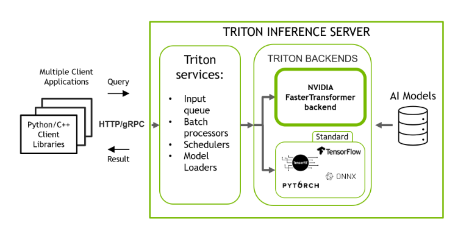

### 用于加速推理大型Transformer的库

​	NVIDIA Faster Transformer是一个库，用于实现基于Transformer的神经网络推理的加速引擎，特别强调大型模型。Faster Transformer包含Transformer块的高度优化版本实现，其中包含编码器和解码器部分。它是由C++/CUDA编写，依赖于高度优化的cuBLAS、cuBLASLt和cuSPARSELt库，可以在GPU上构建最快的Transformer推理流程。

​	与深度学习训练的通用框架相比，FasterTransformer能够获得更快的推理管道，并且基于Transformer的神经网络具有更低的延迟和更高的吞吐量。

Triton推理服务器，具有多个后端，用于对使用不同框架训练的模型进行推理

​	带有FasterTransformer后端的Triton支持wenet、T5、swin、GPT等模型推理。

### warmup

​	当Triton模型加载时，相应的backends会为该模型初始化。对于某些backends，部分初始化会被推迟到模型接收第一个推理请求（或前几个推理请求），因此前几个推理请求可能会明显变慢。

​	为了避免初始缓慢的推理请求，Triton提供配置项使模型能够“预热”，以便在接收第一个推理请求前完全初始化。在预热完成前，模型不会对外提供服务

### FasterTransformer wenet tensorrt plugins

- Encoder

  

  

- Decoder

  

  

  ## 性能分析

  | tensorrt_fastertransformer |         |         |         |          |
  | -------------------------- | ------- | ------- | ------- | -------- |
  | **batch size(并发度=2)**   | **2**   | **4**   | **8**   | **16**   |
  | 吞吐率(infer/s)            | 46.4    | 81.6    | 91.2    | 99.2     |
  | 平均时延(ms)               | 86.192  | 98.015  | 174.612 | 318.608  |
  | **batch size(并发度=8)**   | **2**   | **4**   | **8**   | **16**   |
  | 吞吐率(infer/s)            | 75.6    | 87.2    | 89.6    | 96       |
  | 平均时延(ms)               | 212.723 | 358.374 | 736.458 | 1302.786 |
  | **ONNX_FP16**              |         |         |         |          |
  | **batch size(并发度=2)**   | **2**   | **4**   | **8**   | **16**   |
  | 吞吐率(infer/s)            | 33.2    | 44.8    | 41.6    | /        |
  | 平均时延(ms)               | 120.744 | 183.461 | 363.058 | /        |
  | **batch size(并发度=8)**   | **2**   | **4**   | **8**   | **16**   |
  | 吞吐率(infer/s)            | 30.8    | 42.4    | /       | /        |
  | 平均时延(ms)               | 516.526 | 767.964 | /       | /        |

  CER：均为1.1368%

| 部署在Jetson NX          |         |         |         |          |
| ------------------------ | ------- | ------- | ------- | -------- |
| **batch size(并发度=2)** | **2**   | **4**   | **8**   | **16**   |
| 吞吐率(infer/s)          | 46.4    | 81.6    | 91.2    | 99.2     |
| 平均时延(ms)             | 86.192  | 98.015  | 174.612 | 318.608  |
| **batch size(并发度=8)** | **2**   | **4**   | **8**   | **16**   |
| 吞吐率(infer/s)          | 75.6    | 87.2    | 89.6    | 96       |
| 平均时延(ms)             | 212.723 | 358.374 | 736.458 | 1302.786 |

| 部署在台式机             |        |        |        |         |
| ------------------------ | ------ | ------ | ------ | ------- |
| **batch size(并发度=2)** | **2**  | **4**  | **8**  | **16**  |
| 吞吐率(infer/s)          | 488    | 641.6  | 771.2  | 851.2   |
| 平均时延(ms)             | 8.193  | 12.474 | 20.712 | 37.604  |
| **batch size(并发度=8)** | **2**  | **4**  | **8**  | **16**  |
| 吞吐率(infer/s)          | 698.8  | 919.2  | 1049.6 | 1179.2  |
| 平均时延(ms)             | 22.890 | 34.808 | 53.477 | 108.696 |

