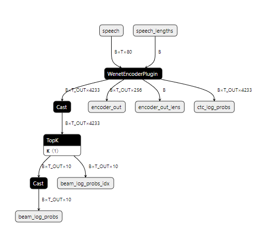

# 语音识别模型部署

### 一、模型准备

​	下载最新版开源语音识别工具包wenet

```
git clone https://github.com/wenet-e2e/wenet.git
```

下载基于Conformer编码器的预训练语音识别模型

```
wget https://wenet-1256283475.cos.ap-shanghai.myqcloud.com/models/aishell/20211025_conformer_exp.tar.gz
tar zxvf 20211025_conformer_exp.tar.gz
model_dir=$(pwd)/20211025_conformer_exp
```

### 二、模型转换--Pytorch to ONNX

​	若直接在Jetson模块上进行模型转换会出现内存不足的问题，模型转换工作需要移植到PC端完成

​	首先将此前下载的`wenet/wenet`文件夹拷贝到项目文件下，里面提供了模型转换所需要的函数。需要将下载的torch模型转换为ONNX模型，使用到`wenet/bin/export_onnx_gpu.py`函数，模型转换的脚本export_onnx.sh：

```
#!/bin/bash

export CUDA_VISIBLE_DEVICES="0"

model_dir=20211025_conformer_exp
onnx_model_dir=aishell_onnx

mkdir -p $onnx_model_dir
python wenet/bin/export_onnx_gpu.py \
    --config=$model_dir/train.yaml  \
    --checkpoint=$model_dir/final.pt  \
    --cmvn_file=$model_dir/global_cmvn  \
    --ctc_weight=0.5  \
    --output_onnx_dir=$onnx_model_dir \
    --fp16  \
    --decoder_fastertransformer || exit 1

cp $model_dir/words.txt $model_dir/train.yaml $onnx_model_dir
```

### 三、编译FasterTransformer

​	在Jetson Xavier NX板子上将上述生成的ONNX模型拷贝到板子的`wenet/runtime/gpu/tensorrt_fastertransformer`目录下，在`wenet/runtime/gpu/tensorrt_fastertransformer`目录下进行编译，编译脚本为compile_fastertransformer.sh：

```
#!/bin/bash
# path: {home}/wenet/runtime/gpu/tensorrt_fastertransformer

mkdir -p exp1
outputs_dir=./exp1
ft_path=./FasterTransformer
pushd ${ft_path}

export TRT_LIBPATH=/usr/lib/aarch64-linux-gnu
CUR_DIR=`pwd`
mkdir -p build
cd build

cmake \
  -DCMAKE_BUILD_TYPE=Release \
  -DCMAKE_VERBOSE_MAKEFILE=OFF \
  -DCMAKE_INSTALL_PREFIX=${CUR_DIR}/install \
  -DBUILD_TF=OFF \
  -DBUILD_PYT=OFF \
  -DBUILD_MULTI_GPU=OFF \
  -DUSE_NVTX=OFF \
  -DBUILD_EXAMPLE=ON \
  -DBUILD_TEST=OFF \
  -DBUILD_TRT=ON \
  -DBUILD_ORGIN_NET=OFF \
  ..

make -j6 || exit 1	# 根据实际CPU数目选择
popd
cp ${ft_path}/build/lib/libtrt_wenet.so $outputs_dir
```

### 四、提取权重

​	在`wenet/runtime/gpu/tensorrt_fastertransformer`目录下，运行脚本extract_weight_replace_plugins.sh，注意：模型在转换过程中需要读取ONNX图节点，需要使用pip安装onnx和onnx-graphsurgeon工具：

```
#!/bin/bash

onnx_model_dir=aishell_onnx
d_model=256
head_num=4
vocab_size=4233
outputs_dir=exp1

mkdir -p /weight/enc
mkdir -p /weight/dec
python3 extract_weights.py --input_onnx $onnx_model_dir/encoder.onnx --output_dir /weight/enc || exit 1
python3 extract_weights.py --input_onnx $onnx_model_dir/decoder.onnx --output_dir /weight/dec || exit 1

python3 replace_plugin.py --input_onnx $onnx_model_dir/encoder.onnx \
                       --d_model $d_model --head_num $head_num --vocab_size $vocab_size\
                       --output_onnx ${outputs_dir}/encoder_plugin.onnx || exit 1
python3 replace_plugin.py --input_onnx $onnx_model_dir/decoder.onnx \
                       --output_onnx ${outputs_dir}/decoder_plugin.onnx \
                       --d_model $d_model --head_num $head_num --vocab_size $vocab_size \
                       --num_layer 6 || exit 1
```




### 五、模型转换--ONNX to TensorRT

​	使用trtexec工具，将ONNX模型转化为更易于推理的Tensorrt模型，转换脚本为onnx_tensorrt.sh：

```
#!/bin/bash

trtexec=/usr/src/tensorrt/bin/trtexec

d_model=256
BEAM_SIZE=10

MIN_BATCH=1
OPT_BATCH=16
MAX_BATCH=16

ENC_MIN_LEN=16
ENC_OPT_LEN=512
ENC_MAX_LEN=2048
DEC_MIN_LEN=$(( ENC_MIN_LEN / 4))
DEC_OPT_LEN=$(( ENC_OPT_LEN / 4))
DEC_MAX_LEN=$(( ENC_MAX_LEN / 4))

outputs_dir=./exp1
cd $outputs_dir

if [ ! -d /weight/enc ] || [ ! -d /weight/dec ]; then
  echo "Please extract weights and move them here first"
  exit 1
fi

echo "convert to trt"
${trtexec} \
    --onnx=./encoder_plugin.onnx \
    --minShapes=speech:${MIN_BATCH}x${ENC_MIN_LEN}x80,speech_lengths:${MIN_BATCH} \
    --optShapes=speech:${OPT_BATCH}x${ENC_OPT_LEN}x80,speech_lengths:${OPT_BATCH} \
    --maxShapes=speech:${MAX_BATCH}x${ENC_MAX_LEN}x80,speech_lengths:${MAX_BATCH} \
    --fp16 \
    --plugins=./libtrt_wenet.so \
    --saveEngine=./encoder.plan

${trtexec}   \
    --onnx=./decoder_plugin.onnx \
    --minShapes=encoder_out:${MIN_BATCH}x${DEC_MIN_LEN}x$d_model,encoder_out_lens:${MIN_BATCH},hyps_pad_sos_eos:${MIN_BATCH}x${BEAM_SIZE}x${MIN_HYPS_PAD},hyps_lens_sos:${MIN_BATCH}x${BEAM_SIZE},ctc_score:${MIN_BATCH}x${BEAM_SIZE} \
    --optShapes=encoder_out:${OPT_BATCH}x${DEC_OPT_LEN}x$d_model,encoder_out_lens:${OPT_BATCH},hyps_pad_sos_eos:${OPT_BATCH}x${BEAM_SIZE}x${OPT_HYPS_PAD},hyps_lens_sos:${OPT_BATCH}x${BEAM_SIZE},ctc_score:${OPT_BATCH}x${BEAM_SIZE} \
    --maxShapes=encoder_out:${MAX_BATCH}x${DEC_MAX_LEN}x$d_model,encoder_out_lens:${MAX_BATCH},hyps_pad_sos_eos:${MAX_BATCH}x${BEAM_SIZE}x${MAX_HYPS_PAD},hyps_lens_sos:${MAX_BATCH}x${BEAM_SIZE},ctc_score:${MAX_BATCH}x${BEAM_SIZE} \
    --fp16 \
    --plugins=./libtrt_wenet.so \
    --saveEngine=./decoder.plan \
    --buildOnly
    # infer with random input would cause illegal memory access error
cd -
```

### 六、更新配置文件

​	自动更新模型仓库中config.pbtxt文件，对应的更新脚本为auto_gen_config.sh：

```
#!/bin/bash

onnx_model_dir=aishell_onnx
d_model=256
vocab_size=4233
MAX_BATCH=16
MAX_BATCH_FOR_SCORING=16

dirs="encoder decoder feature_extractor scoring attention_rescoring"
DICT_PATH=$onnx_model_dir/words.txt
VOCAB_SIZE=$vocab_size
MAX_DELAY=0
MAX_BATCH_SIZE=$MAX_BATCH
D_MODEL=$d_model
INSTANCE_NUM=1
INSTANCE_NUM_FOR_SCORING=2
model_repo_path=./model_repo_ft

if [ ! -d $model_repo_path ]; then
  echo "Please cd to model_repo_path"
  exit 1
fi

for dir in $dirs
do
    cp $model_repo_path/$dir/config.pbtxt.template $model_repo_path/$dir/config.pbtxt

    sed -i "s|DICT_PATH|${DICT_PATH}|g" $model_repo_path/$dir/config.pbtxt
    sed -i "s/BEAM_SIZE/${BEAM_SIZE}/g" $model_repo_path/$dir/config.pbtxt
    sed -i "s/VOCAB_SIZE/${VOCAB_SIZE}/g" $model_repo_path/$dir/config.pbtxt
    sed -i "s/MAX_DELAY/${MAX_DELAY}/g" $model_repo_path/$dir/config.pbtxt
    sed -i "s/D_MODEL/${D_MODEL}/g" $model_repo_path/$dir/config.pbtxt
    if [ "$dir" == "decoder" ]; then
         sed -i "s/MAX_BATCH/${MAX_BATCH_FOR_SCORING}/g" $model_repo_path/$dir/config.pbtxt
         sed -i "s/INSTANCE_NUM/${INSTANCE_NUM}/g" $model_repo_path/$dir/config.pbtxt
    elif [ "$dir" == "scoring" ]; then
         sed -i "s/MAX_BATCH/${MAX_BATCH_FOR_SCORING}/g" $model_repo_path/$dir/config.pbtxt
         sed -i "s/INSTANCE_NUM/${INSTANCE_NUM_FOR_SCORING}/g" $model_repo_path/$dir/config.pbtxt
    else
         sed -i "s/MAX_BATCH/${MAX_BATCH_SIZE}/g" $model_repo_path/$dir/config.pbtxt
         sed -i "s/INSTANCE_NUM/${INSTANCE_NUM}/g" $model_repo_path/$dir/config.pbtxt
    fi
done
```

### 七、加载TensorRT模型

​	将生成的encoder.plan和decoder.plan更新到模型仓库中，并添加MD5校验，加载的脚本为load_model.sh：

```
#!/bin/bash

model_repo_path=./model_repo_ft
outputs_dir=./exp1

mkdir -p $model_repo_path/encoder/1/
cp $outputs_dir/encoder.plan $model_repo_path/encoder/1/
encoder_md5=`md5sum $model_repo_path/encoder/1/encoder.plan | awk '{ print $1 }'`
sed -i "s|ENCODER_MD5|${encoder_md5}|g" $model_repo_path/encoder/config.pbtxt

mkdir -p $model_repo_path/decoder/1/
cp $outputs_dir/decoder.plan $model_repo_path/decoder/1/
decoder_md5=`md5sum $model_repo_path/decoder/1/decoder.plan | awk '{ print $1 }'`
sed -i "s|DECODER_MD5|${decoder_md5}|g" $model_repo_path/decoder/config.pbtxt

mkdir -p $model_repo_path/attention_rescoring/1/
cp $outputs_dir/libtrt_wenet.so $model_repo_path/../
```

**启动Triton推理服务器加载模型**

​	启动Triton部署语音识别服务端，启动的脚本为infer.sh：

```
#!/bin/bash

echo "launch triton server"
model_repo_path=./model_repo_ft
LD_PRELOAD=./libtrt_wenet.so tritonserver --model-repository $model_repo_path \
    --backend-directory=/home/lzl/lzl/tritonserver2.20.0-jetpack5.0/backends --model-control-mode=poll
```


