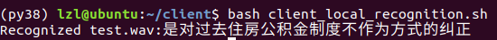

# 客户端模型推理

​	选择一个Ubuntu系统的计算机模拟客户端测试。

### 一、客户端环境准备

​	在tritonserver2.20.0-jetpack5.0/clients/python目录下安装tritonclient。对于新的机器，在官网下载https://github.com/triton-inference-server/server/releases/tag/v2.20.0，可以得到tar包v2.20.0_ubuntu2004.clients.tar.gz。

```
# 解压到python子目录下
tar zxvf v2.20.0_ubuntu2004.clients.tar.gz -C python
```

进入到`python/python`，执行：

```
pip3 install tritonclient-2.20.0-py3-none-any.whl[all]
pip3 install typing_extensions soundfile
```

### 二、单个音频文件的识别

​	客户端识别脚本`client_local_recognition.sh`：

```
#!/bin/bash
# s表示测试单个音频，m表示测试多个音频

mode=${1-'s'}
url=${2-'10.24.83.22:30323'}

if [ $mode == 's' ]; then
        python3 client.py --audio_file=test.wav --url=$url
elif [ $mode == 'm' ]; then
        wav_path=$HOME/data
        python3 client.py --wavscp=${wav_path}/wav.scp --trans=${wav_path}/refer.txt --url=$url
fi

```

​	在`client`目录下运行脚本client_local_recognition.sh，默认为单个音频文件的识别，url为10.24.83.22:30323：

```
bash client_local_recognition.sh
```



### 三、多个音频文件的识别

#### 		数据集准备

```
wget https://oneflow-static.oss-cn-beijing.aliyuncs.com/tripleMu/tensorrt/test.tar
tar -vxf test.tar.gz
```

#### 		音频文件列表scp文件的制作

​	音频文件列表(.scp)包含了所有音频文件的名称和目录，集成于gen_scp.sh：

```
# 这里需要指定wav文件的绝对路径
find $HOME/data -iname '*.wav' > wav.scp.temp	
cat  wav.scp.temp | awk -F '/' '{printf("%s_%s\n",$(NF-1),$NF)}' | sed 's/.wav//' | sed 's/Speaker/Speaker_/' > wav_id 
paste -d' ' wav_id wav.scp.temp> wav.scp
rm wav.scp.temp wav_id
python3 scp_sorted.py	# 对生成的scp文件进行排序
```

​	启动Triton客户端，进行多个音频文件的识别

```
bash client_local_recognition.sh m
```

