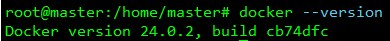
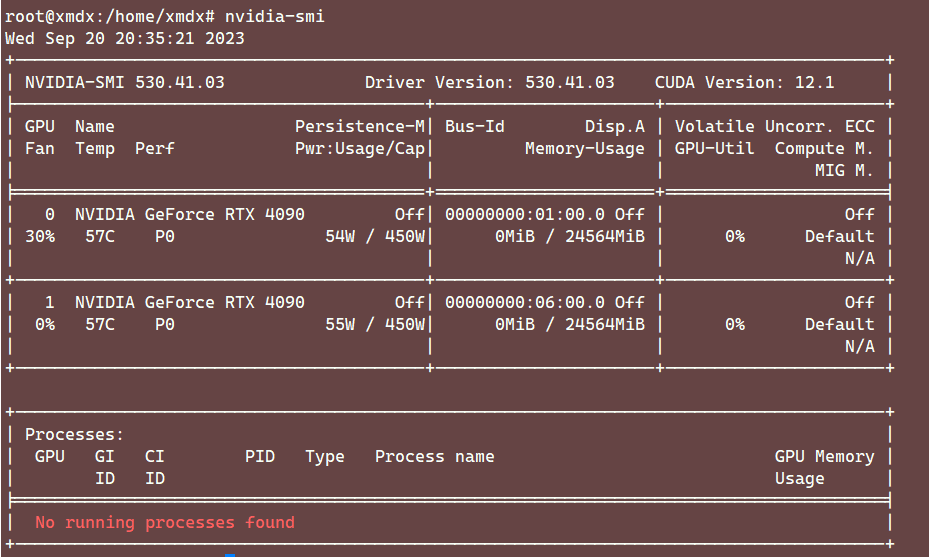

# Docker 安装

## 卸载旧版本的 Docker

```shell
sudo apt-get remove docker docker-engine docker.io containerd runc
```

删除所有镜像、容器和数据卷

```shell
sudo rm -rf /var/lib/docker 
sudo rm -rf /var/lib/containerd
```

## 安装docker

在新主机首次安装 Docker 引擎之前，需要设置 Docker 存储库，之后，可以从存储库安装和更新 Docker，设置存储库的方法：

更新软件包索引并安装软件包，以允许通过 HTTPS 使用存储库：

```shell
 sudo apt-get update

 sudo apt-get install \
    ca-certificates \
    curl \
    gnupg \
    lsb-release
```

添加 Docker 的官方 GPG 密钥：

```shell
sudo mkdir -p /etc/apt/keyrings 
curl -fsSL https://download.docker.com/linux/ubuntu/gpg | sudo gpg --dearmor -o /etc/apt/keyrings/docker.gpg
```

使用以下命令设置存储库：

```shell
echo \ "deb [arch=$(dpkg --print-architecture) signed-by=/etc/apt/keyrings/docker.gpg] https://download.docker.com/linux/ubuntu \ $(lsb_release -cs) stable" | sudo tee /etc/apt/sources.list.d/docker.list > /dev/null
```

更新包索引，并安装最新版本的 docker-ce, docker-ce-cli, containerd.io, docker-compose-plugin：

```shell
sudo apt-get update  
sudo apt-get install docker-ce docker-ce-cli containerd.io docker-compose-plugin
```

若运行时遇到 GPG 错误，默认掩码可能设置不正确，从而导致无法检测到存储库的公钥文件，运行以下命令，然后再尝试更新存储库：

```shell
sudo chmod a+r /etc/apt/keyrings/docker.gpg
```

查看 Docker 是否正常安装：



## 安装 NVIDIA Docker

首先验证英伟达驱动已正确安装：



设置 stable 存储库和密钥：

```shell
distribution=$(. /etc/os-release;echo $ID$VERSION_ID) \
   && curl -s -L https://nvidia.github.io/nvidia-docker/gpgkey | sudo apt-key add - \
   && curl -s -L https://nvidia.github.io/nvidia-docker/$distribution/nvidia-docker.list | sudo tee /etc/apt/sources.list.d/nvidia-docker.list
```

安装 nvidia-docker2 安装包：

```shell
sudo apt-get update
sudo apt-get install -y nvidia-docker2
```

重启 docker：

```shell
sudo systemctl restart docker
```

使用官方 container 测试是否安装成功：

```shell
docker run --rm --gpus all nvidia/cuda:11.8.0-devel-ubuntu20.04 nvidia-smi
```

