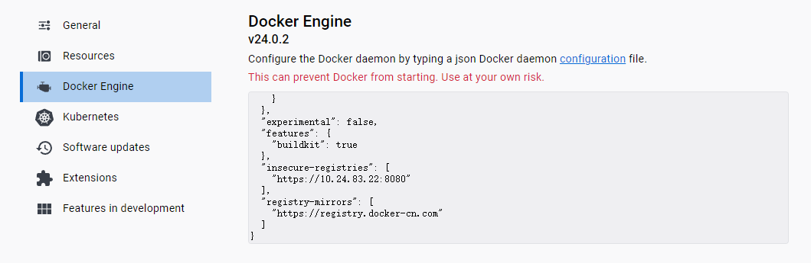
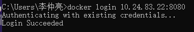
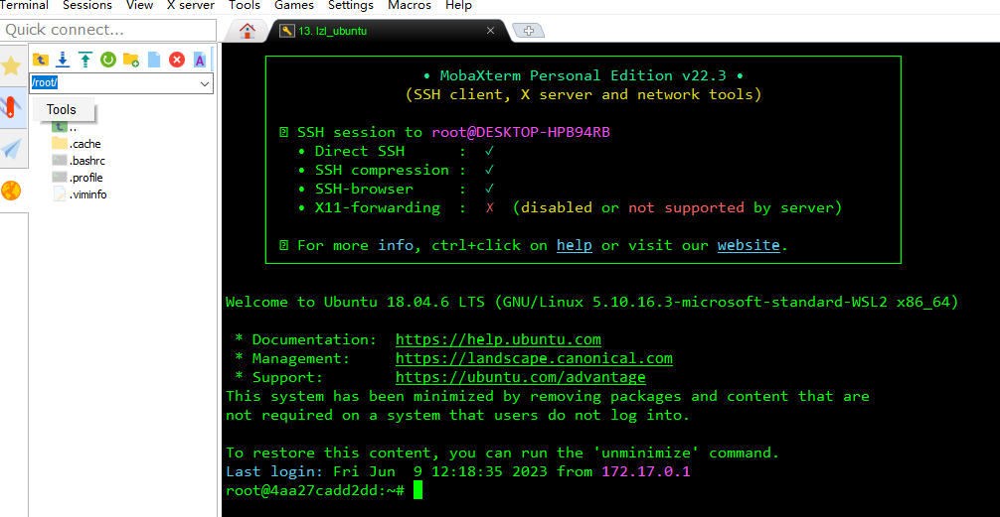
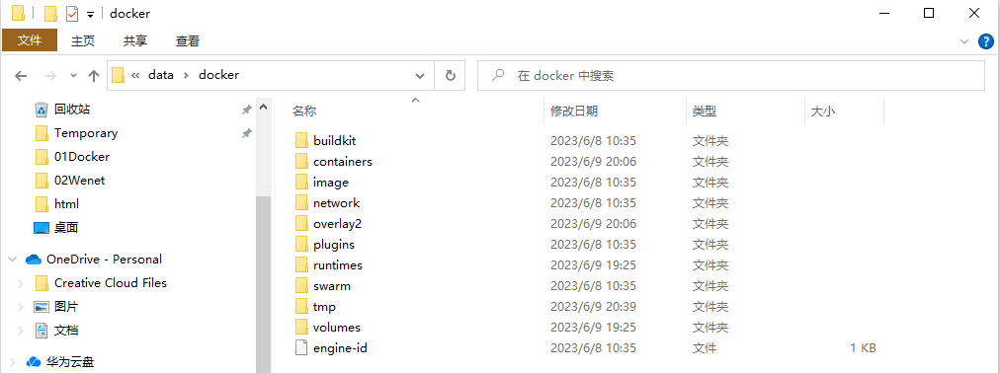

# Docker新建用户

## Ubuntu docker

Docker 的安装方法可以参考：[02Docker安装](D:\GitHub\diary\source\笔记\01Docker\02Docker安装.md)

接下来需要拉取 NVIDIA CUDA 镜像，在 [nvidia/container-images](https://gitlab.com/nvidia/container-images/cuda/-/blob/master/doc/supported-tags.md) 中查看 CUDA 镜像版本，通过

```shell
docker pull nvidia/cuda:11.6.0-devel-ubuntu18.04
```

拉取镜像。

`base`， `devel`， `runtime` 版本介绍：

- base：不包含 CUDA 开发工具集和 Cudnn 库。这个版本主要用于不需要进行 CUDA 编程，而只需要一个基础的运行环境
- devel：包含 CUDA 开发工具集，但不包含 Cudnn 库。这个版本主要用于需要进行 CUDA 编程，但不需要使用 Cudnn 库的场景
- runtime：包含 CUDA 运行时环境，但不包含 CUDA 开发工具集和 CUDNN 库。这个版本主要用于运行已经编译好的 CUDA 程序，但不需要进行 CUDA 编程和使用 CUDNN 库的场景
- cudnn8-devel：包含 CUDA 开发工具集和 Cudnn 8 版本的库。这个版本主要用于需要进行 CUDA 编程，并需要使用 Cudnn 8 库的场景
- cudnn8-runtime：包含 CUDA 运行时环境和 Cudnn 8 版本的库，但不包含 CUDA 开发工具集。这个版本主要用于运行已经编译好的 CUDA 程序，并需要使用 Cudnn 8 库，但不需要进行 CUDA 编程的场景。

接下来是针对拉取的镜像创建容器，使用 `docker run` 命令可以创建一个 Docker 容器：

```shell
# --name 字段指定容器名称，-v 字段指定容器挂载主机文件，-p 字段指定容器与主机的端口映射
# 创建一个普通的运行时环境
user=user
docker run -it --gpus all --name ${user} -v /hdd0:/data -p 4000:22 -p 4001:4001 --shm-size=1g nvidia/cuda:11.6.0-devel-ubuntu18.04 /bin/bash
```

这将创建一个名为 `user` 的新容器，并将其映射到主机的端口 4000，映射机械硬盘  /hdd0 到 /data，需要记住映射的端口号，

容器创建完成后，在容器内依次执行以下命令进行**初始化**

```shell
# user 是容器用户名，123456 是容器 sudo 的密码
user=user
chmod 777 /tmp && \
apt-get update && apt-get upgrade -y && \
apt-get install -y openssh-server vim sudo && \
adduser ${user} --gecos '' --disabled-password && \
echo "${user}:123456" | chpasswd && \
usermod -aG sudo ${user}
```

接下来，设置**开机 ssh 自启动**

首先，在 /root 目录下新建一个 start_ssh.sh文件，并给予该文件可执行权限。

```shell
vim /root/start_ssh.sh

chmod +x /root/start_ssh.sh
```

start_ssh.sh 脚本的内容，如下：

```shell
#!/bin/bash
LOGTIME=$(date "+%Y-%m-%d %H:%M:%S")
echo "[$LOGTIME] startup run..." >>/root/start_ssh.log
service ssh start >>/root/start_ssh.log
#service mysql start >>/root/star_mysql.log
```

将 `start_ssh.sh` 脚本添加到启动文件中，在 .bashrc 文件末尾加入如下内容

```shell
vim /root/.bashrc

# startup run
if [ -f /root/start_ssh.sh ]; then
	/root/start_ssh.sh
fi
```

保存后，等下次重启容器的时候，添加的服务也就跟着重启了。

设置 Docker **自启动**

以上操作都完成后，按 Ctrl+D 退出容器，使用 `docker ps -a` 发现刚刚创建的容器处于 `Exited()` 状态，首先开启容器：

```shell
user=user
docker start ${user}
```

user 为容器名称，然后设置 docker 开机自启动

```shell
docker update --restart=always ${user}
```

## Docker Desktop

下载 docker-desktop，下载网址：https://www.docker.com/products/docker-desktop/，下载好后的 docker 图标：


cmd 打开 Windows 终端，接下来要连接到我们的私有镜像仓库 10.24.83.22:8080，由于私服采用的是http协议，默认不被Docker信任，需要进行配置，改为https协议，打开 docker-desktop 的设置界面，点击 `Docker Engine` 按钮，在右边的面板中编辑：

```json
"insecure-registries": ["https://10.24.83.22:8080"],
```

顺便可以编辑一下 docker 镜像

```json
"registry-mirrors": ["https://registry.docker-cn.com"]
```

点击 Replay&Restart 应用：



打开 cmd，登录到我们的私有镜像仓库，用户名为 admin，密码为 admin。



显示 `Login Succeeded` 则表明登录成功

打开 cmd，拉取 Nvidia CUDA 镜像，如果没有显卡则拉取普通 Ubuntu镜像

```shell
# 有显卡
docker pull 10.24.83.22:8080/nvidia/cuda:11.6.0-devel-ubuntu18.04

# 无显卡
docker pull 10.24.83.22:8080/ubuntu:20.04
```

拉取镜像后使用 `docker run`创建容器，我需要挂载的目录是 `E:\Docker_files`，这个不同计算机需要挂载的目录不同，需要根据自己的情况进行更改

```shell
# 有显卡
docker run -it --gpus all --name lzl -v E:\Docker_files:/files -p 2000:22 10.24.83.22:8080/nvidia/cuda:11.6.0-devel-ubuntu18.04 /bin/bash

# 无显卡（不需要指定 GPU）
docker run -it --name lzl -v E:\Docker_files:/files -p 2000:22 10.24.83.22:8080/ubuntu:20.04 /bin/bash
```

创建完容器，容器就能处于运行状态了，有五栏可以查看容器的状态，常用的是 Terminal 和 Files。


换源，打开文件，在 `\etc\apt\source.list` 目录下更换阿里源，以下是阿里源 18.04 内容（20.04的源需要去网上找一下）：

```shell
deb http://mirrors.aliyun.com/ubuntu/ bionic main restricted universe multiverse
deb http://mirrors.aliyun.com/ubuntu/ bionic-security main restricted universe multiverse
deb http://mirrors.aliyun.com/ubuntu/ bionic-updates main restricted universe multiverse
deb http://mirrors.aliyun.com/ubuntu/ bionic-proposed main restricted universe multiverse
deb http://mirrors.aliyun.com/ubuntu/ bionic-backports main restricted universe multiverse
deb-src http://mirrors.aliyun.com/ubuntu/ bionic main restricted universe multiverse
deb-src http://mirrors.aliyun.com/ubuntu/ bionic-security main restricted universe multiverse
deb-src http://mirrors.aliyun.com/ubuntu/ bionic-updates main restricted universe multiverse
deb-src http://mirrors.aliyun.com/ubuntu/ bionic-proposed main restricted universe multiverse
deb-src http://mirrors.aliyun.com/ubuntu/ bionic-backports main restricted universe multiverse    
```

更新源

```shell
apt update
```

安装 vim 和 openssh-server

```shell
apt install -y vim openssh-server
```

设置 root ssh，修改配置文件 `/etc/ssh/sshd_config`，修改：

```shell
PermitRootLogin yes
```

重启 docker 容器。重启 ssh 使配置生效：

```shell
service ssh restart
```

设置密码，终端输入：

```shell
# passwd
Enter new UNIX password: 123456
Retype new UNIX password: 123456
passwd: password updated successfully
```

使用 MobaXterm 连接，主机名输入 localhost，用户名为 root，密码为123456，可以在命令台控制容器。



挂载的文件位于 `/files` 目录下，这样就在 Windows 里面用容器化技术创建了一个 Ubuntu 容器，相较于虚拟机更加高效。

关于开机自启动 SSH 可以参考第一节的内容。

**额外内容**

主机没办法直接查看容器文件，在 Linux 系统中，容器默认存储在 `/var/docker` 里面，如果在 Windows 里面需要修改容器的一些配置时（如挂载目录、端口映射、共享内存等），需要在文件夹中使用路径 `\\wsl$\docker-desktop-data\data\docker` 打开，和 Linux 系统的 `/var/docker` 具有同样的内容：

