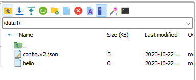

# 容器挂载

目前我们固态硬盘容量不足了，仅剩 193 GB，需要大家把数据迁移到其它盘


目前还不知道如何把 Docker 的容器分盘存储，因此使用**数据挂载**的方式将数据迁移到其它盘。

在 4090 服务器的主机（22 端口）里面，根目录对应了

- /ssd0: 第一块固态硬盘（系统盘）存储位置——2T，容量很宽松
- /hdd0: 机械硬盘存储位置——4T，容量很宽松
- /ssd1: 第二块固态硬盘（容器盘）存储位置——2T，现在这个硬盘快满了

## 创建容器时

通过 `docker run` 命令，一个示例如下：

```
docker run -it --gpus all --name ${user} -v /hdd0:/data -p 4000:22 nvidia/cuda:11.6.0-devel-ubuntu18.04 /bin/bash
```

使用 `-v` 标记在容器中设置一个挂载点 `/data` （就是容器中的一个目录），并将主机上的 `/hdd0` 目录（机械硬盘位置）中的内容关联到 `/data` 下，这样容器对 `/data` 目录的操作，还是在主机上对 `/hdd0` 的操作，都是完全实时同步的，因为这两个目录实际都是指向主机目录。

## 创建容器后

一般我们不会新建一个容器，如果需要在已有的容器上修改，需要修改两个文件

进入到容器目录 `cd /ssd1/docker/containers`，查看到宿主机部署了很多容器


那么如何找到自己的容器？

使用 `docker ps -a`，第一列给出了容器 ID，找到自己的容器名对应的容器 ID 即可，比如我的是 cf44d4b38a28


进入到**自己的**容器目录（这里注意一下不要进错了），目录下有两个文件需要修改，一个是 `hostconfig.json`，另一个是 `config.v2.json`


> ！！！注意：修改前确保关闭 docker 容器
>
> ```
> systemctl stop docker
> ```

### hostconfig.json

首先修改 `hostconfig.json`，这个文件修改比较简单，直接用 `vim` 就可以修改，仅需要在第一个字段 `Binds` 下添加需要挂载的目录即可，比如把机械硬盘 `/hdd0` 挂载到容器内的 `/data` 目录，把第一块固态硬盘 `/ssd0` 挂载到容器内的 `/data1` 目录


### config.v2.json

这个文件内容比较多，并且需要修改的东西比较多，如果对 `vim` 操作不是很熟悉，建议拿出来修改，注意备份就行，首先

```
cp config.v2.json /ssd0/config.v2.json
chmod 777 config.v2.json
```

使用 vscode 打开 `config.v2.json`

vscode 设置软换行的方式参考：https://blog.csdn.net/xiang0731/article/details/123084126


找到 `MountPoints` 字段，仿造其格式进行修改，在我的容器中，出现 `/data` 的地方统统换成 `/data1`，表示容器内的目录，出现 `/hdd0` 的地方统统换成 `/ssd0`，表示需要挂载的目录，其它基本没有改动。

> 我这里为了便于观看插入了几个空格，最后需要把空格还原回去


保存退出。

对原来的 `config.v2.json` 备份并把新修改的添加进去：

```
mv config.v2.json config.v2.json.bak
cp /ssd0/config.v2.json ./config.v2.json
```

重新启动 docker

```
systemctl restart docker
```

第一块固态硬盘就挂载进我们的容器了，可以把数据集放在这个地方（所有人都能看到）



应该能看到这两个挂载信息。


## 总结

建议大家把机械硬盘和固态硬盘都挂载一下。

> 根据自己的经验，如果训练的数据集在机械硬盘，IO 比较慢，训练速度比较慢，可以在训练集放在挂载的第一块固态硬盘里面。