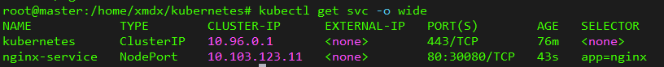

# K8s 创建集群

`kubectl` 是 K8s 的命令行操作命令，可以创建和更新、删除、列表和查详情等一系列操作。

## 验收集群

使用以下命令可以创建一个最简单的 `nginx pod`：

```shell
kubectl apply -f https://k8s.io/examples/pods/simple-pod.yaml
```

创建后可以发现Pod处于Running状态：


在Node02上，添加 `-o wide` 可以查看 pod 的 ip，再使用 curl，可以访问这个 nginx 服务


如无特殊设置，k8s会通过服务器负载均衡自动部署到合适的node节点上，pods的内部IP为192.168.140.65，端口号为80.


## 正式部署NGINX集群

### 创建 Deployment

创建 `nginx-dep.yml` 部署文件

```yaml
apiVersion: v1
kind: Pod
metadata:
  name: nginx
  labels:
    app: nginx
spec:
  containers:
  - name: nginx
    image: nginx:latest
    ports:
    - containerPort: 80
      hostPort: 8081
```

使用命令 `kubectl apply` 创建 pod

- `create` 和 `apply` 的区别：

create：先删除现有的东西，重新根据 yaml 文件生成新的，无法覆盖

apply：根据配置文件列出来的内容，升级现有的，直接覆盖原来的（建议使用）

可以查看pods的详细信息：

```shell
kubectl get pods -o wide
```


三个 pods 全部部署在了 node02 节点上

### 创建 Service

创建 `nginx-service.yaml` 文件，内容为：

```yaml
apiVersion: v1
kind: Service
metadata:
  name: nginx-service
spec:
  selector:
    app: nginx
  ports:
  - protocol: TCP
    port: 80
    targetPort: 80
    nodePort: 30080
  type: NodePort
```

通过

```shell
kubectl apply -f nginx-service.yml
```

创建Service服务

查询服务：

```shell
kubectl get svc -o wide
```



可以发现服务能正常启动。

### 测试

浏览器输入节点IP:30080访问

虚拟机的节点为：192.168.24.129

测试完成，这时候正式nginx集群搭建完成。

### 部署 Dashboard UI

**Dashboard** 是基于网页的 K8s 用户界面，可以使用 Dashboard 将容器应用部署到 K8s 集群中，也可以对容器应用排错，还能管理集群资源，可以使用 Dashboard 获取运行在集群中应用的概览信息，也可以创建或修改 K8s 资源（如 Deployment，Job，DaemonSet 等），例如可以对 Deployment 实现弹性伸缩、发起滚动升级、重启 Pod 或者使用向导创建新的应用。

YAML 文件下载地址：

```shell
 wget https://raw.githubusercontent.com/kubernetes/dashboard/v2.4.0/aio/deploy/recommended.yaml
```

将 Service 改成 NodePort 类型，可以暴露到外部

```yaml
kind: Service
apiVersion: v1
metadata:
  labels:
    k8s-app: kubernetes-dashboard
  name: kubernetes-dashboard
  namespace: kubernetes-dashboard
spec:
  ports:
    - port: 443
      targetPort: 8443
      nodePort: 30001
  selector:
    k8s-app: kubernetes-dashboard
  type: NodePort
...
```

```shell
kubectl apply -f recommended.yaml
kubectl get pods -n kubernetes-dashboard
```

访问地址：https://10.24.83.22:30001

查看状态

```shell
kubectl get all -n kubernetes-dashboard
```

```shell
# 创建用户
kubectl create serviceaccount dashboard-admin -n kube-system
# 用户授权
kubectl create clusterrolebinding dashboard-admin --clusterrole=cluster-admin --serviceaccount=kube-system:dashboard-admin
# 获取用户Token
kubectl describe secrets -n kube-system $(kubectl -n kube-system get secret | awk '/dashboard-admin/{print $1}')
```

使用输出的 `token` 登录到 **Dashboard**：


