# Centos 部署指南

IP 地址：10.130.60.165:39999

用户名：itser

密码：Demo@60165

查看 Centos 的版本，我们的虚拟机的 Centos 的版本为 7.8.2003，64 位操作系统

```
cat /etc/redhat-release
```

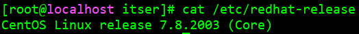

## 安装 Docker

参考链接：https://developer.aliyun.com/article/1000962

Docker 要求 CentOS 系统的内核版本高于 3.10 ，查看本页面的前提条件来验证你的CentOS 版本是否支持 Docker 。

通过 **uname -r** 命令查看你当前的内核版本

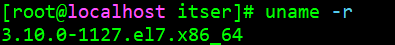

从 2017 年 3 月开始 docker 在原先基础上分为两个分支版本，Docker CE 和 Docker EE。

Docker CE 为社区免费版，Docker EE 为企业版，强调安全，但需付费使用

移除旧的版本：

```
sudo yum remove docker \
                  docker-client \
                  docker-client-latest \
                  docker-common \
                  docker-latest \
                  docker-latest-logrotate \
                  docker-logrotate \
                  docker-selinux \
                  docker-engine-selinux \
                  docker-engine
```

确保 yum 包更新到最新：

```
yum update
```

安装一些必要的系统工具：

```
yum install -y yum-utils device-mapper-persistent-data lvm2
```

添加软件源信息：

```
yum-config-manager --add-repo http://mirrors.aliyun.com/docker-ce/linux/centos/docker-ce.repo
```

更新 yum 缓存：

```
yum makecache fast
```

安装 Docker-ce：

```
yum -y install docker-ce
```

启动 Docker 后台服务：

```
systemctl start docker
```

测试 Docker 安装成功：

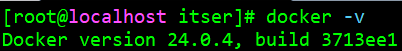

- 镜像加速

  鉴于国内网络问题，后续拉取 Docker 镜像十分缓慢，需要设置镜像，镜像位于配置文件 `/etc/docker/daemon.json`（如果没有该文件的话，就自己先建一个）：

  ```
  {
    "registry-mirrors": ["http://hub-mirror.c.163.com"]
  }
  ```

## 删除 Docker CE

执行以下命令来删除 Docker CE：

```
yum remove docker-ce
rm -rf /var/lib/docker
```

## 安装 kubernetes

### 准备工作

主机关闭防火墙，关闭 selinux，关闭 swap：

```
systemctl stop firewalld ; systemctl disable firewalld

sed -i 's/enforcing/disabled/' /etc/selinux/config
setenforce 0

swapoff -a  # 临时关闭
vim /etc/fstab 注释到swap那一行 # 永久关闭
```

将桥接的 IPv4 流量传递到 iptables 的链

```
cat > /etc/sysctl.d/k8s.conf << EOF
> net.bridge.bridge-nf-call-ip6tables = 1
> net.bridge.bridge-nf-call-iptables = 1
> EOF
```

应用

```
itser]# sysctl --system
* Applying /usr/lib/sysctl.d/00-system.conf ...
net.bridge.bridge-nf-call-ip6tables = 0
net.bridge.bridge-nf-call-iptables = 0
net.bridge.bridge-nf-call-arptables = 0
* Applying /usr/lib/sysctl.d/10-default-yama-scope.conf ...
kernel.yama.ptrace_scope = 0
* Applying /usr/lib/sysctl.d/50-default.conf ...
kernel.sysrq = 16
kernel.core_uses_pid = 1
kernel.kptr_restrict = 1
net.ipv4.conf.default.rp_filter = 1
net.ipv4.conf.all.rp_filter = 1
net.ipv4.conf.default.accept_source_route = 0
net.ipv4.conf.all.accept_source_route = 0
net.ipv4.conf.default.promote_secondaries = 1
net.ipv4.conf.all.promote_secondaries = 1
fs.protected_hardlinks = 1
fs.protected_symlinks = 1
* Applying /etc/sysctl.d/99-sysctl.conf ...
* Applying /etc/sysctl.d/k8s.conf ...
net.bridge.bridge-nf-call-ip6tables = 1
net.bridge.bridge-nf-call-iptables = 1
* Applying /etc/sysctl.conf ...
```

修改主机名，新建一个窗口生效

```
hostnamectl set-hostname master
```

### 安装 Docker/kubeadm/kubelet

添加阿里云 yum 源：

```
itser]# cat > /etc/yum.repos.d/kubernetes.repo << EOF
> [kubernetes]
> name=Kubernetes
> baseurl=https://mirrors.aliyun.com/kubernetes/yum/repos/kubernetes-el7-x86_64
> enabled=1
> gpgcheck=0
> repo_gpgcheck=0
> gpgkey=https://mirrors.aliyun.com/kubernetes/yum/doc/yum-key.gpg https://mirrors.aliyun.com/kubernetes/yum/doc/rpm-package-key.gpg
> EOF
```

执行命令查看哪个版本的 Kubernetes 可用：

```
yum list kubelet --showduplicates | sort -r
```

我们选择 1.21 版本：

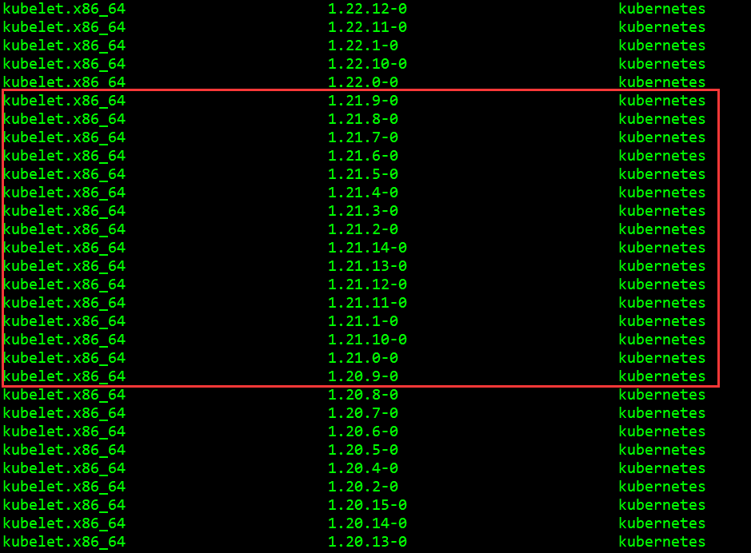

安装 kubeadm, kubelet 和 kubectl，安装版本为 `1.21.3`，注意版本指定时中间是 `-` 不是 `=` ：

```
yum install -y kubelet-1.21.3-0 kubeadm-1.21.3-0 kubectl-1.21.3-0
```

### 部署 Kubernetes Master

#### 主节点初始化

在 `10.130.60.165` 主节点执行：

```
# kubeadm init \
  --apiserver-advertise-address=10.130.60.165 \
  --image-repository registry.aliyuncs.com/google_containers \
  --kubernetes-version v1.21.3 \
  --service-cidr=10.96.0.0/12 \
  --pod-network-cidr=10.244.0.0/16 \
  --ignore-preflight-errors=all
```

部署过程中会有很多警告：

**警告 1**：[WARNING IsDockerSystemdCheck]: detected "cgroupfs" as the Docker cgroup driver. The recommended driver is "systemd". Please follow the guide at https://kubernetes.io/docs/setup/cri/

​	kubeadm 初始化时默认采用 cgroupfs 作为驱动，推荐使用 `systemd`，需要更换 docker 驱动

```
]# vim /etc/docker/daemon.json
{
    "exec-opts": ["native.cgroupdriver=systemd"],
    "registry-mirrors": ["http://hub-mirror.c.163.com"]
}

systemctl daemon-reload && systemctl restart docker
```

**警告 2**：[WARNING SystemVerification]: this Docker version is not on the list of validated versions: 24.0.5. Latest validated version: 20.10

​	卸载已存在的版本：

```
 yum remove docker-ce docker-ce-cli containerd.io
 
 yum remove docker \
                   docker-client \
                   docker-client-latest \
                   docker-common \
                   docker-latest \
                   docker-latest-logrotate \
                   docker-logrotate \
                   docker-engine
```

​	从高到低列出 yum 源各个版本的 docker：

```
yum list docker-ce --showduplicates | sort -r
```

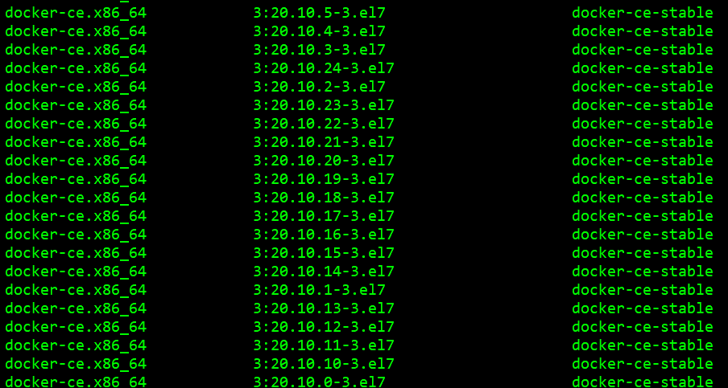

这里我们安装 `20.10.0-3.el7`，这个版本能符合 kubernetes 安装要求：

```
yum install docker-ce-20.10.0-3.el7 docker-ce-cli-20.10.0-3.el7 containerd.io
```

查看 docker 版本：

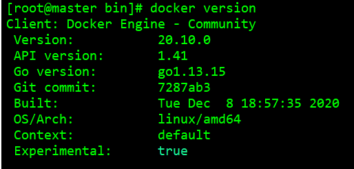

**警告 3**：[WARNING Hostname]: hostname "master" could not be reached

**警告 4**：[WARNING Hostname]: hostname "master": lookup master on 192.168.4.242:53: server misbehaving

​	修改 host 文件：

```
]# cat /etc/hosts
127.0.0.1   localhost localhost.localdomain localhost4 localhost4.localdomain4
::1         localhost localhost.localdomain localhost6 localhost6.localdomain6
10.130.60.165 master
```

**警告 5**：[WARNING Service-Kubelet]: kubelet service is not enabled, please run 'systemctl enable kubelet.service'

​	需要启动 kubelet 服务：

```
systemctl enable kubelet.service
```


解决所有警告后初始化成功：

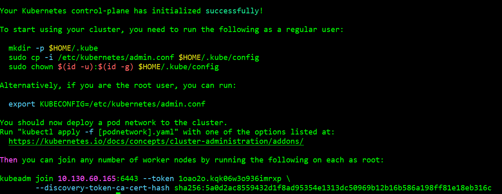

其它节点使用以下命令加入集群

```
kubeadm join 10.130.60.165:6443 --token 1oao2o.kqk06w3o936imrxp \ --discovery-token-ca-cert-hash sha256:5a0d2ac8559432d1f8ad95354e1313dc50969b12b16b586a198ff81e18eb316c
```

跟随指导依次执行：

```
mkdir -p $HOME/.kube
cp -i /etc/kubernetes/admin.conf $HOME/.kube/config
chown $(id -u):$(id -g) $HOME/.kube/config

export KUBECONFIG=/etc/kubernetes/admin.conf
```

完成了 Kubernetes 主节点的初始化。

**k8S 报错**：coredns 的状态是 pending：

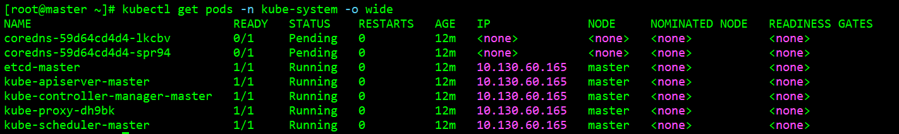

经查阅资料发现 coredns 最大可能是缺少网络插件导致，选择 calico 网络插件，下载地址：

```
wget http://docs.projectcalico.org/v3.8/manifests/calico.yaml
```

安装：

```
kubectl apply -f calico.yaml
```

查看节点状态：

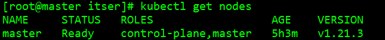

#### 工作节点加入集群

在主节点上获取节点加入的命令：

```
kubeadm token create --print-join-command
```

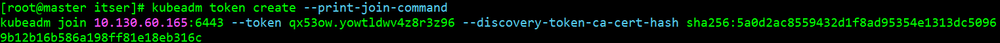

在工作节点（NX/intretech）上，进行重置

```
kubeadm reset
```

工作节点加入 k8s 集群，复制粘贴之前打印的信息：

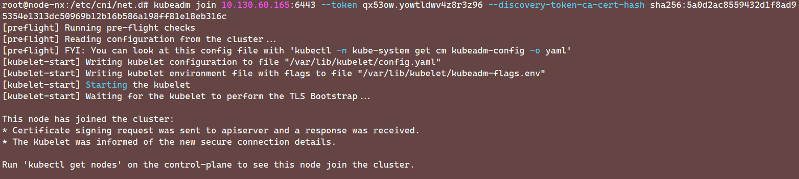

发现我们的工作节点已经加入了 k8s 集群

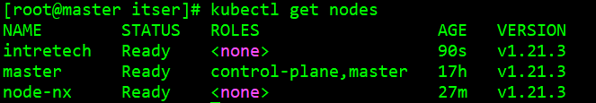

#### 安装 Prometheus

安装的教程可以参考 [Prometheus 安装教程](https://notebook-lzl.readthedocs.io/zh/latest/%E7%AC%94%E8%AE%B0/02Kubernetes/04%E6%95%B0%E6%8D%AE%E5%8F%AF%E8%A7%86%E5%8C%96.html#prometheus)

## 部署服务

首先在主节点上检查节点状态，确保所有的节点处于 Ready 状态：

```
kubectl get nodes
```

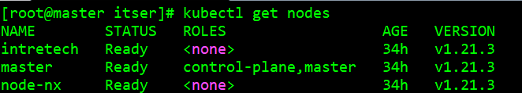

准备 Triton 镜像，镜像用于把服务部署给工作节点（3090 服务器），3090 服务器的镜像如果本地没有则默认从 docker-hub 上下载，因此需要给镜像打标签，并上传到 docker-hub 仓库中，我的 docker-hub 的账户名为 lizhongliang123，密码为 lizhongliang123。

```
docker login
docker tag triton_server:v07.31 lizhongliang123/triton_server:v07.31
docker push lizhongliang123/triton_server:v07.31
```

准备部署文件 `speech-replicas2.yml`，可以将我们的服务部署到 3090 服务器上

```
kubectl apply -f speech-replicas2.yml
```

使用 `nodeName: intretech` 指定需要部署的节点；`image: lizhongliang123/triton_server:v07.31` 指定需要加载的镜像；添加两个挂载：共享内存挂载和模型文件挂载，文件内容如下：

```
apiVersion: apps/v1
kind: Deployment
metadata:
  name: intreplus
  labels:
    app: intreplus
spec:
  replicas: 1
  selector:
    matchLabels:
      app: intreplus
  template:
    metadata:
      labels:
        app: intreplus
    spec:
      volumes:
      - name: dshm
        emptyDir:
          medium: Memory
          sizeLimit: 2048Mi
      - name: models
        hostPath:
          path: /model
      nodeName: intretech
      containers:
        - name: intreplus
          ports:
          - containerPort: 8000
            name: http-triton
          - containerPort: 8001
            name: grpc-triton
          - containerPort: 8002
            name: metrics-triton
          image: lizhongliang123/triton_server:v07.31
          volumeMounts:
          - mountPath: /model
            name: models
          command: ["/bin/bash", "-c"]
          args: ["cd /workspace/tensorrt_fastertransformer; export PYTHONIOENCODING=utf-8;bash infer.sh;"]
          volumeMounts:
            - mountPath: /dev/shm
              name: dshm
```

查看服务部署状态：

```
kubectl get pods -o wide
```

启动了一个 Pods，服务已成功部署到 3090 节点上：

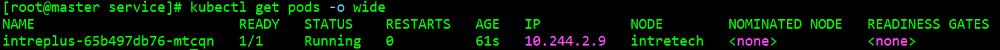

接下来需要部署 Service 文件，用于暴露服务端口

```
kubectl apply -f speech-service.yml
```

Service 文件内容如下：

```
apiVersion: v1
kind: Service
metadata:
  name: intreplus
  labels:
    app: intreplus
spec:
  selector:
    app: intreplus
  ports:
    - protocol: TCP
      port: 8000
      name: http
      targetPort: 8000
    - protocol: TCP
      port: 8001
      name: grpc
      targetPort: 8001
    - protocol: TCP
      port: 8002
      name: metrics
      targetPort: 8002
  type: LoadBalancer
```

查看 Service 类型的服务部署状态：

```
kubectl get svc -o wide
```

服务已经启动了，并将我们的 8001 端口映射到了主机的 32517 端口

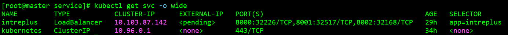

使用 URL `10.130.60.165:32517` 即可对服务进行访问。

使用 `kubectl delete deploy intreplus` 即可退出 Triton 服务，释放内存和显存资源。

