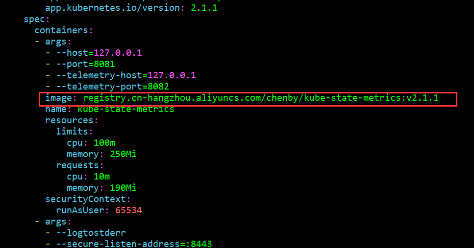
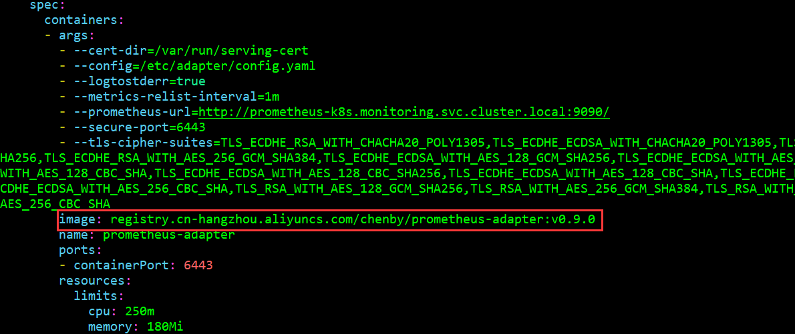
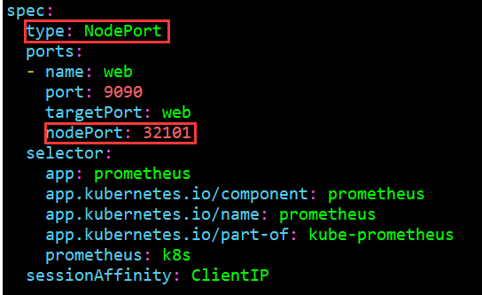
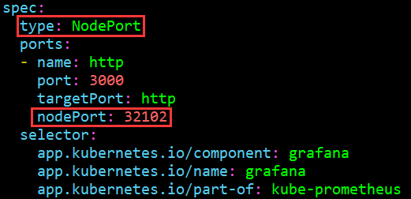
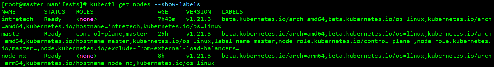
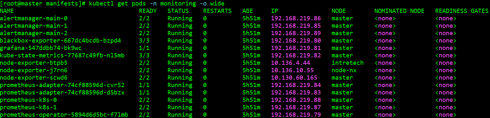

# 数据可视化

**Prometheus**：是从云原生计算基金会（CNCF）毕业的项目。Prometheus 是 Google 监控系统 BorgMon 类似实现的开源版，整套系统由监控服务、告警服务、时序[数据库](https://cloud.tencent.com/solution/database?from_column=20420&from=20420)等几个部分，及周边生态的各种指标收集器（Exporter）组成，是在当下主流的监控告警系统。

**exporter**：广义上向 Prometheus 提供监控数据的程序都可以成为一个 exporter，一个 exporter 的实例称为 target, exporter 来源主要有2个方面：一方面是社区提供的，另一方面是用户自定义的。

**Grafana**：是一款采用 go 语言编写的开源应用，主要用于大规模指标数据的可视化展现，是网络架构和应用分析中最流行的时序数据展示工具。目前已经支持绝大部分常用的时序数据库。

## Prometheus 安装教程

Prometheus 是 K8s 集群内应用广泛的监控服务，要自动更改 Kubernetest Pods 上 Trition 推理服务器的数量，首先收集用于自定义指标 NVIDIA Triton 性能，因为有来自多个 Kubernetes Pods 下的 NVIDIA Triton 指标，所以需要部署一个 PodMonitor，告诉 Prometheus 从所有的 Pods 中收集指标。

Prometheus 是一款开源的系统监控和报警工具包，提供由度量名称键值对标识的时间序列数据。PromQL 是一种灵活的查询语言，用于查询 Prometheus 的度量。

下载 **Prometheus v0.9.0** 版本并解压：

```shell
wget https://github.com/prometheus-operator/kube-prometheus/archive/refs/tags/v0.9.0.tar.gz
tar zxvf kube-prometheus-0.9.0.tar.gz
```

接下来，需要修改里面部分文件内容才能正常安装部署 Prometheus。

### 镜像替换

Prometheus 有两个镜像使用国内网络无法下载，需要替换国内镜像才能下载：

1. **kube-state-metrics**

   文件位于 `manifests/kube-state-metrics-deployment.yaml`，镜像替换为 `registry.cn-hangzhou.aliyuncs.com/chenby/kube-state-metrics:v2.1.1`

   
   
2. **prometheus-adapter**

   文件位于 `manifests/prometheus-adapter-deployment.yaml`，镜像替换为 `registry.cn-hangzhou.aliyuncs.com/chenby/prometheus-adapter:v0.9.0`。

   

### 暴露端口

为了使局域网中任意设备能够通过 Web 端访问 Prometheus 和 grafana，需要修改 Prometheus 和 grafana 中 Service 文件内容。首先暴露 prometheus 端口，需要修改的文件位于 `manifests/prometheus-service.yaml`，端口映射到 32101，需要指定 type 为 `NodePort`，同时在端口中指定 `nodePort: 32101`：



其次暴露 grafana 端口，需要修改的文件位于 `manifests/grafana-service.yaml`，端口映射到 32102：



### 修改 Prometheus 配置文件

为了使 Prometheus 监控服务全部部署在主节点上，需要指定 deployment 节点，需要修改以下文件：

- manifests/prometheus-adapter-deployment.yaml
- manifests/kube-state-metrics-deployment.yaml
- manifests/blackbox-exporter-deployment.yaml
- manifests/grafana-deployment.yaml

- manifests/setup/prometheus-operator-deployment.yaml


- manifests/prometheus-prometheus.yaml
- manifests/alertmanager-alertmanager.yaml

修改前可以使用 `kubectl label` 对 k8s 部署的节点指定类型，首先查看所有节点的标签：

```shell
kubectl get nodes --show-labels
```



给节点添加标签的命令：

```shell
kubectl label nodes master label_name=master
```

有两种修改方式：

- 通过节点类型指定，这样可以批量指定：

```yaml
label_name: master
```

- 通过节点名称指定，这样可以更精确指定：

```yaml
nodeName: master
```

对于前 5 个 deployment 文件两种修改方式均能起效，对于后两个配置文件只有方式 1 能起效。

### 安装和删除

所有文件安装完成后开始 Prometheus 的安装工作，执行：

```shell
kubectl create -f manifests/setup
kubectl create -f manifests/
```

完成 Prometheus 的安装，执行：

```shell
kubectl delete --ignore-not-found=true -f manifests/ -f manifests/setup
```

完成 Prometheus 的删除，如果所有节点均处于 Running 状态则表示安装成功：



## Grafana 是什么

Grafana 是一个监控仪表系统，它是由 Grafana Labs 公司开源的的一个系统监测 (System Monitoring) 工具。它可以大大帮助你简化监控的复杂度，你只需要提供你需要监控的数据，它就可以帮你生成各种可视化仪表。同时它还有报警功能，可以在系统出现问题时通知你。

## Grafana 工作原理

Grafana 本身并不负责数据层，它只提供了通用的接口，让底层的数据库可以把数据给它。而我们起的另一个服务，叫 Prometheus （中文名普罗米修斯数据库）则是负责存储和查询数据的。

Grafana 每次要展现一个仪表盘的时候，会向 Prometheus 发送一个查询请求。


最左边的 docker 服务会将服务的数据发送给 Prometheus(Prometheus-exporter)，最右侧的 Grafana 查询 Prometheus 来展示仪表盘。

## 监控指标

Grafana 使用 Prometheus 语句查询指标并负责可视化，指标通过 Prometheus 的 node-exporter 获取，目前 Grafana 的监控地址为 http://10.24.83.22:32102/

### 基础指标

- 获取各节点的 CPU 频率：`avg by(instance) (node_cpu_scaling_frequency_hertz)`

- 获取各节点的 CPU 核数：`count(node_cpu_seconds_total{mode="user"}) by (instance)`

- 获取各节点 CPU 使用率：`100 - (avg by(instance) (irate(node_cpu_seconds_total{mode="idle"}[5m])) * 100)`

- 获取各节点系统最大内存：`avg by(instance)(node_memory_MemTotal_bytes)`

- 获取各节点系统已使用内存：`avg by(instance)(node_memory_MemTotal_bytes - node_memory_MemAvailable_bytes)`

- 获取各节点内存使用率：`avg by(instance) ((node_memory_MemTotal_bytes - node_memory_MemAvailable_bytes) / node_memory_MemTotal_bytes * 100)`

- 获取各节点上传网络数据量：`topk(5, sort_desc(sum(rate(node_network_transmit_bytes_total[1m])) by (instance)))`

- 获取各节点下载网络数据量：`topk(5, sort_desc(sum(rate(node_network_receive_bytes_total[1m])) by (instance)))`

- 获取各节点磁盘读取速率：`topk(5, sort_desc(sum(rate(node_disk_read_bytes_total[1m])) by (instance))) `

- 获取各节点磁盘写入速率：`topk(5, sort_desc(sum(rate(node_disk_written_bytes_total[1m])) by (instance)))`


### Triton 指标

除了以上基础监控指标，Triton 提供了指示 GPU 和请求统计信息的 Prometheus 度量。

#### 推理请求指标

对于不支持批处理的模型，其请求数、推理数和执行数应该是相等的；对于支持批处理的模型，平均批处理大小应为推理数/执行数。

| Category           | Metric              | Metric Name                             | Description                                              | Granularity | Frequency   |
| ------------------ | ------------------- | --------------------------------------- | -------------------------------------------------------- | ----------- | ----------- |
| Count              | Success Count       | nv_inference_request_success            | Triton收到的成功推理请求数                               | Per model   | Per request |
|                    | Failure Count       | nv_inference_request_failure            | Triton收到的失败推理请求数                               | Per model   | Per request |
|                    | Inference Count     | nv_inference_count                      | 执行的推理数量                                           | Per model   | Per request |
|                    | Execution Count     | nv_inference_exec_count                 | 执行批处理推理数目                                       | Per model   | Per request |
| Latency（count）   | Request Time        | nv_inference_request_duration_us        | 累积端到端推理请求处理时间（包括缓存）                   | Per model   | Per request |
|                    | Queue Time          | nv_inference_queue_duration_us          | 请求在调度队列中等待的累计时间                           | Per model   | Per request |
|                    | Compute Input Time  | nv_inference_compute_input_duration_us  | 处理推理输入请求所花费的累计时间（框架后端，不包含缓存） | Per model   | Per request |
|                    | Compute Time        | nv_inference_compute_infer_duration_us  | 执行推理模型所花费的累计时间（框架后端，不包括缓存）     | Per model   | Per request |
|                    | Compute Output Time | nv_inference_compute_output_duration_us | 处理推理输出所花费的累计时间（框架后端，不包括缓存）     | Per model   | Per request |
| Latency（Summary） | Request Time        | nv_inference_request_summary_us         | 端到端推理请求处理次数总结（包括缓存）                   | Per model   | Per request |
| （默认是禁用的）   | Queue Time          | nv_inference_queue_summary_us           | 请求在调度队列中等待时间摘要（包括缓存）                 | Per model   | Per request |
|                    | Compute Input Time  | nv_inference_compute_input_summary_us   | 请求处理推理输入所花费的时间摘要（框架后端，不包括缓存） | Per model   | Per request |
|                    | Compute Time        | nv_inference_compute_infer_summary_us   | 请求执行推理模型所花费的时间摘要（框架后端，不包括缓存） | Per model   | Per request |
|                    | Compute Output Time | nv_inference_compute_output_summary_us  | 请求处理推理输出所花费的时间摘要（框架后端，不包括缓存） | Per model   | Per request |

#### GPU 指标

| Category | Metric        | Metric Name               | Description                     | Granularity | Frequency    |
| -------- | ------------- | ------------------------- | ------------------------------- | ----------- | ------------ |
| GPU利用  | 功率使用      | nv_gpu_power_usage        | GPU瞬时功率                     | Per GPU     | Per interval |
|          | 功率限制      | nv_gpu_power_limit        | 最大GPU功率限制                 | Per GPU     | Per interval |
|          | 能量消耗      | nv_energy_consumption     | 自Triton启动以来GPU能耗（焦耳） | Per GPU     | Per interval |
|          | GPU利用率     | nv_gpu_utilization        | GPU利用率（0.0-1.0）            | Per GPU     | Per interval |
| GPU内存  | GPU总内存     | nv_gpu_memory_total_bytes | GPU总内存（字节）               | Per GPU     | Per interval |
|          | GPU已使用内存 | nv_gpu_memory_used_bytes  | 已用GPU内存（字节）             | Per GPU     | Per interval |