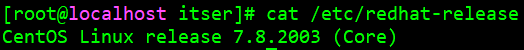

# Centos 部署指南

IP 地址：10.130.60.165:39999

用户名：itser

密码：Demo@60165

查看 Centos 的版本，我们的虚拟机的 Centos 的版本为 7.8.2003，64 位操作系统

```
cat /etc/redhat-release
```



## 安装 Docker

参考链接：https://developer.aliyun.com/article/1000962

Docker 要求 CentOS 系统的内核版本高于 3.10 ，查看本页面的前提条件来验证你的CentOS 版本是否支持 Docker 。

通过 **uname -r** 命令查看你当前的内核版本


从 2017 年 3 月开始 docker 在原先基础上分为两个分支版本，Docker CE 和 Docker EE。

Docker CE 为社区免费版，Docker EE 为企业版，强调安全，但需付费使用

移除旧的版本：

```
sudo yum remove docker \
                  docker-client \
                  docker-client-latest \
                  docker-common \
                  docker-latest \
                  docker-latest-logrotate \
                  docker-logrotate \
                  docker-selinux \
                  docker-engine-selinux \
                  docker-engine
```

确保 yum 包更新到最新：

```
yum update
```

安装一些必要的系统工具：

```
yum install -y yum-utils device-mapper-persistent-data lvm2
```

添加软件源信息：

```
yum-config-manager --add-repo http://mirrors.aliyun.com/docker-ce/linux/centos/docker-ce.repo
```

更新 yum 缓存：

```
yum makecache fast
```

安装 Docker-ce：

```
yum -y install docker-ce
```

启动 Docker 后台服务：

```
systemctl start docker
```

测试 Docker 安装成功：


- 镜像加速

  鉴于国内网络问题，后续拉取 Docker 镜像十分缓慢，需要设置镜像，镜像位于配置文件 `/etc/docker/daemon.json`（如果没有该文件的话，就自己先建一个）：

  ```
  {
    "registry-mirrors": ["http://hub-mirror.c.163.com"]
  }
  ```

## 删除 Docker CE

执行以下命令来删除 Docker CE：

```
yum remove docker-ce
rm -rf /var/lib/docker
```

