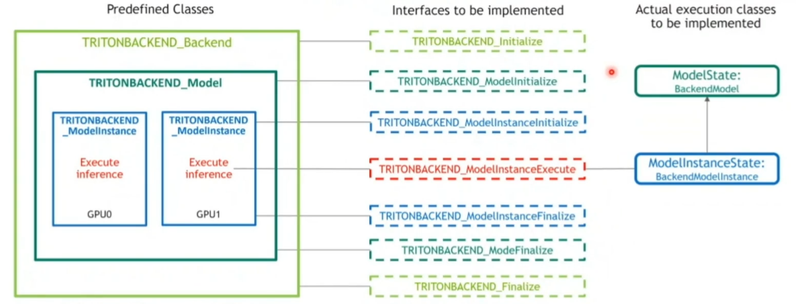
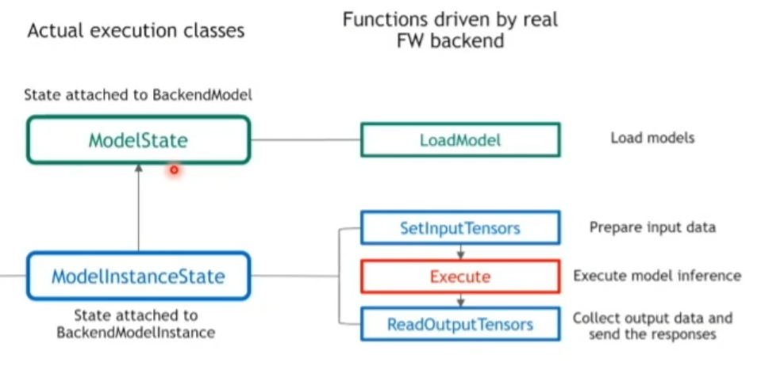
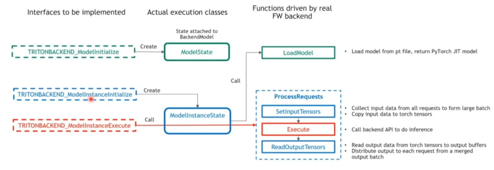

# Triton_Backend详解

## 一、概述

### 1.1 主要场景

有些客户有自己的深度学习框架：Tencent-TNN; Baidu-Paddle; Nvidia-HugeCTR

在 Triton 深度学习框架运行定制化模块：前处理、后处理、未部署到主流 DL 框架

### 1.2 部署什么

TRITONBackend_Backend：ONNX、Pytorch、Tensorflow

TRITONBACKEND_Model：yolov、VGG、RNN

TRITONBACKEND_ModelInstance：可以在 GPU0、GPU1上跑

这三个类代码已经实现了，Triton 需要与这三个类交互，需要实现七个接口函数(C语言编写)，TritonBACKEND 将对象传到接口函数里面，包括 Initialize 和 Finalize，关键部分：ModelInstanceExecute，调这个接口执行推理

Triton 设计了两个状态类，ModelState和 ModelInstanceState，推理执行的代码是写在这两个类里面，

维护状态：ModelState：模型名称、模型输入输出信息，batch_size；ModelInstance：在哪个设备上运行

模型推理：ModelState 实现了成员函数 loadModel；ModelInstanceState 实现成员函数：SetInputTensors、Execute、ReadOutputTensors

定义 Predefined Class 的目的：Triton 对于不同的 Backends 用统一的方式进行管理，Predefined Class 是躯壳类。

定义 ModelState 和 ModelInstanceState 的目的：七个接口不是面向对象的编程，使用两个 Modle 对象，在不同的 Instance 里面执行推理，属于两个状态类，不同 Instance 之间的推理是独立安全的。

为什么不直接在三个类里面进行实例化：这么设计主要是解耦 backend 和 triton 之间的主流程，不需要编译整个 Triton，Backend 之间的开发更高效。