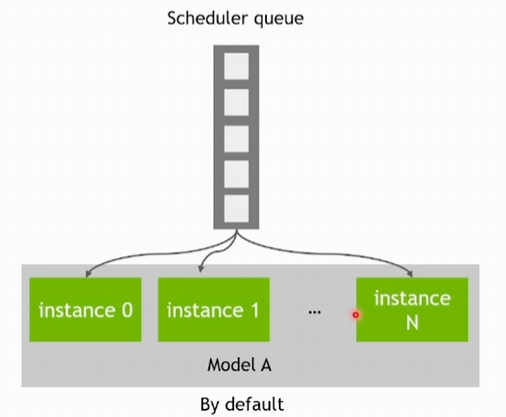
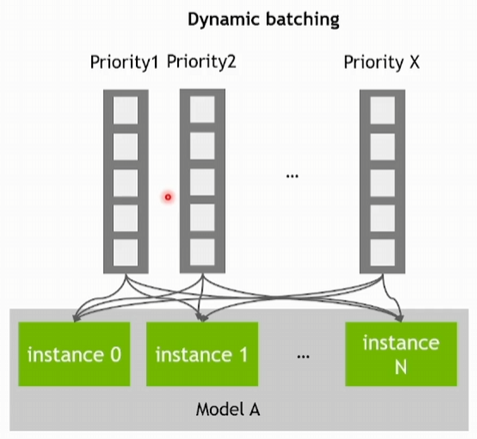
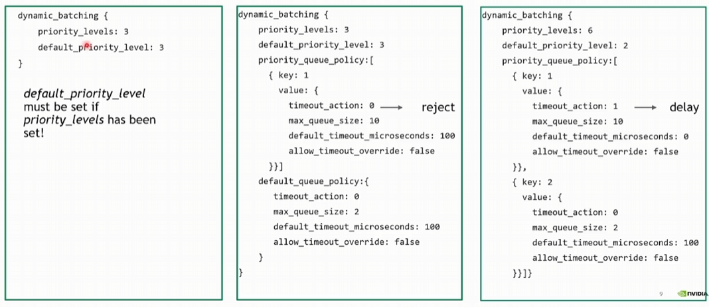

# Triton 队列

## 一、Triton Priority

如果检测到 Modle Instance 处于空闲状态，Schduler 会将请求调度到对应的 Model Instance 上进行推理，推理结果返回给 Client 端。Triton 提供两种优先级机制：

- Queue Priority：可以对 Request 进行优先级划分及管理
- Rate limiter：可以对 Model instance 进行优先级管理

### Queue Priority

只有一个 Scheduler 队列



Dynamic batching：可以定义多个优先级队列，先执行高优先级 Request，再执行低优先级 Request。



配置 Config 文件，启动 server，通过 API 向 Server 发起请求。

- priority_levels：设置优先级
- default_priority_level：设置默认优先级
- priority_queue_policy：为每一个队列策略设置一个优先级
- default_quene_policy：设置默认的队列策略优先级

priority_queue_policy 是一个容器，可以放多个 priority，其中 key: 1 表示设置优先级为 Level 1 的队列策略，数字越小优先级越高，max_queue_size 表示队列能容纳的最大请求数。对于未出现的优先级级别，则使用默认的 default_queue_policy



通过 Client API 向 Server 端发起请求，给 Request 设置 Priority

```
client.async_infer(
	priority=priority,
	timeout=timeout, # Request 在队列存留的最大时长
	client_timeout=client_timeout # 最大的端到端时长
)
```

