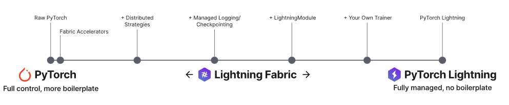

# Pytorch Lighting

PyTorch Lightning是专业AI研究人员和机器学习工程师的深度学习框架，他们需要在规模上保持最大灵活性而不损失性能。随着您的项目从构思到论文/生产的不断推进，Lightning与您共同发展。

## Fabric

Fabric是一种快速而轻量级的方式，可以在没有样板代码的情况下扩展PyTorch模型。将PyTorch代码转换为Lightning Fabric只需5行，即可访问最先进的分布式训练功能（DDP、FSDP、DeepSpeed、混合精度等），从而扩展最大的十亿参数模型。

**什么是 Fabric**

Fabric在以下关键方面与像Lightning Trainer这样的完整训练器有所区别：

1. **快速实施：**
   - 无需重构代码：只需在PyTorch脚本中更改几行，即可利用Fabric的功能。

2. **最大灵活性：**
   - 编写自己的训练和/或推理逻辑，直至个别优化器调用。您不必遵循类似于Lightning Trainer中的标准化基于epoch的训练循环。您可以进行灵活的迭代训练、元学习、交叉验证以及其他类型的优化算法，而无需深入了解框架内部。这也使得在现有的PyTorch项目中采用Fabric来加速和扩展模型变得非常容易，而无需进行大规模的重构。请记住：伴随强大的功能而来的是巨大的责任。

3. **最大控制：**
   - Lightning Trainer具有许多内置功能，可以减少样板代码，使研究变得更简单，但调试它需要对框架内部有一定的了解。在Fabric中，一切都是可选的。可以将其视为一个工具箱：您提取所需的工具（Fabric函数），并将其他工具留在一边。这使得在逐渐向PyTorch代码添加更多功能的过程中，更容易开发和调试代码。Fabric提供了一些重要的工具，以消除不必要的样板代码（分布式、硬件、检查点、日志记录等），但完全由您自己设计和协调。

