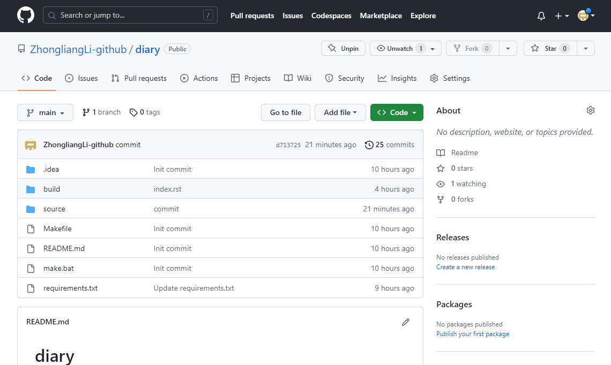

# GitHub + Spinx + Read the docs实战入门指南（二）

参考链接：[知乎博客](https://zhuanlan.zhihu.com/p/618886468)

这一篇主要讲如何自动将指定的文档内容部署到Read the docs中。

对于一份文档，一般有如下要求：

- 只维护一份，其它地方自动更新
- 可以根据代码注释，动态更新维护相应的API文档
- 支持检索
- 多版本之间的API接口动态查看

以下是主要的技术路线：


## 一、Sphinx渲染文档托管到Github

- 经过上一节，我们可以本地生成Sphinx渲染之后的html文档，但是只能本地查看，现需要将其托管到Github中，便于后续Read the docs部署

- 第一节在执行`sphinx-quickstart`后，我们的代码目录位于`D:\ProgramFile\TestProject`，接下来我们要将其部署到Github中。首先在Github上创建一个diary仓库

  

- 接下来在目标文件夹下，依次执行以下命令：

  ```
  git init
  git add .
  git commit -m "first commit"
  git branch -M main
  git remote add origin git@github.com:ZhongliangLi-github/diary.git
  git push -u origin main
  ```

- 去Github界面查看，示例图如下：

  

## 二、部署到Read the docs网站

​	目前Sphinx渲染的文件已经托管到Github的main分支，接下来需要托管到Read the docs网站，便于查看和访问

- 注册登录 [Read the docs](https://readthedocs.org/dashboard/)

- 点击导入一个项目

- 选择我们的**diary**项目

- 更改默认分支为main

- 点击**Build version**，即可开始构建文档

- 成功后，点击右上角阅读文档即可查看

  

- 至此，整个Sphinx渲染的内容就已经部署到Read the docs网站了

