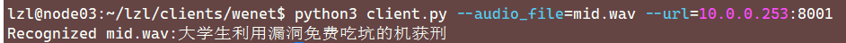

# 客户端模型推理

选择一个Ubuntu系统的计算机模拟客户端测试。

## 客户端环境准备

安装客户端推理所需要的环境：https://github.com/triton-inference-server/server/releases/tag/v2.20.0

对于 Jetson NX，在`${HOME}/lzl/tritonserver2.20.0-jetpack5.0/clients/python`目录下安装 tritonclient

```
cd clinets/python
pip3 install tritonclient-2.20.0-py3-none-any.whl[all]
```

对于新的 Ubuntu 客户端机器，下载 https://github.com/triton-inference-server/server/releases/download/v2.20.0/v2.20.0_ubuntu2004.clients.tar.gz。

```
# 解压到python子目录下
tar zxvf v2.20.0_ubuntu2004.clients.tar.gz -C python
```

进入到`python/python`，安装 tritonclient：

```
pip3 install tritonclient-2.20.0-py3-none-any.whl[all]
pip3 install typing_extensions soundfile
```

## 客户端识别

### 单个音频文件的识别

客户端识别程序位于 `${HOME}/lzl/clients/wenet`，服务端拉起服务后，客户端使用 triton gRPC 客户端开始进行识别：

```
python3 client.py --audio_file=mid.wav --url=10.0.0.253:8001
```

url 需要根据部署服务端的 url 进行修改，端口号为 8001 表示使用 gRPC 服务，端口号为 8000 表示使用 HTTP 服务。



### 多个音频文件的识别

#### 		音频文件列表scp文件的制作

音频文件列表(.scp)包含了所有音频文件的名称和目录，集成于gen_scp.sh：

```
# 这里需要指定wav文件的绝对路径
find $HOME/data -iname '*.wav' > wav.scp.temp	
cat  wav.scp.temp | awk -F '/' '{printf("%s_%s\n",$(NF-1),$NF)}' | sed 's/.wav//' | sed 's/Speaker/Speaker_/' > wav_id 
paste -d' ' wav_id wav.scp.temp> wav.scp
rm wav.scp.temp wav_id
python3 scp_sorted.py	# 对生成的scp文件进行排序
```

启动Triton客户端，进行多个音频文件的识别，

```
python3 client.py --wavscp=wav.scp --trans=refer.txt --url=10.0.0.253:8001
```

