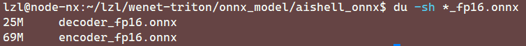
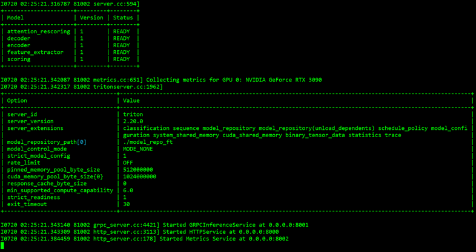

# 性能测试

相关测试文件夹位于 D:\ProgramFile\Python\triton-client

测试指标包括语音识别唤醒率、语音误识率、语音识别响应时间、语音识别模型大小，对应的指标要求如下图所示：


模型采用 Triton Server 进行加载和推理，模型部署在 Jetson NX，客户端将音频文件，上传至 NX 进行推理，并返回推理结果，在 Aishell-1 测试集上进行测试，录音过程在安静的室内环境中，录音文本涉及智能家居、无人驾驶、工业生产等 11 个领域。

测试集包含 20 个录音人共计 7176 条音频数据，音频格式为 wav 格式，并提供精确度高达 98% 以上的转录文本。

## 模型大小

模型大小通过右击模型属性查看文件大小的形式获得，对于预训练模型，模型为final.pt，其大小为188.53MB，将其转换为ONNX格式模型，并转换为FP16精度，模型为encoder_fp16.onnx和decoder_16.onnx，在 Linux 下进入模型目录，使用以下命令获取模型大小：

```
du -sh *_fp16.onnx
```



其大小分别为69MB和25MB，合计94MB，满足指标中模型大小小于 100MB 的要求

## 响应时间和误识率

NX 启动 Triton Server 



客户端使用自己的 Windows 电脑，模拟与 NX 之间的通信，测试 7176 条音频数据的响应时间和误识率

```
python client.py --url=10.136.10.55:8001 --trans=testFile/text --wavscp=testFile/test.scp
```

该程序能计算 7176 条音频数据的平均响应时间和词错误率，在一次程序运行下的平均响应时间为 50.438ms，满足指标中模型响应时间小于 1s 的要求，误识率为 4.66%，满足模型误识率小于 8% 的要求。

我们可以使用 Triton 内置的 `perf_analyzer` 对模型进行进一步测试，可以对模型的响应时间和吞吐率进行测试。Triton 服务端和客户端均位于 NX，测试路径位于 `/home/lzl/lzl/clients/wenet`，对于一段测试音频 `mid.wav`，执行以下代码进行测试

```
# offline_input.json generated
python3 generate_perf_input.py --audio_file=mid.wav

perf_analyzer -m attention_rescoring -b 2 --concurrency-range 2 -i gRPC --input-data=offline_input.json -u localhost:8001
```

以上测试代码测试了batch_size为 2，并发度为 2 的模型吞吐率和响应时延，在请求数为 134 下，模型的吞吐率为 53.6 infer/sec，对应的时延指标：

| 指标 | 时延(ms) |
| ---- | -------- |
| p50  | 74.707   |
| p90  | 79.098   |
| p95  | 80.616   |
| p99  | 83.748   |
| avg  | 74.994   |
|      |          |

所有测试的时延指标均在 1s 内。