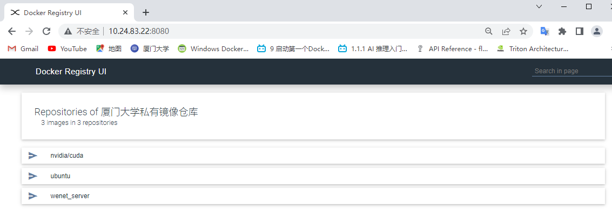
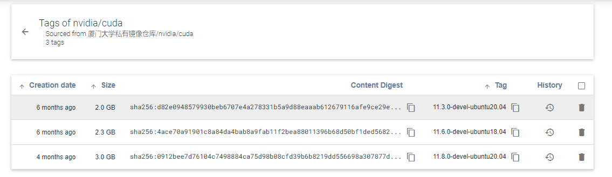
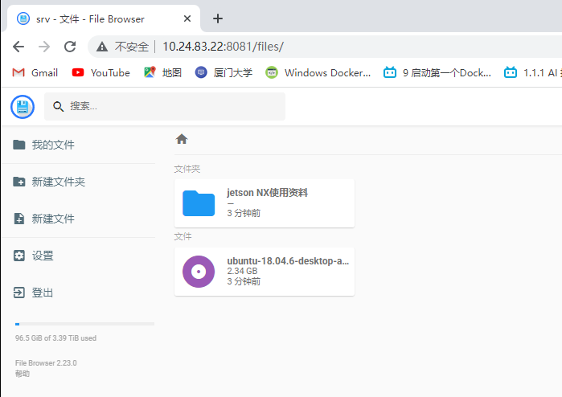
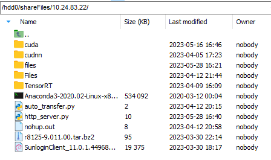
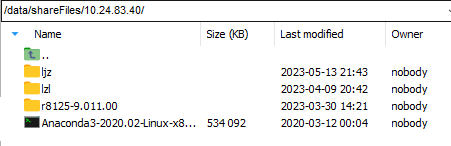
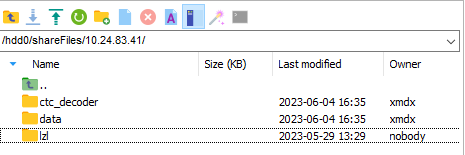

# 服务器文件管理工具

## 一、私有镜像仓库

开源项目链接：https://github.com/Joxit/docker-registry-ui

说明：管理我们服务器所有的镜像，`push` 可将当前镜像推送到镜像仓库，`pull` 可从镜像仓库拉取镜像，镜像的推拉操作都在校园网进行。

Web 端访问链接：http://10.24.83.22:8080/

用户名：**admin**；密码：**admin**

## 二、文件管理器

开源项目链接：https://github.com/filebrowser/filebrowser

docker 镜像：`filebrowser/filebrowser:s6`

Web 端访问链接：http://10.24.83.22:8081/

文件的物理位置：`10.24.83.22 --> /mnt/data/filebrowser/`

说明：文件仓库的 Web 端管理器，在校园网内实现不同 Windows 系统之间大文件共享，也可当作云盘存储文件

## 三、NFS

说明：不同 Linux 主机的文件共享，可以方便将文件从一个主机传输到另一个主机，配合 docker 文件挂载机制也可实现不同容器之间的文件传输

物理主机共享文件夹的物理地址：

10.24.83.22：`/mnt/data/shareFiles/10.24.83.22/`

10.24.83.40：`/data/shareFiles/10.24.83.40/`

10.24.83.41：`/hdd0/shareFiles/10.24.83.41/`

只要在 `/path/to/shareFiles` 文件夹下进行操作，例如添加文件到 `shareFiles/10.24.83.41`，那么添加的文件可以在所有主机对应的文件夹 `shareFiles/10.24.83.41` 下看到。

> 在容器内使用需要注意映射关系，通常在容器创建的时候会挂载机械硬盘，那共享文件夹的位置就是容器挂载目录的位置

> 目前 NFS 文件权限问题还没有解决

