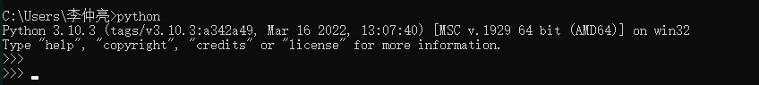
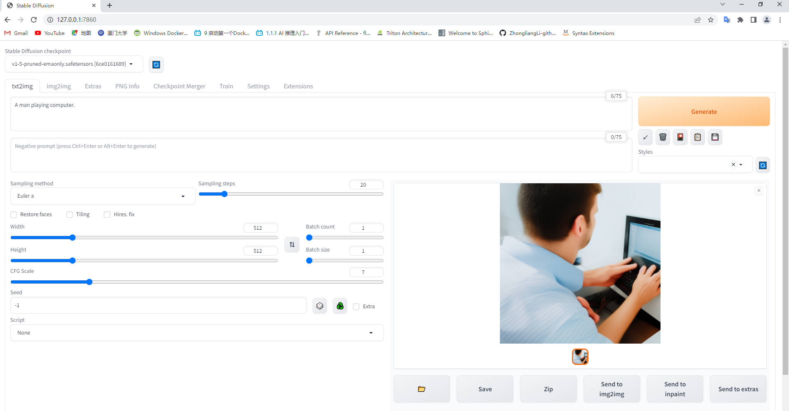

# Stable Diffusion

项目地址：https://github.com/AUTOMATIC1111/stable-diffusion-webui

## Quick start

### 1、Windows 安装

安装 Python 3.10，核对已经添加到环境变量：



安装 Git，主要用作 Git Clone

克隆 stable-diffusion-webui 仓库

```g
git clone https://github.com/AUTOMATIC1111/stable-diffusion-webui.git
```

直接运行 `webui-user.bat` 脚本文件

- Torch 包下载慢

  采用离线下载的方式：下载好 whl 文件，下载的文件已传至云盘，下载到 Stable Diffusion 的目录下，在 venv 目录下使用 `python -m pip install torch-*.whl` 进行安装

环境安装受网络问题影响较大，有些包安装不下来的需要通过源码安装，一些 git 仓库需要科学上网



