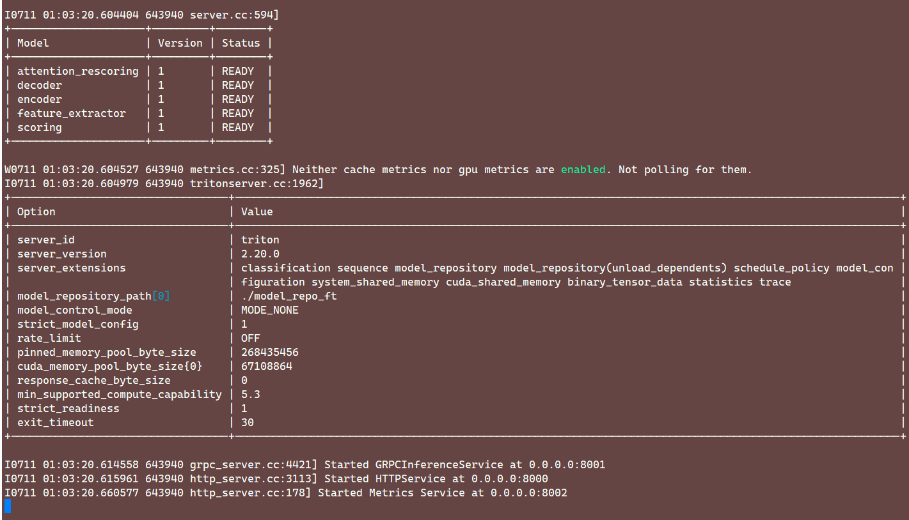
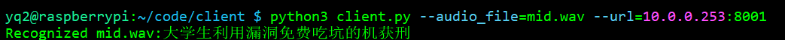
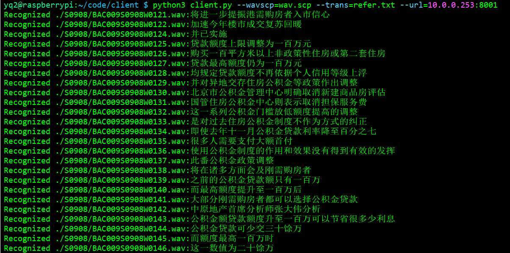

# 树莓派客户端环境安装

## 音频文件识别

在树莓派终端使用 pip 进行 python 环境安装：

```
pip3 install tritonclient[all]
pip3 install soundfile
pip3 install typing_extensions==4.3.0
```

在服务端（NX）拉起语音识别服务：

```
cd lzl/wenet-triton/
bash run.sh
```

服务拉起成功：



在树莓派客户端执行识别程序：

```
python3 client.py --audio_file=mid.wav --url=10.0.0.253:8001
```

树莓派获得识别结果：



多条音频文件识别：

```
python3 client.py --wavscp=wav.scp --trans=refer.txt --url=10.0.0.253:8001
```



## 麦克风输入识别

首先安装 `Pyaudio` 库，直接使用 pip 安装会报错，需要先安装 Portaudio：

```
sudo apt-get install portaudio19-dev
```

然后再安装 Pyaudio

```
pip install pyaudio
```

树莓派播放音频：

```
sudo apt-get install alsa-utils
```

进行麦克风测试，测试代码在树莓派 `yq2` 的 `code/client/audio_test.py` 目录下，代码可以自动识别，如果说话声音超过阈值则开始进行录音，如果说话声音小于阈值，且小于阈值的时间小于 1s 以上，则结束录音，最终录音的结果生成 `test.wav` 文件

<audio src="./test.wav">


