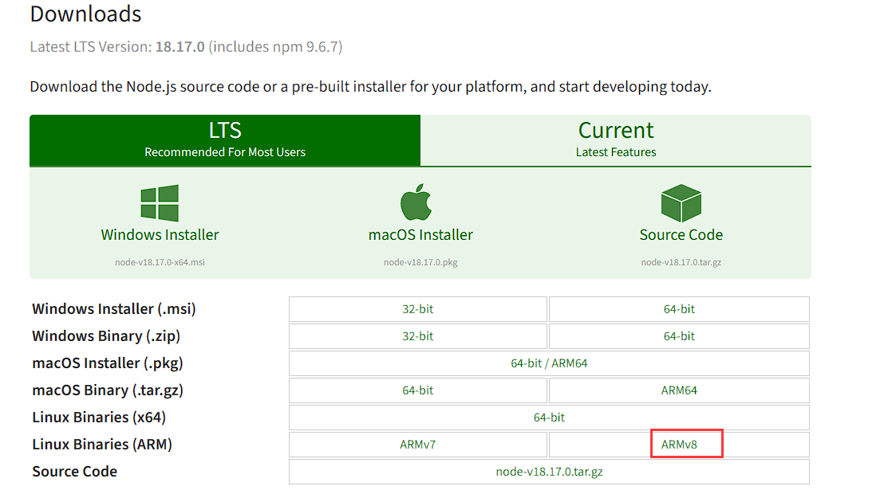
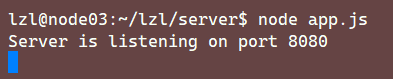

# Node.js

## 简介

Node.js 是一个跨平台的 JavaScript 环境，它构建在为了在服务端运行 JavaScript 代码而设计的 Chrome JavaScript 上，通常用来构建后端应用，是目前非常流行的全栈和前端解决方案。npm 是 node.js 的默认包管理工具，也是世界上最大的软件仓库。

## 安装

### 从 Ubuntu 软件源安装 node.js 和 npm

安装非常简单直接，运行下面命令更新软件包索引，并且安装 Node.js 和 npm：

```
sudo apt update
sudo apt install nodejs npm
```

上面的命令将会安装一系列包，一旦完成，运行下面命令，验证安装过程：

```
$ nodejs --version
v10.19.0

$ npm -v
6.14.4
```

但这种安装方法在 Jetson 设备上运行 `npm install <包名>` 时会报错。

### Jetson 安装 Nodejs

去官网下载 ARMv8 版本的压缩包，下载地址：https://nodejs.org/en/download/



解压下载的文件，添加软链接并添加进环境变量

```
# 解压
tar -xvf node-v18.17.0-linux-arm64.tar.xz
# 建立软链接
sudo ln -s /home/lzl/lzl/tools/node-v18.17.0-linux-arm64/bin/node /bin/node
sudo ln -s /home/lzl/lzl/tools/node-v18.17.0-linux-arm64/bin/npm /bin/npm
```

验证安装：

```
$ nodejs --version
v18.17.0

$ npm -v
9.6.7
```

## 部署

首先安装 websocket 包

```
npm install websocket
```

然后运行 `app.js` 程序：

```
node app.js
```



这样就把服务端部署到 NX 上了

## 语法

### 消息接收

WebSocket 的消息处理在 `conncect` 中实现，使用 `ws` 模板提供的 `WebSocktServer` 实例 `wsServer` 的 `on()` 方法注册 `connect` 事件监听器，并在客户端连接成功后执行回调函数

```
wsServer.on("connect"， (connection) => {
	console.log("WebSocket connection accepted, receive audio:");
	...
})
```

首先创建一个 WAV 音频文件写入器 `wav.FileWriter` 实例，并指定要写入的路径、声道数、采样率和采样位深等参数

```
outputStream = new wav.FileWriter(path.join(__dirname, "output.wav"), {
	channels: CHANNELS,
	sampleRate: SAMPLE_RATE,
	bitDepth: SAMPLE_WIDTH * 8,
});
```

如果接收到的消息类型为二进制数据，则将其写入到 `WAV` 文件中，并使用 `connection.sendUTF()` 方法向客户端发送一个字符串消息，提示音频正在接受中：

```
if (message.type === "binary") {
	outputStream.write(message.binaryData);
	connection.sendUTF("Audio receiving.")
}
```

如果接收到的消息类型不为二进制数据，则表示音频录制已经结束，可以进行推理操作。客户端使用 `websocket.send("Recording finished")` 发送录音结束的字符串消息，服务端接收这个消息的消息类型为 `utf8`，若要将其字符串消息打印在终端，需要对接收的 `message` 进行处理：

```
let str = JSON.stringify(message);
str = JSON.parse(str).utf8Data;
console.log(`Received message from client: ${str}`);
```

### Node.js 调用 Python 脚本

Node.js 比较适合执行 IO 密集操作，不擅长数据处理等 CPU 密集操作；而 Python 则比较擅长数据处理，且有很多好用的工具和计算库；使用 Node 的 `child_process` 库，可以创建并管理子进程，具体实现函数为 `spawn`，Node 示例代码如下：

```
const { spawn } = require('child_process')

const pythonProcess = spawn('python', ['speech/client.py'])
	pythonProcess.stdout.on('data', function(res){
	let data = res.toString();
	console.log('stdout: ', data)
})
```

Node 父进程会等待 Python 子进程执行完成，当 Python 子进程打印的内容，会被 Node 父进程接受并显示。

### 多条消息

如果服务端需要发送多条消息，则 `onMessage()` 方法将在每次接收到一条消息时被调用。因此，可以通过添加适当的逻辑来处理多条消息。

一种常见的方法是使用 JSON 格式来封装多个字段或数据，并在客户端应用程序中解析和处理它们，例如：

```javascript
const message1 = {
	type: 'result',
	data: [1, 2, 3, 4, 5],
	message: 'success'
}

const message2 = {
	type : 'status',
	status: 'processing',
	message: 'Task is in process.'
}

connection.sendUTF(JSON.stringify(message1))
connection.sendUTF(JSON.stringify(message2))
```

在上面的示例中，我们定义了两个 JavaScript 对象，分别表示两种不同类型的消息。然后，我们使用 `JSON.stringify()` 方法将它们转换为 JSON 字符串，并使用 `sendUTF()` 方法将它们发送给客户端。

在客户端应用程序中，可以使用 `JSON.parse()` 方法将接收到的字符串转换回对象，并根据需要访问每个字段。例如：

```
override fun onMessage(websocket: WebSocket?, message: String?) {
	Log.d(TAG, "Received message: $message")
	
	// 将 JSON 字符串转换为对象
	val obj = JSONObject(message)
	
	// 处理不同类型的消息
	when (obj.getString("type")) {
		// 处理不同类型的消息
		"result" -> {
			val data = obj.getJSONArray("data")
			val message = obj.getString("message")
			// 处理结果数据
            ...
		}
        "status" -> {
            val status = obj.getString("status")
            val message = obj.getString("message")
            // 处理状态信息
            ...
        }
        else -> {
            Log.w(TAG, "Unkonwn message type: $(obj.getString("type"))")
        }
		
	}
}
```

