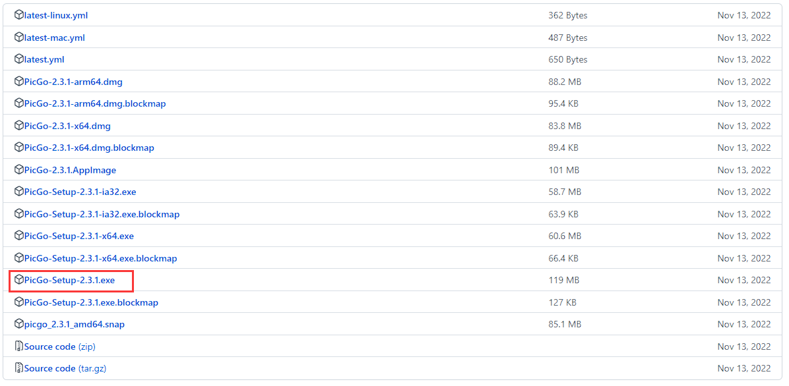
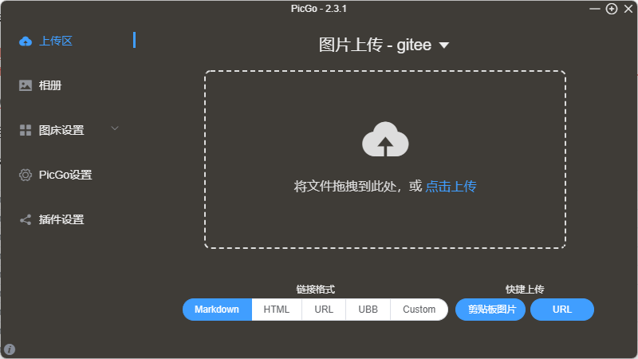
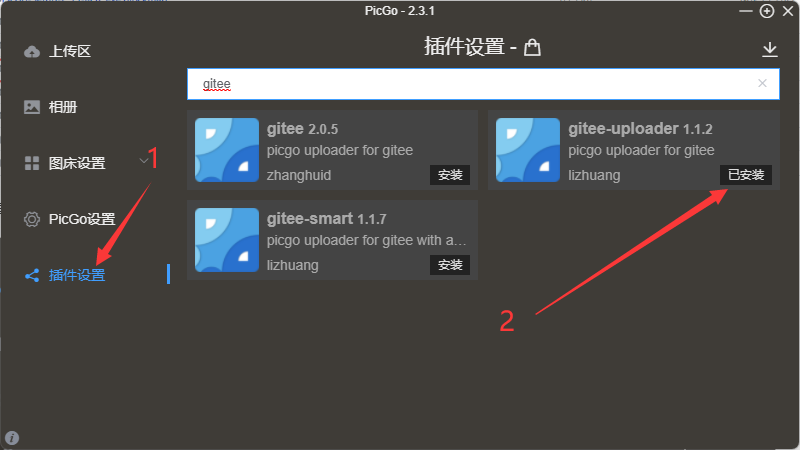
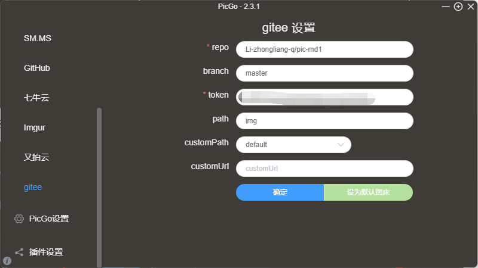
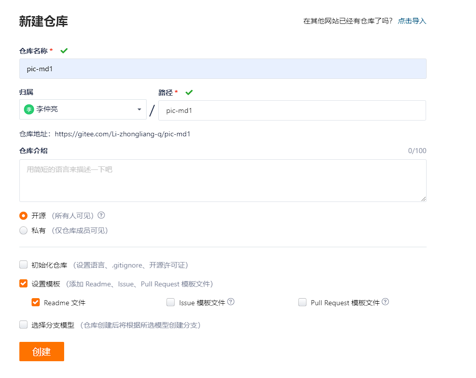
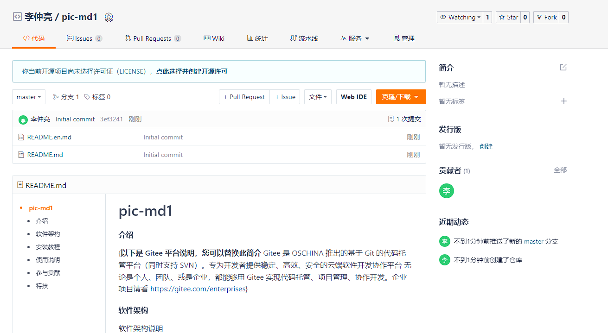
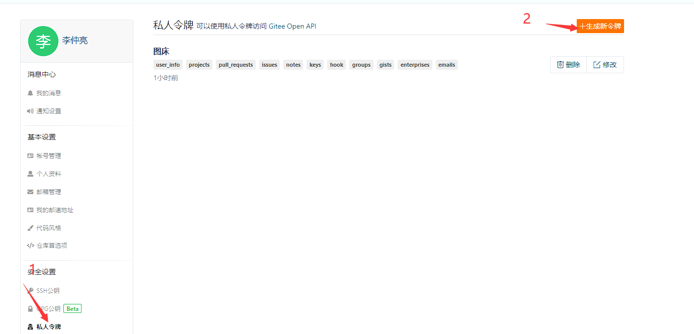
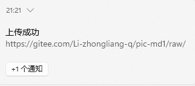

# Typora 配置图床

参考博客：[Typora如何配置gitee图床？超详细教程！-CSDN博客](https://blog.csdn.net/qq_36547531/article/details/114985742)

我们在复制图片至 md 的时候，默认都是上传在本地，例如下图：

这其实挺多麻烦的，例如我们想把笔记上传到一些网络平台，这些本地路径复制上来的图片是显示不出来的，这时候就需要了解图床了：

>图床一般是指储存图片的服务器，有国内和国外之分。国外的图床由于有空间距离等因素决定访问速度很慢影响图片显示速度。国内也分为单线空间、多线空间和cdn加速三种。

图床的免费使用方法是 `gitee`，下面展示一下如何在 **typora 配置上 gitee 的图床**。

## PicGo 的安装与配置

PicGo 是一个图床上传工具，我们主要就是借助这个软件进行上传

项目地址：https://github.com/Molunerfinn/PicGo

进入到 `Releases`，当前最新版本是 `v2.3.1`，如果是 Windows 系统，下载 `.exe` 后缀的文件

下载安装完打开后，出现如下界面：

安装 **gitee** 插件，记住一定要安装成功，注意要安装 `gitee-uploader 1.1.2`：

安装完成后，可以在 `图床设置 -> gitee` 看到如下界面：

## 创建 gitee 仓库

新建一个仓库，仓库名称设置为 `pic-md1`，在设置模板中添加 Readme 文件：

仓库初始化设置完成：

创建完成后，点击个人头像后进入设置，进入私密令牌，选择生成新令牌

复制好密钥，让我们进行下一步。

## 配置

前往 `picGo`，点击 `Gitee` 进行配置

> 这里需要在项目初始目录里面新建一个文件夹 -> img

随便传一张图片进行测试，显示上传成功：

## 配置 Typora

新建一个 Markdown 文件，打开后进入 `偏好设置 -> 图像`，进行如下配置：

这样就成功了！！！

在 `gitee` 的 `img` 文件夹里面也能看到我们上传的图片：

