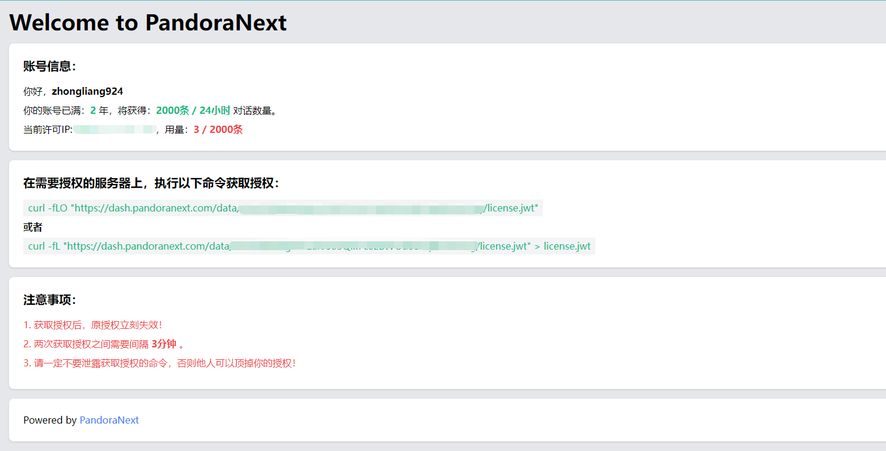
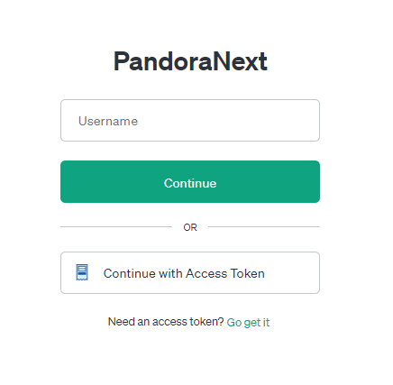
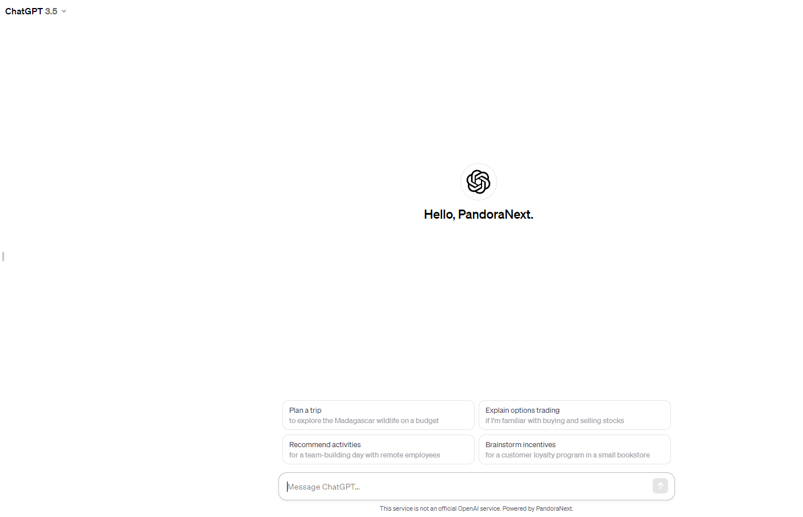

# Pandora-next 部署指南

项目链接：https://github.com/pandora-next/deploy

**背景**：目前 chat-web 项目的反代接口 https://ai.fakeopen.com/api/conversation 已经用不了了，需要选择其它的替代方案，我选择的基于 Pandora-next 的 chat 部署方案，这种方法对使用次数具有限制，但一般是够用的，我的是 1 天 2000 条。

这种方式可以绕开账号验证，绕开翻墙直接使用。

接下来以容器化部署为例。

## Docker 部署

```
$ docker pull pengzhile/pandora-next
$ docker run -d --restart always --name PandoraNext --net=bridge -p 8181:8181 \
             -e PANDORA_NEXT_LICENSE="<JWT Token>" pengzhile/pandora-next
```

- 容器内默认监听 `8181` 端口，映射宿主机的 `8181` 端口，可自行修改
- 你可以映射目录到容器内的 `/data` 目录，包含 `config.json`、`tokens.json`、`license.jwt` 放在其中，这几个文件在项目链接中有模板提供
- 自行使用真实的 `JWT Token` 替换命令中的 `<JWT Token>`，没有 `<` 和 `>`。

## JWT Token

在这里获取：[https://dash.pandoranext.com](https://dash.pandoranext.com/)

使用 `Github` 账号登录，登录后有如下信息：



按照授权的要求，执行以下命令获取 `license.jwt` 文件：

```
curl -fLO "https://dash.pandoranext.com/data/....../license.jwt"
```

对于 **Windows** 系统 PowerShell，使用如下命令获取 `license.jwt` 文件：

```
Invoke-WebRequest -Uri "https://dash.pandoranext.com/data/....../license.jwt" -OutFile "license.jwt"
```

这样会在当前目录下生成 `license.jwt` 文件，打开可以复制里面的内容添加到 `PANDORA_NEXT_LICENSE="<JWT Token>"` 字段内。

如果 IP 发生变动，IP 变动后重新拉取授权。

## 启动

容器创建好后


主机输入 `http://localhost:8081`，进入 `PandoraNext` 登录界面



这里有两种登录方法：

第一种是输入 ChatGPT 的用户名和密码登录

第二种是使用 `Continue with Access Token` 登录，对于如何获取 `Access Token`，需要进入 https://chat.openai.com/api/auth/session，找到`accessToken` 字段，记录该字符串序列。

成功完成登陆后界面如下：



这样就可以**免登录、不翻墙**使用 ChatGPT 了。

