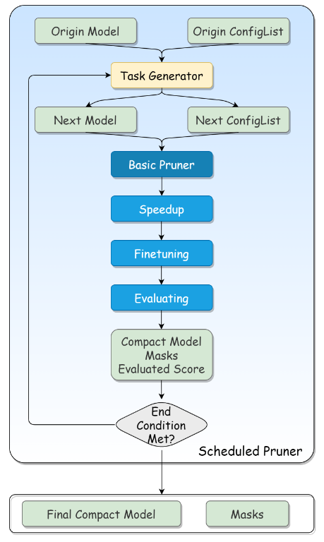

# NNI 示例

NNI 是一个强大的自动化工作，可以帮助用户自动化部署神经网络模型，主要包括：

- [超参调优](https://nni.readthedocs.io/zh/stable/hpo/overview.html)
- [架构搜索](https://nni.readthedocs.io/zh/stable/nas/overview.html)
- [模型压缩](https://nni.readthedocs.io/zh/stable/compression/overview.html)
- [特征工程](https://nni.readthedocs.io/zh/stable/feature_engineering/overview.html)

安装非常简单：

```
pip install nni
```

NNI 使得自动机器学习技术即插即用，提供训练平台，可降低自动机器学习实验管理成本

## 一、NNI模型压缩

典型的神经网络是计算和能源密集型的，很难将其部署在计算资源匮乏 或具有严格延迟要求的设备上，一个自然的想法就是对模型进行压缩， 以减小模型大小并加速模型推理，同时不会显着降低模型性能。可通过剪枝和量化实现，剪枝方法探索模型权重中的冗余， 并尝试删除/修剪冗余和非关键的权重；量化是指通过减少权重表示或激活所需的比特数来压缩模型。


支持 TensorFlow 和 Pytorch，NNI 内置了一些主流的模型压缩算法，另外用户可以使用 NNI 接口定义新的压缩算法。

对于一个具体的神经网络压缩流程，可以单独或联合使用剪枝或量化，采用串行方式同时应用这两种模式


### 1.1. NNI 模型剪枝

#### 概述

剪枝是神经网络压缩的常用技术，剪枝可以探索模型权重（参数）中的冗余，并试图去除/修剪冗余和非关键权重，冗余参数的值为 0，确保其不会参与反向传播。

剪枝的目标是在哪里应用稀疏性，大多对权重进行修剪，以减小模型大小并加速推理速度，NNI 目前仅支持权重剪枝。

- Basic 剪枝器：针对确定的稀疏率，使用 model 和 config 作为输入参数，为每个目标生成掩码


- Scheduled 剪枝器：调度器为每个修剪目标分配稀疏率，还具有模型加速和微调的功能，从逻辑上看，Scheduled 剪枝器是剪枝调度器、Basic 剪枝器和任务生成器的组合，任务生成器只关注每一轮应该达到的修剪效果，并使用 config list 来表达如何修剪，Basic 剪枝器将重置任务生成器提供的模型和配置列表，然后生成掩码。Scheduled 剪枝器的任务流如下图所示：




#### Quick Start

模型剪枝入门，主要做法如下：

1. 训练一个模型 -> 对模型进行剪枝 -> 对剪枝后的模型进行微调
2. 在模型训练过程中剪枝 -> 对剪枝后的模型进行微调
3. 对模型进行剪枝 -> 重新训练剪枝后的模型

使用一个简单模型在 MNIST 数据集上训练

```python
class Net(nn.Module):
    def __init__(self):
        super(Net, self).__init__()
        # 输入维度为1，输出维度为20，卷积核大小为5*5，步幅为1
        self.conv1 = nn.Conv2d(1, 20, 5, 1)
        self.conv2 = nn.Conv2d(20, 50, 5, 1)
        self.fc1 = nn.Linear(4 * 4 * 50, 500)
        self.fc2 = nn.Linear(500, 10)

    def forward(self, x):
        x = F.relu(self.conv1(x))
        x = F.max_pool2d(x, 2, 2)
        x = F.relu(self.conv2(x))
        x = F.max_pool2d(x, 2, 2)
        x = x.view(-1, 4 * 4 * 50)
        x = F.relu(self.fc1(x))
        x = self.fc2(x)
        return F.log_softmax(x, dim=1)
```

该模型包含两个2D卷积核两个前馈网络

#### 剪枝器

使用 config_list 定义需要剪枝的参数：

```
config_list = [{
    'sparsity_per_layer': 0.5,
    'op_types': ['Linear', 'Conv2d']
    }, {
    'exclude': True,
    "op_names": ['fc2']
}]
```

该设置表明修剪类型为 Linear 或 Conv2d 的所有层，除了 fc2，该层与模型输出有关，fc2 设置为 exclude，稀释率为 50%。

剪枝器的模型结构为：

```
 Net(
  (conv1): PrunerModuleWrapper(
    (module): Conv2d(1, 20, kernel_size=(5, 5), stride=(1, 1))
  )
  (conv2): PrunerModuleWrapper(
    (module): Conv2d(20, 50, kernel_size=(5, 5), stride=(1, 1))
  )
  (fc1): PrunerModuleWrapper(
    (module): Linear(in_features=800, out_features=500, bias=True)
  )
  (fc2): Linear(in_features=500, out_features=10, bias=True)
)
```

#### 加速

使用 NNI 的模型加速功能和剪枝器生成好的 masks 对原始模型进行加速，注意 ModelSpeedup 需要 unwrapped 的模型。 模型会在加速之后真正的在规模上变小，并且可能会达到相比于 masks 更大的稀疏率，这是因为 ModelSpeedup 会自动在模型中传播稀疏， 识别由于掩码带来的冗余权重。

加速后的模型结构：

```
 Net(
  (conv1): Conv2d(1, 10, kernel_size=(5, 5), stride=(1, 1))
  (conv2): Conv2d(10, 25, kernel_size=(5, 5), stride=(1, 1))
  (fc1): Linear(in_features=400, out_features=250, bias=True)
  (fc2): Linear(in_features=250, out_features=10, bias=True)
)

```

可以发现和一开始的模型结构有些许不同，模型中间的 50% 的神经元被裁剪掉了

原始模型大小为：1.686MB，剪枝后的模型大小为：429MB，剪枝后的模型相较于原模型大小压缩了4倍

原始模型的识别准确率为：98%，剪枝后模型的识别准确率为：91%，具有较大的损失，后续需要结合模型微调。

### 1.2 剪枝 Transformer

#### 工作流

整个剪枝过程可分为以下步骤：

1. 对下游任务的预训练模型进行微调。根据我们的经验，在微调模型上修剪的最终性能比直接在预训练模型上修剪要好。同时，在这一步骤中获得的微调模型也将用作后续蒸馏训练的教师模型
2. 首先修剪注意力层。在这里，我们在注意力层权重上应用块稀疏，如果头部被完全掩蔽，则直接修剪头部（压缩权重）。如果头部被部分遮盖，我们将不会对其进行修剪并恢复其权重
3. 用蒸馏法重新训练修剪过的模型。在修剪FFN层之前恢复模型精度
4. 修剪FFN层。这里，我们在第一FFN层上应用输出通道修剪，并且第二FFN层输入通道将由于第一层输出信道的修剪而被修剪。
5. 使用蒸馏来重新训练得到最终修剪后的模型

在修剪 Transformer 的过程中，我们获得了以下经验

- 我们在步骤 2 中使用 Movement 修剪器，在步骤4中使用 Taylor FO 权重修剪器。Movement 修剪器在注意层上具有良好的性能，Taylor FO 权重修剪器在 FFN 层上具有较好的性能。这两个修剪器都是一些基于梯度的修剪算法，我们也尝试了基于权重的修剪算法（如 L1 范数修剪器），但在这种情况下似乎效果不佳
- 蒸馏是恢复模型精度的好方法。就结果而言，当我们对 MNLI 任务进行修剪时，通常可以在精度上提高 1~2%。
- 有必要逐渐增加稀疏性，而不是一次达到非常高的稀疏性

#### 实验准备

完整的剪枝过程将在 A100 上花费 8 小时

本节将获得关于下游任务的微调模型：

下载 bert-base-uncased，目录位于`./bert-base-uncased`：

```
git lfs install
git clone https://huggingface.co/bert-base-uncased
```

下载 GLUE 数据集，任务名称为 MNLI，目录位于 `/data`

```
git clone https://huggingface.co/datasets/glue
```

代码：

- `bert/dataLoader.py`
  - `prepare_dataloaders`：用于加载 bert 模型和 MNLI 任务数据集，返回 train_dataloader 和 validation_dataloader
- `bert/train.py`
  - `training`：训练 bert 模型用于模型微调
  - `distillation_training`：用于 FFN 剪枝的蒸馏重训练
- `bert/eval.py`
  - `evaluation`：使用 validation_dataloaders 用于评估模型
- `bert/load_model.py`
  - `create_pretrained_model`：用于加载 bert 预训练模型
  - `create_pretrained_model`：将加载的预训练模型用于模型微调
- `bert/loss.py`
  - `fake_criterion`：
  - `distil_loss_func`：计算蒸馏损失
- `bert/pruner.py`
  - `movement_pruner`：对注意力模块执行 movement 剪枝，提取注意力掩码矩阵
  - `attention_pruner`：对已剪枝的注意力模块进行蒸馏重训练

> 在评估过程中使用了 functools 函数，其基于已有函数定义新的函数，其输入是函数，输出也是函数。其 partial 方法使用可以固定函数的某些输入参数，新定义的函数仅需要输入原始函数的部分参数

微调测试结果位于：`pruning_log/bert-base-uncased/mnli/pruning_bert_mnli/finetuning_on_downstream.log`

生成的微调模型位于：`models/bert-base/uncased/mnli/finetuned_model_state.pth`

#### 模型剪枝

根据经验，分阶段剪枝注意力部分和 FFN 部分能更容易获得良好的效果。当然，一起剪枝也可以达到类似的效果，但需要更多的参数调整测试，在本节使用分阶段修剪方式：

首先，使用 Movement Pruner 修剪注意力层：

加载已有的微调模型：

```
finetuned_model.load_state_dict(torch.load(finetuned_model_state_path, map_location='cpu'))
```

设置 Movement 剪枝器，对注意力层进行剪枝，剪枝配置器：

```
config_list = [{
	'op_types': ['Linear'],
	'op_partial_names': ['bert.encoder.layer.{}.attention'.format(i) for i in range(layers_num)],
	'sparsity': 0.1
}]
```

加载一个新的微调模型来进行加速，可以视为使用微调状态来初始化修建后的模型权重。注意，NNI 加速不支持替换注意力模块，需要手动替换注意力模块。

如果头部是完全掩蔽的，则进行物理修剪，并为 FFN 创建 config_list

```
ffn_config_list.append({
	'op_names': [f'bert.encoder.layer{len(layer_remained_idxs)}.intermediate.dense'],
	'sparsity': sparsity_per_iter
})
```

加载注意力掩码矩阵并确定需要裁剪的注意力头部编号，bert 网络有 12 个注意力头：

```
layer 0 prune 4 head: [2, 4, 9, 11]
layer 1 prune 7 head: [0, 2, 3, 5, 6, 8, 9]
layer 2 prune 7 head: [1, 2, 3, 4, 5, 7, 8]
layer 3 prune 5 head: [2, 3, 4, 6, 8]
layer 4 prune 7 head: [0, 1, 2, 6, 8, 10, 11]
layer 5 prune 5 head: [1, 5, 6, 9, 11]
layer 6 prune 6 head: [2, 3, 4, 6, 10, 11]
layer 7 prune 7 head: [2, 3, 4, 6, 7, 9, 11]
layer 8 prune 9 head: [0, 2, 3, 4, 5, 6, 7, 8, 10]
layer 9 prune 8 head: [0, 1, 2, 3, 4, 5, 7, 9]
layer 10 prune 9 head: [0, 1, 2, 4, 5, 6, 7, 8, 9]
layer 11 prune 7 head: [0, 3, 5, 6, 7, 8, 11]
```

使用 TaylorWeightPruner 在 12 次迭代中对 FFN 进行修剪，在每次修剪迭代后微调3000步，然后再修剪完成后微调 2 个 epochs

NNI 将来将支持逐步修剪调度，然后可以使用修剪器替换掉代码：

## 二、NNI模型量化

