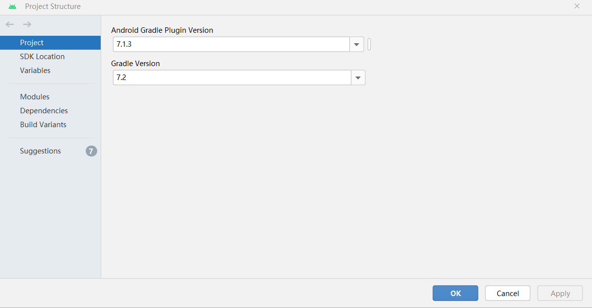
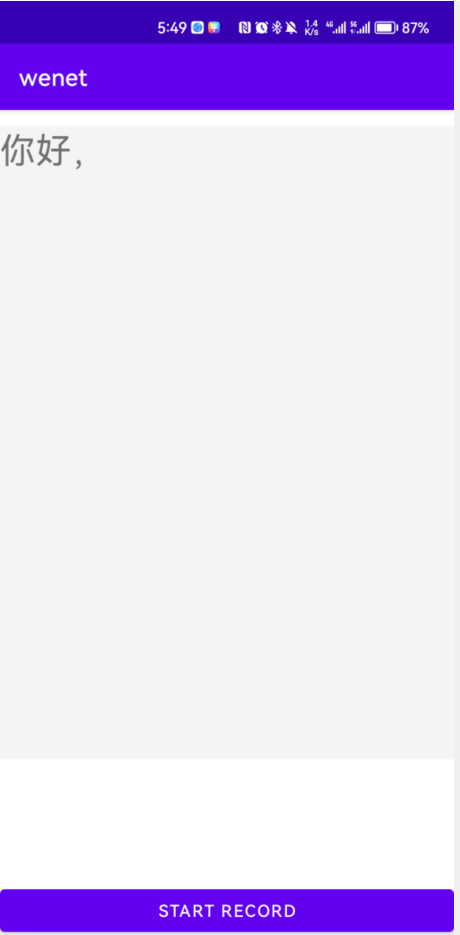
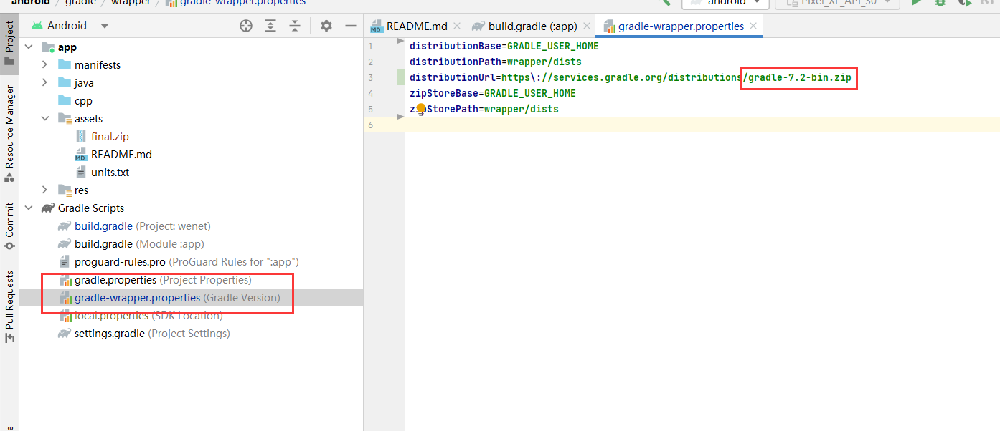
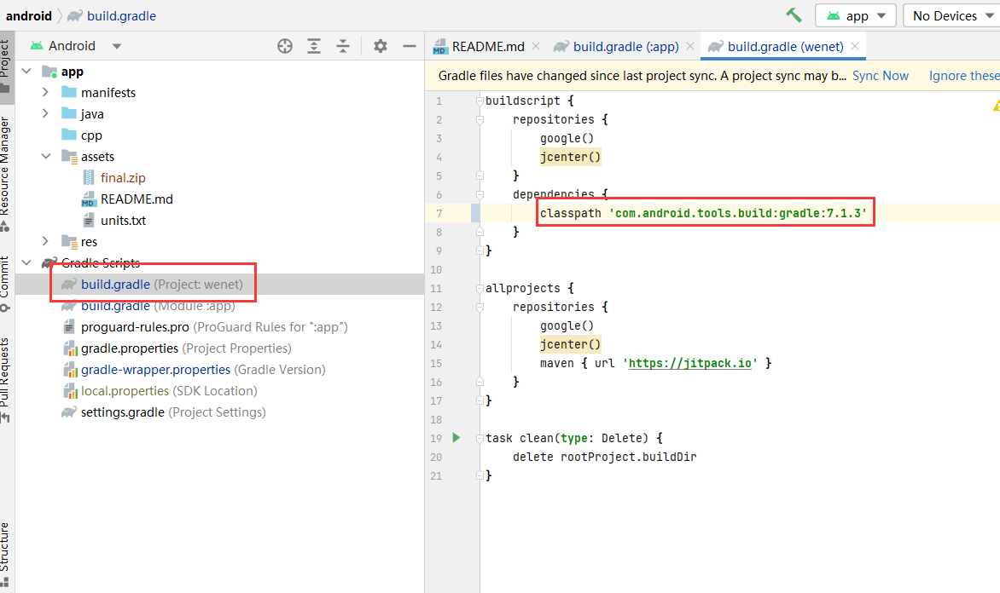

# Android APK

## 一、Android 项目

项目地址：https://github.com/wenet-e2e/wenet

目录位于 ：`./runtime/android`

版本信息：Gradle 版本为 7.2，Gradle 插件版本为 7.1.3

Android 端的流式 ASR 模型，目前是模型部署在手机上，模型大小大概有 100MB，后续需要通过抛接数据的方式将模型部署在 NX 上进行推理。

连接 Android 手机，我的安卓手机的 Android 版本为 12.0，安装对应 12.0 版本的 SDK，编译程序，在手机上得到 Wenet APP，打开 APP 可以实现在线语音识别功能

## 二、代码学习

### java

- MainActivity.java：

  - assertInit 方法：目的是将应用程序的资源文件从 `assets` 文件夹中解压缩并存储到设备上，以便在程序运行时可以访问它们。定义资源列表 "final.zip, units.txt, ctc.ort, decoder.ort, encoder.ort"，遍历 `assets` 文件夹中的所有文件， 检查当前文件是否在定义的资源列表内，复制到应用程序文件目录中。
  - onRequestPermissionsResult 方法：目的是处理录音权限请求并根据用户选择响应应用程序，如果用户授予了权限，则开始录音操作，否则程序将禁用相关功能。程序检查返回的授权结果，如果用户授予权限，则记录一条消息并调用 `initRecoder()` 方法，该方法初始化录音器，否则，显示一个 `Toast` 消息告诉权限被拒绝，防止用户在未授权下启动录音操作。
  - onCreate 方法：Android 应用程序中 `MainActivity` 类的 `onCreate()` 方法，它初始化应用程序 UI 和其它相关内容。 
  - requestAudioPermissions 方法：用于请求录音权限并根据用户的选择响应应用程序。如果应用程序已经授予了录音权限，则直接初始化录音器 `initRecoder()`。
  - initRecoder 方法：用于初始化录音器并设置相关参数并确保其状态正确设置，如果出现任何问题，则记录错误消息并退出方法。在示例中，使用默认的麦克风输入源、采样率为 16000Hz、声道数和 16 位 PCM 编码格式。
  - startRecoderThread 方法：启动线程读取麦克风输入，用于持续监测麦克风的录制状态，并将音频数据添加到缓冲队列中，缓冲队列中的音频数据将在另一个单独的线程上进行语音识别处理。
  - calculateDb 方法：用于计算一组音频数据的分贝值，并将其作为声音矩形的高度值，其进行了适当的调整和约束，以便更好地显示在 UI 上。
  - startAsrThread 方法：用于启动语音识别线程并将录音缓冲区的音频数据传递给识别引擎，进行语音识别处理，在准备就绪后，此方法等待从识别引擎返回最终的识别结果，并将其更新在 UI 上。在录制状态或缓冲队列中仍存在音频数据时，循环将缓冲队列中获取音频数据，并将其添加到语音识别引擎处理，调用`Recognize.acceptWaveform(data)`将获取的数据传递给 C++ 接口，用于进一步处理，然后等待识别引擎返回结果，记录到`textView`中。

  > 这里可以获取输入的缓冲数据，代码中的做法是调用 C++ 接口进行推理引擎识别处理，现在的做法需要将缓冲数据推送到 NX 进行处理，然后从 NX 接收语音识别推理结果。

- Recongnize.java：定义了与语音识别引擎交互所需的所有接口，通过这些接口，Java 代码可以直接调用 C++ 语音识别引擎的功能，并实现完整的语音识别流程：

  - `static { System.loadLibrary("wenet"); }`：在静态块中加载名为 `wenet` 的本地动态库，以便在 Java 中调用 C++ 接口。
  - init：初始化语音识别引擎，并指定模型目录的路径。
  - reset：重置语音识别引擎状态，以便开始新的识别任务。
  - acceptWaveform：将音频数据传递给语音识别引擎进行处理。
  - setInputFinished：标记输入流的结束，以便语音识别引擎可以完成最终结果的生成。
  - getFinished：检查是否已经获得了最终的识别结果。
  - startDecode：开始对输入的音频数据进行语音识别操作。
  - getResult：获取当前的语音识别结果。

- VoiceRectView.java：定义了 `View` 类，用于实现音频模拟条形图，呈现了音频数据的可视化效果，创建了一个简单有趣的音频矩形条形图

## 三、问题

**No variants found for ‘:app‘. Check build files to ensure at least one variant exists.**

更新 gradele 升级到了 7.2 版本

会遇到`"No variants found for ':app'. Check build files to ensure at least one variant exists."`的提示，需要 Android Gradle 插件版本和 Gradle 版本匹配，参考https://developer.android.google.cn/studio/releases/gradle-plugin?hl=zh-cn#updating-gradle，项目中更改成 7.1.3

