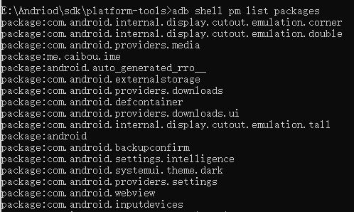

# Android APK

## adb 命令

与语音面板的连接（disconnect 表示取消连接）：

```shell
adb connect 10.0.0.183
```

启动应用程序：

```shell
adb shell am start com.mobvoi.wenet/com.mobvoi.wenet.MainActivity
```

关闭应用程序：

```shell
adb shell am force-stop com.mobvoi.wenet
```

列出设备已安装的程序包：

```shell
adb shell pm list packages
```



找出要删除应用的包名，输入命令，发现打印出 success，则表示卸载成功，这样就可以删除掉特定的 APP 应用了

```shell
adb uninstall com.examples.text2
```

使用 adb 为设备安装 apk：

```shell
adb -s 192.168.31.88:5555 install sndcpy.apk
```

其中，`-s` 选择项是 `adb devices` 对应的设备地址。

