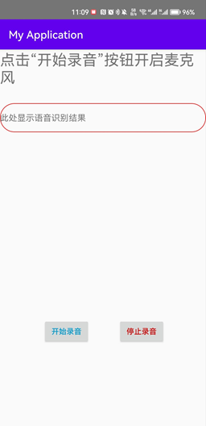

# 安卓语音模块

## 简介

语音安卓 APP 项目已经托管在 Github 仓库：https://github.com/ZhongliangLi-github/Audio-Record

其它的一些语音识别和语音唤醒的项目：

- 百度语音唤醒语音识别语音合成系统：https://github.com/AmazingUU/Android-BaiDuVoice
- snowboy 语音唤醒系统：https://github.com/Kitt-AI/snowboy
- 语音传输：https://github.com/rom1v/sndcpy
- 录音实现：https://github.com/dreamfish797/AudioRecorder

该模块实现了一个语音识别系统，整体的 UI 如下：



## 功能实现

### UI 设计

整体的外观设计，页面布局文件位于 `res/layout/activity_main.xml`，目前 UI 分为三个模块，两个文本显示模块和一个按键模块。

- 文本显示模块 1：点击“开始录音”按钮开启麦克风：`id -> messageTextView`
- 文本显示模块2：此数显示语音识别结果：`id -> editText`
- 按键模块1：开始录音：`id -> start`
- 按键模块2：停止录音：`id -> stop`

在主函数 `MainActivity.kt` 需要对这些布局进行定义，在该布局的同时添加了音频播放模块，用于在按键被按下时被触发，提示按键已被触发，提示音文件位于 `res/raw/ding.wav` 和 `res/raw/dang.wav`，在主函数中被定义和触发

UI 设计相关代码如下： 

```kotlin
class MainActivity : ComponentActivity {
	...
	private var audioRecord: AudioRecord? = null
	private lateinit messageTextView: TextView
	...
	private fun init() {
		setContentView(R.layout.activity_main)
		val btnRecord = findViewById<Button>(R.id.start)		// 按键定义
		val btnStop = findViewById<Button>(R.id.stop)
		messageTextView = findViewById(R.id.messageTextView)	// 文本内容定义
		startPlayer = MediaPlayer.create(this, R.raw.ding)		// 音频内容定义
		stopPlayer = MediaPlayer.create(this, R.raw.dong)
		...
	}
	...
}
```

### 逻辑设计

定义 `onCreate` 函数，该函数在创建 Activity 时被调用：

```kotlin
override fun onCreate(savedInstanceState: Bundle?) {
	super.onCreate(savedInstanceState)	// 调用父类的 onCreate 方法执行一些必要的初始化工作
	verifyPermissions(this)
	init()
}
```

该函数包含了授权函数和初始化函数。

#### 用户授权

首先对授权函数进行定义，该函数向用户请求录音权限和音频播放的权限

```kotlin
private fun verifyPermissions(activity: Activity?) {
	val GET_RECODE_AUDIO = 1
	val PERMISSION_ALL = arrayOf(
		Manifest.permission.RECORD_AUDIO,
		Manifest.permission.MODIFY_AUDIO_SETTINGS
	)
	val permission = ActivityCompat.checkSelfPermission(activity!!, Manifest.permission.RECORD_AUDIO) != 						PackageManager.PERMISSION_GRANTED
			|| ActivityCompat.checkSelfPermission(activity, Manifest.permission.MODIFY_AUDIO_SETTINGS) != 						PackageManager.PERMISSION_GRANTED
	if (permission) {
		ActivityCompat.requestPermissions(
			activity, PERMISSION_ALL,
			GET_RECODE_AUDIO
		)
	}
}
```

权限还需要在 `AndroidMainifest.xml` 文件中进行指定，同时需要获取互联网权限以便后续和服务端进行连接

```
<manifest
	...
	<!--获取手机录音机使用麦克风的权限 -->
	<uses-permission android:name="android.permission.RECORD_AUDIO" />
	<uses-permission android:name="android.permission.MODIFY_AUDIO_SETTINGS" />
	<!--获取手机的Internet权限 -->
	<uses-permission android:name="android.permission.INTERNET" />
	...
</manifest>
```

#### 初始化

在初始化函数中主要对安卓的页面布局进行定义，同时定义按钮按下时的操作，对页面布局的定义在 UI 设计中进行了说明，以下主要说明按钮按下时的操作：

```kotlin
private fun init() {
	// 开始录音事件触发
	btnRecord.setOnClickListener {
		startPlayer.start()
		Thread.sleep(1500)      // 添加了 1.5s 延时，这个延时是等待提示音播完
		startRecord()
		connectWebSocket()
	}
	// 停止录音事件出发
	btnStop.setOnClickListener {
		stopRecord()
		stopPlayer.start()
		disconnectWebSocket()
	}
}
```

##### 开始按钮

在开始按钮按下时，主要执行四项操作

- 播放提示音，提示麦克风打开，录音开始：

  ```kotlin
  startPlayer.start()
  ```

- 添加一个 1.5s 的延时，等待提示音播完，如果不加这段代码，则提示音会被录进音频流文件中

  ```kotlin
  Thread.sleep(1500)
  ```

- 开始录音，这部分是核心，开启一个线程启动麦克风录制音频流，实现安卓录音，并把录制的音频流通过 WebSocket 协议发送给服务端：

  ```kotlin
  private fun startRecord() {
      Log.d(TAG, "StartRecording:")
  
      val minBufferSize = AudioRecord.getMinBufferSize(SAMPLE_RATE, CHANNEL_CONFIG, AUDIO_FORMAT) * 2
      // 检查是否有录音权限，如果没有直接返回一个空值
      if (ActivityCompat.checkSelfPermission(
              this,
              Manifest.permission.RECORD_AUDIO
          ) != PackageManager.PERMISSION_GRANTED
      ) {
          return
          }
      audioRecord = AudioRecord(MediaRecorder.AudioSource.MIC, SAMPLE_RATE, CHANNEL_CONFIG, AUDIO_FORMAT, minBufferSize)
  
      recordingStartTime = System.currentTimeMillis()
      readThread = Thread {
          val buffer = ByteArray(minBufferSize)
          audioRecord?.startRecording()
          while (System.currentTimeMillis() - recordingStartTime < recordDurationMs) {
              val readBytes = audioRecord?.read(buffer, 0, buffer.size) ?: 0
              if (readBytes > 0 && webSocket != null) {
                 // 发送录音数据到 WebSocket 服务器
                 webSocket?.let {
                     if (!it.send(buffer.toByteString(0, readBytes))){
                          Log.w("WebSocket Info", "send failed")
                      }
                  }
              }
          }
      }
      readThread?.start()
  }
  ```

  这段代码调用安卓内置的 `AudioRecord` 方法，输入定义的音频源为麦克风 `MediaRecorder.AudioSource.MIC`、采样率为 16000Hz `SAMPLE_RATE`、通道配置为单声道 `CHANNEL_CONFIG`、音频格式为 16-bit PCM 编码 `AUDIO_FORMAT`、缓冲区大小 `minBufferSize`，设置了最长录音时间为 5s，即如果不手动按下暂停键，最后生成 wav 文件的最长时间为 5s。创建一个字节数组 `readBytes` 用于接收采集到的音频数据，判断音频文件是否有效且客户端是否与服务端已经建立 WebSocket 连接，使用 `toByteString` 方法将发送的音频数据转换为 `ByteString` 类型，并通过 `WebSocket` 发送给服务器，开启 `readThread` 线程。

- 通过 Websocket 连接服务端

  ```kotlin
  private fun connectWebSocket() {
  	val request = Request.Builder().url(WS_URL).build()
  	webSocket = OkHttpClient().newWebSocket(request, object : WebSocketListener() {
  
  		override fun onOpen(webSocket: WebSocket, response: Response) {
  			Log.d("WebSocket Info", "onOpen")
  		}
  
  		override fun onMessage(webSocket: WebSocket, text: String) {
  			Log.d("WebSocket Info", "OnMessage: $text")
  			// 接收到服务器的消息，更新 UI 显示
  			runOnUiThread { messageTextView.setText(text) }
  		}
  
  		override fun onClosing(webSocket: WebSocket, code: Int, reason: String) {
  			Log.d("WebSocket Info", "onClosing")
  		}
  
  		override fun onClosed(webSocket: WebSocket, code: Int, reason: String) {
  			Log.d("WebSocket Info", "onClosed")
  		}
  
  		override fun onFailure(webSocket: WebSocket, t: Throwable, response: Response?) {
  			Log.e("WebSocket Error", t.message ?: "")
  		}
  	})
  }
  ```

  在 WebSocket 连接成功后，调用 `onOpen` 方法；当 WebSocket 接收到消息时，调用 `onMessage` 方法；当 WebSocket 正在关闭时，调用 `onClosed` 方法；当 WebSocket 连接出现错误时，调用 `onFailure` 方法。

##### 停止按钮

在停止按钮按下时，主要执行三项操作

- 停止录音：这是停止按钮的核心，该方法实现了停止录音并释放了相关资源，首先需要等待读取音频数据的线程完成执行，确保所有数据已经写入完毕，并且被服务端接收，然后停止录音操作，释放 `AudioRecord` 对象所需的内存空间以及底层音频硬件资源

  ```kotlin
  private fun stopRecord() {
  	// 等待读取线程完成执行，确保所有数据都已被写入并读取完毕
  	try {
  		readThread?.join(1000)
  	} catch (e: InterruptedException) {
  		e.printStackTrace()
  	}
  	// 停止录音并释放相关资源
  	audioRecord?.stop()
  	audioRecord?.release()
  }
  ```

  它的具体实现细节包括等待正在保存的音频数据被写入完毕、停止录音并释放相关资源

- 停止 WebSocket 连接：调用 `webSocket?.cancel()` 停止客户端与服务端的连接

  ```kotlin
  private fun disconnectWebSocket() {
  	webSocket?.cancel()
  }
  ```

  

- 取消 WebSocket 连接：待连接停止后，播放停止录音的提示音，提示音需要在音频资源被释放后调用，防止这段提示音被录制到音频文件中：

  ```kotlin
  stopPlayer.start()
  ```

### 服务端代码

服务端代码由 Node.js 编写，需要使用的包在 `packages.json` 体现，在我们的示例中需要用到 `wav`、`webSocket`、`ws` 三个包，它们可以使用 `npm install <包名>` 进行安装。

```json
{
    "name": "nodejs-console-app1",
    "version": "0.0.0",
    "description": "NodejsConsoleApp1",
    "main": "app.js",
    "author": {
        "name": ""
    },
    "devDependencies": {
        "eslint": "^8.21.0"
    },
    "eslintConfig": {},
    "dependencies": {
        "wav": "^1.0.2",
        "websocket": "^1.0.34",
        "ws": "^8.13.0"
    }
}
```

接下来展示服务端的 JavaScript 代码，该代码实现了 WebSocket 协议来处理音频数据的传输

```js
const { connect } = require("http2");
const path = require("path");
const WebSocket = require("websocket").server;
const wav = require("wav");
const { client } = require("websocket");

// 假设每个音频文件的采样率、通道数和样本宽度都相同
const SAMPLE_RATE = 16000;
const CHANNELS = 1;
const SAMPLE_WIDTH = 2; // 16 bits per sample

let outputStream = null;

function startServer() {
    const server = require("http").createServer((request, response) => {
        response.writeHead(404);
        response.end();
    });

    server.listen(8080, () => {
        console.log("Server is listening on port 8080");
    });

    const wsServer = new WebSocket({
        httpServer: server,
        autoAcceptConnections: true,
    });

    wsServer.on("connect", (connection) => {
        console.log("WebSocket connection accepted, receive audio:");

        outputStream = new wav.FileWriter(path.join(__dirname, "output.wav"), {
            channels: CHANNELS,
            sampleRate: SAMPLE_RATE,
            bitDepth: SAMPLE_WIDTH * 8,
        });

        connection.on("message", (message) => {
            if (message.type === "binary") {
                outputStream.write(message.binaryData);
                connection.sendUTF("Audio receiving.")
            }
        });

        connection.on("close", () => {
            console.log("WebSocket connection closed.");
        });
    });
}

startServer();
```

改代码实现了一个 WebSocket 服务器，用于接收和保存音频数据。它在 8080 端口启动一个 HTTP 服务器，当接收到 WebSocket 连接请求时创建一个 WebSocket 服务，并在连接建立后开始接收音频数据，并将接收到的音频数据写入到一个 WAV 格式的音频文件中。

