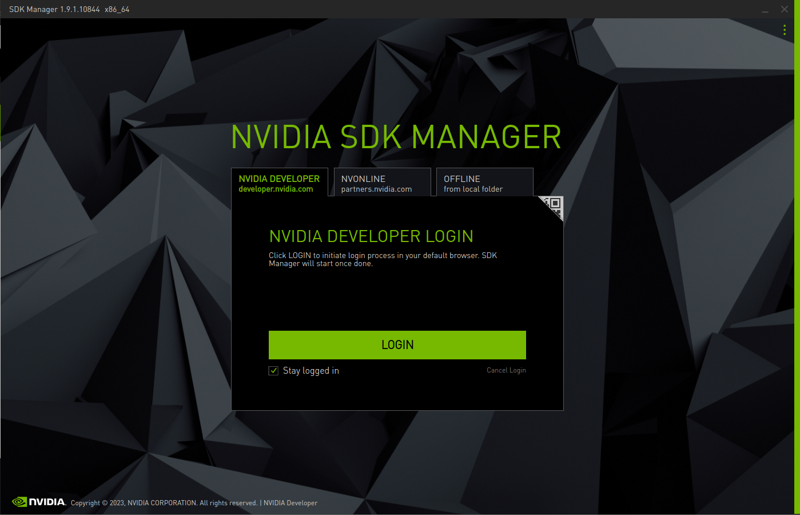
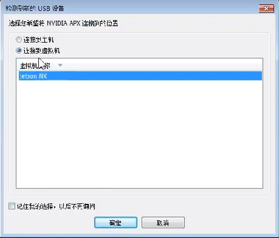

# Jetpack 5.0.2安装

## 一、环境准备

​	在Ubuntu系统上，下载NVIDIA SDK Manager，下载版本为Jetpack5.0.2，选择.deb Ubuntu下载方式


在下载前，需要注册英伟达开发者账号，下载得到deb安装包


在deb安装包目录下，执行：

```
sudo apt install ./sdkmanager_1.9.1-10844_amd64.deb
```

终端输入`sdkmanager`，出现如下所示则表示sdkmanager安装成功



## 二、安装系统镜像

​	首先使用跳线将Jetson板子上面的第二个和第三个引脚短接（每次系统重装前都要重复此操作）。并使用USB线将jetson板子与装有SDKManager的电脑链接，


选择将NVIDIA APX连接到虚拟机：



在设置界面的硬件配置模型，去掉Host Machine的勾，只对目标硬件进行配置，系统版本选择Jetpack 5.0.2(REV.1)。


随后，进入安装界面


系统安装完成后将Jetson板子与显示器进行连接，之后是基于Ubuntu的操作。

## 三、将启动盘从SD卡转移到固态银盘

**第一步	格式化硬盘**

​	设置SSD固态硬盘为第一启动盘，第一步首先格式化SSD，打开菜单搜索Disk：


启动磁盘应用程序：


按**ctrl + F **开始格式化硬盘


然后创建分区，设置16GB交换文件


至此，固态硬盘格式化成功。

**第二步	将Source从SD卡复制到SSD**

​	首先，复制该项目：

```
git clone https://github.com/jetsonhacks/rootOnNVMe.git
cd rootOnNVMe
```

然后将将源文件复制到SSD

```
./copy-rootfs-ssd.sh
```

**第三步	从SSD启动**

​	运行并重新启动以使服务生效

```
./setup-service.sh
```

## 四、结语

​	重启电脑，Jetpack5.0.2在Jetson Xavier NX上的环境部署完成。

​	安装`jtop`可以监控设备的GPU、CPU、内存等使用

使用pip即可完成安装：

```
sudo -H pip install -U jetson-stats
```

输入

```
sudo jtop
```


Jtop也提供了安装的CUDA、CuDNN等版本信息。