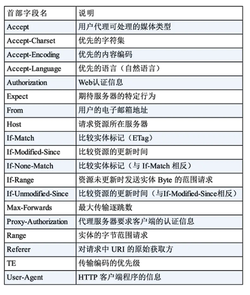

# HTTP 面试题

参考链接：https://zhuanlan.zhihu.com/p/135947893

## HTTP 和 HTTPS 的区别

HTTP（Hyper-text Transfer Protocol）是一种超文本传输协议，**负责在两点之间传输文字、图片、视频等超文本数据的约定和规范**。

- **超文本**：传输内容不单单只是文本，还可以是图片、音频、视频，甚至点击文字和图片可以实现超链接跳转
- **传输**：传输就是数据需要经过一系列物理介质，从一端发送到另一端的过程
- **协议**：网络中传递、管理信息的规范，计算机相互通信需要共同遵守一定的规则

OSI 七层模型：


HTTPS 要比 HTTP 多了 *secure* 安全性这个概念。实际上，HTTPS 并不是一个新的应用层协议，它其实就是 HTTP + TLS/SSL 协议组成，而安全性的保证是 TLS/SSL 所做的工作。

HTTP 属于明文传输，客户端和服务器都无法验证对方的身份，HTTPS 是添加了加密和认证机制的 HTTP

HTTP 与 HTTPS 的主要区别：

- HTTP 地址栏协议以 `http://` 开头，HTTPS 地址栏协议以 `https://` 开头
- HTTP 是未经安全加密的协议，它的传输过程容易被攻击者窃听、数据容易被窃取，发送方和接收方容易被伪造；HTTPS 是安全的协议，它通过 **密钥交换算法 - 签名算法 - 对称加密算法 - 摘要算法** 解决上面这些问题。
- HTTP 的默认端口是 80，HTTPS 的默认端口是 443
- 与 HTTP 通信相比，HTTPS 通信会由于加解密处理消耗更多的 CPU 和内存资源
- HTTPS 需要证书，而证书一般需要向认证机构购买

## Get 和 Post 区别

**GET 和 POST 是 HTTP 中最常用的两个方法**，基本上使用 HTTP 方法中有 99% 都是在使用 Get 方法和 Post 方法：

Get 方法一般用于请求，比如在浏览器地址栏输入 `www.baidu.com` 其实就是发送了一个 get 请求，它的主要特征是请求服务器返回资源；而 Post 方法一般用于 `<form> 表单` 的提交，相当于是把信息提交给服务器，等待服务器作出响应。

Get 方法是不安全的，因为在发送请求的过程中，请求参数会拼在 URL 后面，从而导致容易被攻击者窃取，对信息造成破坏和伪造。

而 Post 方法是把参数放在请求体 body 中的，这对用户来说不可见。

- get 一般用来在服务器上获取资源，post 用来更新服务器的资源

- get 请求的 URL 有长度限制，而 post 请求会把参数和值放在消息体中，对数据长度没有要求
- get 请求会被浏览器主动 cache，而 post 不会，除非手动设置
- get 请求在浏览器反复的 `回退/前进` 操作是无害的，而 post 操作会再次提交表单要求
- get 请求在发送过程中会产生一个 TCP 数据包；post 在发送过程中会产生两个 TCP 数据包。对于 get 方式的请求，浏览器会把 `http header` 和 `data` 一并发送出去，服务器响应 200（返回数据）；而对于 post，浏览器先发送 `header`，服务器响应 100 continue，浏览器再发送 `data`，服务器响应 200 ok（返回数据）

## 无状态协议

无状态协议是指**浏览器对于事务处理没有记忆能力**，每一次请求都是独立的，缺少状态意味着后续处理需要前面的信息，必须要重传。举个例子：客户请求获得网页之后关闭浏览器，然后再次启动浏览器，登录该网站，但是服务器不知道客户关闭了一次浏览器。

HTTP 是一种无状态协议，它对用户操作没有记忆能力。对于每次输入用户名和密码登录一个网站后，下次登录就不再重新输入用户名和密码的行为，这其实不是 HTTP 做的事情，起作用的是一个叫做 `cookie` 的机制，它能让浏览器具有 `记忆` 能力。

当客户端向服务端发送请求时，服务端会向客户端发送一个认证信息，服务器第一次收到请求时，开辟了一块 `Session` 空间（创建了 Session 对象），同时生成一个 `sessionId`，并通过响应头的 `Set-Cookie: JSESSIONID=XXXXXX` 命令，向客户端要求设置 Cookie 的响应，客户端收到响应后，在本机客户端设置一个 `JSESSIONID=XXXXXX` 的 Cookie 信息，该 Cookie 的过期时间为浏览器会话结束


接下来客户端每次向一个网站发送请求时，请求头都会带上该 Cookie 信息（包含 sessionId），然后服务器通过读取请求头的 Cookie 信息，获取名称为 JSESSIONID 的值，得到此次请求的 sessionid。这样浏览器就具备了记忆能力。

还有一种方式是使用 `JWT` 机制，它也是能够让浏览器具有记忆能力的一种机制。与 Cookie 不同，JWT 是保存在客户端的信息，它广泛应用于单点登录的情况。JWT 有两个特点：

- JWT 的 Cookie 信息存储在客户端，而不是服务端内存中。也就是说，JWT 直接本地进行验证就可以，验证完成后，这个 Token 就会在 Session 中随请求一起发送到服务器，通过这种方式可以节省服务器的资源，并且 token 可以进行多次验证。
- JWT 支持跨域认证，Cookies 只能用在单个节点的域或者它的子域中有效。如果它们尝试通过第三个节点访问，就会被禁止。使用 JWT 可以解决这个问题，使用 JWT 能够通过多个节点进行用户认证，也就是我们常说的跨域认证

## UDP 和 TCP的区别

UDP 和 TCP 均位于计算机网络模型的传输层，负责传输应用层产生的数据，

UDP 的全称是 `User Datagram Protocol`，用户数据报协议。它不需要所谓的 `握手` 操作，从而加快了通信速度，允许网络上其它主机在接收方同意通信之前进行数据传输。UDP 的特点包括：

- UDP 能够支持容忍数据包丢失的宽带密集型应用程序
- UDP 具有低延时的特点
- UDP 能够发送大量数据包
- UDP 能够允许 DNS 查找，DNS 是建立在 UDP 之上的应用层协议

TCP 的全称是 `Transmission Control Protocol`，传输控制协议。它能够帮助确定计算机连接到 Internet 以及它们之间的数据传输。通过三次握手建立 TCP 连接，三次握手就是用来启动和确认 TCP 连接的过程。一旦连接建立后，当数据传输完成后，会通过关闭虚拟电路来断开连接。TCP 的主要特点包括：

- TCP 能确保连接的建立和数据包的发送
- TCP 支持错误重传机制
- TCP 支持拥塞控制，能够在网络拥堵的情况下延迟发送
- TCP 能够提供校验和，甄别有害的数据包

下面罗列了 TCP 和 UDP 之间不同点，方便理解和记忆：

- TCP 是面向连接的协议；UDP 是无连接协议
- TCP 仅支持点对点通信；UDP 支持一对一、一对多、多对一、多对多的通信模式
- TCP 在发送数据前需要建立连接，然后再发送数据；UDP 无需建立连接就可以直接发送大量数据
- TCP 会按特定顺序重新排列数据包；UDP 数据包没有固定顺序，所有数据包间相互独立
- TCP 传输速度慢；UDP 传输更快
- TCP 头部有 20 字节；UDP 头部只需要 8 字节，TCP 的头部开销比 UDP 要大
- TCP 是重量级的，在发送用户数据之前，TCP 需要三次握手建立连接；UDP 是轻量级的，没有跟踪连接，消息排序等
- TCP 会进行错误校验并进行错误恢复；UDP 也会错误检查，但会丢弃错误的数据包
- TCP 有发送确认；UDP 没有发送确认
- TCP 会使用握手协议，如 SYN、SYN-ACK、ACK；UDP 没有握手协议
- TCP 是可靠的，因为它可以确保将数据传送到路由器；UDP 中不能保证数据传送到目标

## TCP 三次握手

消息类型的描述：

- SYN：用于初始化和建立连接。是 TCP/IP 建立连接时使用的握手信号，客户机和服务器之间建立 TCP 连接时，首先发送的一个信号
- ACK：帮助对方确认收到的 SYN 消息。用于表示发来的数据已确认接收无误
- SYN-ACK：本地的 SYN 消息和较早的 ACK 数据包。服务器收到 SYN 后，打开客户端连接，发送一个 SYN-ACK 作为答复
- FIN：用于断开连接


TCP 三次握手包含三个环节：连接建立（SYN）、请求响应（SYN+ACK）、连接确认（ACK）

（我要和你建立连接；你真的要和我建立链接吗；我真的要和你建立连接）

## TCP 四次挥手

在连接中止阶段使用四次挥手，连接的每一端都会独立终止，下面来描述这个过程：


- 首先，客户端应用程序决定要断开连接。客户端将 FIN 发送到服务器，并进入 `FIN_WAIT_1` 状态
- 服务器收到 FIN 消息时，服务器立即向客户端发送 ACK 确认消息
- 客户端接收到 ACK 响应后，进入到 `FIN_WAIT_2` 状态，等待来自服务器的 `FIN` 消息
- 服务器发送 ACK 确认消息后，一段时间（可以进行关闭后）会发送 FIN 消息给客户端，告知客户端可以进行关闭
- 当客户端收到从服务端发送的 FIN 消息时，客户端就会由 `FIN_WAIT_2` 状态变为 `TIME_WAIT` 状态。处于 `TIME_WAIT` 状态的客户端允许重新发送 ACK 到服务器为了防止信息丢失。

（我要和你断开连接；好的；我也要和你断开连接；好的）

## HTTP 1.0/1.1/2.0

### HTTP 1.0

HTTP 1.0 是在 1996 年引入的，从那时开始，普及率就达到令人惊人的效果

- HTTP 1.0 仅提供了最基本的认证，这时候用户名和密码还未经加密，因此很容易受到窥探
- HTTP 1.0 被设计用来短链接，即每次发送数据都会经过 TCP 的三次握手和四次挥手，效率比较低
- HTTP 1.0 只使用 header 中的 If-Modified-Since 和 Expires 作为缓存失效的标准
- HTTP 1.0 不支持断点续传，也就是说，每次都会传送全部的页面和数据
- HTTP 1.0 认为每台计算机只能绑定一个 IP，所以请求消息中的 URL 并没有传递主机名（hostname）

### HTTP 1.1

HTTP 1.1 是 HTTP 1.0 开发三年后出现的，也就是 1999 年，他做出以下方面的变化

- HTTP 1.1 使用了摘要算法来进行身份验证
- HTTP 1.1 默认使用长连接，长连接就是只需一次建立就可以传输多次数据，传输完成后，只需要一次切断连接即可。长连接的连接时长可以通过请求头中的 `keep-alive` 来设置
- HTTP 1.1 中新增加了 E-tag，If-Unmodified-Since, If-Match, If-None-Match 等缓存控制标头来控制缓存失效
- HTTP 1.1 支持断点续传，通过使用请求头中的 `Range` 来实现
- HTTP 1.1 使用了虚拟网络，在一台物理服务器上可以存在多个虚拟主机（Multi-homed Web Servers），并且它们共享一个IP地址

### HTTP 2.0

HTTP 2.0 是 2015 年开发出来的标准，它主要做的改变如下

- `头部压缩`，由于 HTTP 1.1 经常会出现 **User-Agent、Cookie、Accept、Server、Range** 等字段可能会占用几百甚至几千字节，而 Body 却经常只有几十字节，所以导致头部偏重。HTTP 2.0 使用 `HPACK` 算法进行压缩
- `二进制格式`，HTTP 2.0 使用了更加靠近 TCP/IP 的二进制格式，而抛弃了 ASCII 码，提升了解析效率
- `强化安全`，由于安全已经成为重中之重，所以 HTTP2.0 一般都跑在 HTTPS 上
- `多路复用`，即每一个请求都是是用作连接共享。一个请求对应一个id，这样一个连接上可以有多个请求

## HTTP 中常见的请求头

HTTP 标头会分为四种，分别是**通用标头**、**实体标头**、**请求标头**和**响应标头**

### 通用标头

通用标头主要有三个，分别是 **Date**、**Cache-Contrl** 和 **Connection**：

**Date** 是一个通用标头，它可以出现在请求标头和响应标头中，基本表示如下，其表示格林威治标准时间，比北京时间慢八个小时

```tcl
Date: Wed, 21 Oct 2015 07:28:00 GMT 
```

**Cache-Control** 是一个通用标头，它可以出现在请求标头和响应标头中，种类比较多，虽说这是一个通用标头，但是又有一些特性是请求标头具有的，有一些是响应标头才有的。主要大类有：可缓存性、阈值性、重新验证并重新加载、其他特性

**Connection** 决定当前事务（三次握手和四次挥手）完成后，是否会关闭网络连接。Connection 有两种，一种是**持久性连接**，即一次事务完成后不关闭网络连接 `Connection: keep-alive`，另一种是 `非持久性连接`，即一次事务完成后关闭网络连接 `Connection: close`

HTTP 1.1 其它通用标头如下：


### 实体标头

实体标头是描述消息正文内容的 HTTP 标头。实体标头用于 HTTP 请求和响应中。头部 `Content-Length`、`Content-Language`、`Content-Encoding` 是实体头。

- Content-Length：指示实体主体的大小，以字节为单位，发送到接收方
- Content-Language：描述客户端或者服务端能够接受的语言
- Content-Encoding：这个实体报用来压缩媒体类型，Content-Encoding 指示对实体应用何种编码，常见的内容编码包括：gzip、compress、deflate、identity，这个属性可以应用在请求报文和响应报文中

下面是一些实体标头字段


### 请求标头

#### Host

Host 请求头指明了服务器的域名，以及服务器监听的 TCP 端口号。如果没有指定端口号，会自动使用被请求服务的默认端口（比如请求一个 HTTP URL 会自动使用 80 作为端口）

```
Host: developer.mozilla.org
```

#### Referer

当浏览器向 web 服务器发送请求的时候，一般会带上 Referer，告诉服务器该网页是从哪个页面链接过来的，服务器因此可以获得一些信息用于处理

```
Referer: https://developer.mozilla.org/testpage.html 
```

#### If-Modified-Since

If-Modified-Since 通常会与 If-None-Match 搭配使用，If-Modified-Since 用于确认代理或客户端拥有的**本地资源的有效性**。获取资源的更新日期时间，可通过确认首部字段 `Last-Modified` 来确定。

如果在 `Last-Modified` 之后更新了服务器资源，那么服务器会响应 200，如果在 `Last-Modified` 之后没有更新过资源，则返回 304。

```
If-Modified-Since: Mon, 18 Jul 2016 02:36:04 GMT
```

#### If-None-Match

If-None-Match HTTP 请求标头使请求成为条件请求。 对于 GET 和 HEAD 方法，仅当服务器没有与给定资源匹配的 `ETag` 时，服务器才会以 200 状态发送回请求的资源。 对于其他方法，仅当最终现有资源的`ETag`与列出的任何值都不匹配时，才会处理请求。

```
If-None-Match: "c561c68d0ba92bbeb8b0fff2a9199f722e3a621a"
```

#### Accept

接受请求 HTTP 标头会通告客户端其能够理解的 MIME 类型

#### Accept-Charset

accept-charset 属性规定服务器处理表单数据所接受的字符集。

常用的字符集有： UTF-8 - Unicode 字符编码 ； ISO-8859-1 - 拉丁字母表的字符编码

#### Accept-Language

首部字段 Accept-Language 用来告知服务器用户代理能够处理的自然语言集（指中文或英文等），以及自然语言集的相对优先级。可一次指定多种自然语言集。


基于 HTTP 1.1 的请求标头汇总：



### 响应标头

#### Access-Control-Allow-Origin

一个返回的 HTTP 标头可能会具有 Access-Control-Allow-Origin ，`Access-Control-Allow-Origin` 指定一个来源，它告诉浏览器允许该来源进行资源访问。

#### Keep-Alive

Keep-Alive 表示的是 Connection 非持续连接的存活时间，可以进行指定。

#### Server

服务器标头包含有关原始服务器用来处理请求的软件的信息。

应该避免使用过于冗长和详细的 Server 值，因为它们可能会泄露内部实施细节，这可能会使攻击者容易地发现并利用已知的安全漏洞。例如下面这种写法

```
Server: Apache/2.4.1 (Unix) 
```

#### Set-cookie

Set-Cookie 用于服务器向客户端发送 sessionID。

#### Transfer-Encoding

首部字段 Transfer-Encoding 规定了传输报文主体时采用的编码方式。

HTTP /1.1 的传输编码方式仅对分块传输编码有效。

#### X-Frame-Options

HTTP 首部字段是可以自行扩展的。所以在 Web 服务器和浏览器的应用上，会出现各种非标准的首部字段。

首部字段 `X-Frame-Options` 属于 HTTP 响应首部，用于控制网站内容在其他 Web 网站的 Frame 标签内的显示问题。其主要目的是为了防止点击劫持（clickjacking）攻击。


基于 HTTP 1.1 的响应标头汇总：


## 地址输入 URL 发生了什么

高频面试题。

首先，需要在浏览器 URL 地址上，输入想访问的地址：

```
https://www.google.com
```

然后，浏览器会根据你输入的 URL 地址，去查找域名是否被本地 DNS 缓存，不同浏览器对 DNS 设置不同，如果浏览器缓存了你想访问的 URL 地址，则直接返回 IP 地址；如果没有缓存 URL 地址，浏览器会发起系统调用查询本机 `hosts` 文件是否有配置 IP 地址，如果找到则直接返回。如果找不到，就向网络发起一个 DNS 查询。

> 该过程涉及浏览器缓存、系统缓存、hosts 文件、路由器缓存、递归搜索根域名的服务器

浏览器需要和目标服务器建立 TCP 连接，需要经过三次握手过程。

在建立连接后，浏览器会向目标服务器发起 `HTTP-GET` 请求，包括其中的 URL，HTTP 1.1 后默认使用长连接，只需要一次握手就可以多次传输数据。

如果目标服务器只是一个简单的界面，就会直接返回。但是对于某些大型网站站点，往往不会直接返回主机名所在的界面，而是会直接重定向。返回的状态码就不是 200，而是 301，302 以 3 开头的重定向码，浏览器获取了重定向响应后，在响应报文中 Location 项找到重定向地址，浏览器重新第一步访问即可。

然后浏览器重新发送请求，携带新的 URL，返回状态码 200 OK，表示服务器可以响应请求，返回报文。

## HTTPS 工作原理

HTTPS 实质就是 HTTP + SSL，探讨 HTTPS 握手过程，实质就是 SSL/TLS 握手过程。

TLS 旨在为 Internet 提供安全的加密协议。TLS 握手是启动和使用 TLS 加密的通信会话过程。在 TLS 握手期间，Internet 通信双方会彼此交换信息，验证密码套件，交换会话密钥。

当用户通过 HTTPS 导航到具体网站并发送请求时，就会进行 TLS 握手。除此之外，每当其它任何通信使用 HTTPS（包括 API 调用和在 HTTPS 上查询 DNS）时，也会发生 TLS 握手。

TLS 具体握手过程会根据所使用的**密钥交换算法的类型**和双方支持的**密码套件**而不同。

