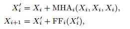

# 2-A Comparative Study On Transformer VS RNN In Speech Applications

论文链接：https://arxiv.org/abs/1909.06317

本文介绍了一个新兴的Sequence-to-Sequence模型，名为Transformer。本文在15个ASR、一个多语言ASR、一个语音翻译（ST）和两个文本转语音（TTS）基准对Transformer和RNN进行了实验比较分析，Transformer在每项任务中具有显著的性能优势。

## 一、引言

- 本文对Transfoemr和RNN进行了大规模比较研究，特别是在ASR相关任务中取得了显著的性能提升
- 介绍语音应用程序使用Transformer的训练技巧：ASR、ST和TTS
- 在开源工具包ESPnet中，在大量公开可用数据集上提供了可重复的端到端配方和预训练模型

本文旨在收集先前的基础研究，并在我们的实验中探索更广泛的话题（如准确性、速度和训练技巧）

## 二、Sequence-to-Sequence RNN

​	下面首先给出S2S的通用描述：	

​	S2S一个神经网络，学习转换源序列到目标序列。图1展示了S2S架构，由编码器和解码器组成。其中$X$是语音序列的源特征，$e$是编码器部分的层数，$d$是解码器部分的层数，$t$是目标帧索引，S2S最小化生成序列$Y_{post}$和目标序列$Y$的损失。

图1 语音应用的Sequence-to-Sequence架构

​	基于RNN的编码器，通常采用BLSTM，对于ASR，编码器序列输出$X_e$可用于源级逐帧预测，使用CTC联合训练和解码。

​	解码器是将编码序列$X_e$和目标前缀$Y_0[1:t-1]$生成下一个目标帧，基于RNN的解码器视线中，经常使用具有注意力机制的单向LSTM，该注意力机制将源逐帧权重给编码源帧$X_e$加权和，作为加权目标逐帧向量和前缀$Y_0[1:t-1]$进行转换。称这种类型的注意力为“编码器-解码器注意力”。

## 三、Transformer

​	Transformer 通过自注意力机制来学习序列信息。关于 Transformer 的论文，可以参考：https://arxiv.org/pdf/1706.03762.pdf。Transformer 由多个 dot-attention 层组成，为了使模型能并行处理多个注意力，扩展到了多头注意力(MHA):

其中 $W_h^q,W_h^k,W_h^v,W^{head}$ 是可学习权重矩阵。自注意力编码器的输入输出：

其中 $FF_i$ 表示第 $i$ 个编码器层的两层前馈网络：

自注意力解码器的输入输出：

把第二行解码器输入与编码器输出之间的注意力矩阵称为“编码器-解码器注意力“，注意力掩码可以将注意力矩阵掩蔽，使得第 $t$ 帧的注意力不会与晚于 $t$ 的未来帧连接，实现单向注意力，用于序列生成。 为了表示非递归模型的时间位置，Transformer 采用正弦位置编码：

## 四、实验

### 4.1 实验配置

​	这里仅看了ASR的实验部分。

​	在子采样阶段，采用两层 CNN，通道数为256、步长为2、核大小为3，将源序列 $X$ 转换为子采样序列 $X_0$，采用编码器网络将 $X_0$ 转换为 $X_e$，解码器网络用于接收编码序列 $X_e$ 和目标序列前缀 $Y[1:t-1]$。在解码中，预解码将 tokens 嵌入到可学习向量，解码阶段在给定编码器输出和目标序列前缀下，采用解码器和单线性层预测下一个 token的后验分布。

​	ASR 的损失是 CTC 和 S2S 的联合损失，采用加权和的方式定义。在解码阶段，解码器使用波束搜索预测下一个 token，组合了 S2S, CTC 和语言模型得分：

​	翻译任务相较于语音识别任务不能保证源序列和目标序列的单调对齐。

####  4.2	实验结果

​	表1 总结了 ASR 实验的 15 个数据集，涵盖了各个主题，包括录音质量（干净、嘈杂和远场）、语言（英语、日语、普通话、西班牙语、意大利语）和大小（10-960 小时）。数据准备脚本基于 Kaild 的 "s5x"。可以对语音添加0.9， 1.0 和 1.1 的速度扰动。同时还可以采用数据增强技术应用于数据集。

​	对于训练 Transformer，简单运行 20-200 epochs，大多为100 epochs，并对最后10个 epochs 的模型参数进行平均，作为最终模型。

​	表2 给出了ASR在 CER/WER 上的实验结果，Transformer 在 13/15 语料库上的性能优于 RNN，在 7/12 语料库上实现了与 Kaldi 相当的 CER/WER：

​	我们总结了在训练过程中观察到的训练技巧：

- 当 Transformer 出现拟合不足时，建议增加 minibatch 大小，可以同时带来更快的训练时间和更好的准确性。
- 当多 GPU 不可用时，可以采用累积梯度策略来模拟大的 minibatch
- Dropout 需要加入Transformer 避免过度拟合
- 采用数据增强的方法可以极大改进 Transformer 和 RNN 的性能

Transformer的弱点在于解码，相较于 Kaldi 系统要慢得多，自注意力需要的计算复杂度较高，需要为 Transformer开发出一种更快的解码算法。

​	

