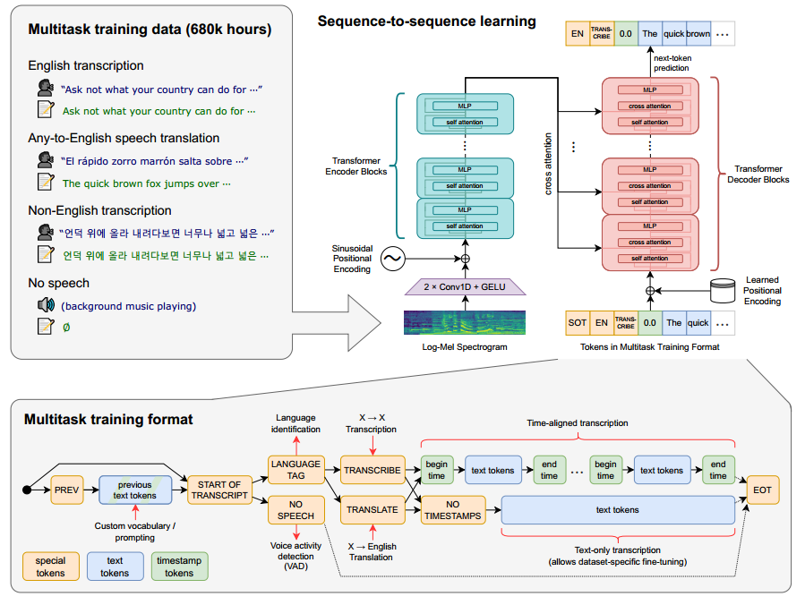
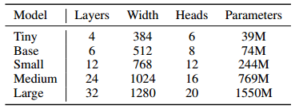
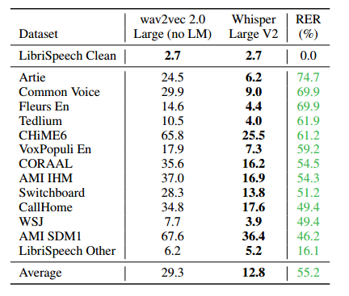
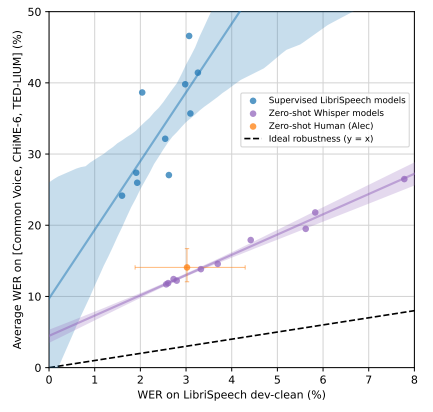
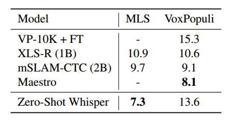

# 通过大规模弱监督实现鲁棒语音识别

论文链接：https://arxiv.org/abs/2212.04356

开源代码：https://github.com/openai/whisper

我们研究了通过简单训练以预测互联网上大量音频转录的语音处理系统的能力。当扩展到 680,000 小时的多语言和多任务监督时，由此产生的模型在标准基准测试中具有很好的泛化能力，通常在零样本迁移的情况下与以前的完全监督结果竞争，无需任何微调。与人类相比，这些模型接近于其准确性和鲁棒性。我们发布了模型和推理代码，以作为进一步研究鲁棒语音处理的基础。

## 引言

语音识别领域的进展得益于无监督的预训练技术的发展，以Wav2Vec 2.0（Baevski等，2020）为代表。由于这些方法直接从原始音频学习，无需人工标签，因此它们可以高效利用大规模的无标签语音数据集，并已迅速扩展到100万小时的训练数据（Zhang等，2021），远远超过了学术监督数据集通常约1,000小时左右的规模。当在标准基准上进行微调时，这种方法改进了技术水平，特别是在数据稀缺的情况下。

这些预训练的**音频编码器学习到了高质量的语音表示**，但由于它们完全是无监督的，它们**缺乏一个同样高性能的解码器**，将这些表示映射到可用的输出，因此需要经过微调阶段才能执行诸如语音识别之类的任务。不幸的是，这限制了它们的实用性和影响，因为微调仍然可能是一个需要熟练从业者的复杂过程。需要微调存在附加的风险。机器学习方法在训练数据集中寻找提高在相同数据集上保留数据上性能的模式方面非常擅长。然而，**其中一些模式脆弱而虚假，不能推广到其他数据集和分布**。在一个特别令人不安的例子中，Radford等人（2021）记录了在ImageNet数据集（Russakovsky等，2015）上微调计算机视觉模型时，物体分类准确性提高了9.2％，但在七个其他自然图像数据集上分类相同物体时，平均准确性没有提高。在另一个数据集上评估时，即使在一个数据集上训练时实现了“超人”级的性能，该模型仍可能会在另一个数据集上犯许多基本错误，可能正是因为它正在利用那些人类忽视的数据集特定的怪癖（Geirhos等人，2020）。

这表明，虽然无监督的预训练显著提高了音频编码器的质量，但缺乏同等高质量的预训练解码器，再加上推荐的数据集特定微调协议，是限制其实用性和鲁棒性的关键弱点。**语音识别系统的目标应该是能够在广泛的环境中可靠地“开箱即用”，而不需要为每个部署分布进行监督微调解码器**。

正如Narayanan等人（2018）、Likhomanenko等人（2020）和Chan等人（2021）所展示的，**以监督方式在多个数据集/领域上进行预训练的语音识别系统表现出更高的鲁棒性，并且对保留数据集的泛化能力明显更强，远远优于单一数据源训练的模型**。这些研究通过结合尽可能多的现有高质量语音识别数据集来实现这一点。然而，这些数据仍然只有相对有限的量易于获取。SpeechStew（Chan等人，2021）将7个现有数据集混合在一起，总共提供了5,140小时的监督数据。虽然数量不可忽视，但与Zhang等人（2021）中提到的1,000,000小时的无标签语音数据相比，仍然很少。

鉴于现有高质量监督数据集的有限规模，最近的努力已经创建了**更大规模的语音识别数据集**。Chen等人（2021）和Galvez等人（2021）通过放宽对黄金标准的人工验证文本的要求，利用先进的自动化流程将弱监督语音识别扩展到了10,000和30,000小时的更嘈杂的训练数据。在质量和数量之间进行这种权衡通常是正确的选择。虽然到目前为止，对于语音识别，还未得到充分研究，但计算机视觉领域的最新工作已经证明，从像ImageNet（Russakovsky等人，2015）这样的黄金标准众包数据集转向**更大规模但弱监督的数据集**，显著提高了模型的鲁棒性和泛化性能（Mahajan等人，2018；Kolesnikov等人，2020）。

然而，这些新数据集仅比现有高质量数据集的总和大几倍，仍然远远小于以前的无监督工作。**在这项工作中，我们弥合了这一差距，将弱监督语音识别扩展到下一个数量级**，使用了680,000小时的标记音频数据。我们称这一方法为Whisper。我们证明，在这种规模下训练的模型能够在已有数据集上实现零样本的良好迁移，无需进行任何数据集特定的微调，即可实现高质量的结果。

除了规模，我们的工作还侧重于将弱监督预训练的范围扩展到不仅仅是英语语音识别，而是多语言和多任务。在这680,000小时的音频中，有117,000小时覆盖了其他96种语言。数据集还包括125,000小时的 `X -> en` 的翻译数据。我们发现，对于足够大的模型，联合多语言和多任务训练没有任何不利之处，甚至带来了好处。

我们的工作表明，迄今为止，对于语音识别来说，对简单的弱监督预训练的规模扩展还没有得到足够的重视。我们在不需要自监督或自训练技术的情况下实现了这些结果，这些技术一直是最近大规模语音识别工作的主要支柱。为了作为进一步研究鲁棒语音识别的基础，我们发布了推理代码和模型，可以在以下网址找到：https://github.com/openai/whisper。

## 方法

### 数据处理

顺应近期利用互联网上的大规模文本数据来训练机器学习系统的趋势，我们采用了一种极简的数据预处理方法。与许多语音识别工作相比，我们训练Whisper模型来预测转录的原始文本，而不需要进行任何重要的标准化处理，依赖序列到序列模型的表现力来学习如何映射话语与其转录形式之间的关系。这简化了语音识别流程，因为它省去了需要单独的逆文本规范化步骤以生成自然语言转录的必要性。

我们从互联网上与转录配对的音频构建数据集。这导致了一个非常多样化的数据集，涵盖了来自许多不同环境、录音设置、说话者和语言的广泛音频分布。**虽然音频质量的多样性有助于训练模型具备鲁棒性，但文本质量的多样性却不会产生类似的好处**。初步检查显示原始数据集中存在大量次优的文本转录。为了解决这个问题，我们开发了几种自动筛选方法来提高文本转录的质量。

**互联网上的许多文本转录实际上并非人工生成，而是现有的自动语音识别系统（ASR）的输出**。最近的研究表明，在混合人工和机器生成数据的数据集上训练可能会显著降低翻译系统的性能（Ghorbani等人，2021）。为了避免学习“transcript-ese”，**我们开发了许多启发式方法来检测和移除训练数据集中的机器生成的文本转录**。许多现有的ASR系统仅输出书面语言的有限子集，消除或规范化了难以仅从音频信号预测的方面，如复杂的标点符号（感叹号、逗号和问号）、格式化空白，如段落，或风格方面，如大写。全大写或全小写的文本转录极有可能不是人工生成的。尽管许多ASR系统包括某种程度的逆文本规范化，但通常是简单的或基于规则的，仍然可以从其他未处理的方面检测，如从未包含逗号。

我们还使用了一个语音语言检测器，该检测器是通过对在VoxLingua107（Valk和Alumae¨，2021）上的一个数据集原型版本进行训练的原型模型进行微调而创建的，以确保口语语言与CLD2中的转录语言相匹配。如果两者不匹配，我们不将（音频、转录）对包括在数据集中作为语音识别训练示例。我们有一个例外，如果转录语言是英语，我们将这些对添加到数据集中，作为 `X->en` 语音翻译训练示例。我们使用模糊去重技术来减少训练数据集中的重复内容和自动生成的内容。

我们将音频文件分成 30 秒的片段，每个片段都与在该时间段内出现的部分转录配对。我们对所有音频进行训练，包括没有语音的片段（尽管以子采样的概率），并将这些片段用作语音活动检测的训练数据。

在进行了初始模型的训练后，我们进行了额外的过滤步骤，**汇总了关于模型在训练数据源上的错误率的信息，并对这些数据源进行了手动检查**，根据错误率和数据源大小的组合对其进行排序，以高效地识别和移除低质量的数据源。这次检查显示，有大量只有部分转录或对齐不良/错位的转录，以及未被过滤启发式方法检测到的低质量机器生成字幕。

为了避免污染，我们在训练数据集和我们认为存在较高重叠风险的评估数据集之间进行了转录级别的**去重**，主要是TED-LIUM 3（Hernandez等人，2018）。

### 模型

由于我们的工作重点是研究大规模监督预训练用于语音识别的能力，为了避免混淆我们的发现与模型改进，我们选择了一个现成的架构。我们选择了一个**编码器-解码器 Transformer**（Vaswani等人，2017）作为该架构已经得到了可靠的验证。所有音频都被重新采样为16,000 Hz，然后在25毫秒的窗口上计算了一个80通道的对数幅度梅尔频谱表示，每隔10毫秒采样一次。

对于特征归一化，我们对输入进行全局缩放，使其在预训练数据集中大致均值为零，并将其范围控制在-1到1之间。编码器通过一个小型的 stem 处理这个输入表示，包括两个卷积层，卷积核宽度为3，使用 GELU 激活函数（Hendrycks & Gimpel，2016），其中第二个卷积层的步长为2。然后，在 stem 的输出上添加正弦位置嵌入，之后应用编码器 Transformer 块。Transformer 使用预激活残差块（Child等人，2019），并对编码器输出应用最后的层归一化。解码器使用学习的位置嵌入和绑定的输入-输出令牌表示（Press & Wolf，2017）。编码器和解码器具有相同的宽度和 Transformer 块数量。图1总结了模型架构。

对于仅支持英语的模型，我们使用了与GPT2相同的字节级BPE文本分词器（Sennrich等人，2015；Radford等人，2019），并为多语言模型重新拟合了词汇表（但保持相同的大小），以避免在其他语言上出现过多的分段，因为GPT-2的BPE词汇表仅包含英语。

### 多任务格式

尽管**在给定音频片段中预测哪些单词被说出是完整语音识别问题的核心部分**，并在研究中得到广泛研究，但这并不是唯一的部分。一个功能完备的语音识别系统可以涉及许多额外的组件，如语音活动检测、说话者分离和逆文本规范化。这些组件通常是分开处理的，导致**在核心语音识别模型周围形成了相对复杂的系统**。为了减少这种复杂性，我们希望有一个单一的模型执行整个语音处理流程，而不仅仅是核心识别部分。这里的一个重要考虑因素是模型的接口。同一输入音频信号可以执行许多不同的任务：转录、翻译、语音活动检测、对齐和语言识别是一些示例。

为了使这种一对多的映射能够由单一模型完成，需要某种形式的任务规范。我们使用一个简单的格式来**指定所有任务和条件信息，将其作为输入令牌序列提供给解码器**。由于我们的解码器是一个音频条件语言模型，我们还训练它以依赖于转录文本的文本历史，希望它能够学会使用更长范围的文本上下文来解决模糊的音频。具体而言，有一定的概率，我们将当前音频段前面的转录文本添加到解码器的上下文中。我们使用一个 `<lang>` 令牌来表示预测的开始。首先，我们预测正在说的语言，每种语言在我们的训练集中用一个独特的令牌表示（总共有99种语言）。这些语言目标来自上文提到的 VoxLingua107 模型。在音频段中没有语音的情况下，模型被训练以预测一个 `<no_audio>` 令牌来表示这一点。接下来的令牌指定任务（转录或翻译），分别用 `<transcription>` 或 `<translation>` 令牌表示。然后，我们指定是否要预测时间戳，包括一个 `<timestamp>` 令牌来表示时间戳模式。此时，任务和所需的格式已经完全指定，输出开始。对于时间戳的预测，我们预测相对于当前音频段的时间，将所有时间量子化到最接近的20毫秒，与Whisper模型的本机时间分辨率相匹配，并为每个时间添加了额外的令牌。我们将时间戳的预测与字幕令牌交替进行：开始时间令牌在每个字幕文本之前被预测，结束时间令牌在字幕文本之后被预测。当最终的转录片段仅在当前的30秒音频块中部分包含时，我们在时间戳模式下仅预测其开始时间令牌，以指示随后的解码应在与该时间对齐的音频窗口上进行，否则我们截断音频以不包括该片段。最后，我们添加一个 `<end>` 令牌。我们仅遮蔽了先前上下文文本的训练损失，并训练模型预测所有其他令牌。请参见图1，以获取我们格式和训练设置的概述。

### 训练细节

为了研究Whisper的扩展特性，我们训练了一系列不同大小的模型。请参见表1以获取概述。我们使用FP16进行数据并行训练，采用动态损失缩放和激活检查点（Griewank＆Walther，2000；Chen等人，2016）。模型使用AdamW（Loshchilov＆Hutter，2017）和梯度范数裁剪（Pascanu等人，2013）进行训练，学习率线性衰减至前2048个更新后为零。我们使用了256个片段的批量大小，模型训练了220个更新，相当于对数据集进行两到三次遍历。由于只进行了几个时期的训练，过度拟合并不是一个主要问题，因此我们不使用任何数据增强或正则化，而是依赖于这个大型数据集中包含的多样性来鼓励泛化和鲁棒性。请参见附录F以获取完整的训练超参数。

表1 Whisper 模型家族架构细节

在早期的开发和评估中，我们观察到Whisper模型有一种倾向，即**对说话者的名称进行合理但几乎总是不正确的猜测**。这是因为预训练数据集中的许多转录包括正在说话的人的姓名，鼓励模型尝试预测它们，但这些信息很少可以从最近30秒的音频上下文中推断出来。为了避免这种情况，我们对不包括说话者注释的转录子集对 Whisper 模型进行了简短的微调，从而消除了这种行为。

## 实验

### 零样本评估

Whisper的目标是开发一个单一的鲁棒语音处理系统，无需针对特定分布进行数据集特定的微调，就能可靠地实现高质量的结果。为了研究这一能力，我们重新使用了一系列现有的语音处理数据集，以检查Whisper是否能够在**领域、任务和语言之间实现良好的泛化**。与使用这些数据集的标准评估协议不同，这些协议包括训练和测试数据集，我们在零样本设置中评估Whisper，不使用这些数据集的任何训练数据，以便我们可以测量广泛的泛化性能。

### 评估指标

语音识别研究通常根据词错误率（WER）度量来评估和比较系统。然而，WER基于字符串编辑距离，对模型输出与参考文本之间的所有差异进行惩罚，包括文本样式上的无害差异。因此，即使系统输出的文本被人类认为是正确的，由于细微的格式差异，WER仍然可能很大。虽然这对所有的转录工作都构成了问题，但对于像Whisper这样的零样本模型来说，尤其严重，因为它没有观察到特定数据集的**转录格式**的任何示例。

这不是一个新颖的观察；开发更好地与人类判断相关的评估指标是一个积极的研究领域，虽然有一些有希望的方法，但迄今为止在语音识别领域还没有广泛采纳。为了**减小对非语义差异的惩罚**，我们选择在计算WER之前对文本进行**广泛的标准化**来解决这个问题。我们的文本规范化器是通过迭代的手动检查开发的，以识别普遍模式，其中简单的WER对Whisper模型的无害差异进行了惩罚。附录C包括了详细信息。对于一些数据集，我们观察到WER下降了多达50％，通常是由于数据集的参考转录将缩写与包含空格的单词分开引起的奇怪情况。我们提醒这种开发过程可能存在过拟合Whisper模型的转录风格的风险，我们将在第4.4节进行调查。我们发布了我们的文本规范化器代码，以便进行轻松比较，并帮助其他人研究语音识别系统在分布之外的环境中的性能。

### 英语语音识别

在2015年，Deep Speech 2（Amodei等人，2015）报告称，当转录LibriSpeech测试-干净分割时，语音识别系统的性能与人类水平相匹配。作为他们分析的一部分，他们得出结论：“鉴于这一结果，我们怀疑在没有进一步领域自适应的情况下，通用语音系统很难在清晰的朗读语音上进一步改进。”然而，七年后，LibriSpeech测试-干净的SOTA WER从他们的5.3%降至1.4%（Zhang等人，2021），远低于他们报告的人类水平错误率5.8%。尽管在保留但在分布数据上表现出巨大且意想不到的进一步提高性能，但在其他环境中使用LibriSpeech训练的语音识别模型仍然远高于人类的错误率。是什么解释了在分布内报告的超人表现和在分布外的亚人表现之间的差距？

我们怀疑人类和机器性能在测试集上测量时之间的差距很大部分是由于混淆了人类和机器在测试集上的性能所测量的不同能力。这个说法一开始可能看起来令人困惑；如果人和机器都在做同样的测试，它们如何能够测试不同的技能？差异不是出现在测试中，而是在训练中。通常要求人们在几乎没有针对正在研究的特定数据分布的监督下执行任务。因此，**人类性能是对分布之外的泛化的度量**。但是，机器学习模型通常在接受来自评估分布的大量监督后进行评估，这意味着**机器性能实际上是对分布内泛化的度量**。虽然人和机器都在相同的测试数据上进行评估，但由于训练数据的差异，测量的是两种完全不同的能力。

Whisper模型经过广泛和多样化的音频分布训练，并在零样本设置下进行评估，可能会更好地匹配人类行为，优于现有系统。为了研究是否是这种情况（或者机器和人类性能差异是否是由尚未被理解的因素引起的），我们可以比较Whisper模型与人类性能以及标准微调的机器学习模型，并检查它们更接近哪一个。

为了量化这种差异，我们检查了总体鲁棒性，即跨多个分布/数据集的平均性能，以及由Taori等人（2020）引入的有效鲁棒性，它衡量了在参考数据集（通常是分布内数据）和一个或多个分布外数据集之间的预期性能差异。

**高效效鲁棒性的模型在分布外数据集上表现优于预期**，作为其在参考数据集上性能的函数，并接近在所有数据集上性能相等的理想状态。在我们的分析中，我们使用LibriSpeech作为参考数据集，因为它在现代语音识别研究中起着核心作用，并有许多已发布的模型在其上进行了训练，这允许对鲁棒性行为进行表征。我们使用了12个其他学术语音识别数据集的套件来研究分布外行为。有关这些数据集的详细信息可以在附录A中找到。

我们的主要发现总结在图2和表2中。尽管最好的零样本Whisper模型在LibriSpeech清晰测试中的WER为2.5，这大致与现代监督基线或2019年中期的最新技术相当，**但零样本Whisper模型在鲁棒性方面具有非常不同的性质，并在其他数据集上表现出色**。即使是最小的零样本Whisper模型，它只有3900万参数，在LibriSpeech测试-干净中的WER为6.7，与最好的监督LibriSpeech模型在其他数据集上的评估时大致具有竞争力。与图2中的人类进行比较，最好的零样本Whisper模型大致匹配其准确性和鲁棒性。为了详细分析这种大幅度的鲁棒性改进，表2比较了最好的零样本Whisper模型与在LibriSpeech测试-干净上性能最接近的监督LibriSpeech模型的性能。尽管它们在参考分布上的性能非常接近，但零样本Whisper模型在其他语音识别数据集上的评估中实现了平均相对误差降低55.2%。

表2。在各种数据集上的有效鲁棒性的详细比较。尽管两个模型在LibriSpeech上的性能相差不到0.1％，但零样本Whisper模型在其他数据集上的性能远远超出了其在LibriSpeech上的预期表现，平均减少了55.2％的错误。在应用我们的文本规范化器后，两个模型的结果以字错误率（WER）报告。

图2。零样本Whisper模型缩小了与人类鲁棒性的差距。尽管在LibriSpeech dev-clean上与人类匹配或表现更好，但监督的LibriSpeech模型在其他数据集上产生大约是人类的两倍错误，显示了它们的脆弱性和缺乏鲁棒性。然而，零样本Whisper模型的估计鲁棒性前沿包括特定人的95%置信区间。

这一发现表明，强调对模型的零样本和分布外评估，特别是在尝试与人类性能进行比较时，可以避免由于误导性比较而夸大机器学习系统的能力。

### 多语言语音识别

为了与以前的多语种语音识别工作进行比较，我们在表3中报告了两个低数据基准的结果：多语种LibriSpeech（MLS）（Pratap等，2020b）和VoxPopuli（Wang等，2021）。

Whisper在多语种LibriSpeech上表现出色，在零样本设置下胜过了XLS-R（Babu等，2021），mSLAM（Bapna等，2022）和Maestro（Chen等，2022b）。我们提醒您，我们在这个结果中使用了一个简单的文本规范化器，这阻止了直接比较或宣称SOTA性能。然而，在VoxPopuli上，Whisper明显表现不佳，仅击败了原始论文中的VP-10K+FT基线。我们怀疑Whisper模型在VoxPopuli上的表现不佳可能是因为**其他模型将这个数据分布作为他们的无监督预训练数据的主要来源**，而该数据集有大量的监督数据，这有利于微调。虽然MLS每种语言有10小时的训练数据，但VoxPopuli平均每种语言的训练数据量大约高出10倍。

这两个基准有点狭窄，因为它们只包括15种独特的语言，几乎所有这些语言都属于印欧语系，其中许多是高资源语言。这些基准提供了有限的覆盖范围和研究Whisper模型多语种能力的空间，Whisper模型包括了75种语言的语音识别训练数据。为了更广泛地研究Whisper的性能，我们还报告了Fleurs数据集的性能。特别是，我们对我们为每种语言提供的训练数据量与相应语言的零样本性能之间的关系感兴趣。我们在图3中可视化了这种关系。我们发现在词错误率的对数和每种语言的训练数据量的对数之间有0.83的强相关系数。检查这些对数-对数值的线性拟合的回归系数，结果估计WER在每增加16倍的训练数据时减半。我们还观察到，根据这一趋势，性能不如预期的最大异常值中的许多语言是具有独特文字的语言，与占培训数据集大多数部分的印欧语系语言更为疏远，比如希伯来语（HE），特拉古语（TE），中文（ZH）和韩语（KO）。这些差异可能是由于语言距离导致的传输不足，我们的字节级BPE分词器不适用于这些语言，或者数据质量的差异。

