# DeepSpeech 2：英语和普通话端到端语音识别

论文链接：https://arxiv.org/abs/1512.02595

我们展示了一种端到端深度学习方法，可用于识别英语或普通话两种截然不同的语言。由于它用神经网络替代了整个手工设计的组件流水线，端到端学习使我们能够处理各种各样的语音，包括嘈杂的环境、口音和不同的语言。我们方法的关键在于应用高性能计算（HPC）技术，使速度比我们先前的系统提高了 $7$ 倍[26]。由于这种效率，以前需要几周的实验现在能在几天内完成。这使我们能够更快地迭代，以找到更优越的架构和算法。因此，在几种情况下，我们的系统在标准数据集上的基准测试中与人工工作者的转录相竞争。最后，通过在数据中心使用批处理调度和GPU的技术，我们展示了我们的系统可以以低延迟的方式以低成本部署在在线环境中，为大规模用户提供服务。

## 引言

几十年来，大量手工设计的领域知识已经被用于当前最先进的自动语音识别（ASR）流水线。一种简单但强大的替代解决方案**是通过深度学习训练这样的ASR模型，将大多数模块替换为单一模型** [26]。我们呈现了我们语音系统的第二代，展示了端到端学习的主要优势。Deep Speech 2 ASR流水线在多个基准测试中接近或超过了亚马逊机械土耳其人工工作者的准确度，在少量修改的情况下可以处理多种语言，并可在生产环境中部署。因此，它代表着朝着一个单一ASR系统迈出的重要一步，该系统能够处理人类处理的整个语音识别背景范围。由于我们的系统建立在端到端深度学习的基础上，我们可以采用一系列深度学习技术：捕捉大规模训练集，使用高性能计算训练更大的模型，并系统地探索神经网络架构的空间。我们展示了通过这些技术，我们能够将我们先前的端到端系统 [26] 在英语中的错误率降低高达 43%，同时也能够高准确度地识别普通话语音。

语音识别面临的挑战之一是语音和声学的广泛差异。因此，现代ASR流水线由许多组件组成，包括复杂的特征提取、声学模型、语言和发音模型、说话者适应等。构建和调整这些单独的组件使得开发新的语音识别器非常困难，特别是对于一种新语言而言。实际上，**许多部分在不同环境或语言中泛化效果不佳，通常需要支持多个特定于应用的系统，以提供可接受的准确性**。这种现状与人类语音识别不同：人类在童年时期具有学习任何语言的固有能力，使用通用技能学习语言。在学会阅读和写作后，大多数人可以在环境、说话者口音和噪音变异的情况下，无需为转录任务进行额外训练即可转录语音。为了满足语音识别用户的期望，我们认为一个单一引擎必须学会类似地胜任；能够在只进行轻微修改的情况下处理大多数应用，并能够在没有剧烈变化的情况下学习新语言。我们的端到端系统使这一目标成为可能，使我们能够在两种截然不同的语言（普通话和英语）的多个测试中接近或超过人工工作者的表现水平。

由于Deep Speech 2（DS2）是一个端到端深度学习系统，我们可以通过关注三个关键组件来实现性能提升：模型架构、大规模标记训练数据集和计算规模。这种方法在计算机视觉和自然语言等其他应用领域也取得了巨大的进展。**本文详细介绍了我们在这三个方面对语音识别的贡献，包括对模型架构以及数据和模型规模对识别性能的影响的广泛调查**。具体而言，我们描述了使用连接主义时序分类（CTC）损失函数[22]进行训练的神经网络的大量实验，以从音频中预测语音转录。我们考虑由许多层的循环连接、卷积滤波器和非线性组成的网络，以及批量归一化（Batch Normalization，BatchNorm）[63]应用于RNN的特定实例的影响。我们不仅找到了比先前工作[26]中更好的预测的网络，还发现了可以在生产环境中部署的递归模型的实例，而准确性没有显著下降。

除了寻找更好的模型架构外，**深度学习系统极大地受益于大量的训练数据**。我们详细介绍了我们的数据捕捉流水线，使我们能够创建比通常用于训练语音识别系统的数据更大的数据集。我们的英语语音系统训练了11,940小时的语音，而普通话系统训练了9,400小时。我们在训练过程中使用数据合成来进一步增加数据。

在大规模数据上进行训练通常需要使用更大的模型。事实上，我们的模型的参数比我们先前系统中使用的参数要多得多。在这些规模上训练单个模型需要数十exaFLOPs的计算能力，这在单个GPU上执行需要3-6周的时间。这使得模型探索变得非常耗时，因此**我们构建了一个高度优化的训练系统，使用8或16个GPU来训练一个模型**。与之前使用参数服务器和异步更新[18, 10]的大规模训练方法相比，我们使用同步随机梯度下降（SGD），这在测试新想法时更容易调试，而且对于相同程度的数据并行性，收敛速度更快。为了使整个系统高效，我们描述了单个GPU的优化以及多个GPU的可扩展性改进。我们采用在高性能计算中通常找到的优化技术来提高可扩展性。这些优化包括在GPU上对CTC损失函数的快速实现和自定义内存分配器。我们还使用精心集成的计算节点和自定义实现的全局归约来加速跨GPU的通信。总体而言，该系统在使用16个GPU进行训练时维持了约50 teraFLOP/秒的性能。这相当于每个GPU约3 teraFLOP/秒，约为峰值理论性能的50%。这种可扩展性和效率将训练时间缩短到3到5天，使我们能够更快地迭代我们的模型和数据集。

**我们在几个公开可用的测试集上对我们的系统进行基准测试**，并将结果与我们先前的端到端系统[26]进行比较。我们的目标是最终在不仅仅是特定基准测试上达到人类水平的性能，而是在反映各种情境的一系列基准测试上达到人类水平的性能。为此，我们还测量了每个基准测试中人工工作者的表现以进行比较。我们发现我们的系统在一些常见的研究基准测试中表现优于人类，并在更难的情况下显著缩小了差距。除了公共基准测试外，我们还展示了我们的普通话系统在反映真实产品场景的内部数据集上的性能。

在大规模部署时，深度学习系统可能面临一些挑战。对于每个用户的话语，评估大型神经网络在计算上是昂贵的，而某些网络架构比其他网络更容易部署。通过模型探索，我们找到了高准确度、可部署的网络架构，这里进行详细介绍。**我们还采用一种适用于GPU硬件的批处理方案，称为Batch Dispatch，可在生产服务器上实现我们的普通话引擎的高效实时运行**。我们的实现在服务器加载了10个同时音频流的情况下，实现了98th百分位的计算延迟为67毫秒。

论文的剩余部分如下。我们首先在第2节回顾深度学习、端到端语音识别和可扩展性的相关工作。第3节描述了模型的架构和算法改进，第4节解释了如何高效计算它们。我们在第5节讨论了训练数据以及进一步增强训练集所采取的步骤。第6节介绍了DS2系统在英语和普通话中的结果分析。最后，在第7节中，我们描述了将DS2部署到实际用户所需的步骤。

## 相关工作

这项工作受到了深度学习和语音识别领域先前工作的启发。在20多年前，人们就开始探索前馈神经网络声学模型[7, 50, 19]。在大致同一时期，循环神经网络和具有卷积的网络也被用于语音识别[51, 67]。最近，深度神经网络已经成为ASR流水线中的固定组成部分，几乎所有最先进的语音工作都包含某种形式的深度神经网络[42, 29, 17, 16, 43, 58]。卷积网络也被发现对声学模型有益[1, 53]。循环神经网络，通常是LSTM，刚刚开始在最先进的识别器中得到应用[24, 25, 55]，并且与卷积层一起用于特征提取[52]效果良好。同时探索了具有双向[24]和单向循环的模型。

端到端语音识别是一个活跃的研究领域，在重新评分DNN-HMM的输出[23]以及独立使用时显示出引人注目的结果[26]。目前有两种方法用于将可变长度的音频序列直接映射到可变长度的转录。**RNN编码器-解码器范式使用编码器RNN将输入映射到一个固定长度的向量，然后使用解码器网络将这个固定长度的向量扩展为一系列输出预测[11, 62]**。在解码器中添加注意力机制极大地提高了系统的性能，特别是在处理长输入或输出时[2]。在语音领域，具有注意力的RNN编码器-解码器在预测音素[12]或字母[3, 8]方面表现良好。

**另一种常用的将可变长度音频输入映射到可变长度输出的技术是与RNN结合使用的CTC损失函数[22]，用于建模时间信息**。CTC-RNN模型在具有字母输出的端到端语音识别中表现良好[23, 27, 26, 40]。CTC-RNN模型在预测音素方面也表现良好[41, 54]，尽管在这种情况下仍然需要一个词汇表。此外，在这种情况下，还需要使用GMM-HMM系统的逐帧对齐来预训练CTC-RNN网络[54]。相反，我们从头开始训练CTC-RNN网络，无需使用逐帧对齐进行预训练。

**深度学习领域迄今取得的成功在很大程度上归功于对规模的充分利用**[36, 38]。在单个GPU上进行训练导致了显著的性能提升[49]，随后这种提升被线性地扩展到了两个[36]或更多个GPU[15]。我们利用了先前在提高单个GPU效率方面的研究成果[9]。我们基于过去关于使用**模型并行ism[15]、数据并行ism**[18]或两者结合的研究[64, 26]，构建了一个快速且高度可扩展的系统，用于在语音识别中训练深度循环神经网络（deep RNNs）。

数据同样是端到端语音识别成功的关键，Deep Speech 1（DS1）使用了超过7000小时的标记语音数据[26]。**数据增强在提高深度学习在计算机视觉中性能方面表现得非常出色**[39, 56, 14]。这也已经被证明对语音系统的性能提升具有积极作用[21, 26]。在语音数据增强的技术中，从简单的噪声添加[26]到复杂的扰动，如模拟改变说话者的声道长度和语速[31, 35]，涵盖了各种方法。

现有的语音系统还可用于启动新的数据收集。在一种方法中，作者使用一个语音引擎来对齐和过滤一千小时的朗读语音[46]。在另一种方法中，使用一个重量级的离线语音识别器为数万小时的语音生成转录[33]。然后，通过一个过滤器并用于重新训练识别器，从而获得显著的性能提升。我们从这些先前的方法中汲取灵感，**利用启动更大数据集和数据增强的方式，以增加系统中标记数据的有效数量**。

## 模型架构

一个简单的多层模型，只包含单个循环层，无法充分利用数千小时的标记语音。**为了从如此大规模的数据集中学习，我们通过增加深度来提高模型容量**。我们尝试了包括多个双向循环层和卷积层的结构，最多达到11层。这些模型每个数据示例的计算量几乎是Deep Speech 1中的模型的8倍，因此快速优化和计算是至关重要的。为了成功优化这些模型，我们对RNNs使用了批归一化（Batch Normalization）和一个我们称之为SortaGrad的新颖优化课程。我们还利用RNN输入之间的长跨度，将每个示例的计算量降低了3倍。这对于训练和评估都是有益的，尽管需要一些修改以便与CTC（Connectionist Temporal Classification）协同工作。最后，尽管我们的许多研究结果使用了双向循环层，我们发现即使只使用单向循环层，也能得到出色的模型——这一特性使得这些模型更容易部署。总的来说，这些特性使我们能够有效地优化深度循环神经网络，并在英语和普通话的错误率上相较较小的基准模型提高了40%以上的性能。

### 前言

图 **1** 展示了DS2系统的架构，其核心与之前的DS1系统[26]相似：一个经过训练的循环神经网络（RNN），用于接收语音频谱图并生成文本转录。

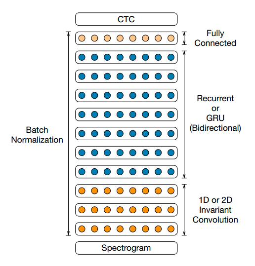

图1：DS2系统的架构，用于对英语和普通话语音进行训练。我们通过改变卷积层的数量从1到3，以及循环或GRU层的数量从1到7来探索这个架构的变体。

设从训练集$X = \{ (x^{(1)}, y^{(1)}), (x^{(2)}, y^{(2)}), \ldots \}$中采样得到单个话语$x^{(i)}$和标签$y^{(i)}$。每个话语$x^{(i)}$是一个长度为$T^{(i)}$的时间序列，其中每个时间切片是一个音频特征的向量，$x^{(i)}_t, t = 0, \ldots, T^{(i)}-1$。我们使用功率归一化的音频片段的频谱图作为系统的特征，因此$x^{(i)}_{t,p}$表示时间$t$处音频帧中第$p$个频率谱的功率。RNN的目标是将输入序列$x^{(i)}$转换为最终的转录$y^{(i)}$。为了符号简便，**我们省略上标，用$x$表示所选话语，$y$表示相应的标签**。

网络的输出是每种语言的字形。在每个输出时间步$t$，RNN对字符$p(l_t|x)$进行预测，其中 $l_t$ 可以是字母表中的字符，也可以是空白符号。在英语中，我们有$l_t \in \{a, b, c, \ldots, z, \text{space}, \text{apostrophe}, \text{blank}\}$，其中我们添加了撇号（apostrophe）以及空格符号表示单词边界。对于普通话系统，网络输出简体中文字符。我们将在第3.9节中对此进行更详细的描述。

RNN模型由多层隐藏单元组成。我们实验的架构包括一个或多个卷积层，接着是一个或多个循环层，最后是一个或多个全连接层。

在第$l$层的隐藏表示由$h^{(l)}$给出，按照惯例，$h^{(0)}$表示输入$x$。网络底部是对输入的时间维度进行一次或多次卷积。对于大小为$c$的上下文窗口，卷积层在时间步$t$的第$i$个激活由以下公式给出：

$$
 h^{(l)}_{t,i} = f(w^{(l)}_i \circledast h^{(l-1)}_{t-c:t+c}) 
$$

其中，◦表示第i个滤波器与前一层激活的上下文窗口之间的逐元素乘积，f表示一元非线性函数。我们使用修剪后的修正线性（ReLU）函数$\sigma(x) = \min(\max(0, x), 20)$ 作为我们的非线性激活函数。在某些层，通常是第一层，我们通过将卷积的步幅设为$s$帧来进行子采样。这样做的目的是缩短上面的循环层的时间步数。

在卷积层之后是一个或多个双向循环层[57]。正向时的激活$-\hat{h}^{(l)}$和反向时的激活$-\tilde{h}^{(l)}$分别计算如下：

$$
\hat{h}^{(l)}_t = g(h^{(l-1)}_t, -\hat{h}^{(l)}_{t-1}) \\
-h^{(l)}_t = g(h^{(l-1)}_t, -h^{(l)}_{t+1})
$$

这两组激活被求和以形成该层的输出激活$h^{(l)} = -\hat{h}^{(l)} + \tilde{h}^{(l)}$。函数$g(\cdot)$可以是标准的循环操作。

$$
\hat{h}^{(l)}_t = f(W_l \hat{h}^{(l-1)}_t + \tilde{U}_l \hat{h}^{(l)}_{t-1} + b_l)
$$

其中，$W_l$是输入到隐藏层的权重矩阵，$\hat{U}_l$是循环权重矩阵，$b_l$是偏置项。在这种情况下，输入到隐藏层的权重在循环的两个方向上是共享的。函数$g(\cdot)$还可以表示更复杂的循环操作，例如长短时记忆（LSTM）单元[30]和门控循环单元（GRU）[11]。

在双向循环层之后，我们应用一个或多个全连接层，其公式为：

$$
h^{(l)}_t = f(W_l h^{(l-1)}_t + b_l)
$$

输出层$L$是一个softmax层，计算给定如下概率分布的字符：

$$
p(l_t = k | x) = \frac{\exp(w^{(L)}_k \cdot h^{(L-1)}_t)}{\sum_j \exp(w^{(L)}_j \cdot h^{(L-1)}_t)}
$$

该模型使用CTC（Connectionist Temporal Classification）损失函数进行训练[22]。**对于给定的输入-输出对$(x, y)$和当前网络参数$\theta$，我们计算损失函数$L(x, y; \theta)$及其相对于网络参数的导数$\Delta_{\theta}L(x, y; \theta)$。**然后使用这个导数通过时间的反向传播算法来更新网络参数。

在接下来的小节中，我们描述了相对于DS1 [26]所做的体系结构和算法改进。除非另有说明，这些改进都是与语言无关的。我们报告了在一个英语说话者保留的开发集上的结果，这是一个包含2048个主要是朗读语音的内部数据集。所有模型均在第5节中描述的数据集上进行训练。我们报告了英语系统的词错误率（WER）和普通话系统的字符错误率（CER）。在两种情况下，我们在波束搜索解码步骤中集成了语言模型，如第3.8节所述。

### 深度 RNN 批归一化

为了在扩展训练集的同时有效地扩展我们的模型，我们通过增加更多隐藏层的方式来增加网络的深度，而不是使每一层更大。先前的工作已经通过增加连续的双向循环层的数量来研究这样做[24]。**我们探讨了批归一化（Batch Normalization，BatchNorm）作为一种加速这些网络训练的技术**[63]，因为它们通常遭受优化问题。

最近的研究表明，批归一化提高了循环神经网络的收敛速度，但并没有显示出在泛化性能上的改善[37]。相反，我们展示了当应用于大型数据集上的非常深的简单RNN网络时，批归一化显著提高了最终的泛化误差，同时大大加速了训练。

在典型的前馈层中，包含一个仿射变换，然后是一个非线性激活函数$f(\cdot)$，我们通过应用$f(B(W h))$而不是$f(W h + b)$来插入BatchNorm变换，其中：

$$
B(x) = \gamma \frac{x - \mathrm{E}[x]}{\sqrt{\mathrm{Var}[x] + \epsilon}} + \beta
$$

术语 $E$ 和 $Var$ 分别表示小批量上的经验均值和方差。由于均值移除已经抵消了其影响，层的偏置 $b$ 被省略。可学习的参数 $\gamma$ 和 $\beta$ 允许层按需缩放和移位每个隐藏单元。常数 $\epsilon$ 是一个小的正数，仅用于数值稳定性。在我们的卷积层中，对于给定的卷积滤波器，均值和方差是在小批量上估算的，考虑到了给定卷积层输出单元的所有时间。BatchNorm 变换通过隔离给定层的输入均值和方差的可能不相关的变化，减少了内部协方差漂移。

我们考虑将 BatchNorm 扩展到双向循环神经网络的两种方法[37]。一个自然的扩展是在每个非线性激活之前立即插入 BatchNorm 变换。公式3随之变为：

$$
\hat{h}^{(l)}_t = f\left(B(W_l \hat{h}^{(l-1)}_t + \tilde{U}_l \hat{h}^{(l)}_{t-1})\right)
$$

在这种情况下，均值和方差的统计是在小批量的单个时间步上累积的。时间步之间的时序依赖性阻止了对所有时间步的平均。我们发现，这种技术并没有改善优化。我们还尝试在连续的时间步上累积平均值，因此后面的时间步被规范化为所有当前和先前的时间步。这也证明是无效的，并且大大复杂化了反向传播。

我们发现，**序列级别的归一化**[37]克服了这些问题。循环计算如下：

$$
\hat{h}^{(l)}_t = f\left(B(W_l \hat{h}^{(l-1)}_t) + \tilde{U}_l \hat{h}^{(l)}_{t-1}\right)
$$

对于每个隐藏单元，我们计算整个小批量内所有项目在序列长度上的均值和方差统计。图2显示，**使用序列级别的归一化，深度网络的收敛速度更快**。表1显示，序列级别的归一化带来的性能提升随网络深度增加而增加，对于最深的网络，性能差异达到了12%。当比较深度时，为了控制模型大小，我们保持总参数数量不变，仍然看到了强大的性能增益。如果我们保持每层激活的数量不变并增加层数，我们预计深度将带来更大的改善。我们还发现，对于最浅的网络，BatchNorm 对泛化误差产生负面影响，就像对于较浅的网络它收敛较慢一样。

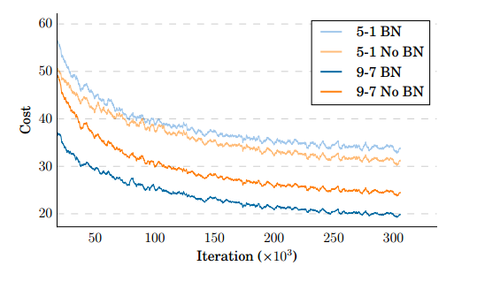

图2：使用和不使用 BatchNorm 训练的两个模型的训练曲线。我们在第一个训练周期之后开始绘制图表，因为由于第3.3节中提到的 SortaGrad 课程方法，曲线更难解释。

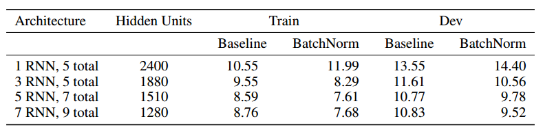

表1：在不同深度的RNN上，使用和不使用BatchNorm的训练集和开发集的词错误率（WER）比较。随着深度的增加，参数数量保持不变，因此每层的隐藏单元数量减少。所有网络都有3800万参数。架构“M RNN，N total”表示在输入处有1层1D卷积，M个连续的双向RNN层，其余层为具有N个总层数的全连接层的网络。

BatchNorm 方法在训练中效果很好，但在部署的自动语音识别（ASR）系统中实现起来很困难，因为在部署中通常需要评估单个语音而不是一个批次。我们发现将每个神经元归一化到其仅在序列上的均值和方差会降低性能。相反，我们在训练期间收集神经元的均值和方差的运行平均值，并在部署中使用这些值进行评估[63]。使用这种技术，我们可以逐个评估单个语音，比使用大批次进行评估的效果更好。

### SortaGrad

**在具有不同长度示例的训练中存在一些算法挑战**。一种可能的解决方案是通过时间截断反向传播[68]，以便在训练过程中所有示例具有相同的序列长度[52]。然而，这可能会抑制学习更长期依赖的能力。其他研究发现按照难度顺序呈现示例可以加速在线学习[6, 70]。许多序列学习问题（包括机器翻译和语音识别）中的一个共同主题是**更长的示例往往更具挑战性**[11]。

我们使用的CTC损失函数隐式地取决于话语的长度，

$$
L(x, y; \theta) = -\log \sum_{l \in \text{Align}(x, y)} \prod_{t=1}^{T} p_{ctc}(l_t | x; \theta)
$$

其中，$\text{Align}(x, y)$ 是在CTC运算符下将转录 $y$ 的字符对齐到输入 $x$ 的帧的所有可能对齐的集合。在上式中，内部项是序列时间步的乘积，随着序列长度的缩小而减小，因为$p_{\text{ctc}}(\text{'t} | x; \theta) < 1$。这启发了我们称之为SortaGrad的课程学习策略。SortaGrad以话语长度作为难度的启发式，因为长话语的成本高于短话语。

**在第一个训练时期，我们按照小批量中最长话语的长度递增的顺序迭代训练集**。在第一个时期之后，训练回到对小批量的随机顺序。表2显示了在具有7个循环层的9层模型上使用和不使用SortaGrad的训练成本的比较。这种效应在没有BatchNorm的网络中尤为明显，因为它们在数值上不太稳定。在某种程度上，这两种技术可以互相替代，尽管当应用SortaGrad和BatchNorm时我们仍然发现了收益。即使使用了BatchNorm，我们发现这个课程仍然提高了数值稳定性和对训练中小变化的敏感性。数值不稳定性可能是由于CPU和GPU中不同的超越函数实现，特别是在计算CTC成本时。这个课程为两种实现提供了可比较的结果。

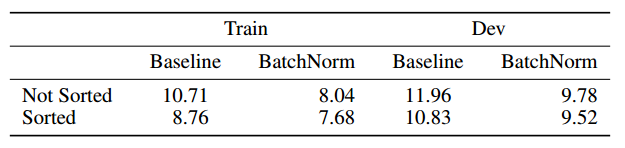

表2：在使用和不使用SortaGrad、以及使用和不使用批归一化的训练集和开发集上的词错误率（WER）比较。

我们怀疑这些好处主要是因为长话语往往具有较大的梯度，然而**我们使用的学习率是独立于话语长度的固定值**。此外，长话语更有可能在训练的早期阶段导致RNN的内部状态爆炸。

### 简单 RNNs 和 GRUs 比较

到目前为止，我们展示的模型是简单的RNN，具有双向循环层，其前向和后向方向的递归由方程式3建模。当前语音和语言处理领域的研究表明，采用更复杂的递归结构可以使网络在更多的时间步上记住状态，但这也会增加训练的计算开销[52, 8, 62, 2]。**两种常用的递归结构是长短时记忆（LSTM）单元[30]和门控循环单元（GRU）[11]**，尽管还存在许多其他变种。最近对成千上万种LSTM和GRU架构变体的全面研究表明，具有适当初始化的遗忘门偏置的GRU与LSTM相当，并且它们的最佳变体相互竞争[32]。我们决定研究GRU，因为对较小的数据集进行的实验表明，对于相同数量的参数，GRU和LSTM达到了相似的准确性，但GRU的训练速度更快，而且不太可能发散。

GRU 通过如下进行计算

$$
z_t = \sigma(W_z x_t + U_z h_{t-1} + b_z) \\
r_t = \sigma(W_r x_t + U_r h_{t-1} + b_r) \\
\tilde{h}_t = f(W_h x_t + r_t \odot U_h h_{t-1} + b_h) \\
h_t = (1 - z_t)h_{t-1} + z_t \tilde{h}_t
$$

其中，$\sigma(\cdot)$ 表示 Sigmoid 函数，$z$ 和 $r$ 分别代表更新门和重置门，为简化起见，我们省略了层标记。与标准的 GRU 稍有不同的是，在通过重置门进行缩放之前，我们将隐藏状态 $h_{t-1}$ 乘以 $U_h$。这使得对 $h_{t-1}$ 的所有操作都可以通过单次矩阵乘法计算。输出非线性函数 $f(\cdot)$ 通常为双曲正切函数 $\tanh$。然而，我们发现对于 $\tanh$ 和 Clipped ReLU 非线性函数，性能相似，我们选择使用 Clipped ReLU，以保持简洁和与网络其余部分的一致性。

GRU 和简单 RNN 结构都受益于批标准化，并在深度网络中取得了强大的结果。然而，表3显示，**对于固定数量的参数，GRU 结构在所有网络深度下都实现了更好的词错误率（WER）**。这清晰地证明了语音识别任务中存在的长期依赖性，既存在于单个单词内部，也存在于单词之间。正如我们在第3.8节中讨论的那样，即使简单的 RNN 也能由于大量的训练数据而隐式地学习语言模型。有趣的是，具有5个或更多循环层的GRU网络并没有显著改善性能。我们将这归因于从每层1728个隐藏单元（对应1个循环层）稀疏到每层768个隐藏单元（对应7个循环层），以保持总参数数量不变。

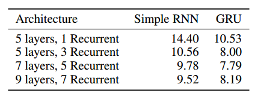

表3：对具有简单 RNN 或 GRU 的不同深度网络进行开发集词错误率（WER）的比较。所有模型均包含批标准化、一层1D不变卷积，并具有约3800万个参数。

在表3中，GRU网络的性能优于简单RNN网络。然而，在后续的结果中（第6节），我们发现随着模型规模的扩大，在固定的计算预算下，简单RNN网络的性能略微更好。鉴于此，大多数剩余的实验中使用简单RNN层而不是GRU层。

### 频率卷积

**时间卷积在语音识别中常用于高效建模变长语音的时间平移不变性**。这种卷积类型在超过25年前首次被提出用于语音神经网络[67]。许多神经网络语音模型的第一层会处理带有一些上下文窗口的输入帧[16, 66]。这可以看作是一个带有步长为一的时间卷积。

此外，子采样对于使循环神经网络在高采样率音频中变得可计算至关重要。**DS1系统通过将频谱图作为输入，并在第一层使用带有步长参数的时间卷积来减少时间步数**，从而实现了这一目标[26]。

在进行任何其他处理之前，对频谱输入特征应用频率和时间域卷积可以轻微提高ASR性能[1, 53, 60]。**频率卷积试图比大型全连接网络更简洁地建模由于说话人变异性而引起的频谱变异**。由于全连接和循环层去除了特征的频谱顺序，因此频率卷积作为网络的第一层效果更好。

我们尝试添加一到三层卷积。这些卷积既可以在时间和频率域中进行（2D不变性），也可以仅在时间域中进行（1D不变性）。在所有情况下，我们使用相同的卷积，保留频率和时间上的输入特征数量。在某些情况下，我们指定跨任一维度的步幅，从而减小输出的大小。我们没有明确控制参数的数量，因为卷积层向我们的网络添加了一小部分参数。表4中显示的所有网络都具有约3500万个参数。

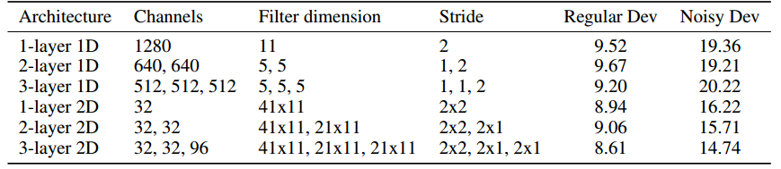

表4：对不同卷积层布局的词错误率（WER）进行比较。在所有情况下，卷积后面跟着7个循环层和1个全连接层。对于2D不变性卷积，第一维是频率，第二维是时间。所有模型都使用BatchNorm、SortaGrad，并具有3500万个参数。

我们在两个数据集上报告结果：一个包含2048个话语的开发集（“Regular Dev”）和一个从CHiME 2015开发数据集[4]中随机抽样的包含2048个话语的噪声较大的数据集（“Noisy Dev”）。我们发现多层1D不变卷积提供了非常小的好处。2D不变卷积在嘈杂的数据上显著改善结果，同时在干净的数据上提供了一些小的好处。从一层1D不变卷积转变为三层2D不变卷积在嘈杂的开发集上将词错误率（WER）提高了23.9%。

### 步长

在卷积层中，我们应用更长的步幅和更广泛的上下文，以加速训练，因为需要较少的时间步来对给定的话语进行建模。通过降采样输入音频（通过FFT和卷积步幅），可以减少以下层中所需的时间步数和计算量，但代价是性能降低。

在我们的普通话模型中，我们以直接的方式使用步幅。然而，在英语中，步幅可能会降低准确性，因为**我们网络的输出至少需要每个输出字符一个时间步，而英语每个时间步的语音字符数量足够高，可能会在使用步幅时出现问题**。为了克服这个问题，我们可以通过使用代表整个单词、音节或非重叠n元组的符号来丰富英语字母表。在实践中，我们使用非重叠的双字母组或二元组，因为与整词等替代方案相比，这些更容易构建，而且数量较少。我们通过简单的同构将单字标签转换为双字标签。

不重叠的双字节减短了输出转录的长度，因此允许减少展开的循环神经网络（RNN）的长度。以非重叠的双字节分割句子“the cat sat”得到 [th, e, 空格, ca, t, 空格, sa, t]。注意对于奇数字符的单词，最后一个字符成为一个单字节，空格也被视为一个单字节。这种同构确保相同的词始终由相同的双字节和单字节标记组成。输出的双字节集包括训练集中出现的所有双字节。

在表5中，我们展示了在不同步幅水平下使用双字节和单字节系统的结果，包括是否使用语言模型。我们观察到，**双字节允许更大的步幅，而不会牺牲词错误率**。这使我们能够减少展开的RNN的时间步数，有益于计算和内存的使用。

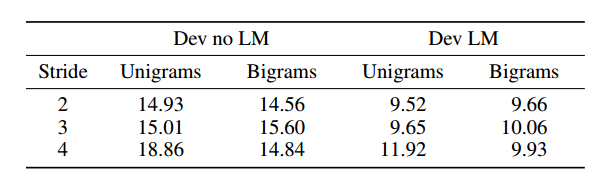

表5: 在具有1层1D不变卷积、7个循环层和1个全连接层的模型上，比较了不同步幅下单字节和双字节输出的词错误率（WER）。所有模型均包括BatchNorm、SortaGrad和3500万参数。使用5-gram语言模型的情况下，对这些模型在开发集上进行了比较。

### 行卷积和单向模型

**双向循环神经网络（RNN）模型在在线低延迟环境中部署具有挑战性**，因为它们被构建为对整个样本进行操作，所以在用户语音输入时无法执行转录过程。我们找到了一个单向架构，其性能与我们的双向模型相当。**这使我们能够在部署系统中使用单向、仅前向的RNN层**。

为了实现这一点，我们采用了一种特殊的层，我们称之为行卷积，如图3所示。这一层背后的直觉是，我们只需要未来信息的一小部分就能在当前时间步骤上做出准确的预测。假设在时间步骤 $t$，我们使用了 $\tau$ 步的未来上下文。现在我们有一个大小为 $d \times (\tau + 1)$ 的特征矩阵 $h_{t:t+\tau} = [h_t, h_{t+1},\ldots,h_{t+\tau}]$。我们定义一个与 $h_{t:t+\tau}$ 相同大小的参数矩阵 $W$。新层在时间步骤 $t$ 的激活 $r_t$ 为：

$$
r_{t, i} = \sum_{j=1}^{\tau} W_{i, j} h_{t+j-1, i}
$$

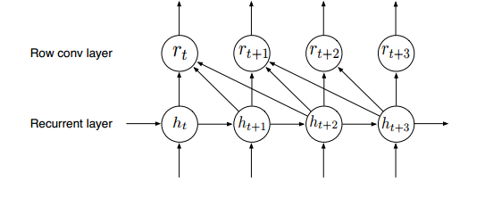

图3：未来上下文大小为2的行卷积架构

由于上式中的卷积式操作对 $W$ 和 $h_{t:t+\tau}$ 都是以行为导向的，我们将这一层称为行卷积。

**我们将行卷积层放置在所有循环层之上**。这有两个优势。首先，这使我们能够以更精细的粒度在行卷积层下进行所有计算，因为只需要很少的未来上下文。其次，与最佳的双向模型相比，这导致了更好的汉语字符错误率（CER）。我们推测**循环层已经学到了良好的特征表示，因此行卷积层只是收集适当的信息以供分类器使用**。有关具有行卷积的单向普通话语音系统的结果以及与双向模型的比较，请参见第7节的部署部分。

### 语言模型

我们通过数百万个独特的语音输入来训练我们的循环神经网络（RNN）模型，这使得网络能够学到一个强大的隐式语言模型。我们的最佳模型在拼写方面非常擅长，而无需任何外部语言约束。此外，在我们的开发数据集中，我们发现我们的模型在许多情况下能够**隐式消除同音异义词**，例如“他期待日本代理商以二十七万五千美元的价格卖出它”。尽管如此，与可用的无标签文本语料库的规模相比，标记的训练数据很小。因此，我们发现当我们**使用从外部文本训练的语言模型来补充我们的系统时，词错误率会得到改善**。

我们使用**n-gram语言模型，因为它们在大量的无标签文本上表现良好**[26]。对于英语，我们的语言模型是一个使用Kneser-Ney平滑的带剪枝的5-gram模型，使用KenLM工具包[28]在Common Crawl Repository3的清理文本上进行训练。词汇表包括来自25亿行文本中最常用的40万个单词，产生了一个包含约8.5亿个n-gram的语言模型。对于普通话，语言模型是一个使用Kneser-Ney平滑的字符级别5-gram模型，带剪枝，训练在包含80亿行文本的内部语料库上。这产生了一个包含约20亿个n-gram的语言模型。

在推理过程中，我们寻找最大化下式中显示的Q(y)的转录y。**这是CTC训练网络和语言模型的对数概率以及一个单词插入项的线性组合**[26]。

$$
Q(y) = \log(p_{\text{ctc}}(y| \mathbf{x})) + \alpha \log(p_{\text{lm}}(y)) + \beta \text{ word_count}(y)
$$

权重 $\alpha$ 控制语言模型和CTC网络的相对贡献。权重 $\beta$ 鼓励在转录中使用更多的单词。这些参数在开发集上进行调优。我们使用束搜索来找到最优的转录[27]。

表6显示，**外部语言模型对英语和普通话语音系统都有帮助**。随着我们从一个具有5层和1个循环层的模型转变为一个具有9层和7个循环层的模型，语言模型相对改进的幅度从英语的48%降至36%，而从普通话的27%降至23%。我们假设**网络通过更多的循环层构建了一个更强大的隐式语言模型**。

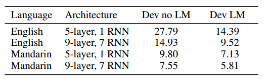

表6: 对比带有和不带有语言模型的英语词错误率（WER）和普通话字符错误率（CER）。这些是只包含一层1D不变卷积的简单RNN模型。

在英语中，语言模型的相对性能提升高于普通话。我们将这归因于汉字代表的信息块比英语字符更大的事实。例如，如果我们**直接输出到英语中的音节或单词，模型将会出现更少的拼写错误**，语言模型可能帮助的程度也会更小。

### 普通话适应

到目前为止，我们描述的技术可以用于构建一个端到端的普通话语音识别系统，直接输出中文字符。这消除了构建发音模型的需要，**而构建发音模型通常是将语音系统迁移到其他语言时涉及的一个相当复杂的组件**[59]。直接输出字符也消除了显式建模语言特定发音特征的需要。例如，我们不需要明确地建模普通话的声调，而一些语音系统可能需要[59, 45]。

我们对网络进行的唯一架构更改是由于中文字符集的特点。首先，网络的输出层输出约6000个字符，其中包括罗马字母，因为混合中英文的转录是常见的。如果一个字符不包含在这个集合中，我们在评估时会发生词汇外错误。这不是一个主要的问题，因为我们的测试集中只有0.74%的词汇外字符。

在普通话中，我们使用字符级语言模型，因为在文本中通常不对单词进行分割。方程12中的单词插入项变成了字符插入项。此外，我们发现在解码时，**波束搜索的性能在较小的波束大小时趋于稳定**。这使我们可以使用束大小为200，而字符错误率几乎没有降低。在第6.2节中，我们展示了我们的普通话语音模型对架构变化的改进大致与我们的英语语音模型相同。

## 系统优化

我们的网络具有数千万个参数，训练算法需要数十个单精度的exaFLOP才能收敛。由于我们评估有关数据和模型的假设的能力取决于快速训练模型的能力，我们构建了一个高度优化的训练系统。该系统有两个主要组件——**一个用C++编写的深度学习库**，以及**一个在CUDA和C++中编写的高性能线性代数库**。我们优化的软件在每个节点上使用8个Titan X GPU运行，使我们能够在一个节点上训练单个模型时维持每秒24个单精度teraFLOP。这占据了每个节点理论峰值计算吞吐量的45%。我们还可以扩展到多个节点，如下一小节所述。

### 可扩展性和数据并行

我们使用标准的**数据并行技术，使用同步随机梯度下降（SGD）在多个GPU上进行训练**。我们最常见的配置使用8个GPU上的小批量大小为512。我们的训练管道将一个进程绑定到每个GPU。然后，这些进程通过使用全局归约在反向传播期间交换梯度矩阵，全局归约在多个进程之间交换矩阵，并将结果求和，以便最终，每个进程都有所有进程的矩阵和的副本。

我们发现同步SGD很有用，因为它是可重现和确定性的。我们发现，在我们的系统中，非确定性的出现通常表示着一个严重的错误，因此将可重现性作为目标极大地方便了调试。相比之下，Dean等人在[18]中找到的异步方法，如带有参数服务器的异步SGD，通常不提供可重现性，因此更难调试。同步SGD易于理解和实现。随着我们向训练过程添加多个节点，它的扩展性良好。

图4显示，随着我们训练的GPU数量翻倍，训练一个时期所需的时间减半，从而实现了近似线性的弱扩展。在此实验中，我们保持每个GPU的小批量为64不变，实际上是在翻倍GPU数量的同时将小批量翻倍。尽管我们有能力扩展到大的小批量，但我们通常在训练过程中使用8或16个GPU，小批量为512或1024，以便收敛到最佳结果。

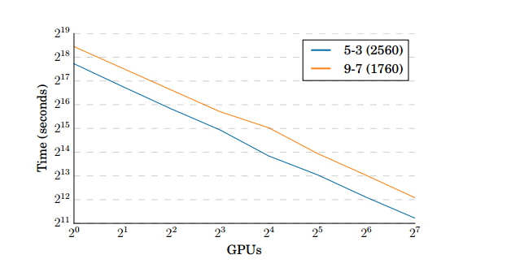

图4: 两个网络的扩展性比较——一个具有5层模型，包含2560个隐藏单元的3个循环层，和一个具有9层模型，包含每层1760个隐藏单元的7个循环层。所示的时间是训练1个时期所需的时间。由于使用了更大的矩阵并且在计算上更有效率，5层模型训练速度更快。

由于全局归约对我们的训练的可伸缩性至关重要，我们为了提高性能和稳定性编写了自己的环算法的实现[48, 65]。**我们的实现避免了CPU和GPU之间的不必要的复制，对于我们的可伸缩性至关重要**。我们使用了支持GPUDirect的smcuda传输配置了OpenMPI，该传输可以在两个不同GPU的内存中发送和接收缓冲区。当两个GPU位于相同的PCI根复杂时，这避免了任何不必要的复制到CPU内存。这还利用了树形结构的互连，通过在相邻设备之间并行运行环的多个段来实现。我们的实现使用MPI发送和接收，以及CUDA核进行逐元素操作。

表7比较了我们的全局归约实现与OpenMPI版本1.8.5提供的实现的性能。我们报告了在使用具有2560个每层隐藏单元的5层、3个循环层架构的模型，在我们的英语数据集上运行了一个时期的全训练中花费在全局归约上的时间。在这个表格中，我们每个GPU使用64的小批量，随着扩展到更多的GPU，扩展算法的小批量。我们看到当通信在一个节点内时（8个GPU或更少），**我们的实现比OpenMPI的实现要快得多**。随着GPU数量的增加和节点间通信的增加，差距缩小，尽管我们的实现仍然比OpenMPI快2-4倍。

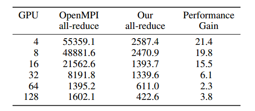

表7: 两种不同全局归约实现的比较。所有时间均以秒为单位。性能增益是OpenMPI全局归约时间与我们的全局归约时间的比率。

我们的所有训练运行都使用8或16个GPU，在这个范围内，与直接使用OpenMPI相比，我们的全局归约实现导致整个训练运行的速度提高了2.5倍。因此，**优化全局归约为我们的实验带来了重要的生产力好处**，并使我们简单的同步SGD方法具有了可扩展性。

### CTC 损失的 GPU 实现

计算CTC损失函数比在我们的RNN架构上执行前向和后向传播要复杂得多。最初，我们将激活从GPU传输到CPU，然后在CPU上使用OpenMP并行化的CTC实现计算损失函数。然而，这个实现在两个方面显著限制了我们的可伸缩性。首先，随着我们提高了RNN本身的效率和可伸缩性，它在计算上变得更加显著。其次，在CPU和GPU之间传输大型激活矩阵需要我们花费互连带宽来进行CTC，而不是用于传输梯度矩阵以使我们能够使用数据并行性扩展到更多的处理器。

为了克服这个问题，**我们编写了CTC损失函数的GPU实现**。我们的并行实现依赖于对CTC计算中的依赖关系进行轻微重构，以及使用ModernGPU [5]中优化的并行排序实现。在附录中，我们提供了更多关于这种并行化的细节。

表8比较了两种CTC实现的性能。GPU实现在英语中每个时期为我们节省了95分钟，在普通话中为25分钟。这减少了总体的训练时间10-20%，这对我们的实验也是一个重要的生产力好处。

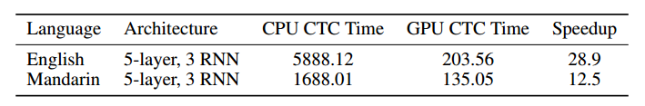

表8: 在两种不同实现中计算CTC损失函数和梯度所花费的时间（秒），在一个时期内。加速比是CPU CTC时间与GPU CTC时间的比率。

### 内存分配

我们的系统经常使用动态内存分配到GPU和CPU内存，**主要用于存储变长话语的激活数据和中间结果**。单个分配可能非常大；对于最长的话语超过1 GB。对于这些非常大的分配，**我们发现CUDA的内存分配器甚至std::malloc在我们的应用中引入了显著的开销**——在某些情况下，使用std::malloc导致了2倍的减速。这是因为cudaMalloc和std::malloc都将非常大的分配转发给操作系统或GPU驱动程序以更新系统页表。这是一个适用于运行多个应用程序的系统的良好优化，所有这些应用程序都共享内存资源，但是在我们的系统中，节点完全专用于运行单个模型，编辑页表纯粹是开销。为了解决这个限制，**我们为CPU和GPU分配编写了自己的内存分配器**。我们的实现遵循jemalloc中的最后一级共享分配器的方法：所有分配都是从连续的内存块中切割出来的，使用伙伴算法[34]。为了避免碎片，我们在训练开始时预先分配所有GPU内存，并从此块中细分单个分配。同样，我们将转发到mmap的CPU内存块大小设置为远大于std::malloc的大小，为12GB。

用于训练深度循环网络的大多数内存用于存储每个层的激活，以供反向传播使用，而不是存储网络的参数。例如，存储具有9层的7000万参数网络的权重大约需要280 MB的内存，但为64个7秒话语的批次存储激活需要1.5 GB的内存。TitanX GPU包含12GB的GDDR5 RAM，有时在处理长话语时，非常深层的网络可能会超过GPU内存容量。这可能是不可预测的，特别是当话语长度的分布包含异常值时，希望在发生这种情况时避免灾难性故障。当请求的内存分配超过可用的GPU内存时，我们使用cudaMallocHost分配页锁定的GPU内存映射的CPU内存。该内存可以通过在PCIe上传递单个内存事务直接由GPU访问，带有降低的带宽，它允许模型在遇到异常值后继续取得进展。

快速内存分配与一个备用机制的结合，使我们在特殊情况下可以稍微溢出可用的GPU内存，使系统变得更简单、更健壮和更高效。

## 训练数据

大规模深度学习系统需要大量标记好的训练数据。我们已经收集了丰富的英语和普通话语音模型训练数据集，并在训练中加入了公开可用的数据集。在英语方面，我们使用了总结在表9中的11940小时的标记语音数据，其中包含800万次语音表达。对于普通话系统，我们使用了9400小时的标记音频，包含1100万次语音表达。普通话语音数据包括百度内部语料库，涵盖了朗读和自发语音，既有标准普通话也有口音普通话。

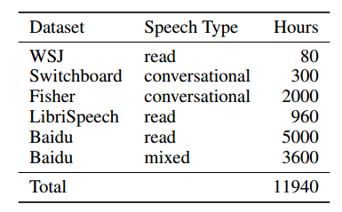

表9: 用于训练英语DS2的数据集摘要。《华尔街日报》（WSJ）、Switchboard和Fisher [13] 语料库均由语言数据联盟出版。LibriSpeech数据集 [46] 在线免费提供。其他数据集为百度内部语料库。

### 数据集构造

其中，部分内部英语（$3,600$ 小时）和普通话（$1,400$ 小时）数据集是从长音频剪辑中提取的，这些剪辑具有带噪音的转录。这些剪辑的长度范围从几分钟到一小时以上不等，在训练期间无法按时间展开它们在RNN中。为了解决这个问题，我们开发了一套对齐、分割和过滤的流程，能够生成一个训练集，其中包含更短的语音表达和较少的错误转录。

流程的第一步是使用已经通过CTC训练的双向RNN模型，将转录与音频帧对齐。对于给定的音频-转录对（x, y），我们寻找最大化对齐的情况。

$$
l^* = \arg \max_{l \in \text{Align}(x,y)} \sum_{t=1}^{T} \log p_{\text{ctc}}(l_t | x; \theta)
$$

这本质上是使用通过CTC训练的RNN模型找到的 Viterbi 对齐。由于方程9对齐进行了整合，**CTC损失函数从未明确要求生成准确的对齐。原则上，CTC可以选择在一些固定延迟后发射转录的所有字符**，这在使用单向RNN时可能发生[54]。然而，我们发现使用双向RNN进行训练时，CTC会产生准确的对齐。

在对齐之后的是一个分割步骤，当它遇到一长串连续的空白标签时，它会切割音频和相应的对齐转录，因为这通常表示一段静音。通过调整连续空白的数量，我们可以调整生成的语音表达的长度。对于英语语音数据，我们还需要在一系列空白之间有一个空格标记，以便只在单词边界上进行分割。**我们调整分割以生成平均长度为7秒的语音表达**。

**流程的最后一步是删除由于对齐失败而产生的错误示例**。我们为数千个示例众包了地面真实转录。地面真实与对齐转录之间的单词级编辑距离用于生成好或坏的标签。单词级编辑距离的阈值被选择为使开发集的好部分的WER小于5%。然后，我们训练一个线性分类器，以准确预测给定来自语音识别器生成的输入特征的坏示例。我们发现以下特征很有用：原始CTC成本、由序列长度标准化的CTC成本、由转录长度标准化的CTC成本、序列长度与转录长度的比率、转录中的单词数以及转录中的字符数。对于英语数据集，**我们发现过滤流程将WER从17%降低到5%，同时保留了超过50%的示例**。

### 数据增强

我们通过添加噪音来增强我们的训练数据，以增加训练数据的有效大小并提高对嘈杂语音的鲁棒性[26]。尽管训练数据包含一些固有噪音，但我们可以通过增强来增加噪音的数量和多样性。过多的噪音增强往往会使优化变得困难，并可能导致更差的结果，而过少的噪音增强会使系统对低信噪比语音的鲁棒性降低。**我们发现一个良好的平衡是对随机选择的 40% 的语音表达添加噪音**。噪音源包括数千小时的随机选择音频剪辑，组合在一起产生数百小时的噪音。

### 缩放数据

我们的英语和普通话语料库比语音识别文献中通常报告的要大得多。在表10中，**我们展示了增加标记训练数据量对WER的影响**。这是通过在训练之前随机抽样完整数据集完成的。

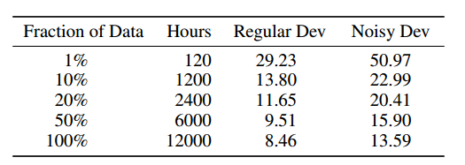

表10: 在增加训练数据集大小时，比较英语WER在正常和带噪音的开发集上的表现。该架构是一个9层模型，包括2层2D不变卷积和7个循环层，参数量为6800万。

对于每个数据集，模型最多训练了20个时期，尽管通常会根据验证集上的错误进行早期停止。我们注意到，对于正常和带噪音的开发集，WER都呈现出幂律下降。对于训练集大小每增加一个数量级，WER相对减少约40%。我们还观察到正常和带噪音数据集之间存在一致的WER差距（相对约60%），**表明更多的数据对两种情况都有同样的好处**。

这意味着语音系统将继续通过更多的标记训练数据进行改进。我们假设与增加原始小时数同样重要的是增加数据集中捕获的语音上下文的数量。上下文可以是使语音独特的任何属性，包括不同的说话者、背景噪音、环境和麦克风硬件。虽然我们没有验证这一说法所需的标签，**但我们怀疑将WER作为数据集中说话者数量的函数来测量，将导致比简单的随机抽样更大的相对增益**。

## 结果

为了更好地评估我们语音系统的实际适用性，我们在广泛的测试集上进行评估。我们使用了**几个公开可用的基准测试和一些内部收集的测试集**。这些测试集共同代表了一系列具有挑战性的语音环境，包括低信噪比（嘈杂和远场）、带口音的、朗读的、自发的和会话式的语音。

所有模型都在完整的英语数据集（见表9）或第5节中描述的完整的普通话数据集上进行了20个时期的训练。我们使用随机梯度下降与Nesterov动量[61]，以及512个语音表达的小批量。如果梯度的范数超过400的阈值，它将被重新缩放为400 [47]。在训练期间，在验证集上表现最佳的模型被选择进行评估。学习率从 $1 × 10^{-4}, 6 × 10^{-4}$ 中选择，以获得最快的收敛速度，并在每个时期后以一个常数因子1.2进行退火。我们对所有模型使用0.99的动量。

所使用的语言模型是在第3.8节中描述的那些。方程12中的解码参数在一个验证集上进行调整。我们对英语解码器使用500的波束大小，对普通话解码器使用200的波束大小。

### 英语数据集

最佳的DS2模型具有11层，其中包括3层2D卷积、7个双向循环层、一个全连接输出层以及批量归一化。第一层输出到bigrams，时间步长为3。相比之下，DS1模型具有5层，其中包括一个单向循环层，在第一层输出到unigrams，时间步长为2。我们在DS2和DS1模型上对几个测试集报告结果。我们没有对任何测试集中的语音条件进行DS2和DS1模型的调整或适应。语言模型解码参数在一个验证集上进行一次设置。

为了将我们系统的性能放在更广泛的背景中，我们将大多数结果与人工工作者进行基准测试，因为语音识别是一种人类擅长的音频感知和语言理解问题。**我们通过支付来自亚马逊Mechanical Turk的工作者手动转录所有测试集，获得人类水平性能的度量**。两个工作者转录同一段音频片段，通常约5秒长，我们使用两个转录中更好的那个进行最终的WER计算。他们可以随意听取音频片段的次数。这些工作者大多数来自美国，平均每个转录花费约27秒。手动转录的结果与现有的地面真实进行比较，以产生WER。尽管现有的地面真实转录确实存在一些标签错误，但这很少超过1%。这意味着地面真实转录与人类水平转录之间的不一致是人类水平性能的一个良好启发。

#### 模型大小

我们的英语语音训练集比常用的语音数据集要大得多。此外，该数据还经过噪音合成增强。为了获得最佳的泛化误差，我们期望模型规模必须增加，以充分利用数据中的模式。在第3.2节中，我们探讨了在固定参数数量的情况下增加模型深度的效果。相反，在这里，我们展示了**改变模型大小对语音系统性能的影响**。我们只改变每个层的大小，同时保持深度和其他架构参数不变。我们在与第3.5节中使用的相同的正常和带噪音的开发集上评估这些模型。

表11中的模型与表3中的模型不同，我们将步长增加到3并输出bigrams。由于我们将模型大小增加到100百万参数，我们发现增加步长对于快速计算和内存约束是必要的。然而，在这个范围内，我们注意到GRU网络的性能优势似乎减小了。实际上，对于有100百万参数的网络，简单RNN的性能优于GRU网络，并且训练速度更快，尽管有2个额外的卷积层。

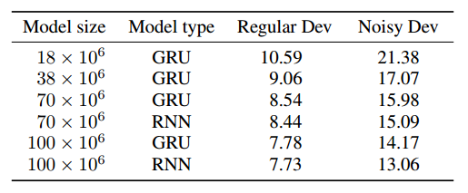

表11：比较模型大小对英语语音系统在正常和带噪音的开发集上WER的影响。我们改变除卷积层之外的所有隐藏单元的数量。GRU模型有3层双向GRU，1层2D不变卷积。RNN模型有7层双向简单循环，3层2D不变卷积。两种模型输出bigrams，时间步长为3。所有模型包含大约3500万个参数，并使用BatchNorm和SortaGrad进行训练。

表11显示，系统的性能一直提高，直到100百万参数。由于它达到了最低的泛化误差，因此后续的英语DS2结果都是使用这个相同的有100百万参数的RNN模型报告的。

表12显示，在一个包含3300个语音表达的百度内部数据集上，**100百万参数的RNN模型（DS2）相对于具有1个循环层的5层模型（DS1）实现了43.4%的相对改进**，该数据集包含各种语音，包括具有挑战性的口音、来自远场或背景噪音的低信噪比，以及自发和对话式的语音。

#### 朗读语音

高信噪比的朗读语音可能是连续语音识别任务中最容易处理的大词汇。我们在两个来自《华尔街日报》（WSJ）新闻文章的语料库的测试集上对我们的系统进行基准测试。这些数据在LDC目录中可用，分别是LDC94S13B和LDC93S6B。我们还利用了最近开发的LibriSpeech语料库，该语料库使用LibriVox项目的有声书构建[46]。

表13显示，DS2系统在4个测试集中的3个中优于人类，并且在第四个测试集上表现相当。鉴于这个结果，**我们怀疑在没有进一步的领域自适应的情况下，通用语音系统在处理清晰的朗读语音方面可能没有太大的提升空间**。

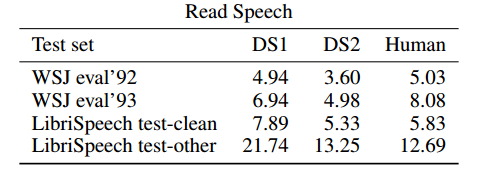

表13: 两个语音系统在朗读语音上的WER比较以及与人类水平性能的对比。

#### 口音语音

我们使用公开可用的VoxForge（http://www.voxforge.org）数据集作为带口音语音的来源，该数据集包含了许多不同口音的演讲者的清晰语音。我们将这些口音分为四类。美加组和印度组是不言而喻的。联邦口音表示具有英国、爱尔兰、南非、澳大利亚和新西兰口音的演讲者。欧洲组包含那些在那些英语不是第一语言的欧洲国家的演讲者。我们从VoxForge数据中构建了一个测试集，每个口音组有1024个例子，总共有4096个例子。

对这些测试集的表现在某种程度上衡量了我们训练数据的广度和质量。表14显示，当我们包含更多带口音的训练数据并使用一个能够有效训练这些数据的架构时，我们在所有口音上的性能都有所提高。然而，与印度口音相比，人类水平性能仍然明显优于DS2。

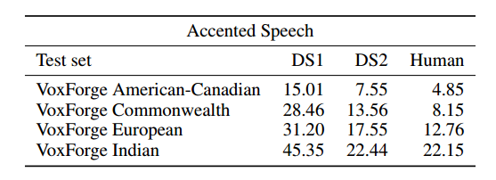

表14: 比较DS1系统和DS2系统在带口音语音上的WER。

#### 带噪语音

我们在嘈杂的语音上测试我们的性能，使用的是最近完成的第三届CHiME挑战[4]中的公开可用的测试集。该数据集包含来自WSJ测试集的1320个语音表达，是在各种嘈杂的环境中朗读的，包括公交车、咖啡馆、街道和行人区。CHiME数据集还包括1320个带有模拟噪音的语音表达，这些噪音来自相同环境，以及包含相同语音表达的控制集，在无噪音的环境中由相同的演讲者传递。**在控制集和嘈杂集上的结果之间的差异提供了网络处理各种真实和合成噪音条件的能力的度量**。CHiME音频有6个通道，使用所有这些通道可以提供显著的性能提升[69]。由于多通道音频在大多数设备上并不普遍，我们对所有结果都使用单通道。表15显示DS2在很大程度上改善了DS1的性能，但在嘈杂的数据上，DS2比人类水平性能差。当数据来自真实的嘈杂环境而不是对清晰语音进行合成噪音时，DS2和人类水平性能之间的相对差距更大。

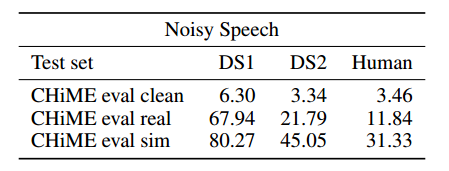

表15: DS1和DS2系统在嘈杂语音上的比较。 "CHiME eval clean"是无噪音的基线。 "CHiME eval real"数据集是在真实嘈杂的环境中收集的，而 "CHiME eval sim" 数据集则是在清晰语音中合成相似的噪音。请注意，我们只使用了六个通道中的一个来测试每个语音表达。

### 普通话数据集

在表16中，我们比较了在普通话语音上训练的几种体系结构，其中包括一个包含2000个语音表达的开发集，以及一个包含1882个嘈杂语音示例的测试集。这个开发集还用于调整解码参数。我们看到，具有2D不变卷积和BatchNorm的最深模型相对于浅层RNN的性能提高了48%，从而延续了我们在英语系统中看到的趋势——多层双向循环大大提高了性能。

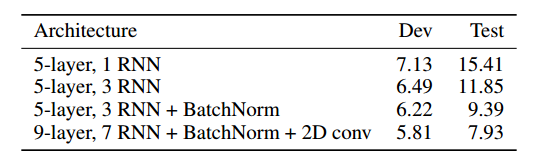

表16: DeepSpeech在架构改进方面的性能比较。开发集和测试集来自百度内部语料库。表中的所有模型每个都有大约8000万个参数。

我们发现，我们的最佳普通话语音系统在转录短的语音查询样本时比典型的普通话说话者表现更好。为了与人类进行基准测试，我们进行了一个测试，选择了100个随机选择的语音表达，并让一个由5名人类组成的小组共同对它们进行标注。与语音系统的性能相比，人类小组的错误率为4.0%，而语音系统的性能为3.7%。我们还将单个人类转录员与语音系统在250个随机选择的语音表达上进行了比较。在这种情况下，语音系统表现得更好：人类的错误率为9.7%，而语音模型的错误率为5.7%。

## 部署

实际应用通常要求语音系统实时转录或具有相对低的延迟。第6.1节中使用的系统对这个任务设计不够理想，原因有几点。首先，由于RNN有几个双向层，要转录语音的第一部分需要将整个语音表达呈现给RNN。其次，由于在解码时使用宽波束，使用语言模型进行束搜索可能很昂贵，特别是在中文中，可能的下一个字符的数量非常大（大约6000个）。第三，如第3节所述，我们在整个语音表达中归一化功率，这再次要求整个语音表达提前可用。

我们通过使用训练集的一些统计信息，**在在线转录过程中对语音输入进行自适应归一化来解决功率归一化问题**。我们可以通过修改我们的网络和解码过程来解决其他问题，以产生一个性能几乎相同但延迟较低得多的模型。我们专注于我们的普通话系统，因为该系统的某些方面更难部署（例如，大字符集），但相同的技术也可以应用于英语。

在本节中，延迟指的是从语音表达结束到产生转录的计算延迟，该延迟从不包括通过互联网传输数据，并且不测量从语音表达开始到产生第一个转录的延迟。**我们专注于从语音表达结束到转录的延迟，因为这对于使用语音识别的应用程序很重要**。

### 批量调度

为了在低延迟下部署我们相对较大的深度神经网络，我们在部署过程中特别关注效率。**大多数互联网应用程序会在数据中心中逐个处理请求。这使得实现变得直截了当，其中每个请求都可以由一个线程管理**。然而，逐个处理请求在计算上是低效的，主要有两个原因。首先，在逐个处理请求时，处理器必须为每个请求加载网络的所有权重。这降低了工作负载的算术强度，并且往往使计算成为内存带宽受限，因为在逐个呈现请求时很难有效使用芯片上的缓存。其次，用于分类一个请求的可利用并行性有限，使得难以利用SIMD或多核并行性。RNNs尤其难以部署，因为逐个评估RNNs依赖于顺序矩阵向量乘法，这是带宽受限且难以并行化的。

为了克服这些问题，我们构建了一个称为Batch Dispatch的批处理调度程序，该调度程序在对这些批次执行前向传播之前，**将用户请求的数据流组装成批次**。在这种情况下，存在批处理大小增加和效率提高以及延迟增加之间的权衡。我们越多地缓冲用户请求以组装大批次，用户等待结果的时间就越长。这对我们可以执行的批处理量施加了一些限制。

我们使用一种渴望批处理的方案，**即在上一批次完成后立即处理每个批次，而不考虑到目前为止已经准备好多少工作**。尽管这种调度算法在计算上效率较低，因为它不尝试最大化批处理大小，但它已经被证明是减少最终用户延迟的最佳方法。

图5显示了我们在一台单独的NVIDIA Quadro K1200 GPU上运行的生产系统，处理10-30个并发用户请求时，请求在给定大小的批次中被处理的概率。如预期的那样，当服务器负载较重时，批处理效果最好：随着负载的增加，分布向更喜欢在较大批次中处理请求的方向移动。然而，即使只有10个并发用户请求的轻负载，我们的系统也至少在包含2个样本的批次中执行了一半以上的工作。

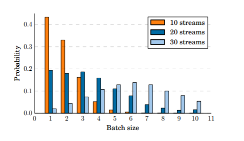

图5：请求在给定大小的批次中被处理的概率

在图6中，我们看到当负载为10个并发流时，我们的系统实现了44毫秒的中值延迟和70毫秒的98百分位延迟。随着服务器负载的增加，批处理调度程序将工作转移到更有效的批次，从而保持延迟较低。这表明Batch Dispatch使得能够以高吞吐量和低延迟部署这些大型模型成为可能。

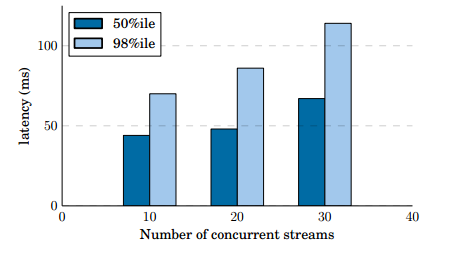

图6：中值和98百分位延迟作为服务器负载的函数

### 部署优化的矩阵乘法内核

我们发现，使用半精度（16位）浮点运算部署我们的模型并不会显著改变识别准确性。由于部署不需要对网络权重进行任何更新，因此它对数值精度的敏感性远低于训练。**使用半精度浮点运算可以节省内存空间和带宽，这在部署中尤其有用**，因为RNN的评估主要由缓存和流式传输权重矩阵的成本决定。

如第7.1节所示，在部署过程中，批处理大小要比训练中小得多。我们发现标准的BLAS库在这个批处理大小下效率不高。为了解决这个问题，**我们编写了自己的半精度矩阵-矩阵乘法核心**。对于10个同时流，超过90%的批次的N值都小于等于4，**在这个范围内矩阵乘法将受到带宽限制**。我们将A矩阵转置存储，以通过使用尽可能宽的矢量加载来最大化带宽，同时避免加载后的转置。每个warp计算所有N个输出列的四行输出。请注意，对于N ≤ 4，B矩阵完全适应L1缓存。这个方案在N ≤ 4时达到了峰值带宽的90%，但对于较大的N开始失去效率，因为B矩阵不再适应L1缓存。尽管如此，它在N = 10时仍然比现有库提供了更高的性能。

图7显示，我们的部署核心在K1200 GPU上的计算吞吐量高于Nervana Systems [44]的核心，覆盖了我们在部署中使用的整个批处理大小范围。我们的核心和Nervana核心都显著快于NVIDIA CUBLAS版本7.0，更多细节可以在这里找到[20]。

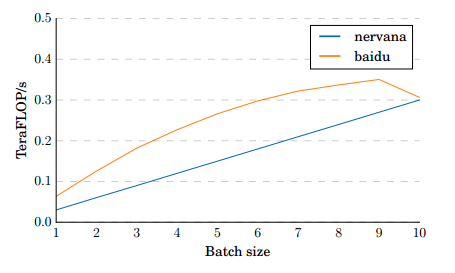

图7：计算Ax = b的核心比较，其中A是一个维度为2560 × 2560的矩阵，x是一个维度为2560 × Batch大小的矩阵，其中Batch大小为2 [1, 10]。所有矩阵均为半精度格式。

### 波束搜索

执行波束搜索涉及到在n-gram语言模型中进行重复查找，其中大多数查找都转换为从内存中读取未缓存的数据。波束搜索的直接实现意味着每个时间步都会为每个束派发一个字符的查找。在中文中，这导致每40毫秒的语音数据步进中超过100万次查找，这对于部署来说速度太慢。为了解决这个问题，我们使用了一种启发式方法来进一步剪枝束搜索。我们不再将所有字符都视为可添加到束中的字符，而是只考虑最少数量的字符，使其累积概率至少为p。在实践中，我们发现p = 0.99效果良好。此外，**我们限制自己最多使用40个字符**。这将中文语言模型的查找时间加速了150倍，并对CER（相对值0.1-0.3%）几乎没有影响。

### 结果

我们能够在低延迟和高吞吐量的情况下部署我们的系统，而不会牺牲太多准确性。在一个包含2000个utterances的验证集上，我们的研究系统达到了5.81的字符错误率，而部署系统达到了6.10的字符错误率。这只是部署系统相对性能下降了5%。为了实现这一点，我们采用了一个具有低部署延迟的神经网络架构，将网络的精度降低到16位，构建了一个更有效地评估RNN的批处理调度程序，并找到了一个简单的启发式方法来降低束搜索成本。该模型具有五个前向递归层，每个层有2560个隐藏单元，一个行卷积层（第3.7节）具有τ = 19，以及一个具有2560个隐藏单元的全连接层。这些技术使我们能够以较低的成本将Deep Speech部署到交互式应用程序中。

## 结论

端到端深度学习为不断提高语音识别系统性能提供了令人兴奋的机会，随着数据和计算能力的增加，系统性能也在不断提升。事实上，我们的结果显示，与先前版本相比，Deep Speech通过利用更多的数据和更大的模型，显著缩小了与人类工作者转录性能之间的差距。此外，由于这种方法非常通用，我们已经证明它可以快速应用于新的语言。为两种非常不同的语言，英语和普通话，创建高性能的识别器几乎不需要对这些语言的专业知识。最后，我们还表明，这种方法可以通过在GPU服务器上将用户请求进行批处理而有效地部署，为将端到端深度学习技术提供给用户铺平了道路。

为了实现这些结果，我们探索了各种网络架构，找到了几种有效的技术：通过SortaGrad和Batch Normalization增强数值优化，对英语进行大步长的带有二元输出的RNN评估，搜索双向和单向模型。这种探索得益于一个经过优化的、受高性能计算启发的训练系统，使我们能够在几天内在大型数据集上训练新的、全尺寸的模型。

总的来说，我们认为我们的结果确认并且典型地展示了端到端深度学习方法在多种场景中对语音识别的价值。在我们的系统尚未与人类可比的情况下，差距迅速缩小，主要是因为应用无关的深度学习技术。我们相信这些技术将继续扩展，因此得出结论：在大多数场景中超过人类的单一语音系统的愿景是即将实现的。

