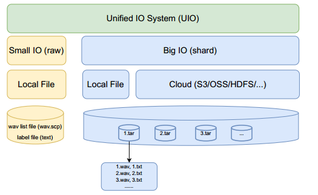

# WeNet 2.0：更具生产力的端到端语音识别工具包

英文名：Wenet2.0 More Productive End-to-End Speech Recognition Toolkit

论文链接：https://arxiv.org/abs/2203.15455

最近，我们发布了WeNet，一个面向生产的端到端语音识别工具包，引入了一个统一的两阶段（U2）框架和一个内置的运行时，以在单个模型中处理流式和非流式解码模式。为了进一步提高ASR性能并满足各种生产需求，在本文中，我们提出了WeNet 2.0，其中包括四个重要的更新：

1. 我们提出了U2++，一个具有双向注意力解码器的统一两阶段框架，通过右到左的注意力解码器包括未来的上下文信息，以提高共享编码器的表征能力和在重评分阶段的性能。
2. 我们引入了基于n-gram的语言模型和基于WFST的解码器到WeNet 2.0，促进了在生产场景中使用丰富的文本数据。
3. 我们设计了一个统一的上下文偏置框架，利用用户特定的上下文信息（例如联系人列表），为生产提供快速适应能力，并提高了在有语言模型和无语言模型情况下的ASR准确性。
4. 我们设计了一个统一的输入/输出界面，支持大规模数据以有效训练模型。

总之，全新的WeNet 2.0在各种语料库上相对于原始WeNet实现了高达10％的识别性能提升，并提供了几个重要的面向生产的功能。

## 1、引言

​	语音工具包：ESPnet，SpeechBrain

​	n-gram LM可以在丰富的生产文本数据上进行快速训练，结果表明，n-gram LM可以实现8%的相对性能改进

## 2、U2++

​	U2++由四部分组成：

- 共享编码器：对声学信息进行建模，由多个Transformer或Conformer层组成，只考虑有限的上下文信息
- CTC解码器：对声学特征和token单元之间帧对齐信息进行建模，一个线性层，将共享编码器的输出转换为CTC激活
- 左到右注意力解码器(L2R)：从左到右的正序token序列进行建模，表示过去的上下文信息
- 右到左注意力解码器(R2L)：从右到左的反向token序列进行建模，表示未来的上下文信息

​	L2R和R2L解码器由多个Transformer解码器层组成，CTC解码在first pass时以流式方式运行，L2R和R2L注意力解码器在非流式下重评分，以提高second pass的性能。

 U2++框架，虚线表示解码期间second pass重评分

对于损失函数设计：

输入被划分为多个chunk，在训练时，当前chunk执行双向chunk-level注意力，自身和前一个/后一个chunk进行双向注意力。

**语言模型**

​	作为Unified的LM和无LM系统，CTC生成first pass的n个最佳结果；无LM时，CTC prefix beam search获得n个最佳候选；有LM时，WeNet 2.0将n-gram LM(G)、词典(L)和E2E建模CTC拓扑(T)编译为基于WFST的解码图(TLG)：

然后采用CTC WFST波束搜索获得n-best候选，最后通过注意力重评分模块，以找到最佳候选者

本文采用Kaldi算法和代码进行解码，表述为WFST，采用了空白帧跳过技术加快解码速度。

图2 语言模型解决方案

**文本偏置**

​	我们在预先知道一组偏置短语时，动态构建上下文WSFT图。首先，对于LM-free，偏置文本根据**E2E建模单元**分割成偏置单元，对于with-LM，则根据**词汇表**分割，然后动态构建上下文WFST图：

- 将具有提升分数的偏置单元依次放在相应的弧上，以生成可接受链
- 对于可接受链的中间状态，添加一条失败弧，其值是负的累计分数

​	当只匹配部分偏置单元而不是整个短语时，失败弧用于去除提升的分数

其中$P_C(\mathbf y)$表示偏置分数。特别地，当一些偏置短语共享相同的前缀时，采用贪婪匹配以简化其实现。

图3(a) 字符级文本图-without LM model

图3(b) 词级文本图-with LM
**UIO**

训练的问题：

- OOM：必须保留所有小文件的索引信息，对于大型数据集非常耗内存
- 低速训练：随机访问大量小文件的过程耗时较多，数据读取成为训练的瓶颈

本文提供了一个unified IO接口，为不同的存储(本地磁盘或云)和不同规模的数据集提供统一的接口

图4 Unified IO

受到TFReord和AIStore的启发，数据格式为shard，打包成tar格式。在训练阶段，在内存内实时解压缩，依次读取同一压缩碎片中的数据，解决随机数据访问问题，同时通过随机读取不同的碎片保证数据的全局随机性。对于小型数据集则直接加载训练样本。

