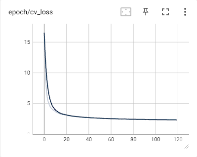
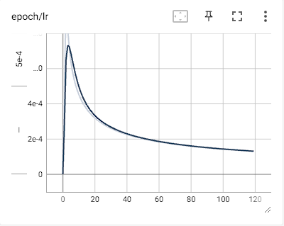
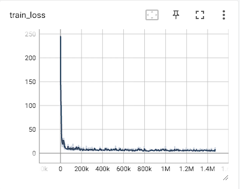
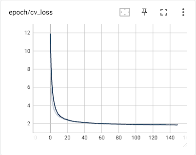
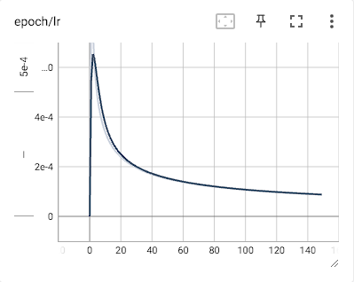
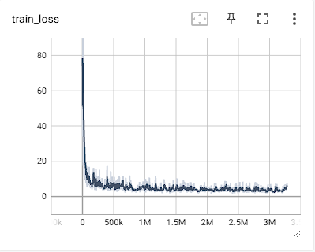
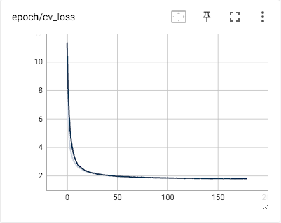
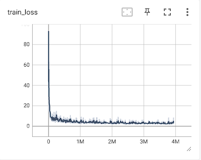

# WeNet 实验小结

## 开源模型

下载地址：https://github.com/wenet-e2e/wenet/blob/main/docs/pretrained_models.en.md

| Datasets | Checkpoint Model                                             |
| -------- | ------------------------------------------------------------ |
| aishell2 | [Conformer](https://wenet-1256283475.cos.ap-shanghai.myqcloud.com/models/aishell2/20210618_u2pp_conformer_exp.tar.gz) |
| multi_cn | [Conformer](https://wenet-1256283475.cos.ap-shanghai.myqcloud.com/models/multi_cn/20210815_unified_conformer_exp.tar.gz) |

## 开源multi_CN数据集

OpenSLR: http://www.openslr.org/resources.php

OpenSLR 是一个致力于托管语音和语言数据集资源的网站，例如用于**语音识别**的训练语料库以及与语音识别相关的软件，目前包含 129 个用于各国语言的 ASR，TTS 数据集。

深度学习的引入极大促进了语音识别技术的发展，数据是训练声学模型的关键。大多数中文语音数据集是商用的，从 2015 年清华大学首次公开了包含 30 多小时音频的 thchs30 数据集开始，陆续有不同规模的中文语音数据集参与到数据开源活动中，下表汇总了目前所有开源中文语音语料库以作参考：

| 数据集           | 内容                                        | 时长（小时） | 训练集大小   | 验证集大小  | 测试集大小   | 录制人 | 标注准确率 | 数据下载                                     |
| ---------------- | ------------------------------------------- | ------------ | ------------ | ----------- | ------------ | ------ | ---------- | -------------------------------------------- |
| aidatatang_200zh | 口语化句子                                  | 200          | 164905 (18G) | 24216(2.5G) | 48144        | 600    | >98%       | [下载](http://openslr.magicdatatech.com/62/) |
| aishell1         | 智能家居、无人驾驶、工业生产等**11**个领域  | 178          | 120418(17G)  | 14331(2.0G) | 7176(1.1G)   | 400    | 98%        | [下载](http://openslr.magicdatatech.com/33/) |
| magicdata        | 互动问答，音乐搜索，SNS信息，家庭指挥和控制 | 755          | 573480(78G)  | 11793(1.7G) | 24279(3.1G)  | 1080   | \>98%      | [下载](http://openslr.magicdatatech.com/68/) |
| primewords       |                                             | 100          | 50384(11G)   | /           | /            | 296    | \>98%      | [下载](http://openslr.magicdatatech.com/47/) |
| stcmds           | 网上语音聊天和智能语音控制                  | 500          | 102600(13G)  | /           | /            | 855    | -          | [下载](http://openslr.magicdatatech.com/38/) |
| thchs            | 主要是新闻                                  | 30           | 10000(2.8G)  | 893(0.259G) | 2495(0.709G) | 40     | -          | [下载](http://openslr.magicdatatech.com/18/) |

总共包含1021000条音频数据，443065394个帧，词汇表有7028个单元

## 模型训练

训练完成的模型可以使用tensorboard查看，如果在容器内运行则需要添加端口映射

```
tensorboard --logdir=./tensorboard --host=0.0.0.0 --port 2001
```

### 训练损失、验证损失和 lr

可以获得训练时的训练损失、验证损失和 lr：

Multi_CN-Small 模型：







Multi_CN-Medium 模型：








Multi_CN-Large 模型：






### Multi_CN 模型参数

| Model        | Conformer(S) | Conformer(M) | Conformer(L) |
| ------------ | ------------ | ------------ | ------------ |
| 参数数目     | 18,110,490   | 48,350,186   | 138,115,818  |
| 编码器层数   | 9            | 12           | 15           |
| 编码器维度   | 144          | 256          | 512          |
| 注意力头数目 | 4            | 4            | 4            |
| 卷积核大小   | 15           | 15           | 15           |
| 解码器层数   | 3            | 6            | 6            |
| epochs       | 120          | 150          | 180          |
| 模型大小     | 70.874MB     | 189.057MB    | 539.737MB    |

## 测试结果

### 测试数据集

| Dataset    | 语音条数 |
| ---------- | -------- |
| Aishell    | 7176     |
| aidatatang | 48144    |
| magicdata  | 24279    |
| thchs      | 2495     |

### 官方提供的 Multi-CN 测试结果

官方下载的multi-cn预训练模型结果，模型结构为Unified Conformer，chunk size为16，模型大小为213.4MB

| Dataset    | attention decoder | ctc greedy search | ctc prefix beam search | attention rescoring |
| ---------- | ----------------- | ----------------- | ---------------------- | ------------------- |
| Aishell    | 1.32%             | 2.73%             | 2.73%                  | 1.71%               |
| aidatatang | 3.78%             | 5.15%             | 5.15%                  | 4.21%               |
| magicdata  | 2.60%             | 3.81%             | 3.79%                  | 2.94%               |
| thchs      | 10.16%            | 11.85%            | 11.85%                 | 10.80%              |

thchs是带噪的测试语音，所以效果较差，且转录文本字数较多，平均一段音频对应30段中文字，而且句子也特别复杂，下面是示例：


如果使用LM模型，使用WFST进行解码，下载官方runtime模型final.zip，测试在不同数据集下的WER:

| Dataset    | WFST   |
| ---------- | ------ |
| Aishell    | 1.80%  |
| aidatatang | 3.34%  |
| magicdata  | 2.04%  |
| thchs      | 11.99% |

词典里面没有英文，对英文的识别能力显著下降

### Multi_CN-Small 测试结果

自己的预训练模型结果

，模型结构为 Unified Conformer, chunk size为16，找到最好的cv loss的模型，采用20次模型平均可以获得更好的效果，模型大小为  70MB，选择的epoch为[119 111 117 118 115 113 114 110 116 112 104 106 102 103 107 109 108 105 95 101]，得到平均后的模型avg_20.pt，然后对其在测试集上进行测试：

| Dataset    | attention decoder | ctc greedy search | ctc prefix beam search | attention rescoring |
| ---------- | ----------------- | ----------------- | ---------------------- | ------------------- |
| Aishell    | 5.44%             | 6.78%             | 6.78%                  | 5.68%               |
| aidatatang | 5.30%             | 6.56%             | 6.56%                  | 5.59%               |
| magicdata  | 3.52%             | 4.50%             | 4.48%                  | 3.69%               |
| thchs      | 13.64%            | 16.11%            | 16.11%                 | 14.77%              |

### Multi_CN-Medium 测试结果

自己的预训练模型结果，模型结构为 Unified Conformer, chunk size为16，找到最好的cv loss的模型，采用25次模型平均可以获得更好的效果，模型大小为189.057MB，选择的epoch为[141 146 147 144 137 148 138 135 136 145 149 140 117 143 142 122 133 131 132 123 127 121 111 124 139]，得到平均后的模型avg_25.pt，然后对其在测试集上进行测试：

| Dataset    | attention decoder | ctc greedy search | ctc prefix beam search | attention rescoring |
| ---------- | ----------------- | ----------------- | ---------------------- | ------------------- |
| Aishell    | 4.40%             | 5.50%             | 5.49%                  | 4.49%               |
| aidatatang | 4.04%             | 5.35%             | 5.34%                  | 4.40%               |
| magicdata  | 2.57%             | 3.52%             | 3.51%                  | 2.82%               |
| thchs      | 13.61%            | 14.57%            | 14.57%                 | 13.29%              |

自己的预训练模型不如下载的可能原因分析：建模单元少了3000（自己的词汇表为7028，官方的为11008），主要体现在对英文模型的建模能力弱了很多。训练数据主要来源于 magicdata，因此在该数据集测试集下的效果较好。

### Multi_CN-Large 测试结果

自己的预训练模型结果，模型结构为 Unified Conformer, chunk size为16，找到最好的cv loss的模型，采用 30 次模型平均可以获得更好的效果，模型大小为 539.737MB，选择的 epoch 为[167 175 172 162 168 142 171 154 140 174 144 177 166 164 165 148 178 141 155 161 134 151 143 150 136 170 117 173 163 138]，得到平均后的模型 avg_30.pt，然后对其在测试集上进行测试：

| Dataset    | attention decoder | ctc greedy search | ctc prefix beam search | attention rescoring |
| ---------- | ----------------- | ----------------- | ---------------------- | ------------------- |
| Aishell    | 4.25%             | 5.36%             | 5.36%                  | 4.36%               |
| aidatatang | 3.66%             | 5.08%             | 5.07%                  | 4.02%               |
| magicdata  | 2.35%             | 3.32%             | 3.30%                  | 2.53%               |
| thchs      | 14.97%            | 15.62%            | 15.62%                 | 14.39%              |

### 4.4 额外实验

- 模型平滑对性能的影响，解码方式选择attention_rescoring

| 数据集  | with Average（30） | last epoch |
| ------- | ------------------ | ---------- |
| AISHELL | 4.57%              | 4.88%      |
| THCHS   | 13.41%             | 14.22%     |

- 量化模型对性能的影响（Runtime模式）JIT模型·：

| 数据集  | quantization(int 8) | FP32 |
| ------- | ------------------- | ---- |
| AISHELL |                     |      |
| THCHS   |                     |      |

- 不同模型在 attention_rescoring 解码方式下的性能对比：

| 模型       | AISHELL | Multi_CN small | Multi_CN medium |
| ---------- | ------- | -------------- | --------------- |
| Aishell    | 4.62%   | 5.59%          | 4.57%           |
| aidatatang | 23.69%  | 5.62%          | 4.36%           |
| magicdata  | 24.88%  | 3.71%          | 2.77%           |
| thchs      | 20.13%  | 14.76%         | 13.41%          |

- 不同模型 with-LM 的性能

| 数据集  | AISHELL | Multi_CN small | Multi_CN medium |
| ------- | ------- | -------------- | --------------- |
| AISHELL |         |                |                 |
| THCHS   |         |                |                 |

## 5、心得记录

**动态bath size和静态batch size**

参考：[动态batch和静态batch的原理和代码详解_少游223的博客-CSDN博客](https://blog.csdn.net/shaoyou223/article/details/122642487)

wenet支持两种batch训练方式

- 第一种是常规的静态batch方案，但当语音长短差异过大时，显存利用率低，同时带来显存oom风险
- 第二种是动态batch方案，不指定batch_size的大小，只限制batch中的最大总帧数，这样就能充分利用显存，同时不会有oom的风险

静态batch代码实现：

```
def static_batch(data, batch_size=16):
    for sample in data:
        buf.append(sample)
        if len(buf) >= batch_size:
            yield buf
            buf = []
    if len(buf) > 0:
        yield buf
```

动态batch代码实现：

```
def dynamic_batch(data, max_frames_in_batch=12000):
    buf = []
    longest_frames = 0
    for sample in data:
        assert 'feat' in sample
        assert isinstance(sample['feat'], torch.Tensor)
        new_sample_frames = sample['feat'].size(0)
        longest_frames = max(longest_frames, new_sample_frames)
        frames_after_padding = longest_frames * (len(buf) + 1)
        if frames_after_padding > max_frames_in_batch:
            yield buf
            buf = [sample]
            longest_frames = new_sample_frames
        else:
            buf.append(sample)
    if len(buf) > 0:
        yield buf
```

**解决爆显存的方法**

1、若采用static_batch训练，减少batch size，对于24G的RTX 4090，需要减少batch size为4；若采用dynamic_batch训练，为了平衡训练速度和显存，设置max_frame_in_batch为24000，这两种方法可以有效解决OOM的问题，但是训练速度会有明显下降

2、减小filter_conf设置项的max_length，减少为20480，对OOM有一定的缓解，但缓解作用不大

3、网上说tensorboard会影响速度，但感觉没啥影响

**训练过程中GPU利用率忽高忽低，有时为0**

把数据集从机械硬盘放到固态硬盘可以有效解决

**Python永久设置路径**

- 当需要import文件夹中的.py文件时，会出现`ModuleNotFoundError: No module named 'wenet'`的报错信息，需要自主添加path：

- 临时添加：sys.path.append()，需要修改代码，且为临时修改，程序退出后需要清空环境变量

- 在site-packet下建立一个wenet_path.pth文件，并添加需要自定义包含引入的路径

```
vim ~/anaconda3/envs/wenet/lib/python3.8/site-packages/wenet_path.pth
```

添加以下内容：

```
/home/lzl/python/wenet/wenet-main
```

核对路径是否添加

```
>>> import sys
>>> sys.path
['', '/home/lzl/anaconda3/envs/wenet/lib/python38.zip', '/home/lzl/anaconda3/envs/wenet/lib/python3.8', '/home/lzl/anaconda3/envs/wenet/lib/python3.8/lib-dynload', '/home/lzl/anaconda3/envs/wenet/lib/python3.8/site-packages', '/home/lzl/python/wenet/wenet-main']
>>> from wenet.dataset.dataset import Dataset
```

没有出现报错信息说明路径已成功添加

**Ubuntu下载多版本的CUDA**

- 下载CUDA Toolkit

  首先去官网https://developer.nvidia.com/cuda-toolkit-archive下载对应版本的 CUDA Toolkit，采用runfile(local)方式

  

  可以得到`cuda**.run`文件

- 安装CUDA

  使用命令安装

```
sudo sh cuda**.run
```

在安装选项中仅安装CUDA Toolkit，其它如驱动、示例等不安装

- 安装cudnn

  进入cudnn官网https://developer.nvidia.com/rdp/cudnn-archive，下载tar包，采用`tar -xf cudnn**.tgz`解压，解压后

```
sudo cp cudnn-linux-x86_64-8.8.1.3_cuda11-archive/include/cudnn.h /usr/local/cuda-11.6/include/
sudo cp cudnn-linux-x86_64-8.8.1.3_cuda11-archive/lib/libcudnn* /usr/local/cuda-11.6/lib64/
sudo chmod a+r /usr/local/cuda-11.6/include/cudnn.h
sudo chmod a+r /usr/local/cuda-11.6/lib64/libcudnn*
```

- 新建环境变量并建立软链接

  - 新建环境变量：

```
# 打开环境变量目录
vim ~/.bashrc

# 添加
export PATH=/usr/local/cuda/bin:$PATH
export LD_LIBRARY_PATH=/usr/local/cuda/lib64:$LD_LIBRARY_PATH
```

环境变量建好后就不用更改了。

- 建立软链接用于CUDA版本自动切换

```
# 删除之前的软链接
sudo rm -rf /usr/local/cuda
# 创建新的cuda软链接
sudo ln -s /usr/local/cuda-11.6 /usr/local/cuda
```


