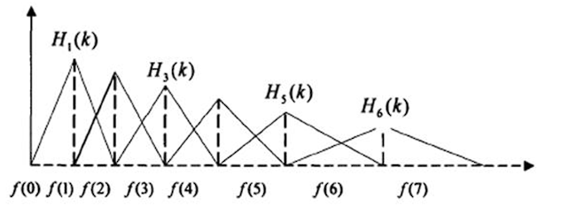

# WeNet 语音识别

## 特征提取

人耳对声音频谱的响应是非线性的，Fbank就是一种前端处理算法，以类似于人耳的方式对音频进行处理，可以提高语音识别的性能。FBank（Filterbank）和MFCC（Mel-Frequency Cepstral Coefficients）都是音频信号处理中常用的特征提取方法，通常用于语音识别和音频处理任务。它们的主要区别在于特征的表示方式和用途。


梅尔滤波器组（Mel Filter Bank）是一组在声学信号处理中常用的滤波器，用于将线性频谱数据映射到梅尔频率尺度下的能量分布。它们的应用在FBank和MFCC特征提取中起着关键作用。

**梅尔滤波器组的构建过程：**

1. **线性频率划分：** 首先，通常将频率轴均匀地分成一系列线性间隔的频率带，这些频率带通常以赫兹（Hz）为单位。

2. **梅尔频率划分：** 梅尔频率是一种与人类听觉感知更相符合的频率划分方式，因此我们希望将线性频率划分映射到梅尔频率上。这个映射过程使用梅尔尺度函数（Mel scale）来完成，通常通过以下公式来计算：
   $$
   M(f) = 2595 * \log_{10}(1 + (f / 700))
   $$
   

   这里，$M(f)$ 是频率 $f$ 的梅尔频率。

3. **滤波器的设计：** 接下来，需要设计一组三角形滤波器，每个滤波器代表了梅尔频率划分下的一个频带。通常，滤波器的中心频率与梅尔频率划分的点对应，滤波器的宽度根据应用的需要进行调整。

4. **滤波器组的应用：** 用这组滤波器对频谱数据进行滤波，计算每个滤波器通道的能量，这样就得到了一组梅尔滤波器组特征。


1. **FBank（Filterbank）特征：**

   - FBank特征是一种基于滤波器组的频谱表示方法。它通过将音频信号分解成不同频率范围内的能量来捕获声音的频谱特性。

   - FBank的计算过程包括以下步骤：

     - 预加重：高频通常与较低频率相比有较小的幅度，提升高频部分，使信号频谱平坦；通过应用一个高通滤波器来平衡音频信号的频谱，减小低频分量的能量。

     - 分帧：将音频信号切分成短时间窗口，通常采用帧长为20-30毫秒的窗口。

     - 傅立叶变换：对每个时间窗口应用傅立叶变换，将时域信号转换为频域信号。

     - 滤波器组应用：计算每个频率范围内的能量，通常使用一组三角滤波器来实现。将功率谱通过一组 Mel 刻度（通常取 40 个滤波器）的三角滤波器来提取频带（模拟人耳对不同频率信号的敏感性不同，低频更具辨别力，高频更不具辨别力），三角滤波器组中每个滤波器都是三角形的，如图所示：

       

     - 对数化：对每个频率范围内的能量取对数，以模拟人耳对声音强度的感知。

   - FBank特征在语音识别中常用于声学建模和特征表示。

2. **MFCC（Mel-Frequency Cepstral Coefficients）特征：**

   - MFCC特征也是一种频谱表示方法，但与FBank不同，它进一步处理了频谱数据以提高其在语音识别任务中的性能。
   - MFCC的计算过程包括以下步骤：
     - 预加重：同样应用高通滤波器。
     - 分帧：将音频信号切分成短时间窗口。
     - 傅立叶变换：将每个时间窗口的信号转换为频域。
     - 滤波器组应用：使用一组三角滤波器将频谱图转换为梅尔频率尺度下的能量。
     - 对数化：对每个滤波器通道的能量取对数。
     - DCT变换：对对数化后的能量应用离散余弦变换，得到MFCC系数。
   - MFCC的主要优点是它捕获了语音信号中的重要频谱特征，并降低了数据的维度，从而在语音识别中有效地减少了计算复杂度。

总的来说，FBank和MFCC都是音频信号处理中常用的特征提取方法，用于将声音数据转换为更具信息性的特征表示，以便于后续的语音识别、音频分类和其他相关任务。

MFCC 实际上就是在 Fbank 的基础上增加了一个离散余弦变换（DCT），捕获了声音的短时频谱信息和梅尔频率分布信息，并具有较高的信息密度。 语音识别在传统 **GMMs-HMMs 框架**中，mfcc 是主流做法，在**深度学习框架**中，已有研究表明 fbank 的性能优于 MFCC。选择使用哪种特征通常取决于具体的应用和任务需求。


## 数据处理流程

data_list_file：返回 `data.list` 的地址，如 `./test/test.list`


dataset：`dataset.list` 返回数据集的 key, wav, txt 三者字典序列，如

```
['{"key": "BAC009S0764W0138", "wav": "/home/lzl/data/open_source/aishell/data_aishell/wav/test/S0764/BAC009S0764W0138.wav", "txt": "成交量环比大幅增加"}', '{"key": "BAC009S0764W0121", "wav": "/home/lzl/data/open_source/aishell/data_aishell/wav/test/S0764/BAC009S0764W0121.wav", "txt": "甚至出现交易几乎停滞的情况"}']
```


processor.parse_raw 操作后：从json格式字符串中解析key, wav, txt和sample_rate等字段，并返回这些信息的字典，`for sample in dataset.source: print(sample['src'])` 返回

```
{'key': 'BAC009S0764W0138', 'txt': '成交量环比大幅增加', 'wav': tensor([[0.0011, 0.0018, 0.0016,  ..., 0.0005, 0.0006, 0.0004]]), 'sample_rate': 16000}
{'key': 'BAC009S0764W0121', 'txt': '甚至出现交易几乎停滞的情况', 'wav': tensor([[ 0.0011,  0.0019,  0.0017,  ..., -0.0002, -0.0002, -0.0002]]), 'sample_rate': 16000}
```

标记化操作后，`for data in dataset: print(data)` 返回

```
{'key': 'BAC009S0764W0138', 'txt': '成交量环比大幅增加', 'wav': tensor([[0.0011, 0.0018, 0.0016,  ..., 0.0005, 0.0006, 0.0004]]), 'sample_rate': 16000, 'tokens': ['成', '交', '量', '环', '比', '大', '幅', '增', '加'], 'label': [1379, 82, 3830, 2407, 1969, 814, 1143, 790, 384]}
{'key': 'BAC009S0764W0121', 'txt': '甚至出现交易几乎停滞的情况', 'wav': tensor([[ 0.0011,  0.0019,  0.0017,  ..., -0.0002, -0.0002, -0.0002]]), 'sample_rate': 16000, 'tokens': ['甚', '至', '出', '现', '交', '易', '几', '乎', '停', '滞', '的', '情', '况'], 'label': [2474, 3116, 331, 2408, 82, 1684, 321, 47, 235, 2199, 2553, 1319, 307]}
```

filter_conf 

resample_conf

speed_perturb

fbank：

```
{'key': 'BAC009S0764W0138', 'label': [1379, 82, 3830, 2407, 1969, 814, 1143, 790, 384], 'feat': tensor([[ 9.9700,  9.4859,  7.7294,  ..., 10.7531, 10.0232,  8.5183],
        [ 8.7889,  8.6868,  5.6897,  ...,  8.9798,  9.8048,  8.7301],
        [ 8.1550,  5.7031,  7.8732,  ...,  8.8939,  9.1575,  8.3101],
        ...,
        [ 8.5359,  9.2060,  8.2756,  ...,  9.7334,  8.7782,  7.4277],
        [ 6.0100,  6.8959,  6.6889,  ...,  9.4693,  9.4506,  7.6894],
        [ 6.9041,  7.1268,  6.6153,  ...,  9.2238,  9.6781,  8.3220]])}
{'key': 'BAC009S0764W0121', 'label': [2474, 3116, 331, 2408, 82, 1684, 321, 47, 235, 2199, 2553, 1319, 307], 'feat': tensor([[10.1612, 10.0174,  8.0100,  ..., 10.3402, 10.2302,  8.2143],
        [ 8.7264,  9.5393,  8.9995,  ...,  9.5964,  9.5112,  8.5175],
        [ 9.3785,  9.1143,  8.4937,  ...,  9.1126,  9.7075,  8.6490],
        ...,
        [11.1994, 10.8889,  8.2860,  ...,  9.0613,  8.8942,  8.1312],
        [11.1128, 10.3942,  5.8071,  ...,  8.5577,  9.2145,  8.4794],
        [ 8.1151,  7.9413,  7.3585,  ...,  8.6954,  8.6922,  8.0730]])}
```

spec_aug、spec_sub、spec_trim：

shuffle、sort

batch，padding：

```

(['BAC009S0764W0121', 'BAC009S0764W0138'], tensor([[[10.1612, 10.0174,  8.0100,  ..., 10.3402, 10.2302,  8.2143],
         [ 8.7264,  9.5393,  8.9995,  ...,  9.5964,  9.5112,  8.5175],
         [ 9.3785,  9.1143,  8.4937,  ...,  9.1126,  9.7075,  8.6490],
         ...,
         [11.1994, 10.8889,  8.2860,  ...,  9.0613,  8.8942,  8.1312],
         [11.1128, 10.3942,  5.8071,  ...,  8.5577,  9.2145,  8.4794],
         [ 8.1151,  7.9413,  7.3585,  ...,  8.6954,  8.6922,  8.0730]],

        [[ 9.9700,  9.4859,  7.7294,  ..., 10.7531, 10.0232,  8.5183],
         [ 8.7889,  8.6868,  5.6897,  ...,  8.9798,  9.8048,  8.7301],
         [ 8.1550,  5.7031,  7.8732,  ...,  8.8939,  9.1575,  8.3101],
         ...,
         [ 0.0000,  0.0000,  0.0000,  ...,  0.0000,  0.0000,  0.0000],
         [ 0.0000,  0.0000,  0.0000,  ...,  0.0000,  0.0000,  0.0000],
         [ 0.0000,  0.0000,  0.0000,  ...,  0.0000,  0.0000,  0.0000]]]), tensor([[2474, 3116,  331, 2408,   82, 1684,  321,   47,  235, 2199, 2553, 1319,
          307],
        [1379,   82, 3830, 2407, 1969,  814, 1143,  790,  384,   -1,   -1,   -1,
           -1]]), tensor([418, 356], dtype=torch.int32), tensor([13,  9], dtype=torch.int32))
```

## 解码

模型识别代码位于：`wenet/bin/recognize.py`

WeNet 提供四种解码方法：注意力解码、CTC 贪婪搜索、CTC 前缀波束搜索和注意力重评分

包含两个 wav 格式音频，对这两个音频进行特征提取，编码器输入 **speech**(batch,maxlen,feat_dim) 和 **speech_length(**batch,) 的格式为：

```
Speech:
tensor([[[10.1612, 10.0174,  8.0100,  ..., 10.3402, 10.2302,  8.2143],
         [ 8.7264,  9.5393,  8.9995,  ...,  9.5964,  9.5112,  8.5175],
         [ 9.3785,  9.1143,  8.4937,  ...,  9.1126,  9.7075,  8.6490],
         ...,
         [11.1994, 10.8889,  8.2860,  ...,  9.0613,  8.8942,  8.1312],
         [11.1128, 10.3942,  5.8071,  ...,  8.5577,  9.2145,  8.4794],
         [ 8.1151,  7.9413,  7.3585,  ...,  8.6954,  8.6922,  8.0730]],

        [[ 9.9700,  9.4859,  7.7294,  ..., 10.7531, 10.0232,  8.5183],
         [ 8.7889,  8.6868,  5.6897,  ...,  8.9798,  9.8048,  8.7301],
         [ 8.1550,  5.7031,  7.8732,  ...,  8.8939,  9.1575,  8.3101],
         ...,
         [ 0.0000,  0.0000,  0.0000,  ...,  0.0000,  0.0000,  0.0000],
         [ 0.0000,  0.0000,  0.0000,  ...,  0.0000,  0.0000,  0.0000],
         [ 0.0000,  0.0000,  0.0000,  ...,  0.0000,  0.0000,  0.0000]]],
       device='cuda:0')
Speech_length:
tensor([418, 356], device='cuda:0', dtype=torch.int32)
```

编码器输出编码向量 **encoder_out**(batch, maxlen, vocab) 和 **encoder_mask**：

```
encoder_out:
tensor([[[-0.6318,  0.1680, -0.1958,  ..., -0.3556,  0.7647,  0.2002],
         [-0.9907,  0.0690,  0.0726,  ..., -0.1478,  0.6845,  0.6363],
         [-0.7811,  0.0324,  0.1467,  ..., -0.0397,  0.6155,  0.5899],
         ...,
         [-0.0701, -0.1026, -0.0237,  ...,  0.0458,  0.0336,  0.0267],
         [-0.0472, -0.0968, -0.0099,  ...,  0.0500,  0.0462,  0.0377],
         [-0.0269, -0.0816, -0.0028,  ...,  0.0752,  0.0419,  0.0402]],

        [[ 0.4415, -2.0940, -0.2651,  ...,  0.7004, -0.4819, -0.8586],
         [ 0.2434, -2.0853, -0.0209,  ...,  0.7715, -0.4453, -0.3800],
         [ 0.0559, -1.5522,  0.0630,  ...,  0.6408, -0.2724, -0.0594],
         ...,
         [-0.2333, -0.2347,  0.3842,  ..., -0.0728,  0.1115,  0.9796],
         [-0.2333, -0.2347,  0.3842,  ..., -0.0728,  0.1115,  0.9796],
         [-0.2333, -0.2347,  0.3842,  ..., -0.0728,  0.1115,  0.9796]]],
       device='cuda:0')

encoder_mask:
tensor([[[ True,  True,  True,  True,  True,  True,  True,  True,  True,  True,
           True,  True,  True,  True,  True,  True,  True,  True,  True,  True,
           True,  True,  True,  True,  True,  True,  True,  True,  True,  True,
           True,  True,  True,  True,  True,  True,  True,  True,  True,  True,
           True,  True,  True,  True,  True,  True,  True,  True,  True,  True,
           True,  True,  True,  True,  True,  True,  True,  True,  True,  True,
           True,  True,  True,  True,  True,  True,  True,  True,  True,  True,
           True,  True,  True,  True,  True,  True,  True,  True,  True,  True,
           True,  True,  True,  True,  True,  True,  True,  True,  True,  True,
           True,  True,  True,  True,  True,  True,  True,  True,  True,  True,
           True,  True,  True]],

        [[ True,  True,  True,  True,  True,  True,  True,  True,  True,  True,
           True,  True,  True,  True,  True,  True,  True,  True,  True,  True,
           True,  True,  True,  True,  True,  True,  True,  True,  True,  True,
           True,  True,  True,  True,  True,  True,  True,  True,  True,  True,
           True,  True,  True,  True,  True,  True,  True,  True,  True,  True,
           True,  True,  True,  True,  True,  True,  True,  True,  True,  True,
           True,  True,  True,  True,  True,  True,  True,  True,  True,  True,
           True,  True,  True,  True,  True,  True,  True,  True,  True,  True,
           True,  True,  True,  True,  True,  True,  True,  True, False, False,
          False, False, False, False, False, False, False, False, False, False,
          False, False, False]]], device='cuda:0')
```

其中 maxlen 表示编码器输出大小为 123，encoder_dim 表示编码器维度为 256。

### 注意力解码

识别代码：

```
hyps, _ = model.recognize(
	feats,
	feats_lengths,
	beam_size=args.beam_size,
	decoding_chunk_size=args.decoding_chunk_size,
	num_decoding_left_chunks=args.num_decoding_left_chunks,
	simulate_streaming=args.simulate_streaming)
```

函数定义代码：

```
def recognize(
    self,
    speech: torch.Tensor,
    speech_lengths: torch.Tensor,
    beam_size: int = 10,
    decoding_chunk_size: int = -1,
    num_decoding_left_chunks: int = -1,
    simulate_streaming: bool = False,
) 
```

初始化候选解码序列 **hyps**(batch * beam) 和候选分数 **scores**(batch * beam)，4232 由 vocab_size(4233)减 1 得到：

```
hyps:
tensor([[4232],
        [4232],
        [4232],
        [4232],
        [4232],
        [4232],
        [4232],
        [4232],
        [4232],
        [4232],
        [4232],
        [4232],
        [4232],
        [4232],
        [4232],
        [4232],
        [4232],
        [4232],
        [4232],
        [4232]], device='cuda:0')

scores:
tensor([[0.],
        [-inf],
        [-inf],
        [-inf],
        [-inf],
        [-inf],
        [-inf],
        [-inf],
        [-inf],
        [-inf],
        [0.],
        [-inf],
        [-inf],
        [-inf],
        [-inf],
        [-inf],
        [-inf],
        [-inf],
        [-inf],
        [-inf]], device='cuda:0')
```

设置标识变量 end_flag，用于跟踪哪些解码序列已经结束，下面是 end_flag 初始化结果

```
end_flag:
tensor([[False],
        [False],
        [False],
        [False],
        [False],
        [False],
        [False],
        [False],
        [False],
        [False],
        [False],
        [False],
        [False],
        [False],
        [False],
        [False],
        [False],
        [False],
        [False],
        [False]], device='cuda:0')
```

第一次 hyps 的更新：

```
tensor([[4232, 2474],
        [4232, 2145],
        [4232, 3967],
        [4232, 1694],
        [4232, 1606],
        [4232, 1543],
        [4232,  428],
        [4232, 1025],
        [4232, 1353],
        [4232, 3457],
        [4232, 1379],
        [4232,   85],
        [4232,   28],
        [4232, 2899],
        [4232,  167],
        [4232,  940],
        [4232,  724],
        [4232, 2425],
        [4232, 1122],
        [4232,  713]], device='cuda:0')
```

第二次 hyps 的更新：

```
tensor([[4232, 2474, 3116],
        [4232, 3967,  356],
        [4232, 2145, 3116],
        [4232, 2474,  356],
        [4232, 1543,  356],
        [4232, 1694, 3116],
        [4232,  428, 3116],
        [4232, 2474, 3447],
        [4232, 2474, 3700],
        [4232, 1606, 3116],
        [4232, 1379,   82],
        [4232, 1379,  427],
        [4232, 1379,  384],
        [4232, 1379, 1018],
        [4232, 1379, 3880],
        [4232, 1379, 1820],
        [4232,   85,   82],
        [4232, 1379, 3796],
        [4232, 1379,  987],
        [4232, 2899,   82]], device='cuda:0')
```

第三次 hyps 的更新：

```
tensor([[4232, 2474, 3116,  331],
        [4232, 3967,  356,  331],
        [4232, 2145, 3116,  331],
        [4232, 2474,  356,  331],
        [4232, 1543,  356,  331],
        [4232, 1694, 3116,  331],
        [4232,  428, 3116,  331],
        [4232, 2474, 3116, 2408],
        [4232, 2474, 3116, 1778],
        [4232, 2474, 3447,  331],
        [4232, 1379,   82, 3830],
        [4232, 1379,   82, 1636],
        [4232, 1379,   82,  124],
        [4232, 1379,   82, 4080],
        [4232, 1379,  427, 3830],
        [4232, 1379,  384, 3830],
        [4232, 1379,   82, 4037],
        [4232, 1379, 1018, 3830],
        [4232, 1379, 3880, 3830],
        [4232, 1379, 1820, 3830]], device='cuda:0')
```

循环结束后，选择最佳 hyps 及其对应的 scores：

```
tensor([[2474, 3116,  331, 2408,   82, 1684,  321,   47,  235, 2199, 2553, 1319,
          307, 4232],
        [1379,   82, 3830, 2407, 1969,  814, 1143,  790,  384, 4232, 4232, 4232,
         4232, 4232]], device='cuda:0')
tensor([-1.4669, -0.7596], device='cuda:0')
```


### CTC 贪婪搜索

识别代码：

```
hyps, _ = model.ctc_greedy_search(
    feats,
    feats_lengths,
    decoding_chunk_size=args.decoding_chunk_size,
    num_decoding_left_chunks=args.num_decoding_left_chunks,
    simulate_streaming=args.simulate_streaming)
```

函数定义代码：

```
def ctc_greedy_search(
    self,
    speech: torch.Tensor,
    speech_lengths: torch.Tensor,
    decoding_chunk_size: int = -1,
    num_decoding_left_chunks: int = -1,
    simulate_streaming: bool = False,
) 
```

计算 CTC 输出的对数概率分布 **ctc_probs** (batch_size, max_len, vocab_size)

```
tensor([[[-2.1300e+01, -4.3652e+01, -2.2847e+01,  ..., -4.4144e+01,
          -4.6541e+01, -4.4118e+01],
         [-8.7973e-05, -5.1651e+01, -2.6533e+01,  ..., -5.0437e+01,
          -5.1987e+01, -5.2143e+01],
         [ 0.0000e+00, -5.8052e+01, -3.2654e+01,  ..., -5.4520e+01,
          -5.3840e+01, -5.8356e+01],
         ...,
         [-6.6757e-06, -2.7019e+01, -1.5894e+01,  ..., -2.1402e+01,
          -2.0570e+01, -2.7004e+01],
         [-6.7949e-06, -2.6998e+01, -1.5951e+01,  ..., -2.1339e+01,
          -2.0650e+01, -2.6991e+01],
         [-8.3446e-06, -2.6951e+01, -1.5641e+01,  ..., -2.1055e+01,
          -2.0529e+01, -2.6948e+01]],

        [[-2.4088e+01, -4.4838e+01, -2.7527e+01,  ..., -4.8582e+01,
          -5.1042e+01, -4.5124e+01],
         [-2.1630e+00, -4.4921e+01, -2.4644e+01,  ..., -4.6835e+01,
          -4.9001e+01, -4.5205e+01],
         [-1.1921e-07, -5.1262e+01, -3.0666e+01,  ..., -4.7500e+01,
          -4.9865e+01, -5.1300e+01],
         ...,
         [-1.6867e-04, -3.0788e+01, -1.1531e+01,  ..., -2.5309e+01,
          -2.4695e+01, -3.0793e+01],
         [-1.6831e-04, -3.0788e+01, -1.1531e+01,  ..., -2.5309e+01,
          -2.4695e+01, -3.0793e+01],
         [-1.6831e-04, -3.0788e+01, -1.1531e+01,  ..., -2.5309e+01,
          -2.4695e+01, -3.0793e+01]]], device='cuda:0')
```

选择每个步长上具有最高对数概率的字符索引 **topk_index** (batch_size, max_len)

```
tensor([[2474,    0,    0,    0,    0,    0,    0,    0,    0,    0,    0,    0,
            0,    0,    0,    0,    0,    0,    0, 3116,    0,    0,    0,    0,
            0,  331,    0,    0,    0,    0,    0, 2408,    0,    0,    0,    0,
            0,    0,   82,    0,    0,    0,    0,    0,    0, 1684,    0,    0,
            0,    0,    0,  321,    0,    0,    0,    0,   47,    0,    0,    0,
            0,    0,  235,    0,    0,    0,    0,    0, 2199,    0,    0,    0,
            0, 2553,    0,    0,    0,    0, 1319,    0,    0,    0,    0,    0,
          307,    0,    0,    0,    0,    0,    0,    0,    0,    0,    0,    0,
            0,    0,    0,    0,    0,    0,    0],
        [1379, 1379,    0,    0,    0,    0,    0,    0,    0,    0,    0,    0,
            0,    0,    0,    0,    0,    0,    0,    0,   82,    0,    0,    0,
            0,    0,    0, 3830, 3830,    0,    0,    0,    0,    0,    0, 2407,
            0,    0,    0,    0,    0,    0, 1969,    0,    0,    0,    0,    0,
          814,  814,    0,    0,    0,    0,    0, 1143,    0,    0,    0,    0,
            0,  790,  790,    0,    0,    0,    0,  384,    0,    0,    0,    0,
            0,    0,    0,    0,    0,    0,    0,    0,    0,    0,    0,    0,
            0,    0,    0,    0,    0,    0,    0,    0,    0,    0,    0,    0,
            0,    0,    0,    0,    0,    0,    0]], device='cuda:0')
```

获得字符索引后，使用掩码填充掩盖的部分得到 **topk_index** (batch_size, max_len)

```
tensor([[2474,    0,    0,    0,    0,    0,    0,    0,    0,    0,    0,    0,
            0,    0,    0,    0,    0,    0,    0, 3116,    0,    0,    0,    0,
            0,  331,    0,    0,    0,    0,    0, 2408,    0,    0,    0,    0,
            0,    0,   82,    0,    0,    0,    0,    0,    0, 1684,    0,    0,
            0,    0,    0,  321,    0,    0,    0,    0,   47,    0,    0,    0,
            0,    0,  235,    0,    0,    0,    0,    0, 2199,    0,    0,    0,
            0, 2553,    0,    0,    0,    0, 1319,    0,    0,    0,    0,    0,
          307,    0,    0,    0,    0,    0,    0,    0,    0,    0,    0,    0,
            0,    0,    0,    0,    0,    0,    0],
        [1379, 1379,    0,    0,    0,    0,    0,    0,    0,    0,    0,    0,
            0,    0,    0,    0,    0,    0,    0,    0,   82,    0,    0,    0,
            0,    0,    0, 3830, 3830,    0,    0,    0,    0,    0,    0, 2407,
            0,    0,    0,    0,    0,    0, 1969,    0,    0,    0,    0,    0,
          814,  814,    0,    0,    0,    0,    0, 1143,    0,    0,    0,    0,
            0,  790,  790,    0,    0,    0,    0,  384,    0,    0,    0,    0,
            0,    0,    0,    0,    0,    0,    0,    0,    0,    0,    0,    0,
            0,    0,    0,    0, 4232, 4232, 4232, 4232, 4232, 4232, 4232, 4232,
         4232, 4232, 4232, 4232, 4232, 4232, 4232]], device='cuda:0')
```

解码结果存在 **hyps** 列表中

```
[[2474, 3116, 331, 2408, 82, 1684, 321, 47, 235, 2199, 2553, 1319, 307], [1379, 82, 3830, 2407, 1969, 814, 1143, 790, 384, 4232]]
```

### CTC 前缀波束搜索

该方法要求批处理大小 batch_size 为 1。

识别代码：

```
hyp, _ = model.ctc_prefix_beam_search(
    feats,
    feats_lengths,
    args.beam_size,
    decoding_chunk_size=args.decoding_chunk_size,
    num_decoding_left_chunks=args.num_decoding_left_chunks,
    simulate_streaming=args.simulate_streaming,
    context_graph=context_graph)
hyps = [hyp]
```

函数定义代码：

```
def ctc_prefix_beam_search(
    self,
    speech: torch.Tensor,
    speech_lengths: torch.Tensor,
    beam_size: int,
    decoding_chunk_size: int = -1,
    num_decoding_left_chunks: int = -1,
    simulate_streaming: bool = False,
    context_graph: ContextGraph = None,
) 
```

计算 CTC 输出的对数概率分布 **ctc_probs** (batch_size, max_len, vocab_size)

```
tensor([[-2.4063e+01, -4.4825e+01, -2.7525e+01,  ..., -4.8585e+01,
         -5.1050e+01, -4.5115e+01],
        [-2.1783e+00, -4.4874e+01, -2.4620e+01,  ..., -4.6767e+01,
         -4.8938e+01, -4.5160e+01],
        [-1.1921e-07, -5.1187e+01, -3.0618e+01,  ..., -4.7398e+01,
         -4.9771e+01, -5.1226e+01],
        ...,
        [-7.3909e-06, -2.6981e+01, -1.5891e+01,  ..., -2.1435e+01,
         -2.0471e+01, -2.6962e+01],
        [-7.3909e-06, -2.6911e+01, -1.5907e+01,  ..., -2.1341e+01,
         -2.0544e+01, -2.6900e+01],
        [-9.1791e-06, -2.6929e+01, -1.5659e+01,  ..., -2.1112e+01,
         -2.0509e+01, -2.6918e+01]], device='cuda:0')

tensor([[-2.1299e+01, -4.3651e+01, -2.2847e+01,  ..., -4.4143e+01,
         -4.6539e+01, -4.4117e+01],
        [-8.7734e-05, -5.1653e+01, -2.6535e+01,  ..., -5.0440e+01,
         -5.1989e+01, -5.2145e+01],
        [ 0.0000e+00, -5.8048e+01, -3.2652e+01,  ..., -5.4516e+01,
         -5.3836e+01, -5.8352e+01],
        ...,
        [-6.6757e-06, -2.7019e+01, -1.5894e+01,  ..., -2.1402e+01,
         -2.0571e+01, -2.7004e+01],
        [-6.7949e-06, -2.6998e+01, -1.5951e+01,  ..., -2.1339e+01,
         -2.0650e+01, -2.6991e+01],
        [-8.3446e-06, -2.6951e+01, -1.5642e+01,  ..., -2.1055e+01,
         -2.0530e+01, -2.6948e+01]], device='cuda:0')
```

波束剪枝，遍历每个语音片段，寻找前 k 个最佳前缀 **top_k_index** (beam_size, )：

```
第一个时间步：tensor([1379, 1421,  764, 1919,    0,  940, 2812, 2425, 2739, 3963],
       device='cuda:0')
第二个时间步：tensor([1379,    0,  764, 1421, 1919,  940,    2, 2553, 3065,   28],
       device='cuda:0')
最后一个时间步：tensor([   0, 2553,   66,    2,  254,   42,  120,   28, 1237, 1186],
       device='cuda:0')
```

经过前缀波束搜索后得到假设 **hyps**（beam_size,）

```
[((1379, 82, 3830, 2407, 1969, 814, 1143, 790, 384), -0.00011378468880136449), 
((1379, 82, 3830, 2407, 1969, 814, 1143, 790, 384, 2553), -11.856218962672214), 
((1379, 82, 3830, 2407, 1969, 814, 1143, 790, 384, 66), -12.448713814140383), 
((1379, 2553, 82, 3830, 2407, 1969, 814, 1143, 790, 384), -12.709843718102267), 
((1379, 3830, 2407, 1969, 814, 1143, 790, 384), -13.568634473983272), 
((1379, 82, 3830, 2407, 1969, 814, 1143, 2553, 790, 384), -13.764553746934688), 
((1379, 82, 2553, 3830, 2407, 1969, 814, 1143, 790, 384), -13.783328885289707), 
((1379, 82, 3830, 2553, 2407, 1969, 814, 1143, 790, 384), -13.793682185676309), 
((1379, 82, 3830, 2407, 1969, 2553, 814, 1143, 790, 384), -14.28625919563268), 
((1379, 82, 3830, 2407, 1969, 814, 1143, 1143, 790, 384), -14.324534298249587)]
2023-09-13 12:20:27,185 INFO BAC009S0764W0138 成交量环比大幅增加
```

CTC 前缀波束搜索相较于 CTC 波束搜索主要是将重复标记和空白标记进行合并

beam_size 等于 1 时 CTC 波束搜索就是 CTC 贪婪搜索

### 注意力重评分

注意力重评分解码方法需要利用到 CTC 前缀波束搜索解码的输出 **hyps**(长度为 beam_size) 和 **encoder_out**(维度为[1,maxlen,encoder_dim])，然后对候选序列进行填充，每个序列填充到最大填充长度 **hyps_pad**(beam_size, max_hyps_len) 并获得 **hyps_lens**。

```
tensor([[1379,   82, 3830, 2407, 1969,  814, 1143,  790,  384,   -1],
        [1379,   82, 3830, 2407, 1969,  814, 1143,  790,  384, 2553],
        [1379,   82, 3830, 2407, 1969,  814, 1143,  790,  384,   66],
        [1379, 2553,   82, 3830, 2407, 1969,  814, 1143,  790,  384],
        [1379, 3830, 2407, 1969,  814, 1143,  790,  384,   -1,   -1],
        [1379,   82, 3830, 2407, 1969,  814, 1143, 2553,  790,  384],
        [1379,   82, 2553, 3830, 2407, 1969,  814, 1143,  790,  384],
        [1379,   82, 3830, 2553, 2407, 1969,  814, 1143,  790,  384],
        [1379,   82, 3830, 2407, 1969, 2553,  814, 1143,  790,  384],
        [1379,   82, 3830, 2407, 1969,  814, 1143, 1143,  790,  384]],
       device='cuda:0')
```

然后复制**encoder_out**，维度变为[beam_size,maxlen,encoder_dim]

将 encoder_out, encoder_mask, hyps_pad, hyps_lens 送入到解码器中，获得解码器输出 **decoder_out**，维度为(beam_size,max_hyps_len,vocab_size)

计算重评分解码器分数：

```
score += decoder_out[i][j][w]
```

表示第 i 个候选序列，第 j 个字在词汇表 w 位置的解码器输出

最终返回 **hyps[best_index]**:

```
(1379, 82, 3830, 2407, 1969, 814, 1143, 790, 384)
```

