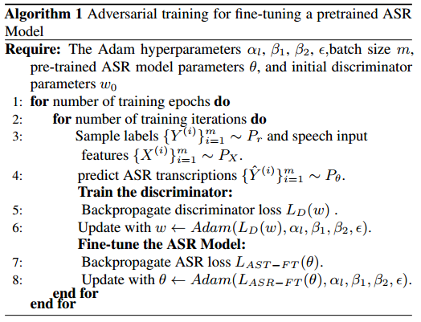
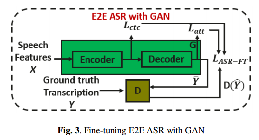
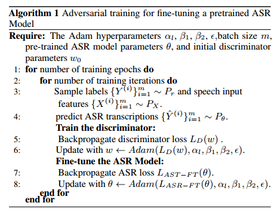

# 1-Fine-Tuning Of Pre-trained end-to-end Speech Recognition With Generative Adversarial Networks

论文链接：https://arxiv.org/pdf/2103.13329.pdf

​	使用GAN微调预训练ASR模型，其中ASR模型充当生成器，鉴别器试图将ASR模型输出（软分布向量）与真实数据分开。由于ASR模型是预训练的，假设ASR模型输出有助于从鉴别器获取更高的分数，并使鉴别器在我们的GAN框架内更难，反过来提高ASR模型在微调阶段的性能。

​	使用额外对抗损失对预训练ASR模型进行对抗性微调，实验表明，提出的方法优于benchmark和传统的基于GAN的对抗性模型

​	GAN已经被广泛应用于语音增强和语音去混响，GAN的对抗性训练从未被探索用于大型配对语料库。

​	微调的E2E ASR模型是使用大型配对语料库预训练的。首先使用交叉熵和CTC loss对ASR网络进行训练，以学习真实的数据分布，训练后ASR模型将给出更平滑的软输出表示，这可以帮助训练更强的鉴别器以提高ASR模型的性能。

## 1、方法

- 生成训练

  ASR模型充当以语音信号为条件的生成器，预测相应的转录文本。鉴别器试图区分真实转录和ASR转录。在训练过程中，对真实转录给予更高的分数，对ASR转录给予更低的分数。本文采用生成训练微调预训练E2E ASR模型，其中使用sequence-to-sequence和CTC loss进行训练。ASR模型微调期间，鉴别器参数是固定的，ASR模型通过额外的对抗性损失进行训练，并生成ASR转录以欺骗鉴别器（即从鉴别器中获得更高的分数）。ASR模型和鉴别器交替训练，并相互学习。算法1描述了用于预训练ASR模型的对抗微调算法，下面将描述鉴别器和ASR网络体系架构。

  

- 鉴别网络

  鉴别网络的输入是ground-truth和ASR输出转录，它返回标量$s$作为质量分数(quality score)，鉴别网络示例如图所示：

  

  \
图1 鉴别网络

  首先通过线性变换将真实文本或ASR输出映射到较低的维度（128），然后应用128核，核大小为2x1，步长为1的两个CNN1D层提取每个时间索引的特征，在层之间应用batch norm，最后在时间轴上计算平均特征，然后将其映射到具有线性投影的单个标量值。

  为了训练鉴别器，引入Wasserstein GAN方法作为改进版本，还引入梯度惩罚。鉴别器用于估计ground-truth转录

- ASR架构

  提出的方法可以适用于任何ASR网络架构。本文使用基于transformer的网络架构，联合CTC和注意力，模型架构示意如图2所示：

  

  \
图2 ASR模型架构

  鉴别器是将$\hat{Y}$作为输入。

- 使用GAN微调ASR模型

  在图3中，预训练ASR模型采用编码器-解码器架构，充当GAN网络的生成器G，鉴别器D试图将ASR转录与Ground Truth区分开，由于ASR模型是预训练的，鉴别器不能很容易区分这两种转录，这有助于训练更强的鉴别器。鉴别器和生成器是交替训练。
  

  \
图3 使用GAN微调ASR模型

  算法1解释了对抗性训练的微调过程：

  

## 2、实验结果

​	采用LibriSpeech数据集进行实验。

  

