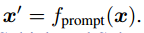
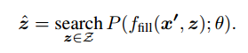
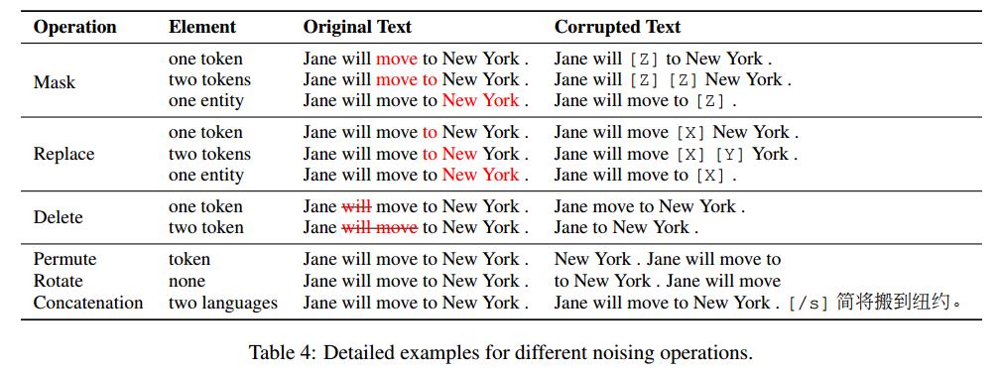
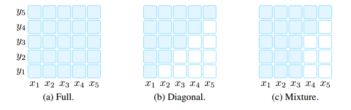
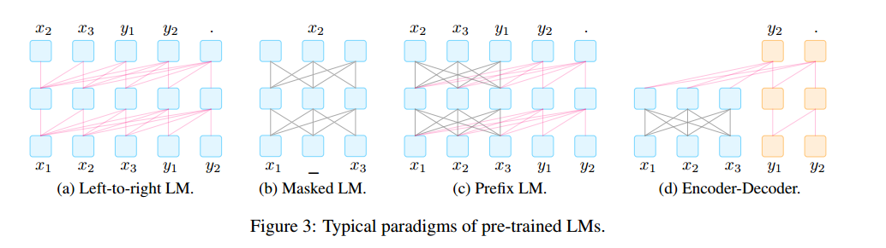

# 预训练、提示和预测：自然语言处理中提示方法的系统调研

本文提出了“基于提示的学习”

传统的监督学习训练模型接受输入 x 并将输出 y 预测为 P（y|x），基于提示的学习基于语言模型，直接对文本概率建模。为了使用这些模型来执行预测任务，使用模板将原始输入 x 修改为具有一些未填充槽的文本字符串提示 x'，然后使用语言模型来概率性地填充未填充的信息，以获得最终字符串 x^，从中可以导出最终输出 y

它允许对大量原始文本进行语言模型的预训练，并且通过定义新的提示函数，该模型能够执行很少的搜索甚至零样本学习，适应很少或没有标记数据的新场景

## NLP 两次变化

NLP 演进框架

然而，从2017-2019年开始，NLP模型的学习发生了翻天覆地的变化，这种完全监督的范式现在发挥着越来越小的作用。

具体而言，标准转向了预训练和微调范式。具有固定架构的模型被预先训练为语言模型（LM），预测观察到的文本数据的概率可以在大型数据集上训练这些 LMs，在学习建模语言的健壮通用特征的过程中。然后，通过引入额外的参数并使用特定任务的目标函数对其进行微调，将上述预训练的LM适应于不同的下游任务。在这种模式下，重点主要转向目标工程（objective engineering），设计预训练和微调阶段的训练目标。张等人（2020a）表明，引入预测文档中显著句子的损失函数将导致更好的文本摘要预训练模型，值得注意的是，预先训练的LM的主体通常也进行了微调，使其更适合解决下游任务。

在**预训练+提示+预测**范式下，不是通过目标工程使预先训练的LM适应下游任务，而是在文本提示的帮助下重新制定下游任务，使其看起来更像原始LM训练期间解决的任务。通过选择适当的提示，我们可以操纵模型行为，以便预训练的LM本身可以用于预测期望的输出。这种方法强调提示工程的重要性，找到了最合适的提示，允许LM解决手头的任务。

## 提示的通用描述

在自监督学习中，为了学习该模型的参数θ，我们使用包含输入和输出对的数据集，并训练模型来预测该条件概率 $P(y|x;\theta)$。主要问题是，为了训练模型，有必要为任务提供监督数据，而对于许多任务来说，这些数据是无法大量找到的。

基于提示的方法是用语言模型对文本 $x$ 本身的概率 $P(x;\theta)$ 进行建模，并使用该概率来预测 y，从而减少或消除对大型监督数据集的需求。具体来说，基本提示分三步预测得分最高的 y：

- 提示添加：Prompt Addition

  应用提示函数将输入文本转换为提示：，该函数由两个步骤组成：

  1. 应用一个模板（[X] The movie is [Z]），它是一个有两个槽的文本字符串：一个用于输入X的输入槽[X]（"I love this movie"），一个用于中间生成的答案文本Z的答案槽[Z]（"great", "fantastic"），该文本稍后将映射到y中。
  2. 用输入文本X填充槽[X]

  值得注意的是，上面的提示将在提示的中间或结尾有一个空槽来填充z，称该提示为完型词提示；在输入文本完全位于z之前的第二种提示则称为前缀提示。[X]槽的数量和[Z]槽的数量可以根据手头任务的需要灵活更改。模板词不一定由自然语言表征组成；它们可以是后来嵌入连续空间的虚拟单词（例如，用数字id表示），一些提示方法甚至直接生成连续向量。

- 答案搜索：Answer Search

  接下来搜索使 LM 得分最大化的文本答案。在生成任务的情况下，Z可以是整个语言的范围；在分类的情况下可以是语言中单词的一个子集。我们通过使用预先训练的LM P（·；θ）计算其相应的填充提示的概率来搜索潜在答案集z

  

  该搜索函数可以是搜索最高得分输出的argmax搜索，也可以是根据LM的概率分布随机生成输出的采样。

- 答案映射：Answer Mapping

  最后，我们想从得分最高的答案z Plot到得分最高的输出y Plot，

提示的设计有许多注意事项：

- 预先训练模型选择
- 提示工程
- 答案工程
- 扩展范式
- 基于提示的训练策略

## 预训练语言模型

许多调查已经表明预训练 LM 在预训练和微调范式中对 NLP 产生了巨大的影响

### 训练目标

预训练的LM的主要训练目标几乎总是由预测文本x的概率的某种目标组成。

- 标准语言模型（SLM）：训练模型以优化来自训练语料库的文本的概率P（x），文本通常以自回归的方式进行预测，一次预测序列中的标记。这通常是从左到右进行的（如下所述），但也可以按其他顺序进行。SLM 一个流行的替代方案是去噪目标，将一些噪声函数应用于输入句子，然后在给定该噪声文本P（x|x~）的情况下尝试预测原始输入句子。
- 损坏文本重建（CTR）：通过仅计算输入句子的噪声部分的损失，将处理后的文本恢复到未损坏的状态。
- 全文重建（FTR）：这些目标通过计算整个输入文本的损失来重建文本，无论它是否被噪声处理

从左到右的自回归LMs可能特别适合前缀提示，而重建目标可能更适合完形填空提示。主要训练目标对特定的提示任务起着至关重要的作用。

### 噪声函数

表 4 介绍了几种类型的噪声函数，可以通过控制噪声的类型以结合先验知识

**Masking** 文本将在不同级别被掩蔽，用[MASK]等特殊令牌替换令牌或多令牌跨度；**Replacement** 类似于掩蔽，只是令牌或多令牌跨度不是用[MASK]替换的，而是另一个令牌或信息片段；**Delete** 在不添加[MASK]或任何其他令牌的情况下，将从文本中删除令牌或多令牌跨度，此操作通常与FTR损失一起使用；**Permutation** 置换首先将文本划分为不同的跨度（标记、子句跨度或句子），然后将这些跨度置换为新的文本。

### 表征方向性

- 左到右：每个单词的表示是根据单词本身和句子中所有以前的单词来计算的。
- 双向：每个单词的表示是根据句子中的所有单词计算的，包括当前单词左侧的单词。

除了上面两个最常见的方向性之外，还可以将这两种策略混合在一个模型中。通常通过注意力掩码实现这些策略

### 典型预训练方法

左到右自回归 LM：用于预测即将到来的单词或将概率P（x）分配给单词序列x=x1，···，xn，这是许多提示方法采用的流行骨干

掩码语言模型：当重点转移到为诸如分类之类的下游任务生成最佳表示时，一个流行的双向目标函数是掩蔽语言模型，该模型旨在基于包围的上下文预测掩蔽文本片段。例如，P（xi |x1，…，xi−1，xi+1，…，xn）表示给定周围上下文的单词xi的概率。通常最适合自然语言理解或分析任务（例如，文本分类、自然语言推理和提取式问答），这些任务通常相对容易被重新表述为完形填空题

前缀和编码器解码器：对于条件文本生成任务，如翻译和摘要，其中给定输入文本x=x1，···，xn，并且目标是生成目标文本y，我们需要一个预训练的模型，该模型既能对输入文本进行编码，又能生成输出文本。使用具有完全连接掩码的编码器首先对源x进行编码，然后（2）自回归地（从左到右）对目标y进行解码。

最近的研究表明，其他非生成任务，如信息提取、问题回答和文本生成评估，可以通过提供适当的提示来重新表述为生成问题。因此，提示方法（i）扩大了这些面向生成的预训练模型的适用性。

## 提示工程