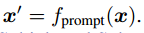
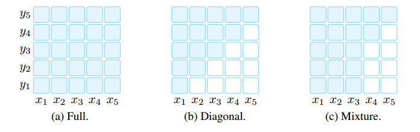
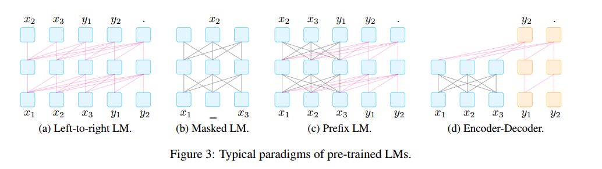

# 预训练、提示和预测：自然语言处理中提示方法的系统调研

本文对自然语言处理中的一种新范式进行了调查和组织，我们称之为“**基于提示的学习**”。与传统的监督学习不同，传统监督学习将模型训练为接收输入 x 并预测输出 y，即 P(y|x)。而基于提示的学习是基于语言模型，直接对文本的概率进行建模。为了使用这些模型执行预测任务，原始输入 x 被修改成一个文本字符串提示 x0，其中包含一些未填充的占位符，然后语言模型被用来以概率方式填充未填充的信息，得到最终的字符串 xˆ，从而可以推导出最终的输出 y。这个框架之所以强大和吸引人，有几个原因：它允许语言模型在大量原始文本上进行预训练，并通过定义新的**提示函数**，模型能够进行少样本甚至零样本学习，适应新的场景，而无需大量标记的数据。在本文中，我们介绍了这一有前途的范式的基础知识，描述了一套统一的数学符号，可以涵盖各种现有工作，同时还按照多个维度组织了现有的工作，例如预训练模型的选择、提示和调优策略等。为了让这一领域更容易接触对此感兴趣的初学者，我们不仅对现有工作进行了系统回顾和高度结构化的基于提示的概念分类，还发布了其他资源，例如包含不断更新的综述的网站 NLPedia–Pretrain 和论文列表。

英文名：Pre-train, Prompt, and Predict A Systematic Survey of Prompting Methods in Natural Language Processing

论文连接：https://arxiv.org/abs/2107.13586

## NLP 两次变化

NLP 演进框架

然而，从2017-2019年开始，NLP模型的学习发生了翻天覆地的变化，这种完全监督的范式现在发挥着越来越小的作用。

具体而言，标准转向了预训练和微调范式。具有固定架构的模型被预先训练为语言模型（LM），预测观察到的文本数据的概率可以在大型数据集上训练这些 LMs，在学习建模语言的健壮通用特征的过程中。然后，通过引入额外的参数并使用特定任务的目标函数对其进行微调，将上述预训练的LM适应于不同的下游任务。在这种模式下，重点主要转向目标工程（objective engineering），设计预训练和微调阶段的训练目标。张等人（2020a）表明，引入预测文档中显著句子的损失函数将导致更好的文本摘要预训练模型，值得注意的是，预先训练的LM的主体通常也进行了微调，使其更适合解决下游任务。

在**预训练+提示+预测**范式下，不是通过目标工程使预先训练的LM适应下游任务，而是在文本提示的帮助下重新制定下游任务，使其看起来更像原始LM训练期间解决的任务。通过选择适当的提示，我们可以操纵模型行为，以便预训练的LM本身可以用于预测期望的输出。这种方法强调提示工程的重要性，找到了最合适的提示，允许LM解决手头的任务。

## 提示的通用描述

在自监督学习中，为了学习该模型的参数θ，我们使用包含输入和输出对的数据集，并训练模型来预测该条件概率 $P(y|x;\theta)$。主要问题是，为了训练模型，有必要为任务提供监督数据，而对于许多任务来说，这些数据是无法大量找到的。

基于提示的方法是用语言模型对文本 $x$ 本身的概率 $P(x;\theta)$ 进行建模，并使用该概率来预测 y，从而减少或消除对大型监督数据集的需求。具体来说，基本提示分三步预测得分最高的 y：

- 提示添加：Prompt Addition

  应用提示函数将输入文本转换为提示：，该函数由两个步骤组成：

  1. 应用一个模板（[X] The movie is [Z]），它是一个有两个槽的文本字符串：一个用于输入X的输入槽[X]（"I love this movie"），一个用于中间生成的答案文本Z的答案槽[Z]（"great", "fantastic"），该文本稍后将映射到y中。
  2. 用输入文本X填充槽[X]

  值得注意的是，上面的提示将在提示的中间或结尾有一个空槽来填充z，称该提示为完型词提示；在输入文本完全位于z之前的第二种提示则称为前缀提示。[X]槽的数量和[Z]槽的数量可以根据手头任务的需要灵活更改。模板词不一定由自然语言表征组成；它们可以是后来嵌入连续空间的虚拟单词（例如，用数字id表示），一些提示方法甚至直接生成连续向量。

- 答案搜索：Answer Search

  接下来搜索使 LM 得分最大化的文本答案。在生成任务的情况下，Z可以是整个语言的范围；在分类的情况下可以是语言中单词的一个子集。我们通过使用预先训练的LM P（·；θ）计算其相应的填充提示的概率来搜索潜在答案集z

  

  该搜索函数可以是搜索最高得分输出的argmax搜索，也可以是根据LM的概率分布随机生成输出的采样。

- 答案映射：Answer Mapping

  最后，我们想从得分最高的答案z Plot到得分最高的输出y Plot，

提示的设计有许多注意事项：

- 预先训练模型选择
- 提示工程
- 答案工程
- 扩展范式
- 基于提示的训练策略

## 预训练语言模型

许多调查已经表明预训练 LM 在预训练和微调范式中对 NLP 产生了巨大的影响

### 训练目标

预训练的LM的主要训练目标几乎总是由预测文本x的概率的某种目标组成。

- 标准语言模型（SLM）：训练模型以优化来自训练语料库的文本的概率P（x），文本通常以自回归的方式进行预测，一次预测序列中的标记。这通常是从左到右进行的（如下所述），但也可以按其他顺序进行。SLM 一个流行的替代方案是去噪目标，将一些噪声函数应用于输入句子，然后在给定该噪声文本P（x|x~）的情况下尝试预测原始输入句子。
- 损坏文本重建（CTR）：通过仅计算输入句子的噪声部分的损失，将处理后的文本恢复到未损坏的状态。
- 全文重建（FTR）：这些目标通过计算整个输入文本的损失来重建文本，无论它是否被噪声处理

从左到右的自回归LMs可能特别适合前缀提示，而重建目标可能更适合完形填空提示。主要训练目标对特定的提示任务起着至关重要的作用。

### 噪声函数

表 4 介绍了几种类型的噪声函数，可以通过控制噪声的类型以结合先验知识

**Masking** 文本将在不同级别被掩蔽，用[MASK]等特殊令牌替换令牌或多令牌跨度；**Replacement** 类似于掩蔽，只是令牌或多令牌跨度不是用[MASK]替换的，而是另一个令牌或信息片段；**Delete** 在不添加[MASK]或任何其他令牌的情况下，将从文本中删除令牌或多令牌跨度，此操作通常与FTR损失一起使用；**Permutation** 置换首先将文本划分为不同的跨度（标记、子句跨度或句子），然后将这些跨度置换为新的文本。

### 表征方向性

- 左到右：每个单词的表示是根据单词本身和句子中所有以前的单词来计算的。
- 双向：每个单词的表示是根据句子中的所有单词计算的，包括当前单词左侧的单词。

除了上面两个最常见的方向性之外，还可以将这两种策略混合在一个模型中。通常通过注意力掩码实现这些策略

### 典型预训练方法

左到右自回归 LM：用于预测即将到来的单词或将概率P（x）分配给单词序列x=x1，···，xn，这是许多提示方法采用的流行骨干

掩码语言模型：当重点转移到为诸如分类之类的下游任务生成最佳表示时，一个流行的双向目标函数是掩蔽语言模型，该模型旨在基于包围的上下文预测掩蔽文本片段。例如，P（xi |x1，…，xi−1，xi+1，…，xn）表示给定周围上下文的单词xi的概率。通常最适合自然语言理解或分析任务（例如，文本分类、自然语言推理和提取式问答），这些任务通常相对容易被重新表述为完形填空题

前缀和编码器解码器：对于条件文本生成任务，如翻译和摘要，其中给定输入文本x=x1，···，xn，并且目标是生成目标文本y，我们需要一个预训练的模型，该模型既能对输入文本进行编码，又能生成输出文本。使用具有完全连接掩码的编码器首先对源x进行编码，然后（2）自回归地（从左到右）对目标y进行解码。

最近的研究表明，其他非生成任务，如信息提取、问题回答和文本生成评估，可以通过提供适当的提示来重新表述为生成问题。因此，提示方法（i）扩大了这些面向生成的预训练模型的适用性。

## 提示工程

提示工程是创建提示函数fprompt（x）的过程，该函数可在下游任务上产生最有效的性能。

### 提示形——Prompt Shape

提示主要有两种：完形填空提示，填补了文本字符串的空白；前缀提示，它延续了字符串前缀。选择哪一个将取决于任务和用于解决任务的模型。一般来说，对于与生成有关的任务，或者使用标准自回归LM解决的任务，前缀提示往往更有利于，因为它们与模型的从左到右的性质很好地吻合。对于使用掩蔽LMs解决的任务，完形填空提示非常适合，因为它们与训练前任务的形式非常匹配。

### 手动模板工程——Manual Template Engineering

创建提示的一种自然的方式是手动创建直观的模板。例如，开创性的LAMA数据集（Petroni等人，2019）提供了手动创建的完形填空模板，以探究LMs中的知识。Brown等人（2020）创建了手工制作的前缀提示，以处理各种任务，包括用于常识推理的问答、翻译和探究任务。

### 自动模板学习——Automated Template Learning

手动创建模板目前存在的几个问题：（1）创建和尝试这些提示是一门需要时间和经验的艺术，尤其是对于一些复杂的任务，如语义解析（2）即使是经验丰富的提示设计者也可能无法手动发现最佳提示。为了解决这些问题，已经提出了许多方法来自动化模板设计过程。提示可以进一步分为离散提示和连续提示，离散提示通常是一个熟悉的字符串，而连续提示则是被直接描述在底层 LM 的嵌入空间中。

另一个正交设计考虑因素是提示函数fprompt（x）是静态的，对每个输入使用基本相同的提示模板；还是动态的，为每个输入生成自定义模板。静态和动态策略适应于不同类型的离散和连续提示

离散提示（又称硬提示），自动搜索在离散空间中描述的模板，通常对应于自然语言短语。涉及的方法包括**提示挖掘**、**提示释义**、**基于梯度的搜索**、**提示生成**和**提示评分**。

基于挖掘的方法可以在给定一组训练输入x和输出y的情况下自动找到模板，该方法在大型文本语料库（如维基百科）中搜索包含x和y的字符串，并找到输入和输出之间的中间词或依赖路径。基于释义的方法采用现有的种子提示（例如手动构建或挖掘），并将其转换为一组其他候选提示，然后选择在目标任务上实现最高训练精度的提示（语言翻译、同义词短语替换、提示神经网络）。基于梯度的搜索寻找短序列，该短序列可以触发底层的预训练LM来生成期望的目标预测，这个搜索是以迭代的方式完成的，在提示中逐步遍历标记。提示评分首先手工制作一组模板作为潜在的候选者，并填充输入和回答槽以形成填充的提示。然后，他们使用单向LM对这些填充的提示进行评分，选择LM概率最高的提示。这将为每个单独的输入生成自定义模板。

因为提示构造的目的是找到一种允许LM有效执行任务的方法，而不是供人类使用，所以没有必要将提示限制为人类可解释的自然语言。直接在模型的嵌入空间中执行提示的连续提示（也称为软提示）。具体来说，连续提示消除了两个约束：（1）放宽了模板词嵌入为自然语言（如英语）词嵌入的约束。（2） 取消模板由预先训练的LM参数参数化的限制。相反，模板有自己的参数，可以根据下游任务的训练数据进行调整。下面我们重点介绍几种有代表性的方法。涉及的方法包括**前缀调整**、**离散提示初始化调整**、**软硬混合调整**。

前缀调整（Li和Liang，2021）是一种在输入中预先准备一系列连续的任务特定向量，同时保持LM参数冻结的方法。数学表达：

与使用真实单词的离散提示相比，这种基于前缀的连续学习在低数据设置下对不同的初始化更敏感。

还有一些方法可以使用已经使用离散提示搜索方法创建或发现的提示来初始化对连续提示的搜索。首先使用离散搜索方法定义模板，根据发现的提示初始化虚拟令牌，然后微调嵌入以提高任务准确性。好处是使用手动模板进行初始化可以为搜索过程提供更好的起点。使用训练样本联合学习每个模板的权重和参数。他们使用的初始模板集要么是手工制作的，要么是使用“提示挖掘”方法获得的。

对于软硬混合调整，这些方法不是使用纯可学习的提示模板，而是在硬提示模板中插入一些可调嵌入。例如著名的**P-tuning**，即通过在嵌入的输入中插入可训练变量来学习连续提示。Han等人（2021）提出了使用规则的提示调整（PTR），该方法使用手工制作的子模板来使用逻辑规则组成完整的模板。为了增强生成模板的表示能力，他们还插入了几个虚拟令牌，这些令牌的嵌入可以使用训练样本与预训练的LMs参数一起调整。PTR中的模板令牌同时包含实际令牌和虚拟令牌。

## 答案工程

与提示工程不同，后者设计了适用于提示方法的合适输入，答案工程旨在寻找答案空间 Z 和映射到原始输出 Y 的方法，以实现有效的预测模型。图1的“答案工程”部分说明了进行答案工程时必须考虑的两个维度：确定答案形式和选择答案设计方法。

### 答案形式——Answer Shape

答案的形式表征了其粒度。一些常见的选择包括：

- 标记（Tokens）：预训练语言模型词汇表中的一个标记，或词汇表的一个子集。
- 范围（Span）：一个短的多标记范围。通常与填空提示一起使用。
- 句子（Sentence）：一句话或文档。通常与前缀提示一起使用。

实际上，如何选择可接受答案的形式取决于我们要执行的任务。在分类任务中，如情感分类（例如 Yin 等人，2019）中，令牌或文本范围的答案空间被广泛使用，但也用于其他任务，如关系抽取（Petroni 等人，2019）或命名实体识别（Cui 等人，2021）。在语言生成任务中通常使用更长的短语或句子答案（Radford 等人，2019），但也用于其他任务，如多项选择题回答（其中多个短语的得分相互比较；Khashabi 等人，2020）中。

### 答案空间设计方法——Answer Space Design Methods

接下来要回答的问题是如何设计适当的答案空间 Z，以及如果答案不被用作最终输出时，如何映射到输出空间 Y。

#### 手动设计

在手动设计中，潜在答案空间 Z 及其与 Y 的映射是由感兴趣的系统或基准设计者手动精心设计的。有多种策略可以用来进行这种设计。

**不受限制空间**：在许多情况下，答案空间 Z 是所有标记的空间（Petroni 等人，2019）、固定长度的范围（Jiang 等人，2020a）或标记序列（Radford 等人，2019）。在这些情况下，最常见的是直接使用恒等映射将答案 z 映射到最终的输出 y。

**受限空间**：然而，也存在一些情况，可能输出的空间是受限制的。这通常用于具有有限标签空间的任务，如文本分类、实体识别或多项选择题回答。举一些例子，Yin 等人（2019）手动设计了与相关主题（“健康”、“金融”、“政治”、“体育”等）、情感（“愤怒”、“喜悦”、“悲伤”、“恐惧”等）或输入文本的其他方面相关的单词列表，以进行分类。Cui 等人（2021）手动设计了用于命名实体识别任务的诸如“人物”、“地点”等的列表。在这些情况下，需要存在答案 Z 与底层类别 Y 之间的映射关系。

就多项选择题回答而言，通常会使用语言模型计算在多个选项中选择某个输出的概率，Zweig 等人（2012）是早期的一个例子。

#### 离散答案搜索

与手动创建提示一样，手动创建答案可能不够理想，以使语言模型实现最佳的预测性能。因此，一些工作致力于自动答案搜索，尽管相对于搜索理想提示的工作来说较少。这些工作涉及离散答案空间（本节）和连续答案空间（下一节）。

**答案改写**：从初始答案空间 Z0 开始，然后使用改写来扩展此答案空间以扩大其覆盖范围（Jiang 等人，2020b）。给定一个答案和输出的对（z0，yi），我们定义一个生成答案的改写集合 para(z0) 的函数。然后，最终输出的概率被定义为该改写集合中所有答案的边际概率，即 P(y|x) = P z∈para(z0) P(z|x)。这种改写可以使用任何方法进行，但Jiang等人（2020b）特别使用了一种回译方法，首先将答案翻译成另一种语言，然后再翻译回来生成多个改写的答案列表。

**修建后搜索**：在这些方法中，首先生成了一个包含多个可信答案的初始修剪答案空间 Z0，然后通过算法进一步搜索这个修剪空间以选择最终的一组答案。请注意，在下面介绍的一些论文中，他们将标签 y 映射到单个答案标记 z 的函数，通常称为 "verbalizer"（Schick 和Schütze，2021a）。Schick 和Schütze（2021a）；Schick 等人（2020）发现了在大规模未标记数据集中频繁出现且至少包含两个字母字符的标记。在搜索步骤中，他们通过最大化训练数据上的标签的可能性来迭代计算单词作为标签 y 代表答案 z 的适用性。Shin 等人（2020）使用 [Z] 标记的上下文表示作为输入，学习了一个逻辑分类器。在搜索步骤中，他们使用第一步中学习的逻辑分类器选择获得最高概率得分的前 k 个标记。这些选定的标记将形成答案。Gao 等人（2021）首先根据训练样本确定的 [Z] 位置上的生成概率选择前 k 个词汇词，构建了一个修剪的搜索空间 Z0。然后，通过基于训练样本的零样本准确度仅选择 Z0 中的一部分词汇词来进一步修剪搜索空间。在搜索步骤中，他们使用固定模板与每个答案映射一起对语言模型进行微调，使用训练数据选择最佳的标签词作为答案，基于开发集上的准确性。

**标签分解**：在进行关系抽取时，Chen 等人（2021b）会自动将每个关系标签分解为其组成单词，并将它们用作答案。例如，对于关系 "per:city of death"，分解后的标签词将是 {person, city, death}。答案范围的概率将被计算为每个标记概率的总和。

#### 连续答案搜索

很少有研究探讨使用可以通过梯度下降进行优化的软答案标记的可能性。Hambardzumyan 等人（2021）为每个类别标签分配了一个虚拟标记，并将每个类别的标记嵌入与提示标记嵌入一起进行优化。由于答案标记直接在嵌入空间中进行优化，它们不使用语言模型学习的嵌入，而是从头开始为每个标签学习一个嵌入。

## 多提示学习——Multi-Prompt Learning

到目前为止，我们讨论的提示工程方法主要集中在为一个输入构建单个提示。然而，大量研究已经表明，使用多个提示可以进一步提高提示方法的效果，我们将这些方法称为多提示学习方法。在实践中，有多种将单一提示学习扩展到使用多个提示的方式，这些方式有各种各样的动机。我们在图1的“多提示学习”部分以及图4中总结了代表性的方法。

### 提示集成——Prompt Ensembling

提示集成是在推理时使用多个未回答的提示来进行预测的过程。图4-(a)中展示了一个示例。这些多个提示可以是离散提示或连续提示。这种提示集成可以实现以下目标：(1) 利用不同提示的互补优势，(2) 缓解提示工程的成本，因为选择一个性能最佳的提示是具有挑战性的，(3) 稳定下游任务的性能。

提示集成与用于组合多个系统的集成方法密切相关，在机器学习中有着悠久的历史（Ting 和 Witten，1997；Zhou 等，2002；Duh 等，2011）。当前的研究也借鉴了这些工作的思想，以得出有效的提示集成方法，如下所述。

**均匀平均**是在使用多个提示时组合预测的最直观方法，即取不同提示的概率的平均值。具体来说，这表示 P(z|x) := 1/K * Σᵢ P(z|fprompt,i(x))，其中 fprompt,i(·) 是提示集成中的第i个提示。Jiang等人（2020c）首先通过选择在训练集上取得最高准确性的K个提示来筛选提示，然后使用从前K个提示获得的平均对数概率来计算在执行事实性探测任务时位于[Z]位置的单个标记的概率。Schick和Schütze（2021a）在使用集成模型对未标记的数据集进行注释时也尝试了简单平均。在执行文本生成评估时，Yuan等人（2021b）将这个任务制定为文本生成问题，并取用不同提示生成的最终生成分数的平均值。

**加权平均**是一种在提示集成中使用的方法，它比简单均匀平均更灵活，因为它允许为每个提示分配权重，考虑到某些提示可能比其他提示性能更好。这些权重通常是基于提示性能预先指定的，或者可以使用训练集进行优化。例如，Jiang等人（2020c）通过最大化在训练数据上的目标输出的概率来学习每个提示的权重。Qin和Eisner（2021）使用相同的方法，不过每个提示的权重与软提示参数一起进行优化。此外，Qin和Eisner（2021）还引入了一种数据相关的加权策略，其中考虑了输入在提示中出现的概率来加权不同提示。Schick和Schütze（2021a,b）在训练之前根据在训练集上的准确性来设置每个提示的权重。

**多数投票**，对于分类任务，还可以使用多数投票方法组合来自不同提示的结果（Lester等人，2021；Hambardzumyan等人，2021）。

**知识蒸馏**，深度学习模型的集成通常可以提高性能，而这种卓越的性能可以使用知识蒸馏（Allen-Zhu和Li，2020）融入到单一模型中。为了融入这一思想，Schick和Schütze（2021a、b、2020）为每个手动创建的模板-答案对训练了一个单独的模型，然后使用它们的集成来注释未标记的数据集。然后，最终模型被训练以从已注释的数据集中蒸馏知识。Gao等人（2021）在其自动生成的模板上使用了类似的集成方法。

**文本生成提示集成**，对于生成任务（即答案是一系列标记而不是单个标记的任务），关于提示集成的研究相对较少。在这种情况下执行集成的一种简单方法是使用标准方法，根据答案序列中下一个词的集成概率生成输出。相反，Schick和Schütze（2020）为每个提示fprompt,i(x)训练一个单独的模型，因此存储每个这些经过微调的语言模型在内存中是不可行的。相反，他们首先使用每个模型解码生成，然后通过对所有模型的生成概率进行平均来评分每个生成。

### 提示增强——Prompt Augmentation

提示增强，有时也称为演示学习（demonstration learning）（Gao等人，2021），提供了一些额外的已回答提示，可以用来演示语言模型应该如何回答与输入x实例化的实际提示。例如，不仅提供一个提示“中国的首都是[Z]。”，而且可以在之前加上一些示例，如“英国的首都是伦敦。日本的首都是东京。中国的首都是[Z]。”另一个执行两个数字相加的示例可以在图4-(b)中找到。这些少样本演示充分利用了强大语言模型学习重复模式的能力（Brown等人，2020）。

尽管提示增强的思想很简单，但有几个方面使其变得具有挑战性：(1) 样本选择：如何选择最有效的示例？(2) 样本排序：如何将选择的示例与提示一起排序？

**样本选择**：研究人员发现，在这种少样本情况下使用的示例选择可能导致非常不同的性能，从某些任务的接近最先进的准确性到接近随机猜测的情况（Lu等人，2021）。为了解决这个问题，Gao等人（2021）；Liu等人（2021a）利用句子嵌入来采样与输入在嵌入空间中接近的示例。为了衡量预训练语言模型在基于指令执行新任务的泛化能力，Mishra等人（2021）提供了既有正样本又有负样本，突出了需要避免的事情。

**样本排序**：Lu等人（2021）发现提供给模型的已回答提示的顺序在模型性能中起着重要作用，并提出了基于熵的方法来评分不同的候选排列。Kumar和Talukdar（2021）搜索训练示例的良好排列作为增强提示，并学习在提示之间用于进一步提高性能的分隔符标记。

提示增强与提供更多文本上下文以改善性能的检索方法密切相关（Guu等人，2018），这种方法在基于提示的学习中也被证明是有效的（Petroni等人，2020）。然而，关键区别在于，提示增强还利用了模板和答案，而较大上下文的学习则不包括这些元素。

### 提示合成——Prompt Composition

对于那些可以基于更基本的子任务进行组合的可组合任务，我们还可以执行提示合成，使用多个子提示，每个子提示用于一个子任务，然后根据这些子提示定义一个复合提示。这个过程在图4-(c)中有所说明。例如，在关系抽取任务中，旨在提取两个实体之间的关系，我们可以将任务分解为几个子任务，包括识别实体的特征和分类实体之间的关系。基于这一直觉，Han等人（2021）首先使用多个手动创建的子提示进行实体识别和关系分类，然后根据关系抽取的逻辑规则将它们组合成一个完整的提示。

### 提示分解——Prompt Decomposition

对于需要为一个样本执行多个预测的任务（例如，序列标记任务），直接定义针对整个输入文本x的整体提示是具有挑战性的。解决这个问题的一个直观方法是将整体提示分解为不同的子提示，然后分别回答每个子提示。图4-(d)用命名实体识别任务的示例说明了这一思想，该任务旨在识别输入句子中的所有命名实体。在这种情况下，输入首先会转化为一组文本跨度，然后模型可以被提示为每个跨度预测实体类型（包括“不是实体”）。由于跨度数量较大，同时预测所有跨度类型并不容易，因此可以为每个跨度创建不同的提示并分别进行预测。这种针对命名实体识别的提示分解已经被Cui等人（2021）探讨，他们应用了我们在这里讨论的方法。

## 提示方法训练策略

