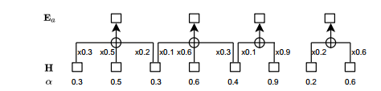
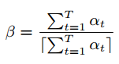

# 2-Paraformer-Fast and Accurate Parallel Transformer for Non-autoregressive

论文链接：https://arxiv.org/abs/2206.08317

开源代码：https://github.com/alibaba-damo-academy/FunASR

​	Transformer 使用自回归解码器逐个生成 tokens，在计算上是低效的。非自回归(NAR)方法可以提高推理速度。本文提出了一个快速准确的并联 Transformer，称为 Paraformer。首先，基于连续 integrate-andfire 预测器预测 token 的数量并生成隐变量；然后，扫视语言模型(glancing language model, GLM)采样器生成语义嵌入，以增强 NAR 解码器对上下文依赖建模的能力；最后，设计一种生成负样本策略用于最小词错误率训练，以进一步提高性能。实验验证所提出的 Paraformer 可以获得最先进的 AR Transformer 相当的性能，加速超过 10 倍。

## 一、引言

​	AED 模型的自回归解码器需要逐一生成 tokens，每个 token 都以所有先前的 tokens 为条件，解码在计算上是低效的，解码时间随着输出序列长度线性增加，非自回归的方式可以减小解码时间。

​	单步 NAR 工作主要集中在如何准确预测 tokens 的数量以及提取隐变量。与 AR 模型相比，单步 NAR 会犯很多替换错误，单步 NAR 有条件独立性假设，缺乏上下文的依赖性会导致替换错误的增加，本文旨在改进单步 NAR 模型，使其获得能与 AR 模型相当的性能。

​	本文提出了一个快速且准确的并联 Transformer（称为 Paraformer），解决了上述的两个挑战。首先，使用基于连续 integrate-and-fire 的预测网络估计目标数量并生成隐变量；其次设计了一个扫视语言模型的采样器模块，以增强 NAR 解码器对 tokens 相互依赖的建模能力；受到神经翻译的启发，设计了一种包括负样本的策略，通过最小词误差率训练提高性能。

​	Paraformer 在实现识别精度的同时，在大型语料库上获得 10 倍的推理速度提升。

## 二、方法

​	本文提出的 Paraformer 网络架构如图 2 所示。该架构由五个模块组成：编码器、预测器、采样器、解码器和损失函数。编码器与自回归编码器相同；预测器用于生成声学嵌入以指导解码；采样器根据声学嵌入和字符令牌生成语义嵌入；解码器是双向 AR 解码器；损失除交叉熵损失外，还与预测器的平均绝对误差(MAE)和 MWER 损失相结合，共同训练。

图2 Paraformer 结构

​	定义输入为 $(\bf X, \bf Y)$ ，其中 $\bf X$ 表示帧数目为 $T$ 的声学特征， $\bf Y$ 表示令牌数目为 $N$ 的目标标签。其中编码器将输入序列 $\bf X$ 映射到隐藏表征 $\bf H$ 。这些隐藏表征 $\bf H$ 然后送到预测器预测令牌数目 $N'$ 并产生声学嵌入 $\bf E_a$ ，解码器在没有后向梯度下通过 first pass，将声学嵌入 $\bf E_a$ 和隐藏表征 $\bf H$ 生成目标预测 $\bf Y'$ ，采样器在声学嵌入 $\bf E_a$ 和目标嵌入 $\bf E_c$ 之间采样，根据预测 $\bf Y'$ 和目标标签 $\bf Y$ 之间的距离生成语义嵌入 $\bf E_s$ 。解码器在 second pass 采用语义嵌入 $\bf E_s$ 和隐藏表征 $\bf H$ 生成最终预测 $\bf Y''$，这一次具有后向梯度。最后对 $\bf Y''$ 进行采样以产生用于 MWER 训练的候选，并在目标令牌数量 $N$ 和预测令牌数量 $N'$ 之间计算 MAE。MWER 和 MAE 在 CE 损失下联合训练。

​	在推理过程中，采样器处于非激活状态，双向并行解码器直接利用声学嵌入 $\bf E_a$ 和隐藏表征 $\bf H$ 仅在单个 pass 上预测最终输出 $\bf Y'$ ，尽管解码器在训练阶段在前向操作两次，但由于单步解码过程，在推理过程中的计算复杂度并未增加。

### 2.1 预测器

​	预测器由两个卷积层组成，输出为 float 权重 $\alpha$，范围是 0-1。累加权重 $\alpha$ 预测令牌数量，添加 MAE 损失用于指导训练，引入了 Continuous Integrate-and-Fire(CIF) 机制生成声学嵌入。CIF 是一种软单调对齐，用于 AED 模型的流式解决方案。为了生成声学嵌入 $\bf E_a$，CIF 累加权重 $\alpha$ 并融合隐藏表征 $\bf H$，直到累积的权重达到阈值 $\beta$，表明达到了声学边界，这个过程如图 3 所示：

图3 CIF过程

根据 [18]，在训练过程中，权重 $\alpha$ 根据目标长度缩放，以便声学嵌入的数量 $\bf E_a$ 与目标嵌入的数量 $\bf E_c$ 相匹配，推理阶段权重 $\alpha$ 直接用于产生 $\bf E_a$。因此，训练和推理之间可能存在不匹配导致预测器的精度下降，由于 NAR 模型比流式模型对预测精度更敏感，可以使用动态阈值 $\beta$ 来减少失配：

### 2.2 采样器

​	在 vanilla 单步 NAR 中，优化目标描述为：

然而，如前所述，与 AR 模型相比，条件独立性假设会导致较差的性能。扫视语言模型可以定义为：

其中 $GLM(Y,Y')$ 表示采样器模块在 $\bf E_a$ 和 $\bf E_c$ 之间选择令牌的子集，上面加一杠表示目标 $\bf Y$ 内剩余未被选择的令牌子集。

其中 $\lambda$ 是控制采样率的采样因子，$d(Y,Y')$ 是采样数，但模型未经训练时它会很大，其随着训练过程而减少，使用汉明距离定义：

总之，采样器模块通过随机替换 tokens 进入声学嵌入 $\bf E_a$ 和目标嵌入 $\bf E_c$ 相结合，生成语义嵌入 $\bf E_s$。训练并行解码器根据采样的令牌预测具有语义上下文的目标 tokens，使得一个模型能够学习输出令牌之间的相互依赖性。

### 2.3 损失函数

​	定义了三个损失函数，即 CE、MAE 和 MWER 损失。这些损失联合进行训练：

对于 MWER，可以表示为：

由于使用贪婪搜索解码，NAR 模型只有一个搜索路径。我们利用负采样策略，通过在 MWER 训练期间随机屏蔽 top1 得分令牌以生成多个候选路径。

## 三、实验

​	在开源 AISHELL-1、AISHELL-2 基准和 20000 小时工业普通话任务评估所提出的方法。在 NVIDIA Tesla V100 上评估推理速度。

​	AISHELL 数据集实验评估结果见表 1，RTF 在 ESPNET 上进行评估，没有使用外部语言模型和无监督训练。Vanilla NAR 与我们提出的 Paraformer 模型具有相同的架构，但没有采样器，然而，由于缺乏上下文依赖性，其性能略低于 AR，可以获得与 AR 模型相当的性能。推理速度(RTF)比 AR 基准快了 12 倍以上，取得在 AISHELL-1 和 AISHELL-2 任务中最先进的性能。

表1 AISHELL-1和AISHELL-2任务上ASR系统的比较（CER%），无LM，*表示批处理大小为 8，默认为 1

​	大量工业实验评估结果见表 3，其中动态 $\beta$ 表示 2.1 节所述的动态阈值，CTC 指的是带有 LM 的 DFSMN-CTC-sMBR 系统，RTF 使用 OpenNMT 进行评估。

​	对于 41M 模型，发现 Vanilla NAR 的 CER 与 AR 模型的 CER 相差很大，但仍优于 CTC，两者都有类似的条件独立性假设，当应用 GLM 时，获得 13.5% 和 14.6% 的相对性能改进，进一步添加 MWER 训练，准确率略有提高。Paraformer 实现了与 AR 模型相当的性能，推理速度快了 10 倍，使用动态阈值可以进一步提升准确性，CIF 减少了推理和训练间的不匹配，以更准确提取声学嵌入。

​	在 63M 模型上评估时现象相似，Paraformer 再次实现与 AR 模型相当的精度，实现了 10 倍的加速。Paraformer 可以通过增加模型大小实现卓越的性能，同时保持比 AR 更快的推理速度。

表3 三个系统在工业 20000h 任务中的性能

​	最后评估了采样因子如表 2 所示，采样器能给目标提供更好的上下文，识别精度会随着 $\lambda$ 的增加而提高。然而，当采样因子太大时，它会导致训练和推理之间不匹配，因为在训练阶段解码两次，推理阶段仅解码一次，性能在 0.5 到 1.0 范围内对 $\lambda$ 是鲁棒的。

​	与 AR 模型相比，Vanilla NAR 在学术阅读语料库 AISHELL 任务上性能衰减较小，在大规模工业语料库衰减较大，工业语料库反映了更复杂的场景，这是首次在大规模语料库任务中探索 NAR 模型。

​	进一步分析 Paraformer 性能，我们统计了错误类型总数，即插入、删除和替换，并进行归一化。与 AR 系统相比，普通 NAR 插入错误略有增加，而删除错误略有减小，表明在动态阈值帮助下，预测器的准确性是优越的；然而，替换错误极具增加，这解释了它们在性能上的巨大差距，这是由 NAR 模型的条件独立性假设造成的，Paraformer 的替换错误相较普通 NAR 有所减小，这是性能改进的主要原因，GLM 使 NAR 模型能更好学习输出令牌间的相互依赖性。与 GLM 相比，AR 模型的波束搜索解码在语言模型中可以发挥强大的作用，是 Paraformer 和 AR 模型仍具有差距的主要原因。

​	为了消除这一剩余的性能差距，我们的目标是在未来的工作中将Paraformer与外部语言模型相结合。