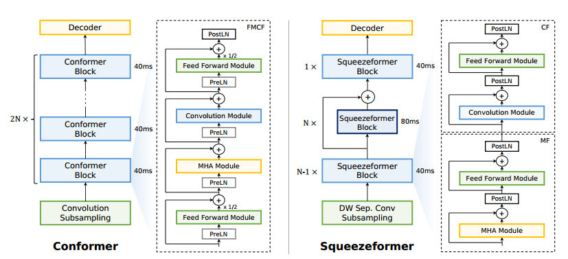
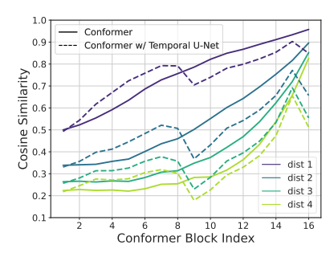
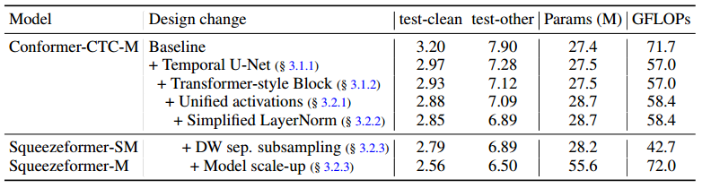
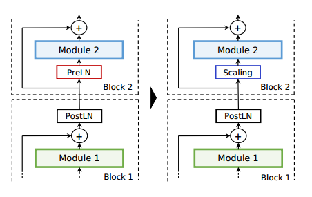
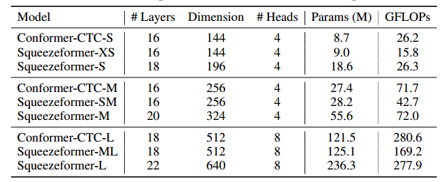
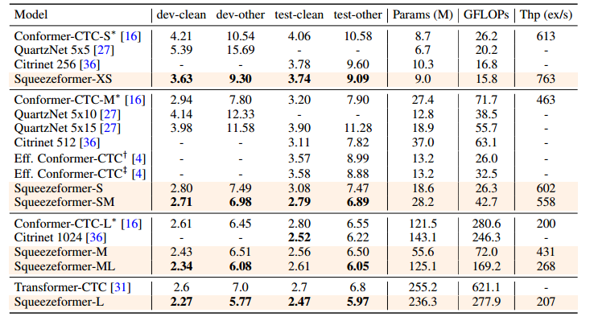

# 4-Squeezeformer-An Efficient Transformer for Automatic Speech Recognition

论文链接：https://arxiv.org/abs/2206.00888

开源代码：https://github.com/kssteven418/squeezeformer

本文提出了 Squeezeformer 网络架构，在相同的训练方案下优于先进的 ASR 模型。对于宏架构，Squeezeformer 结合了时间 U-Net 架构，降低了长序列多头注意力模块的开销，使用更简单的多头注意力或卷积的块结构，然后是前馈模块，不是 Conformer 提出的 Macaron 结构；对于微架构，Squeezeformer 简化了卷积块中的激活，去除了冗余的层归一化操作，结合有效的深度下采样对输入信号进行子采样。在LibraSpeech 数据集下较相同 FLOP 的 Conformer 模型有更好的结果。

## 一、引言

CNN 模型缺乏捕获全局上下文的能力，Transformer 具有巨大的计算和内存开销，Conformer 是一种卷积增强的 Transformer 结构，能够从音频信号中捕获全局和局部特征，成为各种端到端语音识别任务的基准模型。但仍具有一些局限性：在长序列受到注意力机制二次复杂性的影响，相较 Transformer 架构更加复杂，包含了不同归一化方案和激活函数、Macaron 结构和 back-to-back 多头注意力和卷积模块，难以在专用硬件平台上有效进行模型部署。本文提出了疑问，这样的设计方案是否是必要的和最优的。

本文对每一个设计进行了系统性的分析，目标是在给定的预算下实现较低的 WER，在宏观和微观层面开发了更简单、更高效的混合注意力卷积架构，性能优于先进的 ASR 模型。

- 学习相邻语音帧的特征表示时存在很高的时间特征冗余，尤其在网络的深处，导致了不必要的计算开销。本文引入了时间 U-Net 结构，下采样层在网络中间将采样率减半，轻量上采样层在最后恢复时间分辨率保证训练稳定性
- 重新设计了混合注意力卷积架构，提出了类似于标准 Transformer 块的更简单的块结构，其中 MHA 和卷积模块各自直接后跟单个前馈模块
- 使用 Swish 代替 GLU 激活；简化层归一化，将冗余的层前归一化替换为可缩放的层后归一化，该缩放结合残差路径的可学习缩放，该残差路径可以与其它层合并，推理过程零开销；第一子采样层采用深度分离卷积，从而减少浮点运算
- 在相同设置下训练，Squeezeformer 架构在较小或较大模型中都能很好得到扩展，始终优于最先进的 ASR 模型，通过反向消融研究验证了我们提出的 Squeezeformer 架构的合理性

## 二、模型架构

在宏观层面上，Conformer 结合了 Macaron 结构，每个块由四个单元组成，如图 2(左) 所示，这些块多个堆叠形成 Conformer 结构。我们选择 Conformer-CTC-M 作为案例研究的基线模型，使用 LibriSpeech 数据集进行性能评估，测试 30s 模型输入的 FLOP 作为模型效率评估。

图2 （左）Conformer 架构（右）Sequeezeformer 架构

### 2.1 宏架构设计

#### 2.1.1 时间 U-Net 架构

注意力操作相对于输入序列长度具有二次 FLOP 复杂度，我们提议通过减少序列长度上计算注意力来**减轻额外开销**，输入采样率从 10ms 降低到 40ms，在网络基础上使用卷积子采样单元，然而，这个速率在整个网络中保持不变，所有注意力和卷积以恒定时间尺度进行。

我们研究在可学习特征表征中的时间冗余，通过 Conformer 模型深度分析学习的特征如何嵌入到每一个语音帧，从 LibriSpeech 数据集上随机采样 100 个音频信号，通过 Conformer 块进行处理，记录每个块的激活情况，测量两个相邻嵌入向量之间平均余弦相似性，如图 3 实现所示：

图3 相邻语音帧之间两个嵌入向量之间的余弦相似性

直接相连的语音帧在最顶层有 95% 的平均相似性，甚至彼此远离的 4 个语音帧也具有 80% 的相似性，随着输入通过网络中更深层次的 Conformer 块进行处理，时间冗余度会不断增加。我们假设特征嵌入向量中的这种冗余会导致不必要的计算开销，并且序列长度可以在深层网络减小，而不会损失准确性。

我们第一个宏观体系的改进，我们更改 Conformer 模型，在模型早期块对嵌入向量处理后，进行子采样。具体而言，将采样率保持在 40ms 直到第七个块，然后使用池化层将每个序列的采样率调整到 80ms，对于池化层使用步长为 2，核大小为 3 的深度可分离卷积合并相邻嵌入之间的冗余，这将注意力复杂度降低了 4 倍，也减少了特征的冗余。在计算机视觉中，通常在空间上对输入图像进行下采样，使用 Efficient Conformer 以节省计算并开发层级特征。

然而，单独的时间下采样会导致训练不稳定和训练发散，其中一个原因是下采样到 80ms 后，解码器缺乏足够的分辨率。解码器需要将每个语音帧嵌入到单个标签中，例如字符，因此需要足够的分辨率来成功解码整个序列。受计算机视觉 U-Net 的启发，结合和时间 U-Net 结构，通过上采样层恢复网络末端的分辨率，上采样块接收 40ms 和 80ms 采样率处理的嵌入向量，并使用跳跃连接将它们相加，产生 40ms 采样率嵌入。与我们的时间 U-Net 最近的工作是 [43] 中提出的方法，其中 U-Net 架构融合到全卷积模型中，以对睡眠信号进行下采样。

与 Conformer 相比，这一变化使总的 FLOPs减少了 20%，测试的 WER 也提高了 0.62%，对余弦相似性的分析表明，时间 U-Net 结构避免了相邻嵌入在后面的块过于相似，特别是直接影响解码结果的最后一个块上，如图 3 的虚线所示。

#### 2.1.2 Transformer-Style 块设计

Conformer 由一系列前馈网络('F')、多头注意力(MHA, 'M')、卷积('C')和另一个前馈模块('F')组成，称为 FMCF 结构。ASR 模型卷积核大小相当大(31)，其行为类似混合全局信息注意力，因此将具有类似功能的卷积和 MHA 放在一起组成 MC 结构并不合适，我们考虑 MF-CF 结构，其动机是将卷积单元视为局部 MHA 单元。此外，我们放弃了 Macaron 结构，使用 Transformer 类型的网络表示 MF 和 CF 结构，如图 2 所示，该修改在 dev-other 下的 WER 可进一步提高 0.16%。

### 2.2 微架构设计

目前为止完成了 Squeezeformer 的宏架构，将 CV 和 NLP 领域的开创性架构融入到 Conformer 中。本节重点放在单个单元的优化上，进一步简化模型架构，同时提高效率和性能。

表1 

#### 2.2.1 Unified 激活

Conformer 对大多数块使用 Swish 激活，对于卷积模块使用 GLU 激活。这样的异构设计似乎过于复杂且不必要，使硬件部署复杂化，在没有专用矢量处理单元的低端边缘设备上，支持额外的非线性操作需要额外的查找表或高级算法。为了解决这一问题，我们建议使用 Swish 取代 GLU 激活，统一整个模型的激活函数。我们保持卷积单元的扩张率(expansion rate)。如表 1 的第 4 行所示，这一变化并没有导致 WER 和 FLOP 发生明显变化，只是简化了模型结构。

#### 2.2.2 简化层归一化

我们观察到 Conformer 模型包含冗余的层归一化操作，如图 4 左段，这是因为 Conformer 模型既包含在残差块之间应用层归一化的 postLN，也包含在残差块内部应用层归一化的 preLN，preLN 有助于训练稳定，postLN 有助于性能，但两个模块的一起使用会带来冗余操作，除了体系结构冗余之外，层归一化由于其全局残差运算，其计算成本很高。

图4 preLN 和 postLN

我们发现直接去除 preLN 或 postLN 会导致训练不稳定带来收敛失败，在研究失败原因时，发现典型的已训练的 Conformer 模型在 preLN 和 postLN 可学习的尺度变量存在数量级的差异。具体来说，我们发现 preLN 会将输入信号按规模缩小，从而为跳跃连接赋予了更多的权重，因此，在替换 preLN 组件时使用缩放层以允许网络控制该权重是必要的。这种想法在与其它领域的几种训练策略相一致，例如 NF-Net 提出了在残差块前和后的可学习缩放，以在没有归一化的情况下稳定训练。此外，DeepNet 最近提出在跳跃连接中添加不可训练的基于规则的缩放，以稳定 Transformer 中的 preLN。

受计算机视觉的启发，我们采用一个可学习的缩放层取代 preLN，$Scaling(x) = \gamma x + \beta$，其中 $\gamma$ 和 $\beta$ 是可学习的权重和偏移。为了实现架构的同质性，如图 2(右) 所示，我们将所有模块的 preLN 替换为 postLN，然后按比例缩放，整个模型仅包含 postLN。通过可学习缩放，模型测试进一步提高了 0.20%。

#### 2.2.3 深度可分离子采样

现在关注子采样模块，其在 FLOP 总数占了很大一部分，这是因为子采样层使用两个 vanilla 卷积运算，每个运算的步长为 2，为了减小该层的开销，我们将第二个卷积操作替换为深度可分离卷积，同时保持核大小和步长不变，第一次卷积操作保持原样，实现了 22% 基线 FLOPs 的减少，WER 没有受到影响。需要注意的是，深度可分离卷积很难有效映射到硬件加速器，部分原因是其算术密度低，然而，考虑到 FLOP 的减少，总吞吐量可以提高。

我们将所有改进最终命名为 Squeezeformer-SM，与基线 ConformerCTC-M 相比，WER 提高了 1.01%，FLOP 减少了 40%，放大模型可以实现 0.39% 额外 WER 增益，我们将此架构命名为 Squeezeformer-M。

## 三、实验结果

### 3.1 实验设置

对于模型设置，我们构建了具有不同大小和 FLOPs 的 Squeezeformer 模型，模型的具体细节见表 2 所示：

表2 Conformer 和 Squeezeformer 详细架构配置

对于解码，我们使用 CTC 解码器，采用非自回归解码方案。然而，本文工作的重点是编码器模型架构设计，它与解码器类型相互正交。

在许多先前工作中，解码器通常使用外部语言模型进行增强，例如预训练的 4-gram 或 Transformer，其通过更灵活的方式对输出重新评分以增强最终的 WER。我们比较没有外部语言模型的结果，语言模型设计与我们的工作相互正交

对于训练的详细信息，我们在 LibriSpeech-960hr 对 Conformer-CTC 和 Squeezeformer 进行了 500 个 epochs 的训练，在 Google 云 TPUs v3 上训练，对中小模型的批处理大小为 1024，对大模型的批处理大小为 2048。使用 AdamW 优化器，所有模型的权重衰减为 5e-4。

### 3.2 实验结果

我们在 clean 和 other 数据集上比较了 Squeezeformer、Conformer 以及其它先进基于 CTC 的 ASR 模型的比较，包括 QuartzNet、CitriNet、Transformer 以及 Efficient Conformer。

我们的 Squeezeformer 在 WER 和 FLOPs 上均显著优于 Conformer 和其它先进的 ASR 模型。

表3

### 3.3 消融实验

本文对 Squeezeformer 为基线模型的单个架构选择坐额外的消融研究，见表 4：

表4 

**时间 U-Net 结构**

在没有下采样层到上采样层跳跃连接的情况下，模型性能损失 0.35/0.87。表明早期层收集的高分辨率信息对解码有至关重要，模型在没有上采样层的情况下无法收敛

**Layernorm 结构**

模型在只有 PostLN 方案 和只有 PreLN 方案的训练均无法收敛，报告了发散前的最佳 WER，结果表明，可学习的缩放层对训练稳定性和 WER 起着关键作用

**卷积模块**

当消融卷积模块的 GLU 激活时，另一个选择是将其 drop 掉，不使用 Switch 激活代替，这会导致 0.10/0.22 的性能恶化

