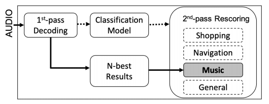

# 面向领域的神经语言模型用于语音识别

论文链接：https://arxiv.org/abs/2101.03229

随着语音助手变得越来越普遍，人们越来越期望它们能够在不同领域支持并表现良好的各种用例。我们提出了一种适用于在生产环境中进行第二遍重评分时实现领域自适应的领域感知重评分框架。在我们的框架中，我们对一个领域通用的神经语言模型进行微调，以适应多个领域，并使用基于LSTM的领域分类模型来选择适合进行第二遍重评分的领域自适应模型。这种领域感知的重评分将单独的三个领域（购物、导航和音乐）的单词错误率提高了高达2.4%，slot 单词错误率提高了高达4.1%，相比之下，与领域通用的重评分相比。这些改进是在保持通用用例的准确性的同时实现的。

## 引言

语音助手已经变得越来越受欢迎，并被用于越来越广泛的用例。例如，用户目前可以向语音助手提出要播放音乐（**音乐领域**）、获取商家地址（**导航领域**）和购买物品（**购物领域**）等请求。通常情况下，这些自动语音识别系统包括一个独立的语言模型（LM）组件，在第一通道与声学模型一起使用，并在第二通道中用于重新评分的可选LM。这些LM模型经过训练，用于估计一系列单词的概率 $P(w_1::w_n)$。而n-gram LMs通过估计每个单词在给定前$n - 1$个单词的情况下的概率来执行此操作，神经语言模型（NLMs）则学习了单词的分布式表示，以及上下文中单词序列的概率函数[1]。这使它们能够将估计推广到看不见的单词序列，以及更长的单词历史。这两种类型的LM可以在各种文本数据源上进行训练，并通常优化用于一般用例。

然而，不同的使用领域在其语言统计方面可能存在显著差异，**通用语言模型可能在新领域上表现不佳**，或者在通用用例中未能很好地代表其他领域[2]。**训练一个在许多领域中表现良好的单一LM具有挑战性**。一些最近的方法包括在解码过程中使用对声学嵌入的注意力[3]，或者使用一个组合式神经语言模型，该模型学会如何组合多个组件语言模型[4]。

在这项工作中，我们描述了一个**领域感知的重新评分框架**，可以在第二通道的生产环境中用来解决这个问题。我们通过对来自三个领域（音乐、导航、购物）的数据进行对通用领域的LM的微调，展示了这些模型在词错误率（WER）和Slot 词错误率（SlotWER）上的改进，后者衡量了在特定关键内容单词上的性能，超越了通用LM。我们发现，即使使用能够捕捉比传统n-gram LM更长的单词历史和更复杂关系的神经模型，这一结果仍然成立。我们展示了一种有效的方法，通过结合一个分类模型来确定在第二通道重新评分中使用哪个领域适应模型。使用这个框架，我们能够获得领域WER和SlotWER方面的0.7%到4.1%的改进。我们报告的实验结果使用的是一个实验性ASR系统，不能反映当前Alexa ASR系统在生产环境中的性能。

## 相关工作

以前的LM适应工作已经显示，**将上下文或领域适应的知识融入LM中可以提高ASR系统的性能**。实现这一目标的一种方式是根据前文动态调整插值的n-gram LM的权重[5]。插值的LM可以包括为不同的对话状态或应用[6]、主题/领域[5, 7]或主题因素的分解[8, 9]优化的不同LM。这些LM可以分别进行训练，然后在运行时选择适当的混合LM。此外，还可以将一个维护最近出现单词表示的缓存组件与插值的n-gram模型相结合，以根据最近的历史将模型适应到目标领域[10]。

最近，神经适应方法已被用来根据非语言上下文信号，如请求时的应用[11]或学习的主题向量[12, 13]，将LM适应到目标领域。例如，[12] 使用从潜在狄利克雷分配中获取的主题表示来为多类型广播转录任务中的音乐流派和节目适应神经语言模型。领域适应也可以通过浅层融合实现，在其中在波束搜索期间集成了一个外部（受上下文约束的）LM[14]。

考虑到第二通道中的有限搜索空间，我们可以在ASR系统的第二通道中使用更大更复杂的模型，从而实现额外的WER改进[1]。在这种方法中，由通用领域的第一通道模型生成的一组假设（表示为n-best列表、格子或混淆网络），然后由领域适应模型重新评分。从第一通道模型获取的LM分数使用第一和第二通道的LM分数的某种组合来更新。

最近，[15]展示了在生产环境中选择适应的模型并使用流程，使用一个主题分类器来选择适当的领域适应LM的可行性。他们表明，这一设置在仅使用通用领域模型时会带来改进。然而，他们的第二通道LM是一个3-gram模型。**循环神经LM在一直表现出色于传统的n-gram模型**，尤其是在不太频繁的尾部单词上，能够捕捉更复杂的单词之间的关系[1, 16]，因此目前尚不清楚在使用更强大的LM时，领域适应改进是否仍然成立。

在下一节中，我们将介绍我们的领域感知重新评分框架，在该框架中，我们基于第一通道ASR输出选择领域感知的NLM用于第二通道。

## 领域感知的重评分框架

我们提出的领域感知重新评分框架如图1所示。在第一通道解码后，最佳ASR输出被送入一个分类模型，以确定使用哪个第二通道重新评分模型。如果给定类别的后验概率满足选定的阈值，那么选择第二通道重新评分模型。第一和第二通道的LM分数根据最小化WER的优化进行插值。在接下来的部分中，我们逐一描述每个组件：首先，**我们描述我们将使用的第一通道ASR系统**。然后，**我们描述用于根据第一通道输出选择第二通道重新评分模型的分类模型**。最后，我们描述**用于第二通道重新评分的领域适应的NLMs**。

图1. 第二通道重新评分框架。分类模型根据第一通道解码输出选择适当的重新评分模型。然后，所选模型（例如，音乐特定模型）重新评分 n-best 假设。

### 第一通道模型

第一通道的语言模型是基于 Kneser-Ney 平滑[17] 的 n-gram 语言模型，使用各种数据进行训练，包括领域内数据（来自实际用户代理互动的转录和半监督数据1 ）以及领域外数据（例如，在网上可获取的语料库）。该语言模型经过优化，以最小化通用流量的困惑度，覆盖了所有领域[5]。声学模型是一个低帧率模型，采用2层频率 LSTM [18]，接着是使用连接主义时间分类损失[19]进行训练的5层时间 LSTM。

### 分类模型

选择适当的第二通道重新评分模型可以看作是一个文本分类任务。我们训练了一个轻量级的基于LSTM的分类器。它包括一个具有100个单元的输入嵌入层和大约150,000个词汇，包括一个用于未登录词的标记，然后是一个具有64个隐藏单元的LSTM层，一个全连接层，以及一个具有4个输出单元的输出层。每个输出单元对应于一个第二通道模型（一个通用领域模型，三个领域适应模型）。我们使用交叉熵损失，softmax激活，以及初始学习率为0.001的Adam优化器，并基于开发集上的性能进行早停。在训练时，模型基于带有注释的转录数据进行训练。在测试时，我们提供最佳ASR假设。输入话语被填充或截断到长度为10。

### 领域自适应 NLMs

根据[20]，我们训练了一个包括两个LSTM层的NLM，每个层包含512个隐藏单元。我们使用基于噪声对比估计的训练方法，它是自标准化的，在训练和推理过程中计算更快，因为在训练过程中不需要计算完整的softmax[21]。为了使NLM适应各个领域，我们从已收敛的通用领域模型初始化训练，使用来自各自领域的数据子集来微调LM以适应该领域[22]。根据[23]，他们使用了较小的学习率进行微调，我们使用了初始学习率的1/4，这在困惑度（PPL）改进方面表现最佳（在1/8至1/2的范围内）。这样，我们的每个NLM都是在相同的数据上进行训练，并且使用相同的词汇表。

### 第二通道重评分和优化

我们从10个最佳ASR假设中生成一个格子，然后使用领域分类器选择的第二通道模型对其进行重新评分。重新评分过程本身使用了如[24, 25]所述的前向推进算法。此外，我们基于（1）总体WER和（2）SlotWER优化用于组合第一通道和第二通道LM的插值权重。优化是使用如[26]所述的模拟退火算法进行的。

我们将这些结果与离线方法进行比较，其中我们使用一最佳ASR结果来估计每个重新评分模型的每话语插值权重，使用EM算法。然后，我们使用这些权重在第二通道中对模型进行线性插值[5]。这种方法在生产环境中并不实际，但为我们的结果提供了一个比较点。