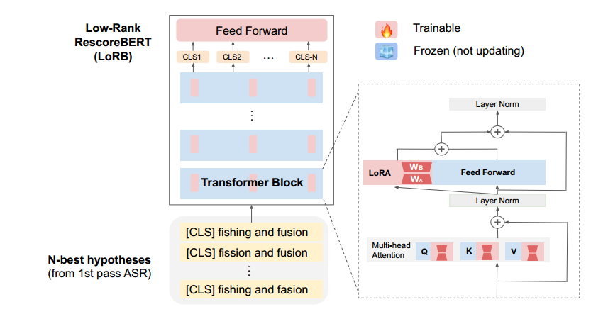
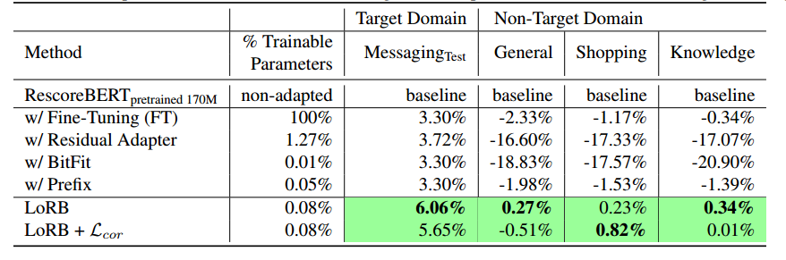
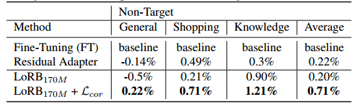
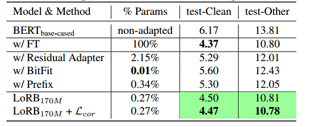
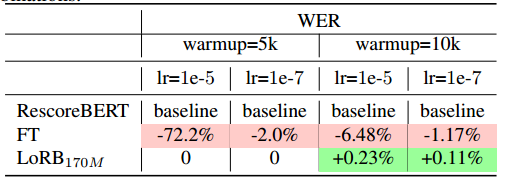
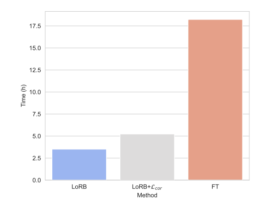
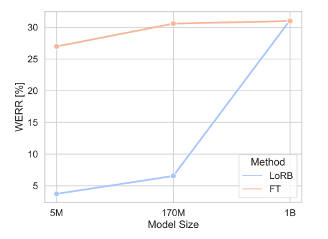
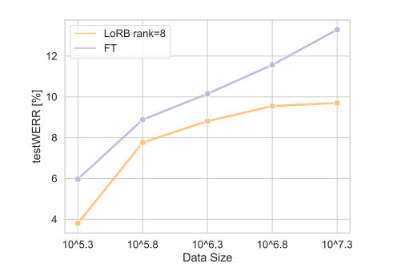
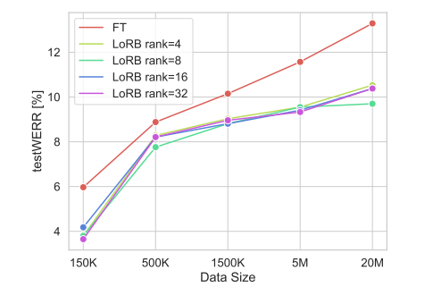

# 大规模语言模型重新评分的低秩适应，用于参数高效的语音识别

论文链接：https://arxiv.org/abs/2309.15223

我们提出了一种基于低秩适应（LoRA）的神经语言建模系统，用于语音识别输出的重评分。尽管像BERT这样的预训练语言模型在二次重评分中表现出卓越性能，但扩展预训练阶段的计算成本以及将预训练模型适应到特定领域的限制，限制了它们在重评分中的实际应用。在这里，我们提出了一种基于低秩分解的方法，用于训练一个重评分的BERT模型，并仅使用预训练参数的一小部分（0.08%）来适应它到新领域。这些插入的矩阵通过与基于相关性的正则化损失一起的判别性训练目标进行优化。提出的低秩适应Rescore-BERT（LoRB）架构在LibriSpeech和内部数据集上进行了评估，训练时间缩短了5.4到3.6倍。

## 引言

二次评分是一种广泛探讨的技术，用于提高自动语音识别（ASR）系统的性能[1, 2, 3, 4, 5]。不同架构的语言模型，如长短时记忆（LSTM）[6]和Transformer[7]，已被证明是N-best重新评分器[8]，可以提高第一次解码的性能。值得注意的是，Transformer 在其他语言模型架构中脱颖而出，**因为它们在模拟输入中的长距离依赖性和上下文方面表现出卓越的能力**。此外，大型语言模型（LLM）如GPT-2[9]和BERT[10]，基于 Transformer，具有融合语言和世界知识的优势。因此，LLMs已被广泛用于许多自然语言处理任务的应用中。

大型语言模型（LLMs）通常在大规模未标记的数据集上进行预训练，然后在一些较小的带标签数据集上进行微调，以适应下游任务。然而，随着预训练模型的规模增加，与微调和在实际应用中部署这些模型相关的成本也在不断上升。为了解决这个实际挑战，提出了一系列参数高效的方法（例如，适配器、模型重编程和提示）[11, 12, 13, 14, 15, 16, 17, 18]，以减轻微调LLMs的计算和内存需求。低秩适应（LoRA）[19]在LLM中冻结所有预训练参数，并将一对可训练矩阵（作为完整矩阵的低秩分解）添加到Transformer架构的每一层。与其他参数高效训练方法（例如适配器[12]）相比，LoRA具有两个明显的优点：

1. 它采用简单的架构，并有潜力减少可训练参数的数量；
2. LoRA不会引入额外的推断延迟，使其成为在生产环境中部署的出色选择。

在这项工作中，我们探索了**低秩适应用于语言模型二次评分，以实现计算效率和语音识别性能之间的有利权衡**。具体来说，我们采用了[20]中提出的判别性训练目标，直接优化最小词错误率，如第3.1节所述。在训练过程中，我们冻结了BERT中的所有层，只更新插入到每个Transformer层的低秩矩阵，正如第3.2节所讨论的那样。因此，用于存储可训练参数的内存和反向传播计算都得到了减少。同时，值得注意的是，我们观察到LoRA可能会导致降低的表示性能，类似于完全微调[21]，这可能会影响在未见测试领域的性能。为了减轻这种负面影响，除了最小词错误损失，我们还在第3.3节中应用了基于相关性的正则化方法。

我们提出的**BERT低秩二次评分（LoRB）在一个公开数据集和覆盖各种领域的内部数据集上进行了评估**。我们展示了与完全微调和其他参数高效方法相比，LoRB可以在目标领域达到可比较的性能，甚至在非目标领域取得更好的性能，而只更新微调中0.08%的可训练参数。此外，LoRB可以节省高达32%的训练内存利用率，并通过允许使用更大的学习率进行训练，实现高达6倍的训练时间缩短。

## 相关工作

### 低秩适配器

低秩适应（LoRA）已在自然语言处理（NLP）领域得到广泛研究。例如，[22]探索了一种自动选择LoRA矩阵的最佳秩值的方法。[23, 24]讨论了插入LoRA矩阵的最有效的 Transformer 模块，而[25]研究了权重矩阵之间的参数分配。一些研究探讨了LoRA有效性的潜在原因。[26, 27]发现学习权重的稀疏性对原始模型施加了正则化效应，从而改善了泛化性能。[28]证明了约束优化问题的维度可以有效减轻灾难性遗忘。除了NLP，低秩适应还被应用于视觉任务，通过微调视觉 Transformer[28, 29, 30]。然而，尚不清楚这些发现是否可以转移到自动语音识别中的二次评分。

### 领域自适应 ASR

在自动语音识别领域的领域自适应研究中，焦点主要集中在第一遍的声学模型上。例如，对于RNN-T模型，广泛采用了上下文偏置等策略[31, 32]。此外，对于低资源目标领域，还探索了使用语音模型重编程或适配器的自监督训练和半监督训练策略[33, 34, 35]。

对于第二遍模型，[36]探索了为新领域微调通用的二次评分模型，并引入了一个领域分类器以在领域特定模型之间切换。[37]提出了为目标领域训练提示嵌入，并在使用二次评分GPT2模型进行评分之前将它们附加到N-best列表。然而，这种方法由于前置提示而引入了额外的推断延迟。相比之下，我们的工作旨在探索低秩参数高效微调方法的泛化效应，同时降低领域自适应的计算成本，而不引入额外的推断延迟。

## 方法

### 二次评分的判别训练

#### 二次重评分

在本节中，我们规定了第二遍评分任务。给定一个N-best假设列表$E = \{E_1, E_2, \ldots, E_n\}$，这些假设是在第一遍声学模型的解码器中基于波束搜索得到的，重新评分模型将为每个假设生成分数。对于任何假设$E_i \in E$，用$s^a_i$表示第一遍给出的分数，用$s^{(l)}_i$表示第二遍产生的分数。对于两遍评分，假设的分数表示负对数似然，因此更低的分数表示更可能的假设。

语言模型，如BERT，接收一个假设并输出一个隐藏表示$g_i$，然后前馈网络以任务特定的[CLS]+标记的表示作为输入，并根据方程（2）得出第二遍的分数$s^{(l)}_i$。

$$
g_i = \text{BERT}(E_i) \\
s^l_i = \text{FFNN}(g^\text{CLS}_i)
$$

假设的最终得分是第一遍和第二遍得分的线性组合：

$$
s_i = s^a_i + \beta \cdot s_i^l
$$

#### 判别训练目标

判别性训练已广泛用于第二遍评分。具体而言，BERT作为一个遮蔽语言模型已经应用于第二遍评分[20]，**通过使用最小词错误率（MWER）[38]的判别性目标进行训练**。给定一个假设$E_i \in E$，用$\epsilon_i$表示与参考文本的单词错误数（编辑距离）。MWER损失函数定义为N-best假设的期望单词错误数，如方程（6）所示：

$$
P_i = \frac{e^{-s_i}}{\sum_{j=1}^{n} e^{-s_j}} \\
\overline{\epsilon}_H = \frac{1}{n} \sum_{i=1}^n \epsilon_i \\
\text{LMWER} = \sum_{i=1}^n P_i \cdot (\epsilon_i - \overline{\epsilon}_H)
$$

### ASR 重评分的低秩适配器

在之前对BERT进行的二次评分任务修改中，BERT的预训练权重$\Phi_0$通过跟随最小化MWER损失的梯度而被更新为$\Phi_0+∆Φ$。学习任务相关参数∆Φ的过程被称为完全微调过程。在完全微调过程中，学习参数的维度$|\Delta\Phi|$等于预训练权重的维度$|\Phi_0|$。

正如[39]所示，预训练语言模型具有较低的内在维度，并可以通过低维度的重新参数化来高效学习。受到这一发现和在NLP任务中大型语言模型的低秩适应成功的启发[19]，我们提出通过学习一个远小于$\Phi_0$维度的低秩表示$\Theta$，或者$|\Theta| \ll |\Phi_0|$，来适应BERT的重新评分任务。

形式上，对于 Transformer 块中的任何输入为$x$，输出为$h$的稠密层，将预训练权重表示为$W_0 \in \mathbb{R}^{d \times k}$，将权重的更新表示为$\Delta W$。我们对更新$\Delta W$执行低秩分解$\Delta W = WBWA$，其中$WB \in \mathbb{R}^{d \times r}$，$WA \in \mathbb{R}^{r \times k}$，且$r \ll \min(d, k)$。前向传播被修改为：

$$
h = W_0x + \Delta Wx = W_0x + W_BW_Ax
$$

在训练过程中，$W_0$被冻结，只有$W_A$和$W_B$被更新。在BERT中，LoRA可以应用于任何一组权重矩阵，例如，$W_0$可以是自注意力模块内的$W_q$、$W_k$、$W_v$或$W_o$，或者是两层前馈网络中的权重矩阵，即$W_{f1}$和$W_{f2}$。

### 多损失训练与正则化

**对于大型预训练模型的微调通常会导致在下游任务的训练数据上出现过拟合现象**[21, 40]。尽管一些参数高效微调方法已经被证明可以通过限制可训参数的数量来有助于缓解过拟合问题[41, 42, 43]，但在一些我们的实验中，评估LoRA微调后的二次评分模型时观察到了在未知测试集上性能轻微下降的现象。

为了获得预训练BERT的具有更好泛化性能的隐藏表示，我们除了MWER损失外，还增加了基于相关性的正则化损失$L_{cor}$：

$$
L = L_{MWER} + \lambda L_{cor}​
$$

基于相关性的正则化[44]已被提出来缓解由于在预训练语言模型上微调而引起的表示退化[45]问题。**通过强制表示的特征空间更具各向同性（在所有方向上均匀可变）**，可以更好地保持学习表示的表达能力。形式上，基于相关性的正则化损失被定义为对句子表示的相关性矩阵偏离单位矩阵的惩罚：

$$
L_{cor} = \|\Sigma - I\|
$$

这里，∥·∥表示弗罗贝尼乌斯范数，$I \in \mathbb{R}^{dh \times dh}$是单位矩阵，$\Sigma \in \mathbb{R}^{dh \times dh}$是相关性矩阵，其中$\Sigma_{ij}$表示[CLS]标记的隐藏表示的第i维和第j维之间的皮尔逊相关系数。在LoRB的情况下，只有对每个BERT层中对[CLS]标记的隐藏表示有贡献的LoRA矩阵受到相关性矩阵损失的正则化。

## 实验

### 数据集

领域自适应的训练数据包括一个公共数据集LibriSpeech[46]，以及两个内部数据集：Messaging（350小时）和Music（150小时）。此外，我们还探讨了与预训练模型和训练数据的规模有关的扩展行为，使用了一个内部的会话领域数据集。

我们在三个内部数据集上评估了语言模型的低秩适应，这些数据集来自去标识化的、远场的英语语音助手对话。内部的**通用领域数据集包含194小时，购物领域数据集包含20小时，知识领域数据集包含5小时的训练数据**，分别如下。

### 实施

在适应实验中，我们在LoRA等级值{4, 8, 16, 32}上变化，并将LoRA应用于两组目标模块：[Wq, Wv] 和 [Wq, Wk, Wv, Wf1 , Wf2]。在LoRA层中，我们将丢弃率设置为0.01和α = 32。在微调RescoreBERT时，我们从预训练模型检查点初始化RescoreBERT中的前馈网络，并持续更新前馈网络的参数，如图1所示。对于所有参数高效训练方法和完全微调，我们使用早停策略来评估在领域内验证集上表现最佳的检查点。

图1. 低秩适应基于Rescoring BERT (LoRB)的示意图。

对于LibriSpeech，我们微调了大小写敏感的BERTbase模型，以便与以前的工作进行公平比较。对于其他内部训练数据集，我们微调了一个内部的170M RescoreBERT模型，具有16层和1024维隐藏层，该模型是基于具有判别性训练目标的内部数据训练的，训练步骤为435K步。

### 基线

第一遍的RNN-Transducer语音识别基线系统的词错误率（WER）低于10%。我们比较了低秩适应与完全微调以及其他三种参数高效微调方法的微调结果。这里的“Adapter”方法指的是[12]中提出的标准残差适配器，其潜在维度是其编码器维度的一半，即768。适配器层被插入到自注意模块和随后的残差连接，以及MLP模块和其随后的残差连接。每个适配器层包括两个全连接层、偏置向量和放置在它们之间的非线性。 “BitFit”方法，提出于[13]，涉及训练每个模块中的偏置向量，同时冻结所有其他参数。 “Prefix”方法指的是前缀调整[11]，它将可训练的标记插入到输入序列中。

## 结果和分析

### 低秩领域自适应

#### 消息数据作为连续域自适应

表1显示了对四个内部数据集的评估结果。我们在内部的消息（MSG）数据集上微调了一个170M的RescoreBERT模型，采用MWER训练目标。微调后的模型在领域内消息测试集和来自通用、购物和知识领域的非分布数据上进行评估。第一行显示了没有任何微调的170M RescoreBERT模型的测试评估结果。所有的参数高效微调方法在目标领域消息方面表现出与完全微调（FT）相媲美甚至更好的性能。然而，FT、Adapter和BitFit在非分布数据上遭遇了性能下降，而LoRB在目标领域和非目标领域都表现出稳健性能。

表1. 在微调消息数据时，LoRB、完全微调（FT）、Adapter和BitFit的相对词错误率（WER）改进。

#### 案例研究1：正则化影响

表2呈现了LoRB和具有基于相关性的正则化的LoRB与基线方法在来自非目标领域的三个内部测试集上的性能比较。我们的实验显示，当应用微调时，音乐领域数据容易出现过拟合，导致其他领域数据的性能下降。这可以归因于有限的数据集大小和存在挑战性的稀有词汇，如艺术家姓名。虽然适配器和LoRB技术在减轻大多数领域的性能下降方面都表现出一定程度的改进，但LoRB与基于相关性的正则化的组合在性能方面取得了最显著的改进。

表2. 在音乐数据上微调时，LoRB170M、完全微调（FT）和适配器的相对词错误率（WER）改进。

#### 案例研究2：公共数据集

表3显示了LibriSpeech数据集的test-Clean和test-Other部分的词错误率（WER）。我们采用了Whisper的第一遍解码设置[47]。在两个测试集上，LoRB相对于其他参数高效训练方法实现了最大的WER降低。具体而言，在test-Other中，LoRB只使用0.27%的参数就可以实现与FT相媲美的结果，而基于相关性的损失带来了进一步的改进，这与我们在Case Study 1中的发现一致。

表3. 在由Whisper-tiny解码的公共LibriSpeech [46]基线的两个标准测试集上的绝对词错误率（WER）。170M BERT基础模型来自官方公共发布[48]，以便在Apache许可证下进行可重复评估。

#### 分析：训练稳定性

表4显示了在不同的训练超参数设置下，完全微调和LoRB后的词错误率。我们观察到，FT对不同的预热步骤和学习率计划组合非常敏感，而LoRB对超参数的变化更加稳健。

表4. 相对于未微调的170M RescoreBERT，在不同的预热步骤和学习率组合下，对非目标购物领域的词错误率（WER）改进。

#### 分析：训练时间和 GPU 内存利用

图2显示了训练时间的比较。我们发现，尽管LoRB在相同的学习率下需要更长时间才能收敛，但当学习率增加时，FT的性能大幅下降。因此，我们可以利用LoRB通过更大的学习率在较短的训练时间内实现与FT相似的词错误率，如图2所示。此外，我们发现LoRB可以大幅减少训练过程中GPU内存的使用百分比，从87%降至52%。

图2. 在消息数据上训练时，LoRB、LoRB+Lcor和Fine-Tuning（FT）的训练时间。

#### 分析：LLM 缩放结果

在本节中，我们展示了底层预训练语言模型的规模以及训练数据集的规模如何影响LoRB的性能。我们使用了一个内部会话数据集（大约6000万个话语）作为训练源。为了评估不同预训练模型大小的扩展行为，我们分别在150,000个对话训练话语上微调内部RescoreBERT模型，其参数大小为5M、170M和1B。为了研究数据大小的扩展行为，我们将对话训练数据分成五个对数规模，分别包含大约20M/5M/1500K/500K/150K个话语。

图3显示了模型规模的变化。随着预训练语言模型的规模增加，FT和LoRB之间的性能差距缩小。随着骨干模型的总预训练参数增加，FT和LoRB之间的性能差距从170M规模下的-22.3%减小到1B规模下的+2.4%，以词错误率相对（WERR）差异表示。在我们的ASR重编码模型实验中，我们发现更大的BERT模型规模可以将LoRB的收敛速度提高2.74倍，这对于生产规模的部署具有益处。

图3. 通过使用FT和LoRA微调的5M、170M和1B大小的RescoreBERT对会话测试集进行的词错误率（WER）评估。

图4显示了在相同的会话测试集上针对不同数据规模训练的模型的词错误率（WER）。一般来说，我们观察到数据规模越大，性能改进越大。值得注意的是，从150K到500K的数据规模变化所带来的性能改进几乎是从500K到20M的变化的四倍。与完全微调中观察到的线性缩放法则不同，LoRB遵循对数缩放曲线，当数据规模达到一定阈值时，趋近于一个固定值。

图4. 由1B RescoreBERT评估的词错误率（WER），使用FT和LoRA微调不同大小的“会话领域”数据。

图5显示了LoRB在不同秩值下的缩放情况。尽管在不同数据规模设置下，秩值和词错误率之间没有明显的相关性，但一般趋势保持一致：较大的数据集规模导致与完全微调（FT）相比更大的性能差距。

图5. 作为数据规模函数的词错误率（WER），由1B RescoreBERT评估，使用FT和不同秩的LoRA微调。

## 结论

**我们引入了LoRB，这是一种高效可扩展的低秩分解方法**，用于基于BERT的重编码模型的领域自适应，具有低计算成本，并且在使用有限规模的领域内数据进行训练时不会降低性能。通过插入仅占预训练模型参数的0.08%的权重矩阵并冻结所有其他参数，我们实现了与完全微调相当的语音识别性能，并且训练速度提高了6倍。公共和内部数据集上的实验性重编码结果显示了LoRB框架和基于相关性的多目标训练的有效性和泛化性。缩放结果强调了大型预训练模型对于获得最佳语音识别重编码结果的重要性。