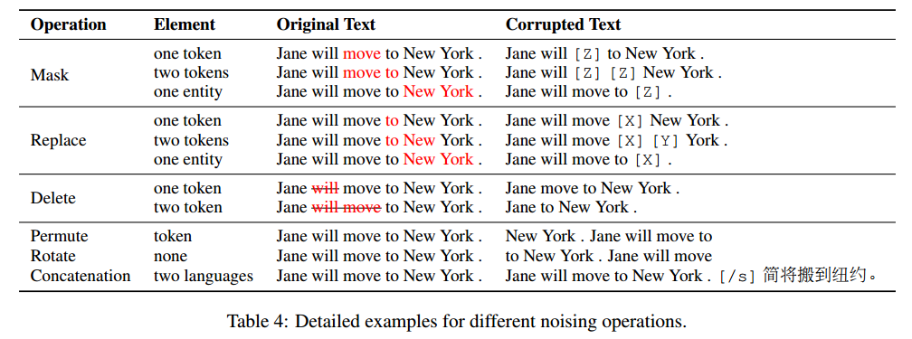
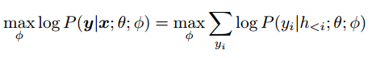
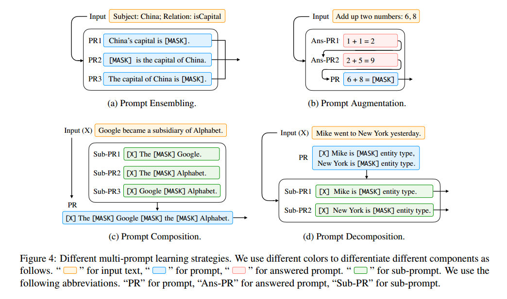

# 预训练、提示和预测：自然语言处理中提示方法的系统调研

英文名：Pre-train, Prompt, and Predict A Systematic Survey of Prompting Methods in Natural Language Processing

论文连接：https://arxiv.org/abs/2107.13586

这篇论文对自然语言处理中的一种新范式进行了调查和整理，我们将其称为“基于提示的学习”。与传统的监督学习不同，传统监督学习训练一个模型，使其接收输入x并预测输出y，即P(y|x)。基于提示的学习是基于直接建模文本概率的语言模型。为了使用这些模型执行预测任务，原始输入x使用模板修改成具有一些未填充槽位的文本提示x0，然后使用语言模型以概率方式填充未填充信息，从而获得最终的字符串xˆ，可以从中推导出最终的输出y。这个框架有很多优点和吸引力：它允许语言模型在大量原始文本上进行预训练，通过定义新的提示函数，模型能够进行少样本甚至零样本学习，适应新的场景，只需很少或没有标记的数据。在本文中，我们介绍了这个有前途的范式的基本概念，描述了一组统一的数学符号，可以涵盖各种现有工作，还沿着几个维度组织了现有的工作，例如预训练模型的选择、提示和调整策略。为了使这个领域对感兴趣的初学者更加可访问，我们不仅对现有工作进行了系统回顾，并高度结构化地总结了基于提示的概念，还发布了其他资源，例如包括不断更新的调查和论文列表的NLPedia-Pretrain网站。

## NLP 两次变化

NLP 演进框架

然而，从2017-2019年开始，NLP模型的学习发生了翻天覆地的变化，这种完全监督的范式现在发挥着越来越小的作用。

具体而言，标准转向了预训练和微调范式。具有固定架构的模型被预先训练为语言模型（LM），预测观察到的文本数据的概率可以在大型数据集上训练这些 LMs，在学习建模语言的健壮通用特征的过程中。然后，通过引入额外的参数并使用特定任务的目标函数对其进行微调，将上述预训练的LM适应于不同的下游任务。在这种模式下，重点主要转向目标工程（objective engineering），设计预训练和微调阶段的训练目标。张等人（2020a）表明，引入预测文档中显著句子的损失函数将导致更好的文本摘要预训练模型，值得注意的是，预先训练的LM的主体通常也进行了微调，使其更适合解决下游任务。

在**预训练+提示+预测**范式下，不是通过目标工程使预先训练的LM适应下游任务，而是在文本提示的帮助下重新制定下游任务，使其看起来更像原始LM训练期间解决的任务。通过选择适当的提示，我们可以操纵模型行为，以便预训练的LM本身可以用于预测期望的输出。这种方法强调提示工程的重要性，找到了最合适的提示，允许LM解决手头的任务。

## 提示的通用描述

在自监督学习中，为了学习该模型的参数θ，我们使用包含输入和输出对的数据集，并训练模型来预测该条件概率 $P(y|x;\theta)$。主要问题是，为了训练模型，有必要为任务提供监督数据，而对于许多任务来说，这些数据是无法大量找到的。

基于提示的方法是用语言模型对文本 $x$ 本身的概率 $P(x;\theta)$ 进行建模，并使用该概率来预测 y，从而减少或消除对大型监督数据集的需求。具体来说，基本提示分三步预测得分最高的 y：

- 提示添加：Prompt Addition

  应用提示函数将输入文本转换为提示：，该函数由两个步骤组成：

  1. 应用一个模板（[X] The movie is [Z]），它是一个有两个槽的文本字符串：一个用于输入X的输入槽[X]（"I love this movie"），一个用于中间生成的答案文本Z的答案槽[Z]（"great", "fantastic"），该文本稍后将映射到y中。
  2. 用输入文本X填充槽[X]

  值得注意的是，上面的提示将在提示的中间或结尾有一个空槽来填充z，称该提示为完型词提示；在输入文本完全位于z之前的第二种提示则称为前缀提示。[X]槽的数量和[Z]槽的数量可以根据手头任务的需要灵活更改。模板词不一定由自然语言表征组成；它们可以是后来嵌入连续空间的虚拟单词（例如，用数字id表示），一些提示方法甚至直接生成连续向量。

- 答案搜索：Answer Search

  接下来搜索使 LM 得分最大化的文本答案。在生成任务的情况下，Z可以是整个语言的范围；在分类的情况下可以是语言中单词的一个子集。我们通过使用预先训练的LM P（·；θ）计算其相应的填充提示的概率来搜索潜在答案集z

  

  该搜索函数可以是搜索最高得分输出的argmax搜索，也可以是根据LM的概率分布随机生成输出的采样。

- 答案映射：Answer Mapping

  最后，我们想从得分最高的答案z Plot到得分最高的输出y Plot，

提示的设计有许多注意事项：

- 预先训练模型选择
- 提示工程
- 答案工程
- 扩展范式
- 基于提示的训练策略

## 预训练语言模型

许多调查已经表明预训练 LM 在预训练和微调范式中对 NLP 产生了巨大的影响

### 训练目标

预训练的LM的主要训练目标几乎总是由预测文本x的概率的某种目标组成。

- 标准语言模型（SLM）：训练模型以优化来自训练语料库的文本的概率P（x），文本通常以自回归的方式进行预测，一次预测序列中的标记。这通常是从左到右进行的（如下所述），但也可以按其他顺序进行。SLM 一个流行的替代方案是去噪目标，将一些噪声函数应用于输入句子，然后在给定该噪声文本P（x|x~）的情况下尝试预测原始输入句子。
- 损坏文本重建（CTR）：通过仅计算输入句子的噪声部分的损失，将处理后的文本恢复到未损坏的状态。
- 全文重建（FTR）：这些目标通过计算整个输入文本的损失来重建文本，无论它是否被噪声处理

从左到右的自回归LMs可能特别适合前缀提示，而重建目标可能更适合完形填空提示。主要训练目标对特定的提示任务起着至关重要的作用。

### 噪声函数

表 4 介绍了几种类型的噪声函数，可以通过控制噪声的类型以结合先验知识

**Masking** 文本将在不同级别被掩蔽，用[MASK]等特殊令牌替换令牌或多令牌跨度；**Replacement** 类似于掩蔽，只是令牌或多令牌跨度不是用[MASK]替换的，而是另一个令牌或信息片段；**Delete** 在不添加[MASK]或任何其他令牌的情况下，将从文本中删除令牌或多令牌跨度，此操作通常与FTR损失一起使用；**Permutation** 置换首先将文本划分为不同的跨度（标记、子句跨度或句子），然后将这些跨度置换为新的文本。

### 表征方向性

- 左到右：每个单词的表示是根据单词本身和句子中所有以前的单词来计算的。
- 双向：每个单词的表示是根据句子中的所有单词计算的，包括当前单词左侧的单词。

除了上面两个最常见的方向性之外，还可以将这两种策略混合在一个模型中。通常通过注意力掩码实现这些策略

### 典型预训练方法

左到右自回归 LM：用于预测即将到来的单词或将概率P（x）分配给单词序列x=x1，···，xn，这是许多提示方法采用的流行骨干

掩码语言模型：当重点转移到为诸如分类之类的下游任务生成最佳表示时，一个流行的双向目标函数是掩蔽语言模型，该模型旨在基于包围的上下文预测掩蔽文本片段。例如，P（xi |x1，…，xi−1，xi+1，…，xn）表示给定周围上下文的单词xi的概率。通常最适合自然语言理解或分析任务（例如，文本分类、自然语言推理和提取式问答），这些任务通常相对容易被重新表述为完形填空题

前缀和编码器解码器：对于条件文本生成任务，如翻译和摘要，其中给定输入文本x=x1，···，xn，并且目标是生成目标文本y，我们需要一个预训练的模型，该模型既能对输入文本进行编码，又能生成输出文本。使用具有完全连接掩码的编码器首先对源x进行编码，然后（2）自回归地（从左到右）对目标y进行解码。

最近的研究表明，其他非生成任务，如信息提取、问题回答和文本生成评估，可以通过提供适当的提示来重新表述为生成问题。因此，提示方法（i）扩大了这些面向生成的预训练模型的适用性。

## 提示工程

提示工程是创建提示函数fprompt（x）的过程，该函数可在下游任务上产生最有效的性能。

### 提示形——Prompt Shape

提示主要有两种：完形填空提示，填补了文本字符串的空白；前缀提示，它延续了字符串前缀。选择哪一个将取决于任务和用于解决任务的模型。一般来说，对于与生成有关的任务，或者使用标准自回归LM解决的任务，前缀提示往往更有利于，因为它们与模型的从左到右的性质很好地吻合。对于使用掩蔽LMs解决的任务，完形填空提示非常适合，因为它们与训练前任务的形式非常匹配。

### 手动模板工程——Manual Template Engineering

创建提示的一种自然的方式是手动创建直观的模板。例如，开创性的LAMA数据集（Petroni等人，2019）提供了手动创建的完形填空模板，以探究LMs中的知识。Brown等人（2020）创建了手工制作的前缀提示，以处理各种任务，包括用于常识推理的问答、翻译和探究任务。

### 自动模板学习——Automated Template Learning

手动创建模板目前存在的几个问题：（1）创建和尝试这些提示是一门需要时间和经验的艺术，尤其是对于一些复杂的任务，如语义解析（2）即使是经验丰富的提示设计者也可能无法手动发现最佳提示。为了解决这些问题，已经提出了许多方法来自动化模板设计过程。提示可以进一步分为离散提示和连续提示，离散提示通常是一个熟悉的字符串，而连续提示则是被直接描述在底层 LM 的嵌入空间中。

另一个正交设计考虑因素是提示函数fprompt（x）是静态的，对每个输入使用基本相同的提示模板；还是动态的，为每个输入生成自定义模板。静态和动态策略适应于不同类型的离散和连续提示

离散提示（又称硬提示），自动搜索在离散空间中描述的模板，通常对应于自然语言短语。涉及的方法包括**提示挖掘**、**提示释义**、**基于梯度的搜索**、**提示生成**和**提示评分**。

基于挖掘的方法可以在给定一组训练输入x和输出y的情况下自动找到模板，该方法在大型文本语料库（如维基百科）中搜索包含x和y的字符串，并找到输入和输出之间的中间词或依赖路径。基于释义的方法采用现有的种子提示（例如手动构建或挖掘），并将其转换为一组其他候选提示，然后选择在目标任务上实现最高训练精度的提示（语言翻译、同义词短语替换、提示神经网络）。基于梯度的搜索寻找短序列，该短序列可以触发底层的预训练LM来生成期望的目标预测，这个搜索是以迭代的方式完成的，在提示中逐步遍历标记。提示评分首先手工制作一组模板作为潜在的候选者，并填充输入和回答槽以形成填充的提示。然后，他们使用单向LM对这些填充的提示进行评分，选择LM概率最高的提示。这将为每个单独的输入生成自定义模板。

因为提示构造的目的是找到一种允许LM有效执行任务的方法，而不是供人类使用，所以没有必要将提示限制为人类可解释的自然语言。直接在模型的嵌入空间中执行提示的连续提示（也称为软提示）。具体来说，连续提示消除了两个约束：（1）放宽了模板词嵌入为自然语言（如英语）词嵌入的约束。（2） 取消模板由预先训练的LM参数参数化的限制。相反，模板有自己的参数，可以根据下游任务的训练数据进行调整。下面我们重点介绍几种有代表性的方法。涉及的方法包括**前缀调整**、**离散提示初始化调整**、**软硬混合调整**。

前缀调整（Li和Liang，2021）是一种在输入中预先准备一系列连续的任务特定向量，同时保持LM参数冻结的方法。数学表达：

与使用真实单词的离散提示相比，这种基于前缀的连续学习在低数据设置下对不同的初始化更敏感。

还有一些方法可以使用已经使用离散提示搜索方法创建或发现的提示来初始化对连续提示的搜索。首先使用离散搜索方法定义模板，根据发现的提示初始化虚拟令牌，然后微调嵌入以提高任务准确性。好处是使用手动模板进行初始化可以为搜索过程提供更好的起点。使用训练样本联合学习每个模板的权重和参数。他们使用的初始模板集要么是手工制作的，要么是使用“提示挖掘”方法获得的。

对于软硬混合调整，这些方法不是使用纯可学习的提示模板，而是在硬提示模板中插入一些可调嵌入。例如著名的**P-tuning**，即通过在嵌入的输入中插入可训练变量来学习连续提示。Han等人（2021）提出了使用规则的提示调整（PTR），该方法使用手工制作的子模板来使用逻辑规则组成完整的模板。为了增强生成模板的表示能力，他们还插入了几个虚拟令牌，这些令牌的嵌入可以使用训练样本与预训练的LMs参数一起调整。PTR中的模板令牌同时包含实际令牌和虚拟令牌。

## 答案工程

与提示工程不同，后者设计了适用于提示方法的合适输入，答案工程旨在寻找答案空间 Z 和映射到原始输出 Y 的方法，以实现有效的预测模型。图1的“答案工程”部分说明了进行答案工程时必须考虑的两个维度：确定答案形式和选择答案设计方法。

### 答案形式——Answer Shape

答案的形式表征了其粒度。一些常见的选择包括：

- 标记（Tokens）：预训练语言模型词汇表中的一个标记，或词汇表的一个子集。
- 范围（Span）：一个短的多标记范围。通常与填空提示一起使用。
- 句子（Sentence）：一句话或文档。通常与前缀提示一起使用。

实际上，如何选择可接受答案的形式取决于我们要执行的任务。在分类任务中，如情感分类（例如 Yin 等人，2019）中，令牌或文本范围的答案空间被广泛使用，但也用于其他任务，如关系抽取（Petroni 等人，2019）或命名实体识别（Cui 等人，2021）。在语言生成任务中通常使用更长的短语或句子答案（Radford 等人，2019），但也用于其他任务，如多项选择题回答（其中多个短语的得分相互比较；Khashabi 等人，2020）中。

### 答案空间设计方法——Answer Space Design Methods

接下来要回答的问题是如何设计适当的答案空间 Z，以及如果答案不被用作最终输出时，如何映射到输出空间 Y。

#### 手动设计

在手动设计中，潜在答案空间 Z 及其与 Y 的映射是由感兴趣的系统或基准设计者手动精心设计的。有多种策略可以用来进行这种设计。

**不受限制空间**：在许多情况下，答案空间 Z 是所有标记的空间（Petroni 等人，2019）、固定长度的范围（Jiang 等人，2020a）或标记序列（Radford 等人，2019）。在这些情况下，最常见的是直接使用恒等映射将答案 z 映射到最终的输出 y。

**受限空间**：然而，也存在一些情况，可能输出的空间是受限制的。这通常用于具有有限标签空间的任务，如文本分类、实体识别或多项选择题回答。举一些例子，Yin 等人（2019）手动设计了与相关主题（“健康”、“金融”、“政治”、“体育”等）、情感（“愤怒”、“喜悦”、“悲伤”、“恐惧”等）或输入文本的其他方面相关的单词列表，以进行分类。Cui 等人（2021）手动设计了用于命名实体识别任务的诸如“人物”、“地点”等的列表。在这些情况下，需要存在答案 Z 与底层类别 Y 之间的映射关系。

就多项选择题回答而言，通常会使用语言模型计算在多个选项中选择某个输出的概率，Zweig 等人（2012）是早期的一个例子。

#### 离散答案搜索

与手动创建提示一样，手动创建答案可能不够理想，以使语言模型实现最佳的预测性能。因此，一些工作致力于自动答案搜索，尽管相对于搜索理想提示的工作来说较少。这些工作涉及离散答案空间（本节）和连续答案空间（下一节）。

**答案改写**：从初始答案空间 Z0 开始，然后使用改写来扩展此答案空间以扩大其覆盖范围（Jiang 等人，2020b）。给定一个答案和输出的对（z0，yi），我们定义一个生成答案的改写集合 para(z0) 的函数。然后，最终输出的概率被定义为该改写集合中所有答案的边际概率，即 P(y|x) = P z∈para(z0) P(z|x)。这种改写可以使用任何方法进行，但Jiang等人（2020b）特别使用了一种回译方法，首先将答案翻译成另一种语言，然后再翻译回来生成多个改写的答案列表。

**修建后搜索**：在这些方法中，首先生成了一个包含多个可信答案的初始修剪答案空间 Z0，然后通过算法进一步搜索这个修剪空间以选择最终的一组答案。请注意，在下面介绍的一些论文中，他们将标签 y 映射到单个答案标记 z 的函数，通常称为 "verbalizer"（Schick 和Schütze，2021a）。Schick 和Schütze（2021a）；Schick 等人（2020）发现了在大规模未标记数据集中频繁出现且至少包含两个字母字符的标记。在搜索步骤中，他们通过最大化训练数据上的标签的可能性来迭代计算单词作为标签 y 代表答案 z 的适用性。Shin 等人（2020）使用 [Z] 标记的上下文表示作为输入，学习了一个逻辑分类器。在搜索步骤中，他们使用第一步中学习的逻辑分类器选择获得最高概率得分的前 k 个标记。这些选定的标记将形成答案。Gao 等人（2021）首先根据训练样本确定的 [Z] 位置上的生成概率选择前 k 个词汇词，构建了一个修剪的搜索空间 Z0。然后，通过基于训练样本的零样本准确度仅选择 Z0 中的一部分词汇词来进一步修剪搜索空间。在搜索步骤中，他们使用固定模板与每个答案映射一起对语言模型进行微调，使用训练数据选择最佳的标签词作为答案，基于开发集上的准确性。

**标签分解**：在进行关系抽取时，Chen 等人（2021b）会自动将每个关系标签分解为其组成单词，并将它们用作答案。例如，对于关系 "per:city of death"，分解后的标签词将是 {person, city, death}。答案范围的概率将被计算为每个标记概率的总和。

#### 连续答案搜索

很少有研究探讨使用可以通过梯度下降进行优化的软答案标记的可能性。Hambardzumyan 等人（2021）为每个类别标签分配了一个虚拟标记，并将每个类别的标记嵌入与提示标记嵌入一起进行优化。由于答案标记直接在嵌入空间中进行优化，它们不使用语言模型学习的嵌入，而是从头开始为每个标签学习一个嵌入。

## 多提示学习——Multi-Prompt Learning

到目前为止，我们讨论的提示工程方法主要集中在为一个输入构建单个提示。然而，大量研究已经表明，使用多个提示可以进一步提高提示方法的效果，我们将这些方法称为多提示学习方法。在实践中，有多种将单一提示学习扩展到使用多个提示的方式，这些方式有各种各样的动机。我们在图1的“多提示学习”部分以及图4中总结了代表性的方法。

### 提示集成——Prompt Ensembling

提示集成是在推理时使用多个未回答的提示来进行预测的过程。图4-(a)中展示了一个示例。这些多个提示可以是离散提示或连续提示。这种提示集成可以实现以下目标：(1) 利用不同提示的互补优势，(2) 缓解提示工程的成本，因为选择一个性能最佳的提示是具有挑战性的，(3) 稳定下游任务的性能。

提示集成与用于组合多个系统的集成方法密切相关，在机器学习中有着悠久的历史（Ting 和 Witten，1997；Zhou 等，2002；Duh 等，2011）。当前的研究也借鉴了这些工作的思想，以得出有效的提示集成方法，如下所述。

**均匀平均**是在使用多个提示时组合预测的最直观方法，即取不同提示的概率的平均值。具体来说，这表示 P(z|x) := 1/K * Σᵢ P(z|fprompt,i(x))，其中 fprompt,i(·) 是提示集成中的第i个提示。Jiang等人（2020c）首先通过选择在训练集上取得最高准确性的K个提示来筛选提示，然后使用从前K个提示获得的平均对数概率来计算在执行事实性探测任务时位于[Z]位置的单个标记的概率。Schick和Schütze（2021a）在使用集成模型对未标记的数据集进行注释时也尝试了简单平均。在执行文本生成评估时，Yuan等人（2021b）将这个任务制定为文本生成问题，并取用不同提示生成的最终生成分数的平均值。

**加权平均**是一种在提示集成中使用的方法，它比简单均匀平均更灵活，因为它允许为每个提示分配权重，考虑到某些提示可能比其他提示性能更好。这些权重通常是基于提示性能预先指定的，或者可以使用训练集进行优化。例如，Jiang等人（2020c）通过最大化在训练数据上的目标输出的概率来学习每个提示的权重。Qin和Eisner（2021）使用相同的方法，不过每个提示的权重与软提示参数一起进行优化。此外，Qin和Eisner（2021）还引入了一种数据相关的加权策略，其中考虑了输入在提示中出现的概率来加权不同提示。Schick和Schütze（2021a,b）在训练之前根据在训练集上的准确性来设置每个提示的权重。

**多数投票**，对于分类任务，还可以使用多数投票方法组合来自不同提示的结果（Lester等人，2021；Hambardzumyan等人，2021）。

**知识蒸馏**，深度学习模型的集成通常可以提高性能，而这种卓越的性能可以使用知识蒸馏（Allen-Zhu和Li，2020）融入到单一模型中。为了融入这一思想，Schick和Schütze（2021a、b、2020）为每个手动创建的模板-答案对训练了一个单独的模型，然后使用它们的集成来注释未标记的数据集。然后，最终模型被训练以从已注释的数据集中蒸馏知识。Gao等人（2021）在其自动生成的模板上使用了类似的集成方法。

**文本生成提示集成**，对于生成任务（即答案是一系列标记而不是单个标记的任务），关于提示集成的研究相对较少。在这种情况下执行集成的一种简单方法是使用标准方法，根据答案序列中下一个词的集成概率生成输出。相反，Schick和Schütze（2020）为每个提示fprompt,i(x)训练一个单独的模型，因此存储每个这些经过微调的语言模型在内存中是不可行的。相反，他们首先使用每个模型解码生成，然后通过对所有模型的生成概率进行平均来评分每个生成。

### 提示增强——Prompt Augmentation

提示增强，有时也称为演示学习（demonstration learning）（Gao等人，2021），提供了一些额外的已回答提示，可以用来演示语言模型应该如何回答与输入x实例化的实际提示。例如，不仅提供一个提示“中国的首都是[Z]。”，而且可以在之前加上一些示例，如“英国的首都是伦敦。日本的首都是东京。中国的首都是[Z]。”另一个执行两个数字相加的示例可以在图4-(b)中找到。这些少样本演示充分利用了强大语言模型学习重复模式的能力（Brown等人，2020）。

尽管提示增强的思想很简单，但有几个方面使其变得具有挑战性：(1) 样本选择：如何选择最有效的示例？(2) 样本排序：如何将选择的示例与提示一起排序？

**样本选择**：研究人员发现，在这种少样本情况下使用的示例选择可能导致非常不同的性能，从某些任务的接近最先进的准确性到接近随机猜测的情况（Lu等人，2021）。为了解决这个问题，Gao等人（2021）；Liu等人（2021a）利用句子嵌入来采样与输入在嵌入空间中接近的示例。为了衡量预训练语言模型在基于指令执行新任务的泛化能力，Mishra等人（2021）提供了既有正样本又有负样本，突出了需要避免的事情。

**样本排序**：Lu等人（2021）发现提供给模型的已回答提示的顺序在模型性能中起着重要作用，并提出了基于熵的方法来评分不同的候选排列。Kumar和Talukdar（2021）搜索训练示例的良好排列作为增强提示，并学习在提示之间用于进一步提高性能的分隔符标记。

提示增强与提供更多文本上下文以改善性能的检索方法密切相关（Guu等人，2018），这种方法在基于提示的学习中也被证明是有效的（Petroni等人，2020）。然而，关键区别在于，提示增强还利用了模板和答案，而较大上下文的学习则不包括这些元素。

### 提示合成——Prompt Composition

对于那些可以基于更基本的子任务进行组合的可组合任务，我们还可以执行提示合成，使用多个子提示，每个子提示用于一个子任务，然后根据这些子提示定义一个复合提示。这个过程在图4-(c)中有所说明。例如，在关系抽取任务中，旨在提取两个实体之间的关系，我们可以将任务分解为几个子任务，包括识别实体的特征和分类实体之间的关系。基于这一直觉，Han等人（2021）首先使用多个手动创建的子提示进行实体识别和关系分类，然后根据关系抽取的逻辑规则将它们组合成一个完整的提示。

### 提示分解——Prompt Decomposition

对于需要为一个样本执行多个预测的任务（例如，序列标记任务），直接定义针对整个输入文本x的整体提示是具有挑战性的。解决这个问题的一个直观方法是将整体提示分解为不同的子提示，然后分别回答每个子提示。图4-(d)用命名实体识别任务的示例说明了这一思想，该任务旨在识别输入句子中的所有命名实体。在这种情况下，输入首先会转化为一组文本跨度，然后模型可以被提示为每个跨度预测实体类型（包括“不是实体”）。由于跨度数量较大，同时预测所有跨度类型并不容易，因此可以为每个跨度创建不同的提示并分别进行预测。这种针对命名实体识别的提示分解已经被Cui等人（2021）探讨，他们应用了我们在这里讨论的方法。

## 提示方法训练策略——Training Strategies for Prompting Methods

通过上面章节中的方法，现在清楚了如何获得合适的提示（或组合提示）以及相应的答案。现在我们讨论与提示方法协同明确训练模型的方法，如图1中的“训练策略”部分所述。

### 训练设置——Training Settings

在许多情况下，可以在不对下游任务的语言模型进行任何明确训练的情况下使用提示方法，只需采用已经训练过以预测文本概率 P(x) 的语言模型，并将其原样应用于填充用于指定任务的洞察或前缀提示。这通常被称为零样本训练设置，因为对于感兴趣的任务没有任何训练数据。

然而，也有一些方法使用训练数据与提示方法一起训练模型。这些方法包括全数据学习，其中使用相当多的训练示例来训练模型，以及少样本学习，其中使用非常少量的示例来训练模型。在后一种情况下，提示方法特别有用，因为通常没有足够的训练示例来完全指定所需的行为，因此使用提示将模型引导到正确的方向尤其有效。

需要注意的是，在第4节描述的许多提示工程方法中，尽管在下游任务模型的训练中没有明确使用注释的训练样本，但它们通常用于构建或验证下游任务将使用的提示。正如Perez等人（2021）所指出的，从下游任务的角度来看，这可能并不是真正的零样本学习。

### 参数更新方法——Parameter Update Methods

在基于提示的下游任务学习中，通常有两种类型的参数，即来自于（1）**预训练模型**和（2）**提示**的参数。哪些参数应该更新是一个重要的设计决策，它可能在不同情景中导致不同程度的适用性。我们根据以下因素总结了五种调整策略（如表6所示）：

(i) 基础语言模型的参数是否被调整；

 (ii) 是否存在额外的与提示相关的参数； 

(iii) 如果存在额外的与提示相关的参数，是否调整这些参数。

#### 无提示微调——Promptless Fine-tuning

如引言中所提到的，自从提示方法变得流行之前，预训练和微调策略一直在自然语言处理领域广泛使用。在这里，我们将没有提示的预训练和微调称为 "promptless fine-tuning"，以与后面介绍的基于提示的学习方法进行对比。在这种策略中，给定一个任务的数据集，通过下游训练样本引发的梯度会更新预训练语言模型的所有参数（或其中一些参数（Howard和Ruder，2018；Peters等人，2019））。以这种方式调整的典型预训练模型包括BERT [32]和RoBERTa [105]。这是一种简单、强大且广泛使用的方法，但在小数据集上可能会过拟合或不稳定学习（Dodge等人，2020）。模型也容易发生灾难性遗忘，即语言模型失去了在微调之前能够执行的任务的能力（McCloskey和Cohen，1989）。

> 优点：简单，无需设计提示。调整所有语言模型参数使模型适应更大的训练数据集。
>
> 缺点：语言模型可能在较小的数据集上过拟合或学习不稳定。

#### 无微调提示——Tuning-free prompting

无调整提示直接基于提示生成答案，而不改变预训练语言模型的参数，正如第2节中描述的提示的最简单形式所述。这些可以选择性地使用已回答的提示来扩充输入，如第6.2节所述，无微调提示与提示增强的组合也被称为上下文学习（Brown等人，2020）。无微调提示的典型示例包括LAMA [133]和GPT-3 [16]。

> 优点：高效，没有参数更新过程。没有灾难性遗忘，因为语言模型参数保持不变。适用于零样本训练设置
>
> 缺点：因为提示是提供任务规范的唯一方法，所以需要大量的工程工作才能达到高准确度。特别是在上下文学习设置中，在测试时提供许多已回答的提示可能会很慢，因此不能轻松使用大型训练数据集。

#### 固定LM 提示微调——Fixed-LM Prompt Tuning

在除了预训练模型的参数之外引入了额外的与提示相关参数的情况，固定-LM提示调整仅使用从下游训练样本中获得的监督信号来更新提示的参数，同时保持整个预训练的语言模型不变。典型的示例包括Prefix-Tuning [96]和WARP [55]。

>优点：与无微调提示类似，它可以保留语言模型中的知识，适用于少样本情景。通常比无微调提示具有更高的准确性。
>
>缺点：不适用于零样本情景。虽然在少样本情景下有效，但在大数据情境下表示能力有限。需要通过选择超参数或种子提示来进行提示工程。提示通常不容易人类解释或操作。

#### 固定提示 LM微调

固定提示的LM微调调整LM的参数，就像标准的预训练和微调范例一样，但另外使用具有固定参数的提示来指定模型的行为。这可能会在特别是在少样本情景下带来改进。

实现这一目标的最自然方式是提供一个离散的文本模板，该模板应用于每个训练和测试示例。典型的示例包括PET-TC [153]，PET-Gen [152]，LM-BFF [46]。Logan IV等人（2021）最近观察到，通过允许答案工程和部分LM微调的组合，可以减少提示工程的复杂性。例如，他们定义了一个非常简单的模板，null提示，其中输入和掩码直接连接在一起 "[X]  [Z]"，没有任何模板词，发现这样可以达到竞争性的准确性。

>优点：提示或答案工程更完全地指定了任务，允许更有效的学习，特别是在少样本情景下。
>
>缺点：仍然需要提示或答案工程，尽管可能不像没有提示那么多。对一个下游任务微调的LM可能对另一个下游任务不起作用。

#### 提示+LM 微调

在这种设置中，存在与提示相关的参数，可以与预训练模型的所有或部分参数一起微调。代表性的示例包括PADA [8]，P-Tuning [103]。值得注意的是，这种设置与标准的预训练和微调范例非常相似，但是添加提示可以在模型训练开始时提供额外的引导。

> 优点：这是最富表现力的方法，可能适用于大数据设置。
>
> 缺点：需要训练和存储模型的所有参数。可能会对小数据集过拟合。

## 应用

在前面的部分，我们从方法本身的机制的角度来审查提示方法。在本节中，我们将从应用的角度来组织提示方法。我们在表格7-8中列出了这些应用，并在接下来的部分中对它们进行总结。

### 知识探究

**事实探究**（又称事实检索）是应用提示方法的最早场景之一。探索这个任务的动机是量化预训练LM的内部表示承载多少事实知识。在这个任务中，通常固定预训练模型的参数，并通过将原始输入转换为如第2.2节所定义的填空提示来检索知识，这个填空提示可以手工制作或自动发现。相关数据集包括LAMA（Petroni et al, 2019）和X-FACTR（Jiang et al, 2020a）。由于答案是预定义的，事实检索只关注于寻找有效的模板并分析使用这些模板的不同模型的结果。在这个背景下，已经探索了离散模板搜索（Petroni et al, 2019, 2020; Jiang et al, 2020c,a; Haviv et al, 2021; Shin et al, 2020; Perez et al, 2021）和连续模板学习（Qin and Eisner, 2021; Liu et al, 2021b; Zhong et al, 2021b）以及提示集成学习（Jiang et al, 2020c; Qin and Eisner, 2021）等方法。

**语言探究**，除了事实知识，大规模预训练还使LM能够处理语言现象，如类比（Brown et al, 2020），否定（Ettinger, 2020），语义角色敏感性（Ettinger, 2020），语义相似性（Sun et al, 2021），cant理解（Sun et al, 2021）以及罕见词理解（Schick and Schutze ¨ , 2020）。上述知识也可以通过以LM完成的自然语言句子的形式呈现语言探究任务来引出。

### 基于分类任务

在分类任务中广泛探索了基于提示的学习，其中可以相对容易地构建提示模板，例如**文本分类**（Yin et al, 2019）和**自然语言推理**（Schick and Schutze ¨ , 2021a）。在分类任务中使用提示的关键是将其重新构造为一个合适的提示。例如，Yin et al (2019) 使用一个提示，如“这个文档的主题是 [Z]。”，然后将其输入到面向掩码的预训练LM中进行插槽填充。

**文本分类**：对于文本分类任务，大多数以前的工作都使用了填充式提示，对于这些任务，已经广泛探讨了提示工程（Gao et al, 2021; Hambardzumyan et al, 2021; Lester et al, 2021）和答案工程（Schick and Schutze ¨ , 2021a; Schick et al, 2020; Gao et al, 2021）。大多数现有的工作都在“固定提示LM调整”策略（在§7.2.4中定义）的少样本设置中探讨了提示学习在文本分类中的有效性。

**自然语言推理**：自然语言推理（NLI）旨在预测两个给定句子之间的关系（例如，蕴涵关系）。与文本分类任务类似，对于自然语言推理任务，常常使用填充式提示（Schick和Schutze ¨ ，2021a）。关于提示工程，研究人员主要关注少样本学习设置中的模板搜索，答案空间Z通常是手动从词汇表中预先选择的。

### 信息提取

与分类任务不同，信息提取任务通常需要更多的技巧来构建提示。

**关系抽取** ：关系抽取是一项任务，其目标是预测句子中两个实体之间的关系。Chen等人（2021b）首次探索了在关系抽取中应用固定提示LM调整的应用，并讨论了两个主要挑战，阻碍了从分类任务中直接继承提示方法学的问题：（1）更大的标签空间（例如，关系抽取中的80与二元情感分类中的2）导致了答案工程方面的更大难度。 （2）在关系抽取中，输入句子中的不同标记可能更或更不重要（例如，实体提及更有可能参与关系），然而，这在分类任务的提示模板中很难反映，因为原始提示模板视每个词都是平等的。为了解决上述问题，Chen等人（2021b）提出了一种自适应答案选择方法，以解决问题（1），以及面向任务的提示模板构建方法，以解决问题（2），他们使用特殊标记（例如[E]）来突出显示模板中的实体提及。类似地，Han等人（2021）通过多个提示组合技术（见图4）来纳入实体类型信息。

**语义解析**： 语义解析是一项任务，其目标是在给定自然语言输入的情况下生成结构化的含义表示。Shin等人（2021）探索了使用LM进行少样本语义解析任务，方法是（1）将语义解析任务构建为一项释义任务（Berant and Liang, 2014），以及（2）通过仅允许根据语法而不允许根据语法的解码过程来约束解码过程。他们尝试了§7.2.2中描述的上下文学习设置，选择了与给定的测试示例（由生成给定训练示例的条件生成概率确定）在语义上接近的答案提示。结果证明了使用预训练LM进行语义解析任务的释义重构的有效性。

**命名实体识别**：命名实体识别（NER）是一项任务，其目标是在给定的句子中识别命名实体（例如，人名、地点）。基于提示的学习应用于标记任务的难度，以NER为例，是，与分类不同，（1）要预测的每个单元是一个标记或跨度，而不是整个输入文本，（2）在样本上下文中的标记标签之间存在潜在关系。总体而言，标记任务中基于提示的学习的应用尚未得到充分探索。Cui等人（2021）最近提出了一种基于BART的基于模板的NER模型，该模型列举了文本跨度，并考虑了在手动构建的模板内每种类型的生成概率。例如，对于给定的输入“Mike went to New York yesterday”，要确定“Mike”是什么类型的实体，他们使用模板“Mike is a [Z] entity”，其中答案空间Z包括“person”或“organization”等值。

###  自然语言处理中的“推理” 

对于深度神经网络是否能够执行“推理”或仅仅是基于大量训练数据记忆模式仍存在争议（Arpit et al，2017; Niven和Kao，2019）。因此，已经有许多尝试通过定义涵盖不同情境的基准任务来探测模型的推理能力。我们以下详细说明了在这些任务中如何使用提示方法。

**常识推理**：在自然语言处理系统中，有许多测试常识推理的基准数据集（Huang等人，2019; Rajani等人，2019; Lin等人，2020; Ponti等人，2020）。一些常尝试的任务涉及解决Winograd模式（Levesque等人，2012），这需要模型在上下文中识别模棱两可的代词的先行词，或者涉及在给定多个选择的情况下完成句子。对于前者，例如“奖杯无法放入棕色手提箱中，因为它太大。” 模型的任务是推断“它”是否指的是奖杯还是“手提箱”。通过在原始句子中将“it”替换为其潜在候选项，并计算不同选择的概率，预训练的LM可以通过选择概率最高的选择来表现得相当好（Trinh和Le，2018）。对于后者，例如“Eleanor主动为她的访客做咖啡。 然后她意识到她没有一个干净的[Z]。” 候选选择是“杯子”，“碗”和“勺子”。预训练LM的任务是选择其中一个最符合常识的候选项。对于这类任务，我们还可以评分每个候选项的生成概率，并选择具有最高概率的候选项（Ettinger，2020）。

**数学推理**：数学推理是解决数学问题的能力，例如算术加法，函数评估。在预训练LM的背景下，研究人员发现，当数字位数较小时，预训练嵌入和LM可以执行简单的操作，例如加法和减法，但当数字较大时，它们会失败（Naik等人，2019; Wallace等人，2019b; Brown等人，2020）。Reynolds和McDonell（2021）探讨了更复杂的数学（例如f（x）= x * x，f（f（3））是什么？）推理问题，并通过为问题串行推理来提高LM的性能。

### 问答任务

Question Answering (QA) 问答任务旨在回答给定的输入问题，通常基于上下文文档。QA可以采用各种格式，例如**抽取式QA**（从包含答案的上下文文档中识别内容；例如SQuAD（Rajpurkar等人，2016）），多项选择QA（模型必须从多个选择中选择；例如RACE（Lai等人，2017））和**自由格式QA**（模型可以返回任意文本字符串作为响应；例如NarrativeQA（Kocisk ˇ y等人´ ，2018））。通常，这些不同格式的问题已经使用不同的建模框架进行处理。使用LM解决QA问题的潜在好处，可能使用提示方法，是不同格式的QA任务可以在同一框架内解决。例如，Khashabi等人（2020）通过微调基于seq2seq的预训练模型（例如T5）和来自上下文和问题的适当提示，将许多QA任务重新制定为文本生成问题。Jiang等人（2020b）更详细地研究了使用序列到序列预训练模型（T5、BART、GPT2）的基于提示的QA系统，观察到这些预训练模型在QA任务上的概率对于模型是否正确并不具有很强的预测能力。

### 文本生成

Text Generation 文本生成是一类涉及生成文本的任务，通常是在一些其他信息的条件下生成文本。可以通过使用前缀提示和自回归预训练LM来轻松应用提示方法来执行这些任务。Radford等人（2019）展示了这种模型在使用提示（例如“翻译成法语，[X]，[Z]”）执行文本摘要和机器翻译等生成任务时的出色能力。Brown等人（2020）为文本生成执行了上下文学习（§7.2.2），创建了一个具有手动模板的提示，并使用多个已回答的提示来增强输入。Schick和Schutze ¨（2020）探索了为手动创建的模板进行了少样本文本摘要的固定提示LM调整（§7.2.4）。Li和Liang（2021）研究了在少样本设置中的文本摘要和数据到文本生成中的固定-LM提示调整（§7.2.3），在这里，可学习的前缀标记被添加到输入中，而预训练模型的参数保持不变。Dou等人（2021）在文本摘要任务中探索了提示+LM调整策略（§7.2.5），其中使用可学习的前缀提示，并由不同类型的引导信号初始化，然后可以与预训练LM的参数一起更新。

### 自动文本生成评估

Yuan et al. (2021b)进行的研究表明，提示学习可以用于生成文本的自动评估。具体来说，他们将生成文本的评估概念化为一个文本生成问题，使用预训练的序列到序列模型进行建模，然后使用前缀提示将评估任务与预训练任务更加接近。他们在德英机器翻译（MT）评估中发现，仅仅在使用预训练模型时将短语“例如”添加到翻译后的文本中可以显著提高相关性。

### 多模态学习

Tsimpoukelli et al. (2021)将提示学习的应用从基于文本的自然语言处理扩展到多模态设置（包括视觉和语言）。他们通常采用固定的LM提示调整策略以及提示增强技术。具体来说，他们将每个图像表示为一系列连续嵌入，然后使用参数冻结的预训练LM，通过这个前缀来生成图像标题等文本。实证结果表明，该系统具有少样本学习能力：在少数演示示例（回答提示）的帮助下，系统可以迅速学习新对象和新的视觉类别的词汇。

### Meta-Applicaiton

提示技术还有许多应用，它们本身并不是自然语言处理（NLP）任务，但可以作为训练强大模型的有用元素，适用于任何应用领域。

**领域自适应**是将模型从一个领域（例如新闻文本）调整到另一个领域（例如社交媒体文本）的实践。Ben-David等人（2021年）使用自动生成的领域相关特征（DRFs）来增强原始文本输入，并将其作为一个序列到序列的问题进行序列标记，使用了一个经过预训练的seq2seq模型。

**去偏差**：Schick等人（2021年）发现，语言模型可以根据带有偏见或去偏差指令进行自我诊断和自我去偏差。例如，要自我诊断生成的文本是否包含暴力信息，我们可以使用以下模板：“以下文本包含暴力内容。[X]  [Z]”。然后，我们将[X]填充为输入文本，并查看[Z]处“是”的概率是否大于“否”。如果“是”的概率大于“否”，那么我们会假设给定的文本包含暴力内容，反之亦然。在生成文本时执行去偏差，首先计算给定原始输入时下一个单词的概率。然后，按照上述方法，计算附加了自我诊断文本输入的下一个单词的概率。可以将下一个标记的这两个概率分布结合起来，以抑制不需要的属性。

**数据集构建**：Schick和Schutze（2021年）提出使用预训练语言模型来根据特定指令生成数据集。举个例子，假设我们有一个未标记的数据集，其中每个样本是一个句子。如果我们想构建一个包含语义相似句子对的数据集，那么我们可以对每个输入句子使用以下模板：“写两个意思相同的句子。[X] [Z]”，并尝试生成一个与输入句子具有相同意思的句子。

### 资源

我们还收集了一些不同基于提示的应用所需的有用资源

**数据集** 表9展示了一些专门设计用于少样本学习和零样本学习的数据集

**提示** 正如表10所示，我们收集了现有的手动设计的常用提示，这可以被视为未来研究和应用的现成资源。

## 挑战

尽管基于提示的学习在不同任务和场景中展现出了显著的潜力，但仍然存在一些挑战，其中一些我们将在下面详细介绍。

### 提示设计

**超出分类和生成的任务** 大多数现有的基于提示的学习工作主要围绕文本分类或生成型任务展开。与信息提取和文本分析任务的应用讨论较少，主要是因为提示的设计较为复杂。我们预计，将来将提示方法应用于这些任务将要求重新构思这些任务，以便可以使用分类或文本生成方法来解决，或者进行有效的答案工程，以适当的文本格式表达结构化输出。

**结构化信息的提示** 在许多自然语言处理任务中，输入都带有各种结构，例如树状结构、图表结构、表格结构或关系结构。如何在提示或答案工程中最好地表达这些结构是一个重要挑战。现有的研究（Chen等，2021b）通过在提示中添加额外的标记来编码词汇信息，如实体标记，已经迈出了一步。Aghajanyan等人（2021）提出了基于超文本标记语言的结构化提示，用于更精细的Web文本生成。然而，超越这一点，针对更复杂的结构变化的研究尚未深入探讨，这可能是一个潜在的有趣的研究领域。

**模板与答案的纠缠** 模型的性能将取决于所使用的模板和所考虑的答案。如何同时搜索或学习最佳的模板和答案组合仍然是一个具有挑战性的问题。当前的研究通常是在选择模板之前选择答案（Gao等，2021；Shin等，2020），但Hambardzumyan等人（2021）已经展示了同时学习两者的初步潜力。

### 答案工程

对于**基于分类的任务**，答案工程面临两个主要挑战：(a) 当类别太多时，如何选择适当的答案空间变成了一个困难的组合优化问题。(b) 当使用多个标记的答案时，如何最好地使用语言模型解码多个标记仍然是未知的，尽管已经提出了一些多标记解码方法（Jiang等，2020a）。

对于**文本生成任务**，合格的答案在语义上可以等同，但在句法上却多种多样。到目前为止，几乎所有的工作都是依赖于单一答案的提示学习来进行文本生成，只有极少数例外（Jiang等，2020c）。如何更好地利用多个参考答案来引导学习过程仍然是一个主要的开放性研究问题。

### 微调策略选择

正如在第7节中所讨论的，有许多方法可以调整提示、语言模型或两者的参数。然而，鉴于这一研究领域还处于起步阶段，我们仍然缺乏对这些方法之间权衡的系统性理解。这个领域可以从系统性的探索中受益，就像在预训练和微调范式中关于这些不同策略之间权衡的探索一样（Peters等，2019）。

### 多提示学习

**提示集成** 在提示集成方法中，随着考虑更多的提示，空间和时间复杂性会增加。如何从不同的提示中提取知识仍然未被充分探讨。Schick和Schutze（2020，2021a，b）使用集成模型来注释大型数据集，以从多个提示中提炼知识。此外，如何选择适合集成的提示也是未被充分探讨的。对于文本生成任务，迄今为止尚未进行有关提示集成学习的研究，可能是因为文本生成中的集成学习本身相对复杂。为了解决这个问题，一些最近提出的神经集成方法，如Refactor（Liu等，2021c），可以被考虑为文本生成任务中的提示集成方法。

**提示组合与分解** 提示组合和分解都旨在通过引入多个子提示来分解复杂任务输入的难度。在实践中，如何在它们之间做出良好的选择是一个关键步骤。从经验上看，对于那些标记（Ma和Hovy，2016）或跨度（Fu等，2021）预测任务（例如，命名实体识别），可以考虑提示分解，而对于那些跨度关系预测（Lee等，2017）任务（例如，实体共指），提示组合可能是更好的选择。将来，可以在更多情境中探索分解和组合的一般思想。

**提示增强** 现有的提示增强方法受输入长度的限制，即向输入中提供太多演示是不可行的。因此，如何选择信息丰富的演示，并以适当的方式排列它们是一个有趣但具有挑战性的问题（Kumar和Talukdar，2021）。

**提示共享** 上述所有考虑都涉及到在单一任务、领域或语言中应用提示。我们也可以考虑提示共享，即将提示学习应用于多个任务、领域或语言。可能出现的一些关键问题包括如何为不同任务设计单独的提示，以及如何调节它们之间的交互。迄今为止，这个领域尚未被探索。图5展示了一种用于多任务的简单多提示学习策略，其中提示模板部分共享。

### 预训练模型选择

有大量的预训练语言模型可供选择（参见第3节），如何选择它们以更好地利用基于提示的学习是一个有趣且具有挑战性的问题。尽管我们在概念上介绍了如何选择不同范式的预训练模型来适应各种自然语言处理任务（见第3.4节），但几乎没有对基于提示的学习为不同的预训练语言模型带来的好处进行系统比较。

### 提示的理论和实例分析

尽管在许多情境中取得了成功，但有关基于提示的学习的理论分析和保证仍然不多见。Wei等人（2021）表明，软提示调整可以放松下游恢复所需的非退化假设（即每个标记的生成概率是线性独立的），从而更容易提取任务特定信息。Saunshi等人（2021）验证了文本分类任务可以重新构思为句子完成任务，从而使语言建模成为一项有意义的预训练任务。Scao和Rush（2021）在经验上展示，对于分类任务，提示通常平均值达到数百个数据点的价值。尽管有一些有趣的研究和发现，但基于提示的学习的理论分析和保证仍然相对有限。随着这一领域的进一步发展，我们可能会看到更多关于基于提示的学习理论和性能保证的研究工作

### 提示可迁移性

理解提示对模型的特定性程度以及提高提示的可迁移性也是重要的课题。Perez等人（2021）展示了在经过调整的少样本学习场景下（在这种情况下，有更大的验证集来选择提示），选择的提示在大小相似的模型之间具有良好的泛化性能，而在真正的少样本学习场景下（在这种情况下，只有很少的训练样本可用），所选择的提示在大小相似的模型之间泛化性能不如前者有效。当两种情景下的模型大小差异较大时，可迁移性也较差。

### 不同范式的结合

值得注意的是，提示范式的许多成功是建立在为预训练和微调范式开发的预训练模型之上的，比如BERT。然而，对于后者有效的预训练方法是否可以直接应用于前者，或者我们是否可以彻底重新思考我们的预训练方法，以进一步提高准确性或适用于基于提示的学习？这是一个重要的研究问题，文献中尚未广泛涵盖。

### 提示方法的校准

校准（Gleser，1996）指的是模型进行良好概率预测的能力。当使用预训练语言模型（例如BART）的生成概率来预测答案时，我们需要小心，因为概率分布通常不会被很好地校准。Jiang等人（2020b）观察到预训练模型（例如BART、T5、GPT-2）在问答任务上的概率通常是校准良好的。Zhao等人（2021）识别出三个陷阱（多数标签偏差、近期偏差和常见标记偏差），这些陷阱会导致预训练语言模型在提供已回答提示时偏向于某些答案。例如，如果最终的回答提示具有积极的标签，那么这会使模型倾向于预测积极的词语。为了克服这些问题，Zhao等人（2021）首先使用无上下文输入（例如，提示可能是“输入：演技平平。情感：负面\n输入：美丽的电影。情感：积极\n输入：N/A。情感：”）来获得初始概率分布P0，然后他们使用真实输入（例如，提示可能是“输入：演技平平。情感：负面\n输入：美丽的电影。情感：积极\n输入：令人惊叹。情感：”）来获得概率分布P1。最后，这两个分布可以用来获得校准的生成概率分布。然而，这种方法有两个缺点：（1）需要找到合适的无上下文输入（例如，是否使用“N/A”或“None”），以及（2）底层预训练语言模型的概率分布仍然不是校准的。

即使我们有了校准的概率分布，当我们假设一个输入只有一个正确答案时，我们仍然需要小心。这是因为同一对象的所有表面形式会竞争有限的概率质量（Holtzman等人，2021）。例如，如果我们将正确答案视为“漩涡浴”，那么它的生成概率通常会很低，因为单词“浴缸”具有相同的含义，它将占据大部分概率质量。为了解决这个问题，我们可以（i）进行答案工程，使用释义方法构建全面的正确答案集（§5.2.2），或者（ii）根据词语在上下文中的先验概率来校准其概率（Holtzman等人，2021）。

