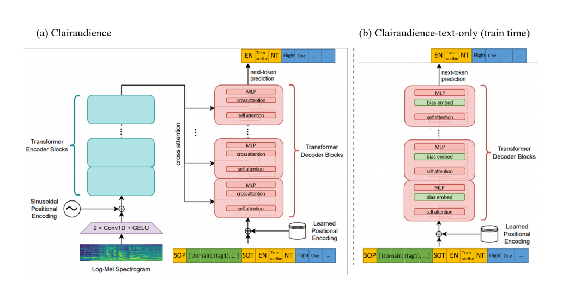
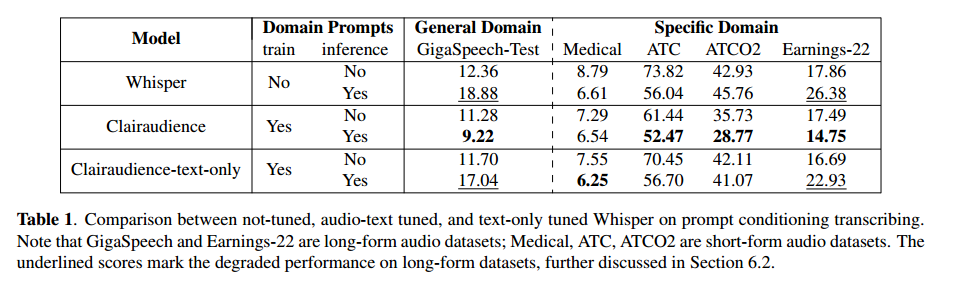
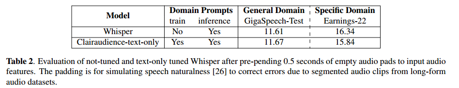
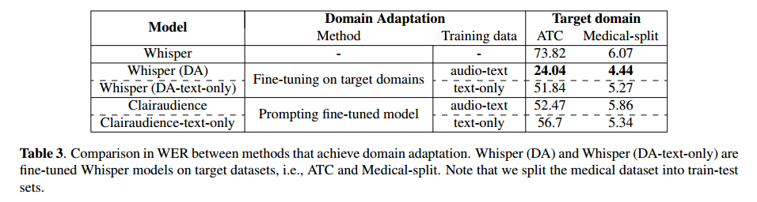

# 零样本域敏感语音识别与提示条件微调

英文名：ZERO-SHOT DOMAIN-SENSITIVE SPEECH RECOGNITION WITH PROMPT-CONDITIONING FINE-TUNING

论文链接：https://arxiv.org/abs/2307.10274

论文代码：https://github.com/mtkresearch/clairaudience

在这项工作中，我们提出了一种方法，可以创建具有领域敏感性的语音识别模型，通过将其生成与给定的文本提示相结合，利用文本领域信息。这是通过对预训练的端到端模型（Whisper）进行微调，使其能够从具有提示示例的演示中学习而实现的。我们展示了这种能力可以泛化到不同领域甚至不同的提示上下文，我们的模型在不同领域的未见数据集上可以获得高达33%的词错误率（WER）降低，包括医疗对话、空中交通管制通信和金融会议等。考虑到音频文本-数据对的有限可用性，我们进一步将我们的方法扩展到仅文本微调，以实现领域敏感性和领域适应性。我们证明我们的仅文本微调模型也可以适应各种提示上下文，其中在医疗对话数据集上，该模型达到了29%的WER降低。

## 引言

在自动语音识别（ASR）领域，已经迅速部署了ASR系统到众多不同行业领域的下游应用，包括金融、医疗保健和交通运输等[1, 2, 3]。最近的研究表明，通过识别特定领域情景，有潜力改进现有的ASR系统[4, 2]。Domain-Prompts [4] 通过学习一小组领域特定的参数来重新评分多领域ASR系统生成的假设，其中输入包括领域名称。然而，由于重新训练或维护微调模型副本所需的资源密集型要求，这种策略难以扩展到未知领域。

与此同时，在自然语言处理（NLP）领域，预训练的大型语言模型通过**条件提示**在各种NLP任务中表现出卓越的性能[5, 6, 7]。最近的研究强调了提示方法的有效性，其中通过用**提示学习**进行微调的文本分类模型在推断时可以在未见领域的数据集上表现出显著的性能[8]。这种方法吸引人的地方在于它增加了应用领域的数量，而无需重新训练。具体来说，PADA [8] 通过提示和领域情景对T5模型[9] 进行微调，以便在推断时，该模型可以利用在未见领域上生成的提示产生的假设进行情感分类[8]。

受自然语言处理领域的进展启发，我们在这项工作中的目标是开发一个**零样本领域敏感的语音识别模型**，它可以利用领域特定的信息，而无需在目标领域进行训练。具体来说，我们将领域情景和标签的信息，这些在应用中容易获得的信息，纳入到提示任务中。然后，我们使用**条件提示**对**Whisper模型**进行微调，这是一个大规模预训练的ASR模型[10]。通过这种提示条件微调过程，Whisper可以对给定的提示变得敏感，并有效地利用可用的领域信息。我们选择Whisper模型是因为它利用了丰富的互联网资源，其中包括了成对的音频文本数据，并且是用简单的**编码器-解码器架构**[11] 进行训练，已经显示出很好的可扩展性，可以灵活地包括提示信息[12, 9]。在Whisper的训练阶段，Whisper解码器已经处理了大约60亿个令牌的多样化网络转录，使解码器成为ASR系统的强大语言模型。因此，我们假设Whisper模型具备足够的语言能力，可以进一步进行微调以实现**领域敏感性**。我们将使用我们的文本提示对Whisper模型进行微调的模型称为**Clairaudience**。我们展示了在Gigaspeech数据集[13] 上对Clairaudience进行微调，可以在利用Medical [14]、UWB-ATCC (ATC) [15]、ATCO2 [16]、Earnings-22 [3] 数据集的先前信息方面表现出领域敏感性。在这些领域特定数据集上的实证结果表明，在词错误率（WER）方面有一致的降低，从33.0%降低到17.4%。

此外，获取大量标记数据可能具有挑战性，并且在应用领域只有无标签的文本可用情况下很困难[17, 18]。我们展示了使用**仅文本数据**并通过提示条件微调来使Whisper具有领域敏感性是可行的。我们将使用这种方法进行微调的模型称为**Clairaudience-text-only**。对Gigaspeech文本进行Clairaudience-text-only微调的实验结果表明，该模型不会忽视音频特征，并在所选领域实现了零样本改进。仅文本结果的有效性促使我们调查模型是否可以通过直接在领域文本上进行微调来进一步改进。这个设置与传统的领域适应最相似。我们发现，在领域文本上微调的Whisper在ATC数据集和分割的Medical数据集上的词错误率与Clairaudience相似，但更低。

以下是我们的贡献总结：

- 我们解决了在推断期间将领域特定信息，如情景和标签，纳入Whisper模型的挑战，而无需在未知领域进行重新训练。
- 我们提出通过在GigaSpeech数据集上使用包括GPT3.5生成的领域标签的文本提示，通过（i）音频-文本对或（ii）仅文本数据对模型进行微调，以实现领域敏感的Whisper。
- 我们的实验表明，通过文本提示进行微调的模型在医疗、金融和交通运输数据集上具有零样本领域敏感性，并且展示出显著的词错误率改进。

## 背景

我们的方法是基于**Whisper模型**构建的。在本节中，我们将简要概述Whisper模型，重点关注它与提示方法的关联。

Whisper模型表明，使用大规模弱监督的音频-文本训练的ASR模型可以零样本迁移到现有数据集并表现良好。Whisper模型利用了编码器-解码器架构[11]，这已经被证明在大规模应用中表现良好[19]，并且在没有微调的情况下在一些任务上展示出竞争力的少样本性能[5]。在训练过程中，模型接触到各种任务，如语音活动检测、语音转录、翻译和语言识别。编码器模块处理对 log-Mel 频谱图作为输入，并生成音频特征。然后，解码器采用这些音频特征以及附加的提示标记序列来生成音频文本。

Whisper模型可以通过指定一系列任务特定的标记作为输入提示来进行语音翻译或转录。例如，在推理过程中，标记序列可以是  **<|startoftranscript|>**  用于语音转录，而  **<|translate|>**  可以用于从德语到英语的语音翻译。在预训练期间，该模型使用历史文本作为上下文来解决具有长距离转录的模糊音频。因此，我们假设通过将**自定义提示**作为**上下文文本**提供给预训练的Whisper模型，我们可以使模型具备利用领域情景/标签的能力。

## 提示条件微调

我们的目标是对端到端语音识别模型进行微调，使其具备利用文本提示提供的信息来降低生成文本的词错误率（WER）的能力。我们期望微调后的模型将能够根据文本提示来区分发音相似的短语，并通过文本提示来识别领域特定的词汇。在本文中，我们关注包含更广泛上下文、情景和流派描述的文本提示，这些信息在音频剪辑中无法捕获。我们的方法可以轻松扩展以适应其他提示格式、上下文甚至其他提示的模态。

由于缺乏公开可用的将音频剪辑与文本提示相关联的语音识别数据集，我们决定主动生成这个数据集。理想的方法是扩充Whisper模型的原始训练数据，以避免将我们的发现与通过额外数据训练获得的改进混淆。由于数据集未发布，我们决定使用GigaSpeech [13]，这是一个从网络音频中收集的数据集，具有丰富的语音上下文多样性。然后，我们基于音频剪辑生成简明而多样化的领域标签，这些标签类似于大型语言模型（LLM）用于生成监督任务数据的工作[20, 21, 22]。对于每个完整音频（平均包含约4,000个标记的完整音频文件），我们使用音频文本在GPT3.5中生成了十个领域标签。

考虑到灵活性和可扩展性，我们决定将提示插入到 **<|prev|>** 的标记和 **<|startoftranscript|>** 之间，格式为**<|prev|>[ domain: {DOMAIN_1}, {DOMAIN_2}, ...]<|startoftranscript|>**，然后是其余的解码器输入序列，其中 {DOMAIN_n} 代表领域标签（参见图1）。在训练期间，领域标签被随机抽样并合并到添加到解码器输入的提示文本中。

图1. Cliaraudience 和 Clairaudience-text-only。 (a) 在Clairaudience的训练期间，模型接受带有包含领域提示的文本的音频-文本对。模型进行音频转录的下一个标记预测。 在推理期间，模型接受音频-提示对，其中每个提示包含来自目标领域的通用领域标签。然后，模型自回归生成文本。 (b) 在Clairaudience-text-only的训练期间，只训练了Transformer解码器。解码器层的交叉注意力输出被替换为可学习的偏置项，以表示音频特征。在推理期间，关闭偏置项，使用交叉注意力输出。Clairaudience-text-only的推断过程与Clairaudience和Whisper相同。图示来源：[10]。

## 仅文本训练

Whisper遵循编码器-解码器 Transformer 架构。在每个解码器块中，执行层输入与编码器输出嵌入之间的交叉注意力，这依赖于音频剪辑。我们通过将每个交叉注意力层的输出替换为可训练的偏置来移除这种注意力机制，如图1所示。添加偏置项的想法受到了无分类器引导的启发[23]。然后，模型通过传统的**序列到序列**训练进行微调。

由于模型是通过仅文本数据进行微调的，因此模型可能容易发生灾难性遗忘[24, 25]。之前的研究[25]通过一个两阶段过程来解决这个问题，首先利用音频-文本微调，然后过渡到仅文本微调。然而，我们发现，在预训练的Whisper模型上进行仅文本数据的提示条件微调时，模型对灾难性遗忘具有鲁棒性。因此，我们在进行所有仅文本微调时没有交错进行任何音频-文本微调。

## 实验配置

### 评估细节

我们的实验使用了Whisper-large-v2（1550M参数）1，这是Whisper模型系列中最大的版本，作为基准模型和比较基线。

我们使用了三个波束搜索生成顶部候选项的转录，以便在论文中报告所有的结果。按照Whisper的设计，我们使用 <|english|> 来指示开始预测，并通过将语言标记设置为 <|english|> 和任务标记设置为 <|A|> 来指定任务为英语转录。然后，加入一个 <|A|> 标记以指示不需要时间戳预测。如果给解码器提供了文本提示，它将被预置到 <|startoftranscript|> 标记之前，并附加一个 <|A|> 标记。以下是在推理时的解码器输入示例： [ domain: Finance, Real Estate, Investment] <|english|>。

性能通过词错误率百分比（WER）和相对基准系统的词错误率降低百分比（WERR）来衡量。

### 数据准备

在我们的实验中，需要两种类型的数据集：（i）一个类似于Whisper训练数据的通用数据集，用于使用提示进行微调，以及（ii）领域特定数据集，其中可以提取或分配领域标签，用于评估模型的零样本性能。

正如第3节所述，我们在GigaSpeech Medium（1000小时）的训练集上使用GPT3.5生成的领域标签进行提示条件微调。我们观察到，在模型训练100小时的音频后，损失会趋于稳定，因此微调所需的数据量远远低于预训练端到端ASR系统所需的数据量。

为了评估微调模型的领域敏感性，我们选择了三个领域的数据集：医疗对话、空中交通管制通信和金融会议。对于医疗对话，我们选择了Kaggle上的"Medical Speech, Transcription, and Intent"（Medical）[14] 数据集，其中包含8.5小时的音频-文本对以及每对附加的领域标签。领域标签用于构建领域提示实验中的文本提示。对于空中交通管制，我们使用了UWB-ATCC（ATC）[15] 和附带有机场信息注释的ATCO2 [16] 的子集，分别包含10小时和2小时的空中交通管制通信片段。对于金融会议，我们使用Earnings-22 [3]，包括约100小时的英语盈利电话。我们将在第6.1节中讨论我们在个别数据集中提取和分配提示信息的方法。

## 实验和结果

### 提示条件微调

这个实验旨在调查通过在GigaSpeech上使用包含GPT生成的领域标签的提示进行音频-文本和仅文本微调获得的提示条件能力的普适性。我们的目标是确定这种能力是否可以在不需要进一步适应的情况下扩展到不同的数据流派和不同类型的提示内容。

我们在三种不同的设置下进行性能比较：(i) **Whisper**，(ii) **Clairaudience** 和 (iii) **Clairaudience-text-only**。我们的模型都是使用提示进行训练的，并且我们在有提示或没有提示的情况下评估模型性能。请注意，上面提到的所有微调都是在GigaSpeech上进行的，模型尚未接触到我们在评估中使用的数据集。

除了GigaSpeech，模型微调的通用领域数据集之外，我们还在四个领域特定数据集上评估这三种设置，分别是医疗、ATC、ATCO2和Earnings-22，这些数据集具有独特的提示内容。在推理时为每个数据集生成的文本提示如下所解释：

- **GigaSpeech-Test**：我们采用与训练期间相同的提示格式；与随机抽样不同，我们向模型提供了由GPT3.5生成的所有十个领域短语。需要注意的是，在这一部分中，我们使用了GigaSpeech的测试集，该测试集包含了与用于训练的不同来源的网络音频剪辑。因此，模型是使用在训练期间从未遇到过的文本提示进行评估的。
- **医疗**：我们从数据集中每个音频剪辑关联的现有症状标签构建文本提示。这些症状标签包括25个简洁的短语，广泛描述了医疗症状，包括例如“咳嗽”、“胃痛”等。每个音频剪辑只与一个症状配对。
- **ATC**：由于该数据集不包含有关个别音频的任何信息，我们对所有音频剪辑的文本提示中包含"空中交通管制"作为领域标签。
- **ATCO2**：我们从每个音频剪辑关联的机场名称、通信频道类型和航空公司呼号构建文本提示。一个文本提示中的领域内容示例可能是：“锡永机场，控制频道，呼号：Alitalia Hansa KLM...”。
- **Earnings-22**：类似于ATC，该数据集不包含有关个别音频的信息。在这种情况下，我们使用领域短语"股东会议"、"盈利电话"、"投资网络研讨会"和"财经新闻"。

提示条件的转录结果列在表1中。我们观察到，在进行微调之前，Whisper具有一定的能力利用文本提示中的信息来提高其转录的准确性。令人惊讶的是，它可以通过一个简单的提示“空中交通管制”将ATC的WER从73.82%降低到56.04%。然而，在GigaSpeech-Test、ATCO2和Earnings-22上，**向没有微调的Whisper添加提示会对其预测产生负面影响**。相反，我们的音频-文本微调模型（Clairaudience）在所有数据集上都表现出改善。该模型展现出了强大的能力，能够利用给定的文本提示来降低其预测的WER。与其在GigaSpeech-Test上的性能一致，它在所有数据集上都实现了显著的WER改善。至于仅文本模型（Clairaudience-text-only），它在关注音频特征时没有灾难性遗忘。该模型展现出的能力较弱，但仍然优于带提示的Whisper在医疗和ATCO2数据集上的表现。它在医疗数据集上的WER低于音频-文本微调模型。然而，与提示的Whisper类似，Clairaudience-text-only在带提示的情况下在GagaSpeech-Test和Earnings-22上的评估结果较差。这种性能下降部分归因于长形音频数据集中的分段音频（音频长度> 30秒）。另一方面，Clairaudience不受这个问题的影响，实现了最低的WER。

有趣的是，我们观察到，即使这些模型是在通用领域数据集上进行微调的，**没有提示的情况下**对Clairaudience和Clairaudience-text-only的评估**在领域特定数据集上也有所改善**。我们推测这种收益是由**来自通用领域数据集学到的更好的音频特征和文本特征对齐**所贡献的，这些对齐可能在特定领域中也存在。然而，Clairaudience的结果表明，在推理过程中使用领域提示会持续降低所有领域特定数据集的WER，当在带提示和不带提示的推断之间进行对比时。

### 分段音频的语音自然度（Speech Naturalness）

鉴于在评估长音频数据集（例如GigaSpeech和Earnings-22）时，带提示的Whisper和Clairaudience-text-only都表现出降低的性能，我们调查了音频输入并发现这两个模型经常无法转录未完成句子的分段音频。

以未完成的句子开头的音频导致模型不输出转录或幻想。为了解决这个问题，我们尝试在输入音频的开头添加0.5秒的空白音频。这个方法的直觉是，填充的音频模拟了句子内的语音自然度[26]，我们假设Whisper的预训练数据中存在未完成句子的情况。表2中的结果表明，这种启发式方法有效地纠正了错误。Clairaudience-text-only甚至在Earnings-22上表现优于带提示的Whisper，与其他领域特定数据集的结果一致。

### 仅文本域自适应

根据Clairaudience-text-only的结果，我们已经证明了在各种领域中启动仅文本微调模型的有效性。在类似于我们的另一个研究设置中 - 领域适应，通常会对目标领域进行微调[18, 4, 17]。因此，我们调查了是否可以在传统的领域适应设置下通过应用仅文本微调过程来改善Whisper模型的性能。

我们使用**音频-文本对**微调和我们的**仅文本**微调方法将Whisper适应到空中交通管制通信和医疗对话领域。由于默认数据集没有训练-测试拆分，我们将医疗数据集按照85:15的比例划分为适应集和评估集。然后，使用适应集的音频转录或转录微调Whisper，并在评估集的音频-转录对上进行评估。

结果见表3。正如预期的那样，在目标领域使用音频-转录对微调的Whisper模型（Whisper (DA)）实现了最低的WER。与未微调的Whisper模型相比，在目标领域使用文本-微调模型（Whisper (DA-text-only)）在ATC和Medical-split上分别实现了显著的20%和13%的WER改进。令人惊讶的是，Whisper (DA-text-only)的性能与ATC上的Clairaudience以及Medical-split上的Clairaudience-text-only相比，绝对WER差别仅为0.63%和0.07%。这个结果强调了将我们的提示-微调过程应用于预训练的端到端ASR系统，在实现性能良好的ASR结果方面，通过提示而不是传统的领域适应方法的有效性。

## 相关工作

我们的工作涉及几个广泛的研究领域，包括提示工程、多领域自动语音识别和文本-仅领域适应。在语音处理系统的应用中，提示工程直到最近才引起关注。

在[27]中的工作将冻结的Whisper提示到未见过的任务，例如音频-视觉识别、混合编码语音识别和语音翻译。SpeechPrompt [28]使用微调的wave2vec2模型生成提示，作为输入传递给GPT2进行音频分类。此外，仅文本训练在领域适应中已经得到广泛研究。[29]中的工作在目标领域对外部语言模型进行微调，以重新评分ASR系统的输出，以实现领域适应。浅层融合在外部语言模型和ASR系统之间进行结果的线性插值[30]。Domain-Prompts [4]可能是与我们最相似的工作，它将音频和领域名称作为输入，并输出由带有领域特定参数的提示微调的GPT2选择的重新评分转录。然而，与这些工作不同的是，我们考虑了通过上下文提示微调模型以具有领域信息来处理多个领域的设置。

## 讨论

我们的论文探讨了一个简单的问题：一个经过微调的ASR模型，通过使用领域信息作为提示，是否可以在未知领域中提高性能，而无需额外的重新训练？我们的微调模型Clairaudience和Clairaudience-text-only在大多数领域特定数据集上提高了性能，超过了未经微调的Whisper模型，并且在仅文本领域适应的进一步实验中，提示的Clairaudience模型可以在领域适应方面实现与直接在目标领域上使用文本-仅数据微调的Whisper模型类似的性能。

至于我们研究的局限性，评估所选领域存在一定的主观性，而且我们的评估方法对短音频转录最为稳健。我们的第一个局限性是个别领域特定信息可能已出现在GigaSpeech训练集中。

在表1中，我们观察到与没有提示的推理设置相比，微调模型的性能有所改善。这种改善可能归因于**微调和测试数据之间的数据重叠**，如前面所述。此外，我们观察到，与Whisper相比，Clairaudience的性能在其他通用领域数据集，即Common Voice [31]和LibriSpeech [32]上的绝对WER降低了最多0.95%。这种差异可能归因于在拟合模型到GigaSpeech数据集时分布偏差，该数据集可能不像Whisper的预训练数据集那样全面和多样化。另一个局限性是**Whisper是在音频片段（30秒）上训练的，而不是在任意长的音频输入上训练**，这是由于内存限制所致。为了处理长形式转录，Whisper模型在  token 和  token 之间插入先前生成的文本，以通知模型关于当前片段之前的语音。尽管我们在文本提示周围添加了括号，但我们观察到，在仅文本数据上进行微调的模型也会继承这种机制，并且当输入音频是未完成的句子的一部分时，会错误地将提示视为先前的文本，如在第6.2节讨论的那样。这种行为在未经微调的模型中更为明显。有趣的是，尽管从未见过提示和先前文本共存的设置，但在音频-文本数据上进行训练的模型对这种问题是免疫的。因此，我们假设可以通过将**仅文本调整与少量音频-文本调整混合**或利用Whisper中的声音检测任务来更好地解决这个问题，正如[33]中所述，并将该研究留给将来的工作。

## 结论

在本文中，我们提出了一种通过在领域信息的提示下对端到端ASR模型进行微调，以实现跨多个领域的泛化的方法。我们展示了该方法在使用音频-文本或仅文本数据进行微调的模型中的有效性。我们的实验结果表明：(i) Clairaudience，在GigaSpeech上进行微调并进行提示，对Medical、ATC、ATCO2和Earnings-22数据集是零样本领域敏感的。在与Whisper和Clairaudience-text-only的比较中，它实现了最佳的WER；(ii) Whisper可以通过仅微调其解码器来变得领域敏感。结果的Clairaudience-text-only模型在Medical、ATCO2和Earnings-22数据集上表现优于Whisper；(iii) 通过领域提示，Clairaudience可以与Whisper (DA-text-only)表现类似，后者是直接在ATC和Medical-split数据集上进行仅文本微调的模型。

我们希望我们的论文能激发对更多基于提示的ASR系统、零样本学习以及使用仅文本数据来改进端到端ASR系统的进一步研究。