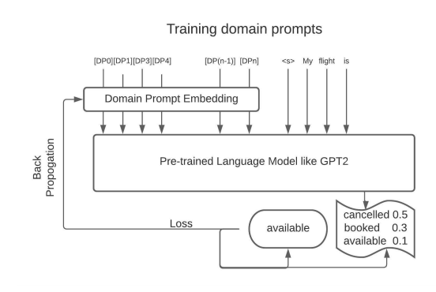
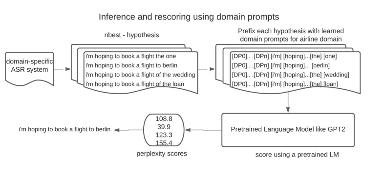
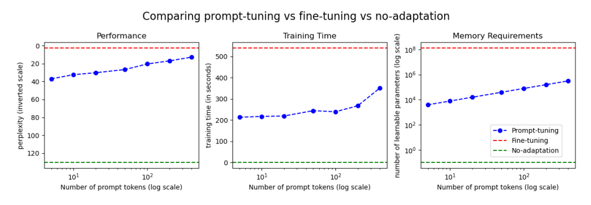
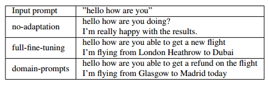
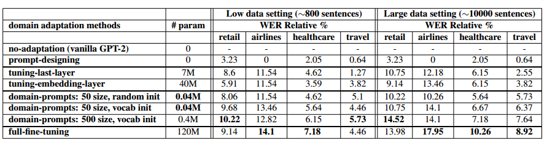
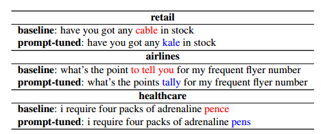

# 领域提示：朝着存储和计算高效的自适应ASR系统方向前进

英文名：DOMAIN PROMPTS: TOWARDS MEMORY AND COMPUTE EFFICIENT DOMAIN ADAPTATION OF ASR SYSTEMS

论文链接：https://arxiv.org/abs/2112.08718v1

自动语音识别（ASR）系统已在各种各样的领域应用中找到了用途。由于领域特定的系统在领域内评估中表现优于其通用对应物，因此显然需要具备存储和计算高效的**领域自适应**。特别是，对于用于重新评分ASR假设的参数大的基于Transformer的语言模型进行适应具有挑战性。在这项工作中，我们介绍了**领域提示**（domain-prompts）方法，该方法训练了少量领域**令牌嵌入参数**，以使基于Transformer的语言模型适应特定领域。仅使用每个领域的少量额外参数，我们在未经调整的语言模型基线上实现了7-14%的词错误率（WER）改善。尽管参数高效，但这些改善效果与拥有数亿参数的完全微调模型相当。通过在提示大小、数据集大小、初始化和领域上进行消融实验，我们提供了使用领域提示在ASR系统中的好处的证据。

## 引言

自动语音识别（ASR）系统构成了各个行业产品的关键组成部分。由于它们在性能方面的最新进展[1, 2, 3]，已经在包括医疗保健、旅行预订和客户服务在内的广泛领域中得到了部署。进一步提高这些系统性能的典型技术是使用外部语言模型（LM）对n个最佳假设进行重新评分，因为与标记的音频数据相比，文本数据更容易获得[3, 4]。最近基于Transformer的语言模型，如GPT-2 [5]和BERT [6]，在各种语言建模任务中都表现出了与传统模型相比的显著增益。然而，这些语言模型包含数百万个参数，将它们调整为资源有限的领域特定ASR系统存在挑战。维护多个领域适应的这些LM的副本是不可扩展的，因为涉及到大量的内存、计算和维护成本。另一方面，适用于所有领域的通用版本的LM在性能上不如领域特定的LM [7, 8]。因此，明显存在在性能和成本之间找到平衡的需求。

最近的语言建模文献[9, 10, 11, 12, 13, 8]包括了解决将大型语言模型高效适应特定任务的新方法。与为每个任务进行微调和存储数百万个参数不同，它们提出了一些关于使用通用的与任务无关的LM副本以及每个任务的有限附加参数的思路。因此，这些方法在成本和每个独立任务的性能之间达到了所需的平衡。例如，AdapterHub [9]引入了与冻结的预训练LM权重一起的新的任务特定层，而Leopard [11]提出了一种基于元学习的方法，可以使用来自未知任务的很少训练示例来快速适应预训练参数。更近期的模型，如GPT-3 [14]，能够借助描述任务的单词（称为提示）来解决新任务。

与为NLP任务调整语言模型不同，本文侧重于ASR系统的领域自适应，扩展了[**15**]的工作。我们的目标是**学习一组小型领域特定参数**，以比未经调整的基于Transformer的语言模型更好地评分领域特定的ASR假设。我们从任务自适应中借鉴了**提示微调**（prompt-tuning）[10]的思想，引入了用于实现我们目标的领域提示。我们将领域提示定义为领域特定的嵌入，当添加到任何句子的令牌嵌入前，并通过基本的语言模型，可以得到该领域特定句子的发生概率。在我们的领域自适应方法中，可训练参数的数量（提示令牌的数量乘以嵌入大小）远小于LM的大小，但却实现了与完全微调的领域特定LM相似的性能。我们的主要贡献总结如下：(1) 我们以参数高效的方式引入领域提示，以使基于Transformer的语言模型适应特定领域，(2) 在小内存和计算开销下，我们展示了与使用普通的、开箱即用的LM的ASR系统相比，WER改善了7-14%，(3) 特别是在低数据环境中，我们的方法与完全微调的模型性能相匹配，甚至击败了其他LM自适应方法，尽管它仅使用完整模型参数的<0.3%。

## 方法论

GPT-3 [14]引入了提示作为特殊的文本令牌，描述了有助于模型理解任务的内容。例如，要解决机器翻译任务，可以在推理过程中只需添加这些提示，而无需使用相应的数据集对模型进行微调，就可以实现可比较的性能。在提示微调[10]中，与为任务手动设计这些提示不同，**模型直接使用来自任务的少量标记示例来学习提示令牌嵌入**。我们证明，这样的嵌入也可以用于任务的不同领域，即，我们可以在句子前添加额外的领域特定令牌，从而提高来自该领域的句子的得分。我们假设基于Transformer的语言模型中的自注意力层将会在学习的领域嵌入和句子中的令牌之间创建相互作用，从而提高得分以适应该领域。我们通过在第3节中评估困惑度分数来验证我们的论点。图1总结了训练和推理步骤。在训练过程中，我们将一个随机初始化的领域提示嵌入前缀添加到来自该领域的训练句子中，通过一个普通的Transformer LM进行传递，并预测下一个令牌。我们通过反向传播损失来更新领域特定嵌入，保持其他参数不变。在推理过程中，我们将学习的领域提示前缀添加到测试句子中，并计算整个输入的困惑度。对于ASR系统，我们使用这些困惑度分数来重新排列声学模型（AM）的假设。

**领域提示的训练部分**

**领域提示的推理部分**

上述描述的方法还有两个额外的细节。首先，与之前的工作[10]一样，我们在一些实验中并不随机初始化领域提示嵌入，而是从该领域词汇表中最常见的单词令牌嵌入开始。其次，由于相同的学习领域提示被添加到该领域中的每个假设前面，我们预先计算并保存 Transformer 的状态直到k个时间步，其中k是领域提示令牌的数量。我们在为同一领域中的所有假设打分时重复使用此状态，以节省ASR系统的推理延迟。

## 实验设置

**目标**：为了测试所提出的领域提示在领域自适应中的有效性，我们进行了大量的实验，涉及不同的领域、提示大小、初始化和训练集大小。我们的一个目标是确认领域提示学习领域特定知识的能力，并研究提示令牌大小对性能和成本的影响。为此，我们展示了领域特定句子的困惑度数据，并提供了通过提示模型生成的文本的定性示例。接下来，我们展示了领域特定LM在ASR系统中的重要性，并比较了基于性能和参数效率的各种领域自适应方法的有效性。

**方法论**：我们在实验中评估了以下方法。在这些方法中，我们使用领域特定数据更新Transformer LM的不同权重集合，同时保持其他权重不变：(1) 无自适应：不更新任何参数，因此是一个普通的LM。这是我们所有实验的基线，(2) 提示设计：不更新任何参数，但手动在输入句子前缀中创建提示。这些提示是对每个领域进行描述的15-20个单词的摘要，(3) 完全微调：更新LM的所有参数，(4) 领域提示：仅更新领域提示令牌嵌入，(5) 调整最后一层：更新Transformer LM的最后一个解码器层的权重，以及(6) 调整嵌入层：仅更新Transformer LM的令牌嵌入权重。

**数据集**：对于我们的初始实验，以计算领域特定数据集上的困惑度分数，我们使用了公开可用的MultiDoGo [16]数据集的文本数据。我们在一个预训练的LM之上添加并学习领域提示，使用训练集来调整超参数，然后在测试集上计算困惑度分数。我们报告了在快餐领域的数字，该领域的训练、开发和测试对话分别为6748、1446和1446。每个对话平均包括10轮代理-客户对话。对于ASR系统的下一个实验，我们使用内部数据集进行LM的领域自适应以及重新评分后的评估。数据已删除所有个人身份信息，不包含任何用户识别信息。领域自适应数据是一个仅包含文本的数据集，其中包含了第4节讨论的领域中的对话话语。我们在实验中对所有领域随机采样了800或10000个这样的话语。假设的重新评分是在8kHz的对话数据集上进行的，每个领域包括500个音频和其转录。这个数据集代表了面向任务的对话系统中常见的ASR应用。

**实验设置**：我们使用GPT-2模型[5]作为基于Transformer的LM。我们使用一台配备16块Tesla K80 GPU的计算机进行所有实验，并以秒为单位报告墙钟时间。用于评估的n个最佳假设是由混合ASR系统（包括第一遍AM和LM）生成的网格的输出，其中n ≤ 50。第一遍LM包括一个标准的4-gram语言模型，训练在异构的文本语料库上。它使用Kneser-Ney（KN）[17]平滑，并具有50万词的词汇量。本文中报告的所有数字都是WER相对百分比（WERR），表示相对于重新评分的开箱即用的GPT-2（即无自适应基线）的WER改进。

## 结果和讨论

### 困惑度评估

我们在MultiDoGo数据集的快餐领域中总结了图2中的结果。在这里，我们比较了用于附加领域的困惑度、训练时间和用于保存更新参数的内存。横轴表示使用的领域提示的大小，而纵轴则表示度量值。我们还添加了用于参考的无适应基线（绿色）和完全微调（红色）的水平线。前者不需要为新领域额外的内存或训练时间，但性能较差，而后者会更新数百万个参数。另一方面，我们的方法（蓝色）处于两个极端之间的中间地带，受领域提示大小的控制。只需5个提示令牌，困惑度从无适应基线的130降至37，而使用400个提示令牌，我们实现了与完全微调模型类似的困惑度。除了这些困惑度分数，我们还在表1中提供了我们模型为航空公司领域生成的文本，以验证领域提示能够生成与领域相关的连贯句子。

图2 比较了不同域自适应方法的性能、计算量和内存开销

表1 航空领域生成文本

### WER 评估

表2总结了我们在ASR系统中使用领域提示的实验结果。我们在两种不同的数据设置下评估了识别错误率（WER）：低数据和大数据（如表2顶部所示）。在低数据设置中，我们对所有领域适应方法只使用了800个示例。在大数据设置中，我们使用了大约多12倍的示例。接下来，我们使用四个不同的领域进行广泛的比较。对于这些领域，我们拥有足够的相关领域特定的微调数据，使用这些数据可以在普通Transformer模型的基础上获得合理的正面增益（9-18%的WER改善）。表3显示了我们数据集中的一些定性示例，学习领域特定知识对于重新评分非常有用。

根据ASR系统的n-best列表的质量，不同领域的改进程度各不相同。表格的第一列还突出显示了每个领域每种领域适应方法学习的附加训练参数的数量，其中M表示百万。请注意，实验的目标不是找到性能最佳的方法，而是发现在最少数量的附加参数下实现最佳性能的设置，从而找到实际实用性。

表2 不同领域适应方法在参数数量和WERR%指标方面的比较 

表3 定性示例：比较通过领域提示调整的GPT-2与普通GPT-2（基线）的输出。

**在低数据设置下，领域提示实现了与全面微调模型相媲美的性能**。这个设置代表了非常常见的实际应用场景，其中对话管理中ASR系统仅有有限数量的领域特定数据可用。在这种情况下，我们观察到领域提示模型几乎能够与完全微调模型相匹配，而可训练参数的数量明显较少。我们将这一发现归因于领域提示足够能够在不过拟合的情况下捕获有限领域特定示例中的所有信息。因此，在这种设置下，领域提示成为明显的选择，因为它实现了相当的性能，但在所有其他方法中具有最少的可训练参数，从而节省了内存和计算成本。

**领域提示是参数高效的**。如表格右半部分所示，当我们拥有足够的微调数据时，我们发现领域提示方法可以在非常小的内存开销下，比普通的GPT-2模型实现7-14%的WER改善。尽管在这种设置下，经过微调的模型表现更好，但与领域提示方法相比，它们的性能提升较小，而且需要存储和更新大约300倍于领域提示嵌入的参数。当与涉及更新单个层并冻结模型其余部分的自适应方法相比（这些方法使用7M-40M个参数）时，具有40k参数的领域提示表现始终更好。这是可以预期的，因为在大型模型架构中难以手动选择要调整的所有高影响参数的子集，因此这些方法失去了参数效率。相反，领域提示提供了更好的方法，它保持了整个模型架构不变，但在模型的输入前缀中添加了额外的可训练参数。此外，通过手动设计这些提示在提示设计中并没有带来明显的改善，这表明必须使用领域特定数据来学习这些提示。

**消融实验（Ablations）**。表中还包含了一些有关提示大小和初始化方法的消融实验，以了解它们对性能的贡献。如第2节所述，我们使用最常见的词汇词初始化了领域提示。这比随机初始化提示嵌入略有改进。由于这些词汇代表了领域，它们被证明是学习领域特定嵌入的有用起点。此外，我们还观察到将领域提示的大小从50增加到500会带来小幅改进，但也会增加额外的内存成本。因此，这些超参数为ASR系统开发人员提供了灵活性，可以根据需要有效地权衡成本和性能。

## 结论

我们提出了一种名为“领域提示”的内存和计算高效的领域适应方法，适用于基于Transformer的语言模型，如GPT-2，以用于对ASR假设进行重新评分。

通过将这些提示前缀添加到输入句子中，我们将模型偏向特定领域，从而更好地对来自该领域的句子进行评分。仅使用每个领域额外0.3%的参数，**我们的方法在领域特定数据集上实现了与完全微调模型相当的困惑度和WER（识别错误率）数值**。在内存开销非常小的情况下，我们的方法相比使用普通的GPT-2模型实现了7-14%的WER改进。特别是在低数据设置下，我们的方法与微调性能相当。这种设置在工业中具有重要意义，因为它使ASR系统能够以可扩展的方式适应资源有限的领域。领域提示代表了一种情况，其中一种用于有效适应语言建模任务的技术可以为ASR系统中的领域适应产生积极的结果。我们计划在未来为ASR系统调整更多类似的想法，如AdapterHub [9]、Side-tuning [18]等。