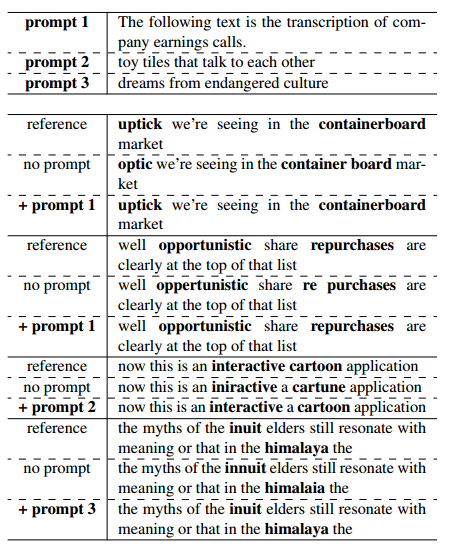
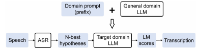
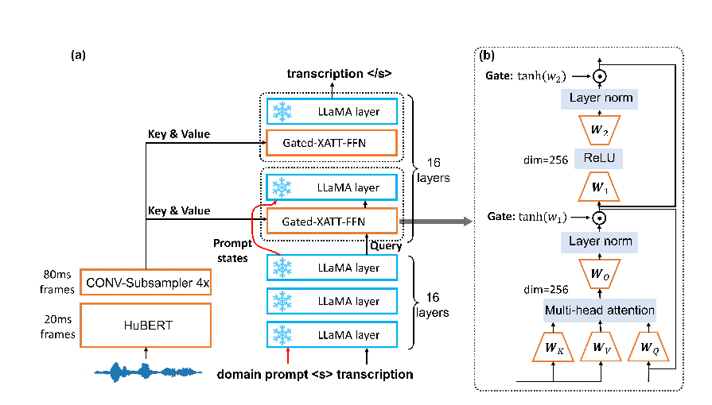
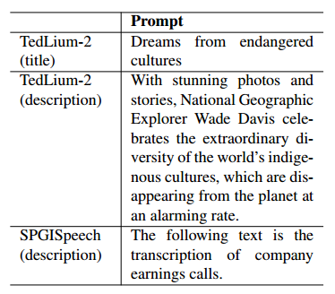
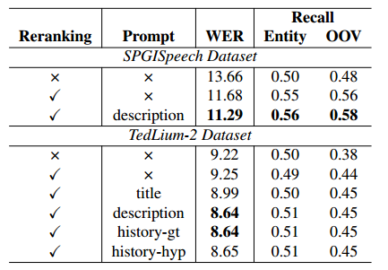
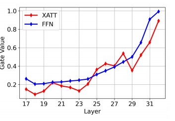
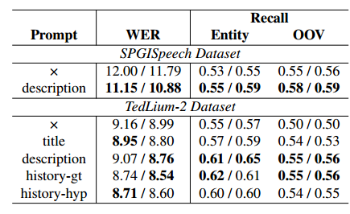

# 使用大型语言模型进行语音识别零样本领域自适应提示

论文链接：https://arxiv.org/abs/2306.16007

Language Models (LMs) 的整合已被证明是解决语音识别中领域偏移的有效方法。然而，这些方法通常需要大量的目标领域文本数据来训练LMs。与这些方法不同的是，在本工作中，我们仅使用**特定领域的文本提示**，提出了两种零样本ASR领域自适应方法，使用了一个70亿参数的大型语言模型（LLM）LLaMA。LLM的应用方式有两种：1）**两阶段重排序**：使用LLaMA对给定ASR系统的N个最佳假设进行重新排序；2）**深度LLM融合**：将LLM合并到基于编码器-解码器的ASR系统的解码器中。实验表明，仅使用一个领域提示，这两种方法都可以有效降低超出领域的 TedLium-2 和 SPGISpeech 数据集上的词错误率（WER）。特别是，深度LLM融合具有更好的实体识别和超出词汇词的召回率优势。

## 引言

端到端（E2E）自动语音识别（ASR）系统[1, 2, 3, 4, 5]已经表现出比传统的 pipeline 方法更卓越的性能，尤其是在**模型规模和监督数据集的规模上有所增加**。然而，E2E ASR仍然存在领域不匹配和文本语料库有限利用的问题。为了解决这些问题，通常会引入外部语言模型（LMs）。其中，不改变ASR模型架构的两种技术是"second-pass rescoring"[6]和浅层融合[7]。或者，LMs可以被集成到ASR模型解码器中作为内部LMs，例如深度融合[8]和冷融合[9]，将LM的隐藏状态与ASR模型合并。分解的神经 transducer 模型[10, 11]是另一种有前途的架构，它分别预测空白标记和词汇标记，以便词汇预测器充当完整的语言模型。

利用语言模型（LM）可以使ASR领域自适应更加容易，因为收集目标领域的文本比音频文本对更容易。在这种情况下，用于ASR适应的LM可以通过微调[12, 13, 14, 15, 16]或提示调整[17]来开发。尽管这些方法显示出了有希望的结果，但值得注意的是，常用的LMs，如GPT-2 [18]和Transformer-XL [19]，规模相对较小且缺乏上下文学习能力。相比之下，最新的大型语言模型（LLMs），如GPT-4 [20]和LLaMA [21]，提供了显著更大的容量。这些LLMs可以通过将任务的文本描述作为提示[22]而无需训练即可适应下游任务。因此，LLMs在领域自适应方面具有以下优势：

- **零样本自适应**：传统的获得额外音频/文本数据进行领域适应的方法不仅耗时而且成本高昂，有时甚至难以获得领域特定的数据。通过提示，我们可以将LLM适应到新的领域，并在ASR中使用它而无需重新训练。
- **灵活的提示设计**：LLM具有从不同形式和长度的文本中提取信息的卓越能力，使提示设计变得轻松。根据情况，可以有效地使用各种类型的提示。例如，可以提供简明扼要的讲话摘要以提高识别准确度，或者只使用标题或重要的实体词作为提示。
- **充分利用快速增长的LLM社区**：近年来，LLM的能力迅速发展，开源模型和商业API都取得了巨大突破。我们相信，用于解决ASR领域偏移的提出的框架将随着LLM的进展而不断改进。

在这项工作中，我们利用了LLaMA-7B和手工制作的文本提示，将在LibriSpeech [23]上训练的ASR模型适应到TedLium-2 [24]和SPGISpeech [25]数据集。这些提示是从TED演讲的视频描述和SPGISpeech的数据集描述中提取的。最初，我们使用LLaMA对HuBERT-CTC模型[26]的16个最佳假设进行了重新评分。当引入提示时，我们观察到了TedLium-2和SPGISpeech数据集上相对词错误率（WER）的降低，分别为6.6%和3.3%。two-pass 重评分的有效性受N个最佳假设的质量限制。

因此，在进一步的实验中，LLaMA直接集成到了一个编码器-解码器框架中，该框架从 Flamingo [27] 进行了修改，在本文中称为深度LLM融合。在这个设置中，来自HuBERT模型的声学特征通过门控交叉注意机制被输入到冻结的LLaMA模型中。通过使用领域提示，我们在TedLium-2和SPGISpeech数据集上分别实现了相对WER的降低，分别为2.6%和7.7%。值得注意的是，领域提示使对语义重要实体的识别更加准确，如表1所示。例如，使用提示指示录音是公司盈利电话时，描述轻微上升趋势的单词"uptick"可以准确识别，而不会错误地识别为"optic"。

表1. 使用/不使用提示的深度LLM融合示例

## 相关工作

### 内部 LM 域自适应

端到端（E2E）ASR模型从训练数据中学习了一个内部LM，但它偏向于源领域。为了解决在转移到新领域时的这种偏差，密度比[28]、混合自回归 transducer[29]、内部LM估计（ILME）[12, 13]等方法会预测内部LM分数，并从E2E模型和外部LM的组合分数中减去它。然而，这些方法引入了解码过程的额外复杂性，内部LM的估计可能不准确。因此，提出了替代方法，包括**微调内部LM [10, 14] 或用目标领域LM** [16] 替换它。这允许ASR模型直接适应新领域，无需外部LM。在这项工作中，深度LLM融合方法可以被视为明确地将LLaMA用作内部LM。

### 提示域自适应

提示（Prompting）是一种用于LM适应的流行方法，它涉及在文本输入中**添加前缀[**30]。它可以分为离散提示和连续提示两类。在[31, 32]中，使用了具有离散提示的 **recurrent** 和基于 **Transformer-XL** 的LM来对ASR模型的 N 个最佳假设进行重新评分。**提示包括历史转录和对话行为**，这些信息来自自然语言理解模型的输出，从而使LM偏向于提示上下文所指示的领域。为了消除手动提示设计的需要，提示调整（prompt tuning）[17]使用可学习的权重作为提示。它需要在目标领域进行训练，但与整个 LM 微调相比，更新的参数数量大大减少。在我们的研究中，我们为TedLium-2和SPGISpeech数据集设计了直接的描述性提示，**并使用了一个明显更大的LM**，超越了以前方法的规模。

### 从 LLM 到 多模态 LLM

将 LLM 适应到多模态任务一直是最近的研究热点，特别关注**视觉理解**任务。其中一种方法是在 MiniGPT-4 [33]中提出的，它在单个投影层之后直接将视觉特征馈送到 LLM 以进行对齐。另一种方法，LLaMA-Adapter [34]利用了作为逐层提示的固定长度可训练向量，可以在指导性微调过程中整合视觉信息。MiniGPT-4 和 LLaMA-Adapter 都是仅有解码器的模型。另一方面，Flamingo [27]采用了编码器-解码器框架，其中通过交叉注意力将视觉表示融合到 LLM 中。在所有这些方法中，LLM 保持冻结状态，只引入了少量参数。为了稳定训练，使用了诸如 LLaMA-Adapter 中的零初始化注意力和Flamingo中的零初始化门控等技术逐渐整合视觉特征。在这项工作中，**深度LLM融合可以被视为将LLM适应到语音模态**。考虑到处理长而可变长度输入的需求，我们的架构类似于 Flamingo。

## 方法

### Second pass 重评分

图2显示了领域自适应的 two-pass 重排序方法的流程图。首先，ASR模型生成N个最佳假设。然后，带有领域提示的LLaMA模型计算LM分数（方程1），作为每个假设的对数概率之和。本质上，在重新评分之前，**会在每个假设的开头添加一个特定领域的文本提示**。最后，选择具有最高LM分数的假设。请注意，由于收益有限，我们没有将LM分数与E2E ASR分数合并。此外，浅层融合没有考虑，因为ASR模型和LLM之间的词汇不匹配使得解码过程变得复杂。

图2 second-pass 重评分流程图

$$
\text{LM score} = \sum_{i = 1}^{N}\log P(w_i|w_{<i},w_p)
$$

当前词片段 $w_i$ 的概率是在前面的词片段 $w_p$ 的条件下确定的

### 深度 LLM 融合

#### 模型架构

图1（a）展示了使用门控交叉注意力和前馈网络（Gated-XATT-FFN）模块[27]将LLaMA集成到序列到序列模型中的情况。首先，原始波形输入由HuBERTLarge模型处理，随后是一个卷积子采样模块，将每帧的声学特征从20毫秒降至80毫秒。这些特征在Gated-XATT-FFN模块中充当键和值，而LLaMA的隐藏状态充当查询。最后，使用因果LLaMA解码器生成转录。在训练过程中，LLaMA层保持不变，而所有其他模块都会更新。这个架构是从Flamingo [27]进行了改编，主要的不同之处包括：

- **语音编码器替代了视觉编码器**，而且进行了微调而不是冻结。我们还尝试解冻LLaMA的最后一层，有助于进一步提高性能。
- 为了让LLaMA解码器能够区分提示和转录，我们在它们之间添加了**一个特殊的句子开始标记**。此外，与提示对应的隐藏状态跳过了Gated-XATT-FFN模块，以便与特殊标记直接查询声学特征的开头。
- 通过减少声学特征的时间维度和Gated-XATT-FFN模块的隐藏维度，降低了**计算需求**。此外，Gated-XATT-FFN模块仅包括在LLaMA的顶层，消除了**存储浅层梯度**的需求。

图1. (a) 将LLaMA深度融合到基于注意力的编码器-解码器ASR模型中，以HuBERT作为编码器。 (b) Gated-XATT-FFN模块示意图

#### 低维门控交叉注意力

图1（b）中的Gated-XATT-FFN模块是将语音模态集成到LLaMA中的关键组件。它采用Tanh门控机制（方程2 3），确定语音特征对最终转录的影响程度。该模块由两个可训练的门控参数，w1和w2组成，分别用于控制交叉注意力和FFN。为了确保稳定的训练过程，这些参数被初始化为零，因此语音特征会逐渐纳入其中。

$$
Y = \tanh(w_1) \odot \text{MHA}(K, V, Q) + Q \\
\hat Y = \tanh(w_2) \odot \text{FFN}(Y) + Y
$$

传统的交叉注意力模块通常在计算过程中保持一致的维度。由于LLaMA7B具有大的隐藏维度4096，单个线性投影矩阵将具有1600万个参数。为了减小Gated-XATT-FFN模块的规模，我们通过将多头注意力和FFN内部的隐藏维度减小到256来实现瓶颈结构。

#### Long-form 训练

在推理过程中，LLaMA解码器利用提示来引导目标领域的自回归生成转录。为了实现这一点，**训练过程中每个转录之前都需要有上下文前缀是至关重要的**。这些前缀需要具有多样性，以增强通用性。然而，手动为个别话语构建提示并不可行，而对多个话语使用相同的提示也不理想。因此，我们采用了长文本训练，**使用前一个话语的单个真实转录作为提示**。通过这样做，我们鼓励模型有效地整合历史文本，其中包括局部上下文或与主题相关的信息。

## 实验设置

### 模型配置

在我们的实验中，我们使用了LLaMA模型，该模型具有70亿个参数，32层和隐藏维度为4096。对于 second-pass 重评分，我们使用了开源的HuBERT-Large模型1，该**模型在LibriLight [35]数据集上进行了预训练**，并使用字符级词汇和CTC损失**在LibriSpeech [23]数据集上进行了微调**。在解码过程中，我们对所有测试集使用了16个束搜索大小。在LLaMA的重新评分后，我们选择具有最高LM分数的假设。对于深度LLM融合，我们使用了HuBERT-Large模型2，该模型在LibriLight数据集上进行了预训练，并作为语音编码器。它以16kHz的原始波形作为输入，并以50Hz的帧速率生成隐藏状态。为了降低隐藏状态的采样率，我们应用了两个1D卷积层，卷积核大小为3，步长为2，将帧速率降低到12.5Hz。这些降采样的状态被用作16个Gated-XATT-FFN模块中的键和值，这些模块插入到LLaMA的顶部16层中。在每个Gated-XATT-FFN模块中，多头交叉注意力的维度为256，有四个头。

深度LLM融合模型在LibriSpeech数据集上进行了训练，使用Specaug [36]来掩盖HuBERT状态，并采用三个阶段的训练计划。在第一阶段，仅**从头开始训练CONV-Subsampler和Gated-XATT-FFN模块**，使用AdamW [37]优化器，批量大小为64，交叉熵损失，训练步数为20万次。采用了倒数平方根调度，峰值学习率（LR）为1e-4。在这个阶段，可训练参数的数量为8200万。在第二阶段，**解冻了HuBERT模型**，并使用LR为3e-5进行微调，微调步数为10万次。可学习参数的数量增加到4.75亿。值得注意的是，在前两个阶段，模型是在话语级的ASR任务上进行训练的。在第三阶段，**以80%的概率将历史转录作为提示引入**，并使用LR为1e-5进行额外的微调，微调步数为10万次。在这个阶段，可以选择解冻最后的LLaMA层以提高性能，这引入了另外4.6亿个参数。训练过程使用了八个NVIDIA Tesla V100 32GB GPU，每个GPU的实际批量大小为1。通过在八个步骤上积累梯度，实现了一个模拟的批量大小为64。在解码过程中，使用了波束搜索，波束大小为16。

### 评估

#### 数据集

在LibriSpeech数据集 [23] 上训练的ASR模型在TedLium-2 [24] 和SPGISpeech数据集 [25] 上进行了评估。LibriSpeech训练集包含960小时的语音数据。对于SPGISpeech评估集，我们选择了15小时的语音子集。与LibriSpeech词汇表相比，该子集中的每个样本至少有两个超出词汇表的词汇（OOV）。用于SPGISpeech评估集的提示是：“以下文本是公司收益电话的转录。”对于TedLium-2数据集，我们合并了开发集和评估集，结果是包含20个TED Talk视频的录音，共有4小时的语音。我们收集了每个视频的标题和描述作为领域特定的提示（表2）。所有提示都通过去掉标点符号并将单词更改为小写进行了标准化，以使其格式与长文本训练中使用的历史转录相同。此外，将为LibriSpeech和TedLium2数据集提供使用一个历史转录的长文ASR性能，因为它们的话语源自长篇录音。

表2. 提示样例

#### 指标

对于LibriSpeech测试集，使用了标准的词错误率（WER）。在领域适应中，我们还考虑了实体词和超出词汇（OOV）词的召回率，这些词汇具有更多的语义意义。为了实现这一点，我们使用了一个命名实体识别模型，从地面真实标签和假设中提取实体词汇。

然后，通过计算恢复的实体词汇与总实体词汇数量之比来计算召回率。类似地，使用LibriSpeech词汇表提取OOV词汇来确定OOV召回率。

## 结果

### Second-pass 重评分结果

一般而言，Second-pass 重评分通常有益于 ASR 自适应，如表3所示。在SPGISpeech数据集上，重评分在WER上贡献了1.98%的绝对降低。此外，通过在重评分之前在每个假设前添加数据集描述，我们实现了WER额外的0.39%绝对改进。我们还观察到实体和OOV召回率明显提高，分别比CTC基线分别提高了6%和10%。

在TedLium-2数据集上，没有提示的重评分并没有明显改善WER。当使用短标题提示时，我们观察到WER有轻微的0.23%的绝对改进。较长的提示以及引入本地历史背景导致更实质性的性能改进，WER降低了高达0.58%。虽然实体召回率只有轻微的改进，但OOV召回率提高更为显著，绝对增加了7%。

总之，Two-pass 重评分的好处取决于 **LLaMA 与目标领域的对齐程度**，这可以通过提示来增强。此外，**上限性能受到N个最佳假设质量的限制**，这解释了在TedLium-2数据集上实体召回的有限改进，该数据集的上限为0.56。

表3. 带有/不带有LLaMA重评分的HuBert-CTC领域适应性能

### 深度 LLM 融合结果

我们评估了深度LLM融合方法，LLaMA模型可以被冻结，也可以对最后的LLaMA进行微调。微调是基于以下发现而提出的，即更深层在ASR中发挥着更为关键的作用，如图3所示，绝对门数值随着层深度的增加而增加。由于最后的LLaMA层适应了ASR任务并具有更多可训练的参数，表4中的所有情况下WER均稳定改进。

图3. 不同层次的Gated-XATT-FFN模块的绝对门数值

深度 LLM 融合在不使用提示的情况下优于 HuBERT CTC 基线，如表4所示。提示对深度 LLM 融合的效果与 two-pass 重评分有类似的正面影响。在 SPGISpeech 数据集上，当最后的 LLaMA 层被冻结或微调时，提示导致 WER 分别降低0.85%和0.91%。在 TedLium-2 数据集上，WER 方面的改进相对较小。当最后的 LLaMA 层未进行微调时，使用视频**标题的简短提示略优于视频描述的较长提示**。然而，在微调了最后的 LLaMA 层后，**使用较长的提示性能显著提高**。此外，通过使用历史转录，与使用全局描述性提示相比，我们实现了更低的WER。这是因为先前的转录与当前话语更密切相关，并与长篇训练中使用的提示类型相匹配。更重要的是，深度 LLM 融合对实体和 OOV 召回率的贡献显著更好。在 TedLium-2 上，深度 LLM 融合的最高实体和 OOV 召回率分别为 0.65 和 0.56，而在 two-pass 重评分中，最佳召回率仅为 0.51 和 0.45。这表明深度 LLM 融合在识别重要的与话题相关的词汇方面更出色。

表4. 深度LLM融合的领域适应性能。结果分别为最后的LLaMA层被冻结/微调的模型提供

## 结论

在我们的论文中，我们探讨了使用两种框架进行 ASR 模型的**零样本领域自适应**：Two-pass 重评分和深度 LLM 融合。通过充分利用大规模 LLaMA，我们通过基于提示的方法实现了有效的适应，消除了对目标领域数据的微调需求。

LLM 的强大功能使提示的设计变得简单而灵活，可以使用**主题词汇或更长的描述作为提示**。Two-pass 重评分方法具有不需重新训练即可适应现有 ASR 模型的优势。深度 LLM 融合需要在源领域中对语音编码器和 LLM 进行联合训练。虽然需要更多的计算资源，但它能够在新领域中恢复更多的实体和OOV词汇。在未来的研究中，**我们计划对整个LLaMA模型进行高效微调，并使用更大版本的LLaMA**。

