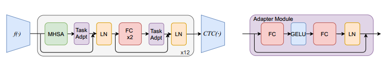
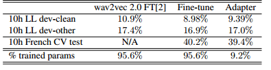
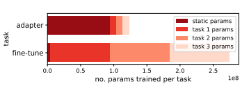
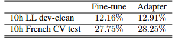
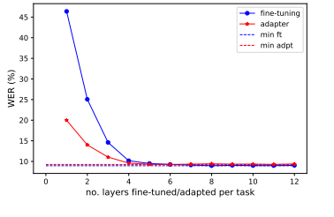

# 自监督语音模型的高效适配器转移用于自动语音识别

论文链接：https://arxiv.org/abs/2202.03218

自监督学习（SSL）是一种强大的工具，允许从未标记的数据中学习底层表示。基于Transformer的模型，如wav2vec 2.0和HuBERT，正在主导语音领域。通常，**这些模型会在少量标记数据上进行微调，用于下游任务**，如自动语音识别（ASR）。这涉及重新为每个任务训练大部分模型。**适配器是小型轻量级模块**，通常用于自然语言处理（NLP），以将预训练模型适应新任务。在本文中，我们提出将适配器应用于wav2vec 2.0，以减少下游ASR任务所需的参数数量，并增加模型对多个任务或语言的可扩展性。使用适配器，我们可以在每个任务训练少于10％的参数的情况下执行ASR，而与完全微调相比性能几乎没有降低。消融实验表明，仅将适配器应用于预训练网络的顶层可以获得与完全迁移相似的性能，支持高度预训练的层次编码更多的音素信息的理论，并进一步优化效率。

## 引言

**自监督学习现在已成为自然语言处理（NLP）的标准实践**，像BERT [1] 这样的模型已经取得了最新颖的成果。最近，自监督学习（SSL）方法已成功应用于语音任务。最近的作品，如wav2vec 2.0 [2] 和HuBERT [3]，表明语音领域的自监督学习可以取得最新颖的成果。

大多数自监督学习（SSL）模型**依赖于无监督预训练，然后在下游任务上进行监督微调**。无监督预训练允许模型受益于大量易获得的未标记数据。微调使用相对较少的标记数据，并重新训练自监督模型的部分以适应所需的下游任务。

尽管这些方法取得了出色的结果，但**微调模型在计算上成本高昂，不适用于多任务的扩展**，比如多语言的自动语音识别（ASR）；必须为每个下游任务学习和存储完整的微调参数集。通常情况下，每个任务的参数规模为 $O(10^8)$。一旦模型对一个任务进行了微调，整个模型就对该任务进行了固定，必须重新加载基本模型以迁移到未来的任务。

**适配器是小型可训练模块，可以应用到已冻结的预训练网络的各层，并进行调整以适应特定任务**。最近，这些适配器已经应用于NLP中的预训练非监督模型[4, 5]。适配器的好处在于它们允许使用相对较少的参数来适应新任务。由于现有模型参数保持不变，**原始模型可以支持多个下游任务，每个任务只需要一组适配器参数**。这使得适配器的训练更加高效，并且高度可扩展到多个任务。

ASR任务在高资源语言（如英语）方面已经得到了很好的研究。然而，在那些具有有限的文本和音频配对训练数据的语言中，要获得良好的性能更加困难。wav2vec 2.0在有限的标记数据下表现出色，而多语言的wav2vec 2.0 [6]在各种语言中都取得了很好的结果，包括在预训练时未曾见过的语言。自监督语音模型能够利用来自预训练的通用特征，很好地适应具有有限标记数据的情境，因此非常适合多语言ASR。然而，**为每种语言进行微调并存储微调参数是不切实际的**。此外，**微调会覆盖预训练模型参数**，因此可能不是充分利用预训练知识的最佳方式。

在本文中，我们将适配器应用于预训练的wav2vec 2.0模型，以将预训练表示迁移到下游ASR任务。适配器提出了一种更加高效利用这些预训练表示的方式，相比通常的微调方法，每个下游任务所需的参数要少得多。这对于多任务场景，如多语言ASR，以及增加了自监督语音模型的研究可访问性都有应用。据我们所知，这是适配器模块首次应用于自监督语音模型进行ASR的情况。

## 背景

### 自监督 ASR

标记的语音数据相对稀缺且生成成本较高。自监督方法能够利用大量**未标记的语音数据**来学习通用的语音特征。

已经提出了各种方法，如CPC [7]、APC [8]和wav2vec [9]。它们的共同目标是使用各种自监督任务来训练底层网络，学习原始语音波形的编码表示。其中许多模型包括一种形式的重构，其中重新创建了被屏蔽的表示或原始输入波形的元素。然后，**底层网络可以用于提取表示，这些表示将用作下游任务的输入**，而不是更传统的语音特征，如对数Mel滤波器组特征。这些网络可以被冻结，也可以通过某种迁移学习进一步优化以适应下游任务。

wav2vec 2.0 是该领域的领先模型[2]。然而，通常的 fine-tuning wav2vec 2.0 用于下游 ASR 的方法**需要重新训练大部分模型层**。事实上，总模型参数的95.6%都需要训练，因此必须为每个任务存储这些参数。如果只有单语言的 ASR 是目标任务，这并不是问题。但对于多语言语音识别，或者像[10]中的语音翻译等多任务使用 wav2vec 2.0 编码器的情况，这并不理想。

最近，wav2vec 2.0 的架构已经取得了进展，包括添加了自我训练[11]。虽然在这项工作中我们使用了 wav2vec 2.0，但**我们的方法也适用于任何基于自监督的基于 Transformer 的语音模型**，包括 HuBERT[3]。

### 适配器

Adapter 模块在自然语言处理领域被引入作为一种高效的迁移学习方法[4]。研究发现，在使用预训练的 BERT 模型进行 NLP 任务时，**Adapter 方法能够用少量参数接近全面微调的性能**。Adapters 也成功应用于神经机器翻译（NMT）[12] 和视觉任务[13]。最近，还提出了双 Adapter 模块用于多语言迁移[5]，其中一个 Adapter 用于语言自适应，另一个用于捕获任务特定的自适应。

Adapter 模块还被应用于流式 RNNT 模型[14]和混合 CTC-attention 语音 Transformer[15]中，以解决多语言语音识别的问题。最近，Adapters 还被用于语音翻译，将预训练模块[10]组合在一起。在持续学习的环境中，Adapter 模块也用于新任务的高效自监督学习预训练[16]。

我们假设在**语音模型中会看到与自然语言处理模型中相同的 Adapter 模块的好处**，即将预训练网络有效地转移到下游任务，性能几乎不会下降。

## 方法

在 wav2vec 2.0 中，卷积编码器接受原始波形作为输入。然后，对编码的输出应用了一个 transformer 模型。该模型通过屏蔽输入帧，然后将预测值与屏蔽帧的正值和负值量化版本进行比较来训练。这类似于对比性预测编码（contrastive predictive coding）[7]。

在将 wav2vec 2.0 应用于下游模型时，**特征编码器是冻结的**，并在 transformer 上下文模型的**顶部添加了线性分类器以进行微调**。通常，Transformer 模型在最初的 N 次更新中也是冻结的。在将 wav2vec 2.0 应用于自动语音识别（ASR）时，**线性分类器和模型会通过使用少量标记语音数据的连接主义时间分类（CTC）损失进行微调**。

**适配器是由一个下投影、非线性部分和一个上投影组成的小型瓶颈模块，带有一个跳跃连接**（请参见图2）。最初的实现 [4] 在自注意力层和前馈层后都应用了适配器。但可以在 transformer 块中的不同位置应用适配器 [12]。全连接层被初始化为接近于单位函数的形式。**这种恒等初始化和跳跃连接允许在训练过程中忽略该模块**，如果不被认为是必要的话。

在我们的适配器实验中，**我们在每个 Transformer 块中应用适配器两次**。我们的实验表明这会产生最好的结果。我们在 Transformer 网络之上应用一个线性分类器。**每个任务使用 CTC 损失来训练一组适配器、层归一化层和线性分类器**，网络的其余部分保持冻结。

## 实验和结果

我们使用标准的 wav2vec 2.0 BASE 架构，包括 12 个 transformer 层，并使用 `fairseq` 发布的公开预训练 checkpoint，该 checkpoint 是在 LibriSpeech 数据集上进行预训练的。我们为所有的适配器使用标准大小为 256，并最初将适配器应用于每个 transformer 层。

我们还进行了自己的微调实验以进行比较，并遵循了 wav2vec 2.0 的微调格式。通过调整超参数，我们能够改善那篇论文中报告的单词错误率（WER）值。我们进行了 20,000 步的训练，前 4,000 步中 transformer 层被冻结，并使用了学习率 5e-5。

我们研究了在 LibriLight（LL）数据集的 10 小时监督子集上进行微调和适配器的性能，并在标准的 LibriSpeech 开发集上进行评估。我们还进行了法语 ASR 的实验，以展示多任务场景。我们使用 Common Voice（CV）语料库的 10 小时子集，并在 CV 测试集上进行评估。在所有情况下，我们都计算了单词错误率（WER）。**我们发现适配器传输的最佳设置是运行 10,000 步，学习率为 5e4**。所有实验都在 8 个 V100 GPU 上运行，并没有使用语言模型融合，以便进行转移方法的比较。

适配器在英语 ASR 上表现略差（见表1），但对于dev-clean和dev-other，绝对的 WER 增加只有0.41%和0.17%。这种性能下降伴随着训练的任务特定参数数量大幅减少。微调需要训练 95.6% 的参数，而我们的适配器方法只需训练 9.2% 的参数。对于法语 ASR，与传统的微调相比，使用适配器实际上表现略好。

然而，这种方法的真正好处在于扩展到多种语言或任务时，如图3所示。每个微调任务几乎会使需要学习和存储的参数数量翻倍，然而适配器每个任务只添加了少量额外的参数。这使得适配器传输比微调更具扩展性，同时达到类似的性能。

我们的结果表明，即使在预训练模型和下游任务之间存在不匹配，例如在法语转换的情况下，**微调和适配器都能在ASR中取得一定的成功**。对于微调来说，这并不令人意外，因为在训练期间会覆盖预训练网络的特定于语言的特征。然而，适配器传输中，原始网络保持不变。因此，适配器能够弥补语言不匹配，并学习语言和任务特定的特征。这与[5]中使用单独的适配器来处理任务和语言的方法形成对比。

值得注意的是，**适配器实验比微调实验运行速度更快**，这既是因为可训练参数数量减少，提高了训练速度，也是因为较小的最佳训练步数。适配器实验不依赖于冻结步数超参数，并且使用简单的两阶段学习率调度器（如[4]中所示）成功运行，而传统微调则需要更复杂的三阶段调度器[2]。所有这些因素使适配器方法更适合研究人员进行实验。

此外，我们还自行预训练了一种双语的英语和法语wav2vec 2.0模型，使用了约1000小时的法语CV数据以及960小时的英语LibriSpeech数据，然后进行了英语和法语ASR实验（见表2）。这证明我们的适配器方法对于多语言预训练模型同样有效，因为**适配器的性能再次接近于微调**。

最后，我们测试了**只训练层归一化参数**，正如[4]中所建议的。然而，正如在那项工作中发现的那样，这种方法表现不佳，LibriSpeech dev-clean上的WER为32.9%。这提供了证据，**表明适配器模块本身提高了性能**，而不是重新训练的层归一化参数。

### 消融

以前的研究表明，**自监督模型的较低层包含更多的通用语音特征，而较高层更多地用于音素判别**[8]。因此，我们研究了只训练网络的前N层，使用了微调和适配器两种方法。所有实验都使用了英语wav2vec 2.0 BASE模型，10小时的LibriLight训练数据，并在LibriSpeech dev-clean上进行了评估。

将适配器仅添加到12个层中的顶部4层的效果几乎与将适配器添加到每一层中相当，事实上，只使用6个适配器的效果最好，WER为9.27%。这立即将所需的参数数量减半，仅占总参数的4.85%。优化微调也是可能的；只训练前8个transformer层可以获得最佳性能。

然而，与使用适配器相比，微调需要训练更多的层次，即使有8个层次等于训练了65.5%的参数（见图4）。当只训练一层时，适配器方法表现显著更好，表明适配器更能够利用整个网络的预训练知识。

图4中呈现的曲线表明，**网络的顶部层对下游性能的影响比底部层更重要**，支持了高层网络编码更多音素信息，而低层编码更多通用语音信息的假设。

## 讨论

这项工作提供了有关如何以更高效的参数利用自监督语音模型的见解，而不会损害性能。在转移到下游任务时，通常情况下，微调模型的大部分部分仍然是性能最好的方法。但是，**使用适配器而不是微调可以在训练时间较短的情况下实现接近的性能**，并且需要更少的参数。这可以让我们更快、更便宜地进行有关模型（如wav2vec 2.0和HuBERT）的实验，并提高可扩展性，适用于多个任务，例如多语言ASR。

还可以进行更多关于如何在附加任务中利用适配器的工作，如说话者识别和语音翻译。

消融实验显示，**不需要将网络的所有层传输到下游任务，只需传输顶部N层**，从而支持了高层网络编码更多音素信息的理论。适配器更能够利用预训练信息，我们使用一个适配器层的性能比使用一个微调层的性能更好，而最佳性能来自于适应较少的层，相对于微调。

虽然我们是第一个以这种方式在语音领域使用适配器的人，但我们的发现类似于NLP领域的发现。在NLP领域进行相同的层笑容实验将是有趣的。更广泛地说，我们展示了语音领域可以从未来NLP领域关于自监督学习的工作中受益。

