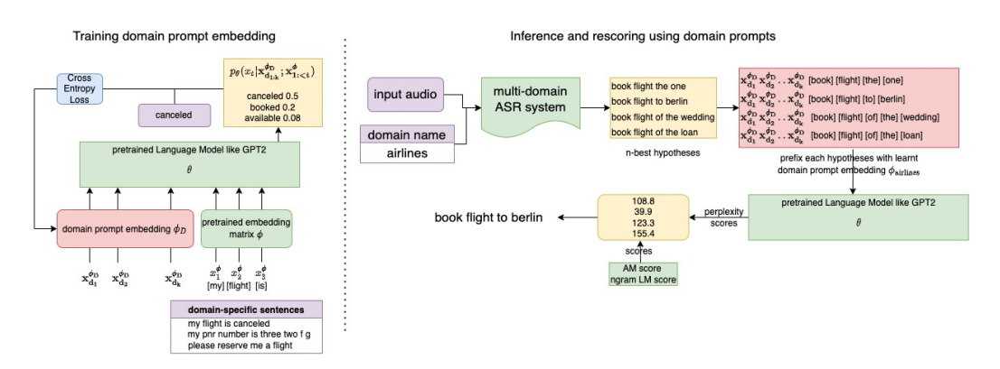
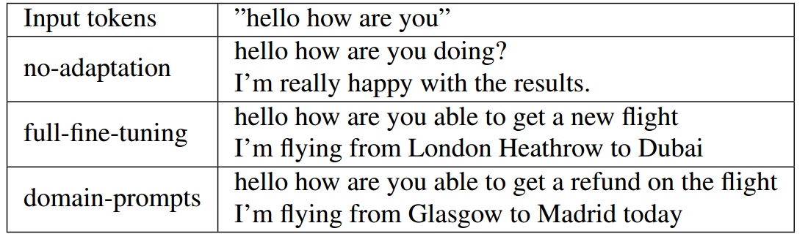
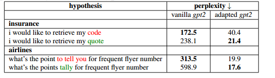
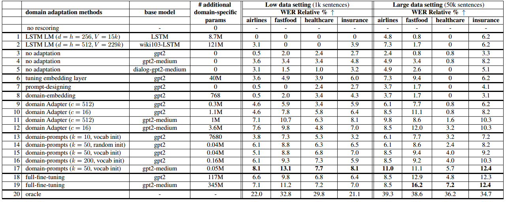

# Prompt Tuning GPT-2语言模型用于参数高效领域自适应ASR系统

论文链接：https://arxiv.org/abs/2112.08718

自动语音识别（ASR）系统已在各种不同领域的众多工业应用中找到了用武之地，因此需要适应具有小内存和部署开销的新领域。在本研究中，我们介绍了一种称为“领域提示”的方法，该方法涉及训练少量领域嵌入参数，以引导基于Transformer的语言模型（LM）进入特定领域。使用这个经过领域调整的LM对ASR假设进行重新评分，可以在仅有1000个未标记的领域特定文本句子的情况下，实现7-13%的词错误率（WER）降低。尽管仅更新了基本LM的0.02%的参数，但这一改进与完全微调的模型相当甚至更好。此外，我们的方法适合部署，因为学到的领域嵌入是前缀添加到模型的输入而不是更改基本模型架构。因此，我们的方法是ASR系统中LM的**即时适应的理想选择**，可以逐渐扩展到新领域。

## 引言

自动语音识别（ASR）系统在各种行业产品中起到关键作用。借助最近的进展，它们已经在包括医疗保健、旅行预订和客户服务等各种领域得到部署。改进这些系统性能的典型方法之一是**使用外部语言模型（LM）对n个最佳假设进行重新评分**[2]。最近的预训练Transformer型LM，如GPT2 [4]和BERT [5]，已经被证明比传统的基于LSTM的LM更有效[6]，用于重新评分。然而，对于需要逐渐支持新领域的工业ASR系统，存在以下挑战。正如[7, 8]所展示的，特定领域的数据对于提高该领域的性能很有用。然而，为每个领域单独重新训练或维护Transformer型LM的副本是不可伸缩的，因为更新和存储数百万个参数会带来巨大的成本。因此，**迫切需要一种高效的域自适应方法，以适应这种LM**。[9, 10, 11]使用外部知识、内存和上下文分别来提高特定困难领域的性能，而[12, 13]则适应了系统内部使用的神经LM。然而，据我们所知，我们的工作是首次提出并研究了一种方法，**以实现Transformer型LM的高效领域自适应，以提升ASR系统性能**。语言建模文献[14, 15, 16]提出了一些新颖的方法，来解决相关问题，即如何高效地使这些LM适应特定任务。他们提出，可**以在冻结的与任务无关的模型中引入一些特定任务可训练参数**，而不是为每个任务进行微调和存储数百万参数。例如，AdapterHub [14]在已经训练好的LM的冻结权重与新的任务特定层相结合。更近期的模型，如GPT-3 [17]，可以借助任务的文本描述（称为提示）来解决新任务。

与[18]相扩展，本工作的重点是将这些**LM适应到同一任务的不同领域**，而不是解决多个任务。我们的目标是学习一小组领域特定的参数，以便在没有领域数据的情况下，比基本的基于Transformer的LM更好地对ASR假设进行评分。借鉴了用于任务自适应的**提示调整**[15]的思想，我们引入了用于实现目标的领域提示。我们将领域提示定义为领域特定的嵌入，当添加到标记嵌入序列前缀，并通过预训练的Transformer LM 时，会返回下一个标记的概率分布，接近于完全领域自适应的LM给出的分布。我们的主要贡献总结如下：

(1) 我们引入了一种新的方法，即领域提示，这是首次尝试将提示微调应用于基于Transformer的LM的参数高效领域自适应，用于ASR系统的使用；

(2) 在具有有限数据的新领域中，我们证明了使用我们的方法调整LM来对ASR假设进行重新评分可以实现7-13%的WER降低，同时只需使用一小部分额外的领域特定参数；

(3) 除了节省内存和训练成本外，领域提示还可以匹配或甚至超越完全微调模型的性能，而不需要改变基本模型的部署方式，从而使其成为工业ASR系统的即时领域自适应的理想选择。

## 方法论

GPT-3 [17]引入了**自然语言提示作为任务的文本描述**。例如，在机器翻译任务的输入中添加前缀"将句子翻译成法语"。在提示调整（Prompt-tuning）中[15]，与其手动设计这些提示，**模型会使用来自任务的少量标记示例来学习它们的嵌入**。我们证明这样的嵌入也可以用于不同的领域，也就是说，我们可以在句子前添加额外的领域特定嵌入向量，以提高来自该领域的句子的困惑度。我们使用自监督任务，即在未标记的领域特定文本中预测下一个标记。未标记句子是由 $T$ 个标记 $x_1$, $x_2$, ..., $x_T$ 组成的序列。设 $x_\varphi^{1:T}$ 表示这些标记对应的 d 维嵌入向量的串联，由参数化的 $\varphi$ 的嵌入矩阵给出。这些向量在通过多个 Transformer 层传播之后，经过 softmax 运算以获得下一个可能标记的词汇概率分布。数学上，我们将在 $t$ 时刻预测 $x_t$ 标记的概率表示为 $p_\theta(x_t|x_\varphi^{1:<T})$。

在我们的方法中，对于任何领域 D，我们首先使用预训练的 $\{\theta;\phi\}$，并引入一小部分额外的参数 $\phi_D$，这些参数采用 k 个 d 维嵌入向量 [$x_{\varphi_D}^{d1}$；$x_{\varphi_D}^{d2}$；...；$x_{\varphi_D}^{dk}$] 的形式，将它们连接在一起，形成 $x_{\varphi_D}^{d1:k}$。我们在每个时间步长中将它们添加到每个句子前，以预测下一个标记。**在训练过程中，我们保持 $\{\theta;\phi\}$ 不变**，通过最小化真实标记值 $x_t$ 和其预测概率之间的交叉熵损失来学习 $\phi_D$。方程 1 表示一个这样序列的损失，我们将所有来自该领域的句子的损失值相加。

$$
\phi_D = \text{argmin}_{\phi_D} \sum_{t=1}^{t=T} -\log p_θ(x_t|x_{\phi_D}^{d_{1:k}}; x_{\phi}^{1:<t})
$$

我们假设 Transformer-based LMs 中的**自注意层会在领域 $D$ 的 tokens 嵌入和 $\phi_D$ 之间创建相互作用，从而提高得分以适应域 $D$**。在推理过程中，我们将来自ASR系统的候选结果前缀 $(x_{\varphi_D}^{d1:k})$ 用于相应领域，然后使用模型的困惑度分数进行后处理，如图 1 所示。此外，在我们的实现中，我们使用梯度下降来最小化损失，而不是随机初始化参数$\varphi_D$，**我们从域训练句子中 k 个最常见的单词的标记嵌入（使用预训练模型的$\varphi$）开始**，遵循之前的工作[15]。此外，为了确保由于额外计算而导致的推断延迟不增加，我们使用缓存来存储传播k个域提示通过Transformer层后的Transformer状态。这些域嵌入对于域内的所有候选结果是常数，因此它的前向传递可以预先计算，以确保评分候选结果的延迟对于Transformer LM的基础版本和适应版本是相同的。

## 实验设置

为了测试所提出的领域提示的有效性，我们进行了大量的实验，使用四个不同的领域、模型大小、初始化和训练集大小来进行适应的基线实验。我们使用了两个GPT-2架构的版本[4]作为我们的**基础模型**：(1) gpt2（117M（百万）参数）(2) gpt2-medium（345M参数）。我们在AWS ec2实例上进行了所有的实验，使用了8个Tesla V100 GPU，使用混合ASR系统。**这样的系统包括一个声学模型（AM）和两个不同的语言模型（LM）**。第一遍的语言模型是一个n-gram语言模型，直接与AM的lattice进行组合，而第二遍的语言模型是一个神经语言模型，用于对从lattice解码的n个最佳假设进行后处理。我们的AM是在12,000小时的音频上训练的。我们的第一遍LM是一个4-gram模型，使用Kneser-Ney（KN）[19]平滑，并在异构文本语料库上训练，词汇表大小为500,000个词。我们使用来自不同第二遍LM的分数（并与AM和第一遍LM的分数相互插值）来对n个最佳列表进行后处理，其中n = 10。我们的性能度量标准是词错误率（WER），我们报告相对于基线的WER减小百分比（WERR）。

### 数据集

对于我们的实验，我们需要按**领域划分的文本数据进行LM适应**，以及用于评估的音频数据。我们未能找到任何可以按领域划分并同时符合这两个标准的公共数据集。因此，我们使用了四个不同领域的内部数据集，并删除了所有个人可识别信息（PII）。对于文本数据，我们分别使用了1,000个和50,000个领域特定的会话句子。这些数据分别分成了80:20的训练集和开发集。开发集上的困惑度用于调整所有基线模型的超参数，如学习率等。对于评估，我们使用了每个领域的500个已标记的8kHz音频，这些音频是会话式任务导向对话系统中的单个话语。

### Baseline

在表2中用于比较的第二遍LM的不同选择定义如下： 

1. 无重新评分（基准）：使用没有第二遍 LM 的 1-best 假设；
2. LSTM LM：基于 2 层 LSTM 的 LM，具有嵌入维度（d）、隐藏维度（h）、基于单词的标记器、词汇大小（V）；
3. 无自适应：无需使用任何领域数据或任何参数更新的开箱即用的 Transformer-based LM；
4. 调整嵌入层：使用领域特定数据来更新嵌入矩阵（$\phi$）的参数，同时保持 $\theta$不变；
5. 提示设计：手动添加提示到假设中而无需进行任何训练。使用领域中的 20 个最常用的单词作为固定提示；
6. 领域嵌入[7]：学习特殊领域标记的嵌入。这等于我们方法中的k = 1；
7. 领域适配器：适配器[14]通常用于 Transformer-based LM 的参数高效任务适应。但是，我们在这里使用下一个标记预测的自监督任务训练领域适配器，使用不同的缩减因子(c)；
8. 领域提示：使用不同的 $k$ 值和 初始化 $\phi_D$ 的领域嵌入 $\phi_D$；
9. 完全微调：更新基础 LM 的所有参数 $(\phi, \theta)$；
10. oracle：选择在 n-best 列表中具有最低 WER 的假设，以了解通过重新评分的**改进上限**。

## 结果和讨论

领域自适应方法用于将 LM 适应到特定领域。如表1所示，使用从航空公司数据中学到的**领域提示的LM，与开箱即用的LM相比，能够生成非常特定于该领域的话语**。我们在表3中展示了一些定性结果，其中提供了与相似假设的标准gpt2和领域提示（k = 50）的困惑度分数。这些示例表明**领域信息如何帮助消除歧义，选择正确的假设**。我们在表2中总结了我们在两种不同设置中的所有方法的WERR分数。第一列包含了方法的名称和其超参数，第二列是使用的基础模型，而第三列表示除了基础模型之外需要领域特定可训练参数的数量。需要注意的是，**实验的目标不仅是找到性能最佳的方法，还要发现以最少数量的附加参数实现最佳性能的设置**。这对于系统扩展到可能涉及数百个领域的情况至关重要，因为存储和训练成本与领域特定参数的数量直接相关。

表1. gpt2 适应到航空领域的文本

表3. 定性示例：领域适应的gpt2更倾向于选择假设（绿色）而不是具有错误标记的假设（红色）

适应领域特定数据对于所有领域的性能都有帮助，无论在哪种设置下（第4行与第19行或第3行与第18行）。即使对话-gpt2-medium [20]（第5行）重新评分，**该模型是在大型对话语料库上预训练的，但也不如对少量领域数据进行自适应有效**。不同领域的WERR数值各不相同，但不同领域自适应方法的相对性能在所有领域中保持一致。这些领域之间相当不同。**像医疗保健这样的领域有大量未知的技术术语，因此通过重新评分的改进相对较小**。在大数据设置下，领域特定数据也添加到了第一遍的语言模型中，因此n-best假设的质量更好，从而通过重新评分获得更大的性能改进（第20行）。与[6]中的结果类似，我们观察到基于Transformer的语言模型的性能优于基于LSTM的方法（第1行和第2行与第18行）。为了公平比较，我们增加了LSTM模型的大小，并使用wikitext-103 [21] 进行了预训练（第2行），但它仍然无法与Transformer模型匹敌。此外，**随着Transformer模型大小的增加，性能也会提高**（第18行与第19行），进一步表明需要参数高效的自适应方法。我们对我们的方法的主要结论如下：

### 领域提示是参数效率最高的

**领域提示使每个领域使用基本模型的参数的＜0.02%来实现与领域特定的完全微调模型性能相媲美**（第17行与第19行）。尽管在大数据设置中，微调模型的性能优于我们的方法，但其改进是以为每个领域部署单独模型为代价的。这在有足够的数据时是可以预期的，大量的领域特定参数可以捕获更多的领域信息。适配器通常因其效率而使用，但与我们的方法相比，效果有限**。具有较少参数的领域提示（第11行与第17行）可以击败适配器的性能**。此外，适配器还有另一个限制，即其参数数量随基本 Transformer 模型的层数增加而增加（gpt2与gpt2-medium相比），而领域提示只取决于嵌入维度d。微调 Transformer-based LM 的一部分参数（第6行）不太有效，因为**手动选择最具影响力的参数子集是困难的**，而且在性能和成本方面表现不佳。**固定提示或训练单个领域嵌入向量等方法使用的参数几乎没有或非常少，但它们的改进仅略高于未经调整的基本LM**（第3行与第7和8行）。

### 领域提示为新域实现了最佳的性能

这种设置代表了常见的实际应用，即需要将具有有限数据量的新领域添加到ASR系统中。在这里，领域提示可以充分发挥其优势：

1. Transformer基础LM的丰富预训练
2. 不会过度拟合有限数量的示例

事实表明，微调的gpt2性能略好于相应的prompt-tuned版本（第16行与第18行），而gpt2-medium则相反（第17行与第19行），表明更新大量参数容易过度拟合。因此，领域提示能够在其有限的领域特定参数中捕获所有必要的领域特定信息，并实现7-13%的WERR改进。

**领域提示适用于部署**：除了性能和成本的好处之外，领域提示还可以轻松用于新领域，而无需部署新模型或引入新的架构。领域提示前缀添加到输入，使所有基本模型参数保持不变，而所有其他适应方法都需要更新基本模型架构内的参数。

### 领域提示提供超参数以权衡性能和成本

在表2的第13、14和16行进行比较，我们可以看到随着k的增加，模型的性能会提高，尽管性能改进会饱和。这为ASR系统开发人员提供了一个可以根据他们的需求和领域数据的可用性来控制成本的参数。

### 使用常见词汇标记嵌入进行初始化是有帮助的

比较第14行和第15行，使用最常见领域词的标记嵌入初始化 $\phi_D$ 会带来一些边际性的改进。由于这些词汇代表了领域，它们证明是一个有用的起点。

## 结论

Domain prompts提供了一种可扩展和参数高效的方法，用于向基于Transformer的语言模型添加领域信息。它在不影响性能的情况下节省了存储和训练成本。**对于新领域，即使只有少量示例可用，它也能实现最佳性能**。

与更新基础模型参数不同，新参数被添加为输入的前缀，因此我们的方法不需要为每个领域进行模型部署。因此，我们的方法成为将工业ASR系统逐渐扩展到新领域的理想选择，几乎没有额外开销。

